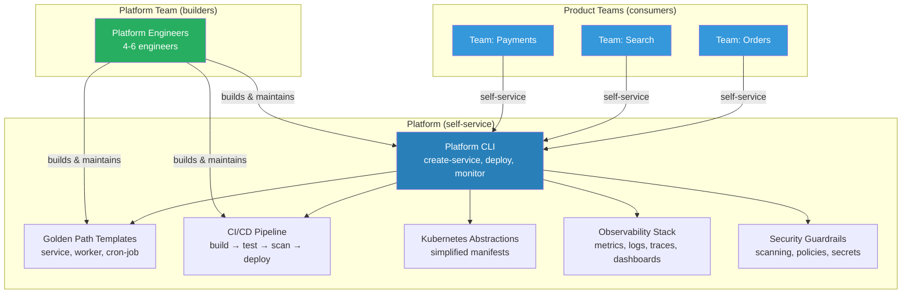
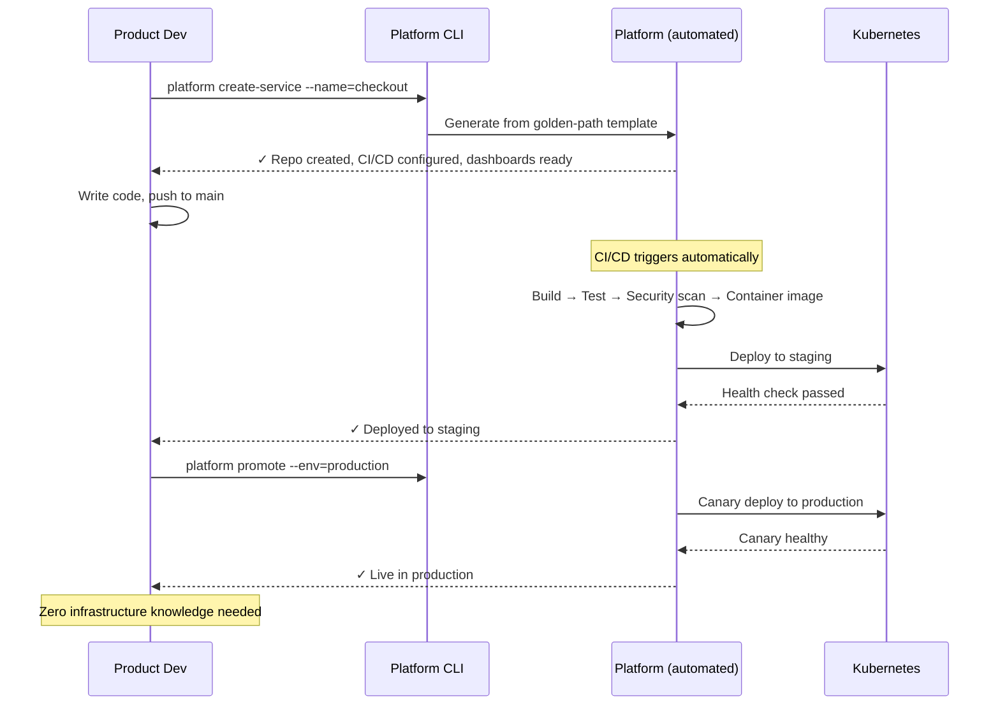

# Platform Team

## 1. The Problem (Story)

CloudCart, an e-commerce platform with 60 engineers across 8 product teams, has a problem that's invisible on any feature roadmap: **every team reinvents infrastructure.**

- Team Orders spent 3 weeks building a CI/CD pipeline for their service
- Team Search spent 4 weeks building a *different* CI/CD pipeline with different conventions
- Team Payments built their own Kubernetes manifests, got the health check configuration wrong, and had 2 hours of downtime because the liveness probe restarted the pod during a long database migration
- Team Notifications needed a message queue. They evaluated Kafka, RabbitMQ, and SQS independently — then chose SQS because "it was easiest," while every other team uses Kafka
- All 8 teams independently wrote their own OpenTelemetry instrumentation. Six implementations have bugs. Two don't trace across service boundaries.

The total cost of this duplication:

```
8 teams × 3 weeks average infrastructure work = 24 engineer-weeks
= 6 engineer-months per year spent NOT building product features
= ~$300K in salary redirected from customer value to yak-shaving
```

But the cost is worse than raw time:
- **Inconsistency**: 8 different CI/CD pipelines, 8 different logging formats, 8 different deployment strategies → debugging a production incident requires understanding 8 different setups
- **Quality**: Product teams are optimizing for speed, not infrastructure quality. Their Terraform, Docker, and K8s configs are "just good enough" — until they're not
- **Knowledge silos**: Each team's infrastructure knowledge stays in that team. When someone leaves, their custom setup becomes a mystery

## 2. The Naïve Solutions

### Attempt 1: "Shared libraries"

Create a `common-infra` npm package with Terraform modules, Docker templates, and CI scripts. Every team imports it.

Problems:
- Who maintains `common-infra`? If no one owns it, PRs rot. If everyone owns it, conflicting changes create merge wars.
- Breaking changes in the library break all 8 teams simultaneously
- A library doesn't encode opinions — it's raw tools, not paved paths
- Teams fork the library "temporarily" and never merge back → 8 forks within 6 months

### Attempt 2: "DevOps engineer on each team"

Embed one infrastructure-skilled engineer in each product team.

Problems:
- 8 DevOps engineers each making independent decisions → 8 different approaches (same as before, just faster)
- Finding 8 good DevOps engineers is hard. Most teams get a junior who doesn't know what "good" looks like.
- Each embedded DevOps engineer has no peers to learn from → isolation and skill stagnation
- If one leaves, that team loses ALL infrastructure knowledge

### Attempt 3: "Central Ops team that does things for product teams"

A traditional Operations / SRE team that receives tickets from product teams:

```
Product team: "We need a new service deployed"
Ops team: "Filed. ETA: 2-3 weeks"
Product team: *waits*
```

Problems:
- Ops team becomes a bottleneck. 8 teams, one ops team → constant prioritization fights
- Product teams wait instead of building → velocity collapses
- Ops team has no business context. Product teams have no infrastructure context. Both sides frustrated.
- "Throw it over the wall" culture: product teams build, ops deploys, blame flows both directions when things break

## 3. The Insight

**Treat internal infrastructure as a product — with a team that builds it, users who consume it, and a self-service interface.** The platform team doesn't DO deployments for product teams. They build the deployment TOOL that product teams use themselves. This eliminates the bottleneck (teams don't wait for the platform team) while ensuring consistency (everyone uses the same tool).

## 4. The Pattern

A **Platform Team** builds and maintains internal self-service capabilities that reduce cognitive load on stream-aligned (product) teams:

### What the Platform Provides
- **Paved paths**: Golden-path templates for creating new services (CI/CD, K8s manifests, monitoring, alerting — all pre-configured)
- **Self-service APIs/CLIs**: `platform create-service --name=checkout` → generates repo, pipeline, dashboards
- **Abstractions that hide complexity**: Product teams don't need to know how Kubernetes works. They need to deploy their code.
- **Guardrails**: Built-in security scanning, cost limits, compliance checks — enforced by the platform, not by policy documents

### How It Interacts
- **X-as-a-Service** (primary): Product teams consume the platform without needing to talk to the platform team
- **Collaboration** (occasional): When a product team has an unusual need, they collaborate temporarily
- **Documentation-first**: If someone needs to ask the platform team how to use the platform, the platform's UX has failed

### Guarantees
- Consistency: all services deploy the same way
- Velocity: product teams don't spend time on infrastructure
- Quality: infrastructure built by specialists, not generalists
- Self-service: no tickets, no waiting

### Non-Guarantees
- Not free: the platform team requires headcount and investment
- Not instant: building a good platform takes 6-12 months
- Not one-size-fits-all: some teams will have needs the platform doesn't cover (yet)
- Not optional compliance: if the platform is too rigid, teams will work around it

## 5. Mental Model

**A road network.** Product teams are delivery trucks. They need to get packages (features) to customers. They don't want to build roads — they want to drive on them. The platform team builds and maintains the roads (CI/CD, K8s, monitoring). Product teams drive on the roads without thinking about asphalt composition. The roads have guard rails (security, compliance) built in. If a truck needs a special route (custom infrastructure), the platform team evaluates whether to build a new road or provide a detour.

## 6. Structure





## 7. Code Example

### TypeScript — Internal developer platform simulator

```typescript
// ─── TYPES ───────────────────────────────────────────

interface ServiceSpec {
  name: string;
  type: 'api' | 'worker' | 'cron';
  language: 'typescript' | 'go' | 'python';
  needsDatabase: boolean;
  needsQueue: boolean;
}

interface PlatformService {
  name: string;
  repo: string;
  ciPipeline: string;
  k8sNamespace: string;
  dashboardUrl: string;
  healthEndpoint: string;
  createdAt: Date;
  status: 'provisioning' | 'ready' | 'deployed' | 'error';
}

interface DeployResult {
  service: string;
  environment: string;
  version: string;
  steps: string[];
  success: boolean;
}

// ─── PLATFORM ───────────────────────────────────────

class DeveloperPlatform {
  private services: Map<string, PlatformService> = new Map();
  private templates: Map<string, string[]> = new Map();

  constructor() {
    // Golden-path templates: pre-configured, opinionated setups
    this.templates.set('api', [
      'Dockerfile (multi-stage, slim base)',
      'k8s/deployment.yaml (health checks, resource limits, HPA)',
      'k8s/service.yaml (ClusterIP)',
      '.github/workflows/ci.yaml (build → test → scan → deploy)',
      'Makefile (standard commands: build, test, lint, deploy)',
      'observability/dashboards.json (Grafana: latency, errors, throughput)',
      'observability/alerts.yaml (p99 > 500ms, error rate > 1%)',
    ]);

    this.templates.set('worker', [
      'Dockerfile (multi-stage)',
      'k8s/deployment.yaml (no service, higher memory)',
      '.github/workflows/ci.yaml',
      'observability/dashboards.json (queue depth, processing rate)',
    ]);

    this.templates.set('cron', [
      'Dockerfile (multi-stage)',
      'k8s/cronjob.yaml (schedule, backoff, deadline)',
      '.github/workflows/ci.yaml',
      'observability/alerts.yaml (job failed, job exceeded deadline)',
    ]);
  }

  // Self-service: create a new service
  createService(spec: ServiceSpec): PlatformService {
    console.log(`\n[Platform] Creating service: ${spec.name} (${spec.type}, ${spec.language})`);

    const template = this.templates.get(spec.type);
    if (!template) throw new Error(`Unknown service type: ${spec.type}`);

    console.log('  Generated from golden-path template:');
    for (const file of template) {
      console.log(`    📄 ${file}`);
    }

    // Additional infrastructure based on needs
    if (spec.needsDatabase) {
      console.log('    📄 terraform/database.tf (RDS PostgreSQL, automated backups)');
      console.log('    📄 k8s/secret.yaml (database credentials from Vault)');
    }
    if (spec.needsQueue) {
      console.log('    📄 terraform/queue.tf (Kafka topic, consumer group)');
    }

    // Security guardrails (automatic, not optional)
    console.log('  Security guardrails applied:');
    console.log('    🔒 Container image scanning (Trivy)');
    console.log('    🔒 Dependency vulnerability check (npm audit / govulncheck)');
    console.log('    🔒 Secret scanning (git-secrets)');
    console.log('    🔒 Network policies (deny-all default, allow-list)');

    const service: PlatformService = {
      name: spec.name,
      repo: `github.com/company/${spec.name}`,
      ciPipeline: `https://ci.internal/${spec.name}`,
      k8sNamespace: spec.name,
      dashboardUrl: `https://grafana.internal/d/${spec.name}`,
      healthEndpoint: `/${spec.name}/healthz`,
      createdAt: new Date(),
      status: 'ready',
    };

    this.services.set(spec.name, service);
    console.log(`\n  ✅ Service "${spec.name}" ready. Time: ~30 seconds.`);
    console.log(`     Repo: ${service.repo}`);
    console.log(`     Dashboard: ${service.dashboardUrl}`);
    console.log(`     CI Pipeline: ${service.ciPipeline}`);

    return service;
  }

  // Self-service: deploy a service
  deploy(serviceName: string, environment: string, version: string): DeployResult {
    const service = this.services.get(serviceName);
    if (!service) {
      return { service: serviceName, environment, version, steps: [], success: false };
    }

    console.log(`\n[Platform] Deploying ${serviceName}@${version} → ${environment}`);

    const steps: string[] = [];

    // Automated pipeline steps (product team doesn't configure these)
    const pipeline = [
      `Build container image: ${serviceName}:${version}`,
      'Run unit tests',
      'Run integration tests',
      'Scan image for vulnerabilities',
      'Push to container registry',
      `Deploy to ${environment} (canary: 5%)`,
      'Run smoke tests',
      'Check metrics (error rate, latency)',
      `Promote canary to 100% in ${environment}`,
      'Update Grafana annotations',
    ];

    for (const step of pipeline) {
      steps.push(step);
      console.log(`  ✓ ${step}`);
    }

    service.status = 'deployed';

    return { service: serviceName, environment, version, steps, success: true };
  }

  // Self-service: check service health
  status(serviceName: string): void {
    const service = this.services.get(serviceName);
    if (!service) {
      console.log(`[Platform] Service "${serviceName}" not found`);
      return;
    }

    console.log(`\n[Platform] Status: ${serviceName}`);
    console.log(`  Status: ${service.status}`);
    console.log(`  Health: ${service.healthEndpoint} → 200 OK`);
    console.log(`  Dashboard: ${service.dashboardUrl}`);
    console.log(`  Last deploy: 2 hours ago`);
    console.log(`  P99 latency: 45ms | Error rate: 0.02% | Throughput: 1,200 req/s`);
  }

  // Platform team's view: what needs maintenance
  platformTeamView(): void {
    console.log('\n╔═══════════════════════════════════════╗');
    console.log('║  Platform Team Dashboard              ║');
    console.log('╠═══════════════════════════════════════╣');
    console.log(`║  Services on platform: ${this.services.size.toString().padEnd(15)}║`);
    console.log(`║  Template types: ${this.templates.size.toString().padEnd(21)}║`);

    let deployed = 0, ready = 0;
    for (const s of this.services.values()) {
      if (s.status === 'deployed') deployed++;
      if (s.status === 'ready') ready++;
    }

    console.log(`║  Deployed: ${deployed.toString().padEnd(27)}║`);
    console.log(`║  Ready (not deployed): ${ready.toString().padEnd(15)}║`);
    console.log('╚═══════════════════════════════════════╝');

    console.log('\n  Platform team focus:');
    console.log('    → Upgrade Kubernetes to 1.29');
    console.log('    → Add ARM64 build support');
    console.log('    → Improve deploy speed (target: < 5 min)');
    console.log('    → Zero support tickets pending');
  }
}

// ─── SCENARIO ────────────────────────────────────────

function demo() {
  const platform = new DeveloperPlatform();

  console.log('════════════════════════════════════════');
  console.log('  Product team creating a new service');
  console.log('════════════════════════════════════════');

  // Product team creates a service — no infrastructure knowledge needed
  platform.createService({
    name: 'checkout',
    type: 'api',
    language: 'typescript',
    needsDatabase: true,
    needsQueue: true,
  });

  platform.createService({
    name: 'email-sender',
    type: 'worker',
    language: 'go',
    needsDatabase: false,
    needsQueue: true,
  });

  console.log('\n════════════════════════════════════════');
  console.log('  Product team deploying');
  console.log('════════════════════════════════════════');

  platform.deploy('checkout', 'production', 'v1.3.0');

  console.log('\n════════════════════════════════════════');
  console.log('  Checking service status');
  console.log('════════════════════════════════════════');

  platform.status('checkout');

  platform.platformTeamView();
}

demo();
```

### Go — Platform service generator

```go
package main

import "fmt"

type ServiceType string

const (
	API    ServiceType = "api"
	Worker ServiceType = "worker"
	Cron   ServiceType = "cron"
)

type ServiceSpec struct {
	Name     string
	Type     ServiceType
	NeedsDB  bool
	NeedsQ   bool
}

type Platform struct {
	services map[string]string // name → status
}

func NewPlatform() *Platform {
	return &Platform{services: make(map[string]string)}
}

func (p *Platform) Create(spec ServiceSpec) {
	fmt.Printf("\n[Platform] Creating %s (%s)\n", spec.Name, spec.Type)

	templates := map[ServiceType][]string{
		API:    {"Dockerfile", "k8s/deployment.yaml", "k8s/service.yaml", "ci.yaml", "dashboards.json"},
		Worker: {"Dockerfile", "k8s/deployment.yaml", "ci.yaml", "dashboards.json"},
		Cron:   {"Dockerfile", "k8s/cronjob.yaml", "ci.yaml", "alerts.yaml"},
	}

	for _, f := range templates[spec.Type] {
		fmt.Printf("  📄 %s\n", f)
	}

	if spec.NeedsDB {
		fmt.Println("  📄 terraform/database.tf")
	}
	if spec.NeedsQ {
		fmt.Println("  📄 terraform/queue.tf")
	}

	fmt.Println("  🔒 Security guardrails applied")
	p.services[spec.Name] = "ready"
	fmt.Printf("  ✅ %s ready\n", spec.Name)
}

func (p *Platform) Deploy(name, env, version string) {
	if _, ok := p.services[name]; !ok {
		fmt.Printf("[Platform] %s not found\n", name)
		return
	}

	steps := []string{
		"Build image", "Run tests", "Security scan",
		"Push to registry", fmt.Sprintf("Deploy to %s", env),
		"Smoke tests", "Promote to 100%",
	}

	fmt.Printf("\n[Platform] Deploying %s@%s → %s\n", name, version, env)
	for _, s := range steps {
		fmt.Printf("  ✓ %s\n", s)
	}
	p.services[name] = "deployed"
}

func main() {
	p := NewPlatform()

	p.Create(ServiceSpec{Name: "checkout", Type: API, NeedsDB: true, NeedsQ: true})
	p.Create(ServiceSpec{Name: "email-worker", Type: Worker, NeedsQ: true})
	p.Deploy("checkout", "production", "v1.3.0")

	fmt.Printf("\n── Platform Status: %d services managed ──\n", len(p.services))
	for name, status := range p.services {
		fmt.Printf("  %s: %s\n", name, status)
	}
}
```

## 8. Gotchas & Beginner Mistakes

| Mistake | Why It Happens | Fix |
|---------|---------------|-----|
| Platform team as a ticket queue | Product teams submit requests. Platform team executes them. = Traditional Ops rebadged. | Self-service only. If a product team needs to file a ticket, the platform has a UX gap. |
| Building the platform before understanding users | Platform team builds what they think is cool, not what product teams need | Run user research. Shadow product teams. Track the top 5 pain points and solve those. |
| No product management | Platform treated as "maintenance work" without a roadmap, prioritization, or user feedback | Assign a product manager to the platform. Treat it as an internal product. |
| Over-abstracting | Platform hides so much that product teams can't debug issues or customize behavior | Provide escape hatches. Allow teams to drop down to raw K8s manifests when needed. |
| Under-investing | "We'll staff the platform team later — right now everyone needs to ship features" | If product teams are spending 30%+ time on infrastructure, the platform pays for itself immediately |
| Platform team grows too large | As the platform expands, the team becomes a mini-org that builds everything | Limit scope: the platform provides what 80% of teams need. The remaining 20% is self-served by product teams. |

## 9. Related & Confusable Patterns

| Pattern | Relationship | Key Difference |
|---------|-------------|----------------|
| **Team Topologies** | Framework this belongs to | Platform Team is one of Team Topologies' four team types. |
| **DevOps** | Cultural predecessor | DevOps says "you build it, you run it." Platform Team says "you build it, you run it — on a platform that makes running it easy." |
| **SRE** | Complementary | SRE focuses on reliability. Platform Team focuses on developer experience. They often overlap but have different primary goals. |
| **Innersource** | Collaboration model | Innersource lets product teams contribute to the platform. The platform team reviews and owns code quality. |
| **Infrastructure as Code** | Tool the platform builds on | IaC is a technique. The platform team packages IaC into self-service templates that product teams consume. |

## 10. When This Pattern Is the WRONG Choice

| Scenario | Why a Platform Team Hurts | Better Alternative |
|----------|--------------------------|-------------------|
| < 4 product teams | Not enough users to justify the platform investment | Shared libraries + part-time infrastructure owner |
| Every team is unique | Wildly different languages, deployment targets, and requirements | Per-team DevOps specialists. No platform can generalize enough. |
| Cloud-managed services suffice | AWS/GCP already provides the "platform" via managed services | Use cloud-native tools directly. Don't wrap wrappers. |
| Team is too early | You don't know your golden path yet because you haven't deployed enough services | Wait until patterns emerge from manual work, then automate |
| Cost pressure | A 4-6 person platform team is a significant headcount investment | Start with one platform engineer embedded in a product team. Grow organically. |

**Symptom you need a platform team**: Product teams spend > 25% of their time on infrastructure. Every team has a slightly different CI/CD pipeline. New services take weeks to deploy instead of hours.

**Back-out strategy**: Start with a single "platform engineer" role, not a team. One person builds templates, documents golden paths, and answers infrastructure questions. If demand grows (and it will), formalize into a team. If not, the single engineer's templates still save time.
