# Team Topologies

## 1. The Problem (Story)

DataStream, a 120-engineer company, has been scaling fast. They went from 20 to 120 engineers in two years. During that growth, teams formed organically: whoever was available got assigned to whatever needed work. The result:

- **Team "Omega"** (8 engineers): owns the API gateway, a Kafka consumer, two React dashboards, and the Terraform configs for production infrastructure. They're spread so thin that nothing gets deep attention.

- **Team "Core Platform"** (15 engineers): built the internal deployment platform. They now spend 80% of their time in Slack answering "how do I deploy?" questions from other teams. They haven't shipped a platform improvement in 4 months.

- **Team "Special Projects"** (6 engineers): exists because an executive wanted a specific feature. The feature shipped. The team now has no clear mission but still exists in the org chart.

- **Team "Mobile"** (10 engineers): owns the iOS and Android apps. When the mobile team needs a backend change, they file a ticket with Team Omega and wait 3-4 weeks. Meanwhile, they build workarounds in the mobile app.

The VP of Engineering asks: "Why is everything slow?" The answer: nobody can articulate what kind of team each team IS, how teams should interact, or what the team boundaries mean. Some teams are organized by technology (Mobile, Frontend), some by project (Special Projects), some by infrastructure layer (Core Platform), and some by everything-at-once (Omega).

**Without a vocabulary for team types, every team becomes a grab bag of responsibilities with unclear interactions.**

## 2. The Naïve Solutions

### Attempt 1: "Functional teams" (organize by skill)

Group engineers by technical specialty: Frontend Team, Backend Team, Mobile Team, DevOps Team, QA Team.

Problems:
- Every feature requires coordination across 3-5 teams → meetings, handoffs, delays
- No single team owns a customer-facing capability end-to-end
- Conway's Law produces a layered architecture even when you want domain services
- "Backend Team" becomes a bottleneck for every feature

### Attempt 2: "Project teams" (organize by initiative)

Form temporary teams around business projects. When the project ends, reassign people.

Problems:
- No long-term ownership → "who maintains this after the project finishes?"
- Knowledge scatters when teams dissolve
- Engineers feel like mercenaries, not owners
- Technical debt accumulates because nobody's incentivized for long-term health

### Attempt 3: "Feature teams" (anyone works on anything)

Any engineer can work on any part of the codebase. Assign work by availability.

Problems:
- No deep expertise anywhere
- Code quality degrades as unfamiliar engineers make quick-fix changes
- No ownership = no accountability for operational health
- Pull requests take forever because context-switching between domains is expensive

## 3. The Insight

**Not all teams serve the same purpose. There are exactly four fundamental team types, and three interaction modes between them.** When you can classify each team and define how it interacts with others, org complexity becomes manageable. The framework, from Matthew Skelton and Manuel Pais, doesn't prescribe the perfect org chart — it gives you a vocabulary to reason about your org structure.

## 4. The Pattern

**Team Topologies** defines four team types:

| Team Type | Purpose | Count |
|-----------|---------|-------|
| **Stream-Aligned** | Delivers business value along a flow of work (a product, a customer journey, a domain) | Many (most teams) |
| **Platform** | Provides self-service internal capabilities that accelerate stream-aligned teams | Few |
| **Enabling** | Helps stream-aligned teams adopt new skills or technologies, then moves on | Very few |
| **Complicated-Subsystem** | Owns a component that requires deep specialist knowledge (ML model, video codec, crypto engine) | Rare |

And three interaction modes:

| Mode | Between | How It Works |
|------|---------|-------------|
| **Collaboration** | Any two teams | Close working together, shared problem-solving. High-bandwidth but costly. Time-limited. |
| **X-as-a-Service** | Platform ↔ Stream-Aligned | Platform provides a self-service API/tool. Stream-aligned teams consume it without asking. |
| **Facilitating** | Enabling → Stream-Aligned | Enabling team coaches and unblocks. Doesn't build for the stream team — teaches them. |

### Guarantees
- Clear team purpose: every team knows its type and mission
- Reduced cognitive load: no team owns "everything"
- Explicit interaction: teams know HOW they should work together
- Scalable: works from 5 teams to 500

### Non-Guarantees
- Doesn't tell you which domains to create teams around
- Doesn't solve hiring or skill gaps
- Doesn't prevent all coordination overhead (some cross-team work is necessary)
- Team types can evolve: a team might shift from Enabling to Platform over time

## 5. Mental Model

**A hospital.** Stream-aligned teams are the **wards** (cardiology, oncology, orthopedics) — they treat specific patients end-to-end. The **platform** team is facilities management (electricity, water, building maintenance) — wards don't think about plumbing. **Enabling** teams are the training department — they teach surgeons a new technique and move on. **Complicated-subsystem** teams are the radiology lab — you send scans there because the equipment and expertise are too specialized for every ward to maintain.

## 6. Structure

```mermaid
graph TD
    subgraph "Stream-Aligned Teams"
        SA1[Team: Orders<br/>🔵 Stream-Aligned]
        SA2[Team: Search<br/>🔵 Stream-Aligned]
        SA3[Team: Payments<br/>🔵 Stream-Aligned]
    end

    subgraph "Platform Team"
        PT[Team: Platform<br/>🟢 Platform<br/>CI/CD, K8s, Observability]
    end

    subgraph "Enabling Team"
        ET[Team: Cloud Migration<br/>🟡 Enabling<br/>Teaches teams to use cloud-native patterns]
    end

    subgraph "Complicated-Subsystem Team"
        CS[Team: ML Ranking<br/>🔴 Complicated-Subsystem<br/>Ranking algorithm, model training]
    end

    SA1 -->|X-as-a-Service| PT
    SA2 -->|X-as-a-Service| PT
    SA3 -->|X-as-a-Service| PT

    ET -.->|Facilitating| SA1
    ET -.->|Facilitating| SA3

    SA2 -->|X-as-a-Service| CS

    style SA1 fill:#3498db,color:#fff
    style SA2 fill:#3498db,color:#fff
    style SA3 fill:#3498db,color:#fff
    style PT fill:#27ae60,color:#fff
    style ET fill:#f39c12,color:#fff
    style CS fill:#e74c3c,color:#fff
```




## 7. Code Example

### TypeScript — Team topology analyzer

```typescript
// ─── TYPES ───────────────────────────────────────────

type TeamType = 'stream-aligned' | 'platform' | 'enabling' | 'complicated-subsystem';
type InteractionMode = 'collaboration' | 'x-as-a-service' | 'facilitating';

interface TopologyTeam {
  name: string;
  type: TeamType;
  cognitiveLoad: number;   // 1-10: how much does this team have to think about?
  services: string[];
  headcount: number;
}

interface TeamInteraction {
  teamA: string;
  teamB: string;
  mode: InteractionMode;
  duration: 'permanent' | 'temporary';
}

// ─── TEAM TOPOLOGY ANALYZER ─────────────────────────

class TopologyAnalyzer {
  private teams: Map<string, TopologyTeam> = new Map();
  private interactions: TeamInteraction[] = [];

  addTeam(team: TopologyTeam): void {
    this.teams.set(team.name, team);
  }

  addInteraction(interaction: TeamInteraction): void {
    this.interactions.push(interaction);
  }

  // Validate the topology against Team Topologies rules
  validate(): string[] {
    const issues: string[] = [];

    for (const [name, team] of this.teams) {
      // Rule 1: Cognitive load should be manageable
      if (team.cognitiveLoad > 7) {
        issues.push(`⚠ ${name}: cognitive load ${team.cognitiveLoad}/10 — team is overloaded. Split responsibilities.`);
      }

      // Rule 2: Stream-aligned teams should be the majority
      const streamCount = [...this.teams.values()].filter(t => t.type === 'stream-aligned').length;
      const totalCount = this.teams.size;
      if (streamCount < totalCount * 0.5) {
        issues.push(`⚠ Only ${streamCount}/${totalCount} teams are stream-aligned. Most teams should be stream-aligned.`);
      }

      // Rule 3: Enabling teams should have temporary interactions
      if (team.type === 'enabling') {
        const permanentInteractions = this.interactions.filter(
          i => (i.teamA === name || i.teamB === name) && i.duration === 'permanent'
        );
        if (permanentInteractions.length > 0) {
          issues.push(`⚠ ${name} (enabling) has permanent interactions. Enabling teams should have temporary engagements.`);
        }
      }

      // Rule 4: Platform teams should use X-as-a-Service mode
      if (team.type === 'platform') {
        const nonServiceInteractions = this.interactions.filter(
          i => (i.teamA === name || i.teamB === name) && i.mode !== 'x-as-a-service'
        );
        if (nonServiceInteractions.length > 0) {
          issues.push(`⚠ ${name} (platform) has non-XaaS interactions. Platform teams should primarily operate as a service.`);
        }
      }

      // Rule 5: Teams shouldn't own too many services
      if (team.services.length > 3 && team.type === 'stream-aligned') {
        issues.push(`⚠ ${name}: owns ${team.services.length} services. Consider splitting by domain.`);
      }
    }

    // Rule 6: Check for collaboration overload
    for (const [name, team] of this.teams) {
      const collabCount = this.interactions.filter(
        i => (i.teamA === name || i.teamB === name) && i.mode === 'collaboration'
      ).length;
      if (collabCount > 2) {
        issues.push(`⚠ ${name}: ${collabCount} collaboration interactions. Collaboration is expensive — limit to 1-2 at a time.`);
      }
    }

    return issues;
  }

  printTopology(): void {
    console.log('╔═══════════════════════════════════════╗');
    console.log('║  Team Topology Map                    ║');
    console.log('╚═══════════════════════════════════════╝');

    const typeEmoji: Record<TeamType, string> = {
      'stream-aligned': '🔵',
      'platform': '🟢',
      'enabling': '🟡',
      'complicated-subsystem': '🔴',
    };

    const grouped = new Map<TeamType, TopologyTeam[]>();
    for (const team of this.teams.values()) {
      const list = grouped.get(team.type) ?? [];
      list.push(team);
      grouped.set(team.type, list);
    }

    for (const [type, teams] of grouped) {
      console.log(`\n${typeEmoji[type]} ${type.toUpperCase()}`);
      for (const t of teams) {
        const loadBar = '█'.repeat(t.cognitiveLoad) + '░'.repeat(10 - t.cognitiveLoad);
        console.log(`  ${t.name} (${t.headcount} eng) | load: [${loadBar}] ${t.cognitiveLoad}/10`);
        console.log(`    Services: ${t.services.join(', ')}`);
      }
    }

    console.log('\n── Interactions ──');
    const modeSymbol: Record<InteractionMode, string> = {
      'collaboration': '↔',
      'x-as-a-service': '→',
      'facilitating': '⇢',
    };
    for (const i of this.interactions) {
      const symbol = modeSymbol[i.mode];
      const dur = i.duration === 'temporary' ? '(temp)' : '(perm)';
      console.log(`  ${i.teamA} ${symbol} ${i.teamB} [${i.mode}] ${dur}`);
    }
  }

  // Suggest transformations for mistyped teams
  suggestTransformations(): void {
    console.log('\n╔═══════════════════════════════════════╗');
    console.log('║  Suggested Transformations            ║');
    console.log('╚═══════════════════════════════════════╝');

    const issues = this.validate();
    if (issues.length === 0) {
      console.log('  ✅ Topology looks healthy!');
    } else {
      for (const issue of issues) {
        console.log(`  ${issue}`);
      }
    }
  }
}

// ─── SCENARIO ────────────────────────────────────────

function demo() {
  const analyzer = new TopologyAnalyzer();

  // Stream-aligned teams
  analyzer.addTeam({
    name: 'orders',
    type: 'stream-aligned',
    cognitiveLoad: 5,
    services: ['orders-api', 'orders-ui'],
    headcount: 6,
  });

  analyzer.addTeam({
    name: 'search',
    type: 'stream-aligned',
    cognitiveLoad: 6,
    services: ['search-api', 'search-indexer'],
    headcount: 5,
  });

  analyzer.addTeam({
    name: 'payments',
    type: 'stream-aligned',
    cognitiveLoad: 7,
    services: ['payments-api', 'fraud-detection', 'billing-ui'],
    headcount: 7,
  });

  // Platform team
  analyzer.addTeam({
    name: 'platform',
    type: 'platform',
    cognitiveLoad: 6,
    services: ['ci-cd', 'k8s-platform', 'observability'],
    headcount: 5,
  });

  // Enabling team
  analyzer.addTeam({
    name: 'cloud-enablement',
    type: 'enabling',
    cognitiveLoad: 4,
    services: [],
    headcount: 3,
  });

  // Complicated-subsystem team
  analyzer.addTeam({
    name: 'ml-ranking',
    type: 'complicated-subsystem',
    cognitiveLoad: 8,
    services: ['ranking-model', 'feature-store'],
    headcount: 4,
  });

  // Define interactions
  analyzer.addInteraction({
    teamA: 'orders', teamB: 'platform',
    mode: 'x-as-a-service', duration: 'permanent',
  });
  analyzer.addInteraction({
    teamA: 'search', teamB: 'platform',
    mode: 'x-as-a-service', duration: 'permanent',
  });
  analyzer.addInteraction({
    teamA: 'payments', teamB: 'platform',
    mode: 'x-as-a-service', duration: 'permanent',
  });
  analyzer.addInteraction({
    teamA: 'cloud-enablement', teamB: 'orders',
    mode: 'facilitating', duration: 'temporary',
  });
  analyzer.addInteraction({
    teamA: 'search', teamB: 'ml-ranking',
    mode: 'x-as-a-service', duration: 'permanent',
  });

  analyzer.printTopology();
  analyzer.suggestTransformations();
}

demo();
```

### Go — Team topology validator

```go
package main

import "fmt"

type TeamType string

const (
	StreamAligned       TeamType = "stream-aligned"
	Platform            TeamType = "platform"
	Enabling            TeamType = "enabling"
	ComplicatedSubsys   TeamType = "complicated-subsystem"
)

type Team struct {
	Name          string
	Type          TeamType
	CognitiveLoad int
	Services      []string
	Headcount     int
}

type Interaction struct {
	TeamA     string
	TeamB     string
	Mode      string // collaboration, x-as-a-service, facilitating
	Temporary bool
}

type Topology struct {
	Teams        []Team
	Interactions []Interaction
}

func (t *Topology) Validate() []string {
	var issues []string

	streamCount := 0
	for _, team := range t.Teams {
		if team.Type == StreamAligned {
			streamCount++
		}
		if team.CognitiveLoad > 7 {
			issues = append(issues, fmt.Sprintf(
				"⚠ %s: cognitive load %d/10 — overloaded", team.Name, team.CognitiveLoad))
		}
		if team.Type == Enabling {
			for _, i := range t.Interactions {
				if (i.TeamA == team.Name || i.TeamB == team.Name) && !i.Temporary {
					issues = append(issues, fmt.Sprintf(
						"⚠ %s (enabling): has permanent interaction — should be temporary", team.Name))
				}
			}
		}
	}

	if streamCount < len(t.Teams)/2 {
		issues = append(issues, fmt.Sprintf(
			"⚠ Only %d/%d teams are stream-aligned", streamCount, len(t.Teams)))
	}

	return issues
}

func (t *Topology) Print() {
	emoji := map[TeamType]string{
		StreamAligned:     "🔵",
		Platform:          "🟢",
		Enabling:          "🟡",
		ComplicatedSubsys: "🔴",
	}

	fmt.Println("── Team Topology ──")
	for _, team := range t.Teams {
		fmt.Printf("  %s %s (%s, %d eng, load: %d/10)\n",
			emoji[team.Type], team.Name, team.Type, team.Headcount, team.CognitiveLoad)
		fmt.Printf("    Services: %v\n", team.Services)
	}

	fmt.Println("\n── Interactions ──")
	for _, i := range t.Interactions {
		dur := "permanent"
		if i.Temporary {
			dur = "temporary"
		}
		fmt.Printf("  %s ↔ %s [%s] (%s)\n", i.TeamA, i.TeamB, i.Mode, dur)
	}

	issues := t.Validate()
	if len(issues) > 0 {
		fmt.Println("\n── Issues ──")
		for _, issue := range issues {
			fmt.Println(" ", issue)
		}
	} else {
		fmt.Println("\n  ✅ Topology healthy")
	}
}

func main() {
	topo := &Topology{
		Teams: []Team{
			{Name: "orders", Type: StreamAligned, CognitiveLoad: 5, Services: []string{"orders-api"}, Headcount: 6},
			{Name: "search", Type: StreamAligned, CognitiveLoad: 6, Services: []string{"search-api"}, Headcount: 5},
			{Name: "platform", Type: Platform, CognitiveLoad: 6, Services: []string{"ci-cd", "k8s"}, Headcount: 5},
			{Name: "enablement", Type: Enabling, CognitiveLoad: 3, Services: nil, Headcount: 3},
			{Name: "ml-engine", Type: ComplicatedSubsys, CognitiveLoad: 8, Services: []string{"ranking"}, Headcount: 4},
		},
		Interactions: []Interaction{
			{TeamA: "orders", TeamB: "platform", Mode: "x-as-a-service", Temporary: false},
			{TeamA: "search", TeamB: "platform", Mode: "x-as-a-service", Temporary: false},
			{TeamA: "enablement", TeamB: "orders", Mode: "facilitating", Temporary: true},
			{TeamA: "search", TeamB: "ml-engine", Mode: "x-as-a-service", Temporary: false},
		},
	}
	topo.Print()
}
```

## 8. Gotchas & Beginner Mistakes

| Mistake | Why It Happens | Fix |
|---------|---------------|-----|
| Calling every team "stream-aligned" | It sounds good — everyone delivers value! But platform and enabling work is real and different. | Be honest about team purpose. A team that builds CI/CD is a platform team, not a stream team doing "CI/CD features." |
| Platform team as a ticket queue | Stream teams file tickets, platform team executes them = bottleneck | Platform must be SELF-SERVICE: APIs, docs, CLIs. If stream teams need to ask permission, it's not a platform. |
| Enabling team becomes permanent | "The enablement team is still teaching after 12 months" = it's a consulting team, not enabling | Time-box: 6-8 weeks per engagement. If the stream team can't operate independently after that, the approach is wrong. |
| Too many complicated-subsystem teams | "Our auth is complicated, search is complicated, billing is complicated..." | Most things are not genuinely complicated-subsystem-worthy. Reserve this for true specialist domains (ML, cryptography, video codecs). |
| No explicit interaction modes | Teams interact however they feel like →  some collaborate, some throw tickets over the wall, some ignore each other | Explicitly declare interaction modes and review them quarterly |
| Ignoring cognitive load | Team owns 8 services + on-call + platform migration → burnout | Measure cognitive load. If a team can't explain their entire domain in 15 minutes, they own too much. |

## 9. Related & Confusable Patterns

| Pattern | Relationship | Key Difference |
|---------|-------------|----------------|
| **Conway's Law** | Foundation | Conway's Law is the force. Team Topologies is the framework for working with that force. |
| **Inverse Conway Maneuver** | Complementary | Inverse Conway says "design teams for architecture." Team Topologies says "here are the team types to choose from." |
| **Platform Team** | One of the four types | The platform team pattern (next pattern) is a deep dive into one Team Topologies type. |
| **Spotify Model** | Alternative framework | Spotify uses squads, tribes, chapters, guilds. Team Topologies uses four team types + three interaction modes. Team Topologies is more prescriptive about interactions. |
| **SAFe** | Different scale | SAFe addresses enterprise-level program management. Team Topologies addresses team-level organization. |

## 10. When This Pattern Is the WRONG Choice

| Scenario | Why Topologies Hurts | Better Alternative |
|----------|---------------------|-------------------|
| < 3 teams | Framework overhead for a small org | Just define clear ownership informally |
| Rapidly pivoting startup | Team types calcify before you know what you're building | Keep teams flexible, reorganize when strategy stabilizes |
| Uniformly skilled generalists | No need for enabling or complicated-subsystem types | All stream-aligned with shared responsibility for infrastructure |
| Regulated waterfall environment | Team Topologies assumes autonomous delivery. Regulated environments may require separate QA, compliance, and security teams. | Adapt topologies to include mandatory regulatory functions |

**Symptom you need Team Topologies**: You can't articulate what kind of team each team IS. Teams interact inconsistently. Some teams are overwhelmed while others lack clear purpose.

**Back-out strategy**: Start by classifying your existing teams into the four types WITHOUT reorganizing. Just labeling teams clarifies expectations. If the labels reveal misalignment (a "platform" team that's really stream-aligned), that's the first conversation to have.
