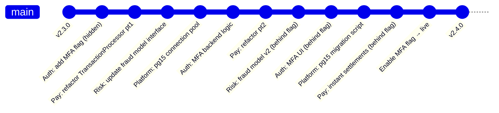
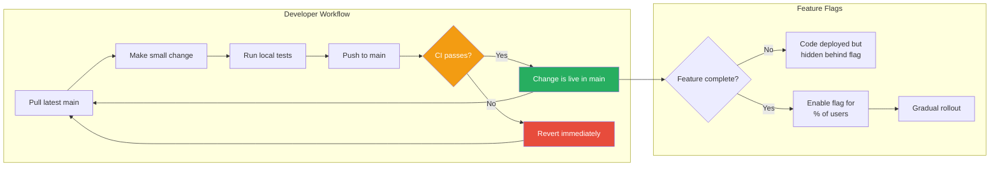

# Trunk-Based Development

## 1. The Problem (Story)

NexPay is a fintech company with 40 engineers across 6 teams. They use GitFlow: `main`, `develop`, `release/*`, `feature/*`, and `hotfix/*` branches. Each feature gets a long-lived branch.

**Quarter 3 begins.** The teams start working:

- **Team Auth** branches `feature/mfa-overhaul` from `develop`. The MFA rewrite takes 5 weeks.
- **Team Payments** branches `feature/instant-settlements`. Estimated 4 weeks.
- **Team Risk** branches `feature/fraud-ml-v2`. Estimated 6 weeks.
- **Team Platform** branches `feature/db-migration-pg15`. A database engine upgrade.

**Week 3:** Team Platform merges `feature/db-migration-pg15` into `develop`. They change the database connection pooling interface. No one notices because the other branches diverged from `develop` 3 weeks ago.

**Week 5:** Team Auth tries to merge `feature/mfa-overhaul` into `develop`. **372 merge conflicts.** Platform's DB changes broke 14 files in the Auth service. But Auth has been building on top of the OLD interface for 5 weeks. The merge takes **4 days** and introduces 3 bugs that only surface when auth code meets the new DB pooling layer.

**Week 6:** Team Payments merges `feature/instant-settlements`. More conflicts. But worse — their feature changes the same `TransactionProcessor` class that Risk team is also changing. The merge creates a Frankenstein: half old logic, half new logic. Two unit tests pass individually but fail together.

**Week 8:** Release time. `develop` → `release/3.1`. QA finds 17 bugs — 11 of which are **merge artifacts** that didn't exist in any individual branch. The release slips by 2 weeks.

**The scoreboard for Q3:**
- Branches alive simultaneously: 12
- Average branch lifetime: 22 days
- Merge conflicts resolved: 86
- Bugs introduced by merges: 11
- Days spent resolving integration issues: 18

**Long-lived branches don't defer work — they defer PAIN.** The longer a branch lives, the more it diverges, and the harder the merge. Integration pain grows exponentially with branch lifetime.

## 2. The Naïve Solutions

### Attempt 1: "Merge develop into feature branches daily"

Teams merge `develop` into their feature branches every day to stay up-to-date.

Problems:
- Merging FROM develop INTO feature branch = "inverse merge" — creates confusing git history
- Feature branches still don't share their changes with each other until merge day
- Team Auth and Team Risk still diverge from each other (they only see `develop`, not each other's branches)

### Attempt 2: "Smaller feature branches"

Break features into smaller branches. 2-day branches instead of 5-week branches.

Problems:
- Better, but the PROCESS is still branches → merge → branches → merge
- If the 2-day branch includes half a feature, how do you deploy partial work? Users see an incomplete MFA screen?
- Coordination overhead increases: 30 small branches = 30 PRs to review per week
- Doesn't solve the fundamental problem: branches are ISOLATION, and isolation is the enemy of integration

### Attempt 3: "Merge freeze before releases"

No new branches in the 2 weeks before release. Only bug fixes.

Problems:
- Engineers sit idle during merge freeze or pile up work that makes the NEXT merge worse
- Doesn't prevent the 5-week branches from diverging during the rest of the quarter
- Treats the symptom (bad releases) not the disease (late integration)

## 3. The Insight

**Stop branching as an isolation mechanism. Integrate continuously into a single shared branch — `main` — with every commit.** No feature branches that live more than a day. Everyone commits to the same branch. To keep incomplete features hidden from users, use feature flags instead of branches. Branches are for isolation. But isolation is what makes integration painful. Remove the isolation, remove the pain.

## 4. The Pattern

**Trunk-Based Development (TBD)** is a source-control branching model where all developers commit to a single shared branch (`main` or `trunk`) at least once per day.

### Rules
1. **One branch**: `main` is the only long-lived branch
2. **Short-lived feature branches**: Maximum 1-2 days (if used at all). Many teams commit directly to `main`.
3. **Feature flags**: Incomplete features are hidden behind toggles, not branches
4. **CI runs on every commit**: If `main` breaks, it's fixed within minutes
5. **No merge conflicts**: Because changes are integrated continuously, conflicts are small and caught immediately

### Branching Model
```
Feature Branches (GitFlow):          Trunk-Based:
  main ───────────────────────        main ─●─●─●─●─●─●─●─●─●─●─●─
   │                                        (all commits, daily)
   ├── develop ──────────────
   │    ├── feature/auth (5w)
   │    ├── feature/pay (4w)
   │    └── feature/risk (6w)
   └── release/3.1 ─────────
```

### Key Properties
- **Continuous integration is literal**: Code integrates into shared branch continuously, not in batches
- **Merge conflicts are tiny**: Max 1 day of divergence → trivial conflicts
- **Everyone sees everyone's code**: No surprises at merge time
- **Deployment readiness**: `main` is always deployable (because it's always tested)

### Guarantees
- Merge conflicts < 10 lines (normal day)
- Broken `main` is detected within minutes (CI) and fixed within minutes (revert)
- No "integration hell" — integration happens continuously, not at the end of the quarter
- Team changes are immediately visible to all other teams

### Non-Guarantees
- Does not prevent bugs (just prevents MERGE-CAUSED bugs)
- Requires feature flags for incomplete work (additional complexity)
- Requires fast CI pipeline (slow builds block everyone)
- Does not work without a culture of small, incremental changes

## 5. Mental Model

**A shared document vs. email attachments.** In the email model (branches), each person downloads the document, edits it for 3 weeks, and emails their version back. Merging 5 people's offline edits is a nightmare. In the shared-document model (trunk-based), everyone edits the same Google Doc in real-time. Conflicts are resolved character-by-character, immediately. You can see what others are typing right now. Nobody sends a 50-page diff after 3 weeks of silence.

## 6. Structure





## 7. Code Example

### TypeScript — Trunk-based development simulator

```typescript
// ─── TYPES ───────────────────────────────────────────

interface Commit {
  hash: string;
  author: string;
  team: string;
  message: string;
  filesChanged: string[];
  timestamp: Date;
  behindFlag?: string;   // Feature flag protecting this change
}

interface CIResult {
  commitHash: string;
  passed: boolean;
  duration: number;        // seconds
  failureReason?: string;
}

interface FeatureFlag {
  name: string;
  enabled: boolean;
  rolloutPercent: number;
  owner: string;
}

// ─── TRUNK WORKFLOW ─────────────────────────────────

class TrunkBasedRepo {
  private commits: Commit[] = [];
  private flags: Map<string, FeatureFlag> = new Map();
  private ciPipeline: (commit: Commit) => CIResult;

  constructor() {
    // Simulate CI: 95% pass rate, fast builds
    this.ciPipeline = (commit: Commit) => {
      const passed = Math.random() > 0.05;
      return {
        commitHash: commit.hash,
        passed,
        duration: Math.floor(Math.random() * 180 + 60), // 60-240 seconds
        failureReason: passed ? undefined : 'Test failure in integration suite',
      };
    };
  }

  createFlag(name: string, owner: string): void {
    this.flags.set(name, { name, enabled: false, rolloutPercent: 0, owner });
    console.log(`[Flag] Created: ${name} (disabled, owned by ${owner})`);
  }

  enableFlag(name: string, percent: number): void {
    const flag = this.flags.get(name);
    if (!flag) return;
    flag.enabled = true;
    flag.rolloutPercent = percent;
    console.log(`[Flag] ${name}: enabled for ${percent}% of users`);
  }

  // Developer pushes to main
  push(author: string, team: string, message: string, files: string[], flag?: string): boolean {
    const commit: Commit = {
      hash: Math.random().toString(36).substring(2, 9),
      author,
      team,
      message,
      filesChanged: files,
      timestamp: new Date(),
      behindFlag: flag,
    };

    // Run CI
    const ci = this.ciPipeline(commit);

    const flagLabel = flag ? ` [behind flag: ${flag}]` : '';
    console.log(`\n[Push] ${commit.hash} by ${author} (${team})`);
    console.log(`  "${message}"${flagLabel}`);
    console.log(`  Files: ${files.join(', ')}`);
    console.log(`  CI: ${ci.passed ? '✅ PASSED' : '❌ FAILED'} (${ci.duration}s)`);

    if (!ci.passed) {
      console.log(`  ⚠️  ${ci.failureReason}`);
      console.log(`  🔄 REVERTING commit ${commit.hash}`);
      return false;
    }

    // Check for conflicts (files changed by someone else in last 2 commits)
    const recentFiles = this.commits
      .slice(-2)
      .flatMap(c => c.filesChanged);
    const conflicts = files.filter(f => recentFiles.includes(f));

    if (conflicts.length > 0) {
      console.log(`  ⚡ Minor conflict in: ${conflicts.join(', ')}`);
      console.log(`  ✅ Resolved (< 5 lines — typical for trunk-based)`);
    }

    this.commits.push(commit);
    return true;
  }

  // Show the state of main
  printLog(lastN: number = 10): void {
    console.log('\n╔═══════════════════════════════════════╗');
    console.log('║  main branch — commit log             ║');
    console.log('╚═══════════════════════════════════════╝');

    const recent = this.commits.slice(-lastN);
    for (const c of recent) {
      const flag = c.behindFlag ? ` 🚩${c.behindFlag}` : '';
      console.log(`  ${c.hash}  ${c.author.padEnd(10)} ${c.message}${flag}`);
    }
    console.log(`\n  Total commits: ${this.commits.length}`);
  }

  // Metrics
  printMetrics(): void {
    console.log('\n╔═══════════════════════════════════════╗');
    console.log('║  Trunk-Based Development Metrics      ║');
    console.log('╚═══════════════════════════════════════╝');

    const teams = new Set(this.commits.map(c => c.team));
    const commitsPerTeam = new Map<string, number>();
    for (const c of this.commits) {
      commitsPerTeam.set(c.team, (commitsPerTeam.get(c.team) || 0) + 1);
    }

    console.log('\n  Commits per team:');
    for (const [team, count] of commitsPerTeam) {
      console.log(`    ${team}: ${count}`);
    }

    const behindFlags = this.commits.filter(c => c.behindFlag).length;
    console.log(`\n  Commits behind feature flags: ${behindFlags}/${this.commits.length}`);
    console.log(`  Active feature flags: ${[...this.flags.values()].filter(f => f.enabled).length}`);
    console.log(`  Average commits/day: ${Math.round(this.commits.length / Math.max(1, teams.size))}`);
    console.log(`  Branch count: 1 (main)`);
  }
}

// ─── COMPARE: GITFLOW vs TRUNK-BASED ────────────────

interface BranchModel {
  name: string;
  branches: number;
  avgBranchLifeDays: number;
  mergeConflictsPerQuarter: number;
  mergeBugsPerQuarter: number;
  integrationDaysPerQuarter: number;
  deployFrequency: string;
}

function compareModels(): void {
  const gitflow: BranchModel = {
    name: 'GitFlow',
    branches: 12,
    avgBranchLifeDays: 22,
    mergeConflictsPerQuarter: 86,
    mergeBugsPerQuarter: 11,
    integrationDaysPerQuarter: 18,
    deployFrequency: 'Every 6-8 weeks',
  };

  const trunk: BranchModel = {
    name: 'Trunk-Based',
    branches: 1,
    avgBranchLifeDays: 0,
    mergeConflictsPerQuarter: 4,
    mergeBugsPerQuarter: 0,
    integrationDaysPerQuarter: 0,
    deployFrequency: 'Multiple times/day',
  };

  console.log('\n╔═══════════════════════════════════════════════╗');
  console.log('║  GitFlow vs Trunk-Based Development            ║');
  console.log('╚═══════════════════════════════════════════════╝');

  const metrics = [
    ['Active branches', gitflow.branches, trunk.branches],
    ['Avg branch life (days)', gitflow.avgBranchLifeDays, trunk.avgBranchLifeDays],
    ['Merge conflicts/quarter', gitflow.mergeConflictsPerQuarter, trunk.mergeConflictsPerQuarter],
    ['Merge-caused bugs/quarter', gitflow.mergeBugsPerQuarter, trunk.mergeBugsPerQuarter],
    ['Integration days/quarter', gitflow.integrationDaysPerQuarter, trunk.integrationDaysPerQuarter],
    ['Deploy frequency', gitflow.deployFrequency, trunk.deployFrequency],
  ] as const;

  for (const [label, gf, tb] of metrics) {
    console.log(`  ${String(label).padEnd(28)} ${String(gf).padEnd(20)} ${tb}`);
  }
}

// ─── SCENARIO ────────────────────────────────────────

function demo() {
  const repo = new TrunkBasedRepo();

  // Create feature flags for incomplete work
  repo.createFlag('mfa-v2', 'team-auth');
  repo.createFlag('instant-settlements', 'team-payments');
  repo.createFlag('fraud-ml-v2', 'team-risk');

  console.log('\n═══ Week 1: Everyone commits to main ═══');
  repo.push('Alice', 'team-auth', 'Add MFA config table migration', ['db/migrations/004_mfa.sql'], 'mfa-v2');
  repo.push('Bob', 'team-payments', 'Refactor TransactionProcessor: extract validation', ['src/payments/processor.ts']);
  repo.push('Carol', 'team-risk', 'Update fraud model interface (backward compat)', ['src/risk/model.ts']);
  repo.push('Dan', 'team-platform', 'pg15: update connection pool config', ['src/db/pool.ts', 'config/db.yaml']);

  console.log('\n═══ Week 2: Incremental progress ═══');
  repo.push('Alice', 'team-auth', 'MFA: add TOTP generation (behind flag)', ['src/auth/mfa.ts', 'src/auth/totp.ts'], 'mfa-v2');
  repo.push('Bob', 'team-payments', 'TransactionProcessor: add settlement queue', ['src/payments/processor.ts', 'src/payments/settlement.ts'], 'instant-settlements');
  repo.push('Carol', 'team-risk', 'Fraud ML v2: new feature extraction (behind flag)', ['src/risk/features.ts'], 'fraud-ml-v2');
  repo.push('Dan', 'team-platform', 'pg15: migration dry-run script', ['scripts/pg15-migrate.sh']);

  console.log('\n═══ Week 3: MFA ready for rollout ═══');
  repo.push('Alice', 'team-auth', 'MFA: add UI components (behind flag)', ['src/auth/mfa-ui.tsx'], 'mfa-v2');
  repo.push('Alice', 'team-auth', 'MFA: integration tests', ['tests/auth/mfa.test.ts']);
  repo.enableFlag('mfa-v2', 5);   // 5% canary
  repo.enableFlag('mfa-v2', 100); // Full rollout

  repo.printLog();
  repo.printMetrics();
  compareModels();
}

demo();
```

### Go — Trunk-based commit validator

```go
package main

import (
	"fmt"
	"time"
)

type Commit struct {
	Hash    string
	Author  string
	Age     time.Duration
	Files   int
	Message string
}

type TrunkValidator struct {
	maxAgeDays int
	maxFiles   int
}

func NewValidator(maxAgeDays, maxFiles int) *TrunkValidator {
	return &TrunkValidator{maxAgeDays: maxAgeDays, maxFiles: maxFiles}
}

func (v *TrunkValidator) Validate(commits []Commit) {
	fmt.Println("\n── Trunk-Based Development Compliance ──")
	violations := 0

	for _, c := range commits {
		ageDays := int(c.Age.Hours() / 24)
		issues := []string{}

		if ageDays > v.maxAgeDays {
			issues = append(issues, fmt.Sprintf("branch age %dd > %dd max", ageDays, v.maxAgeDays))
		}
		if c.Files > v.maxFiles {
			issues = append(issues, fmt.Sprintf("%d files > %d max", c.Files, v.maxFiles))
		}

		if len(issues) > 0 {
			violations++
			fmt.Printf("  ❌ %s (%s): %v\n", c.Hash, c.Author, issues)
		} else {
			fmt.Printf("  ✅ %s (%s): %d files, %dd old\n", c.Hash, c.Author, c.Files, ageDays)
		}
	}

	fmt.Printf("\n  Result: %d/%d compliant (target: 100%%)\n",
		len(commits)-violations, len(commits))
}

func main() {
	v := NewValidator(1, 10) // Max 1 day old, max 10 files

	commits := []Commit{
		{"a1b2c3d", "Alice", 4 * time.Hour, 3, "Add MFA config"},
		{"e4f5g6h", "Bob", 6 * time.Hour, 5, "Refactor processor"},
		{"i7j8k9l", "Carol", 50 * time.Hour, 2, "Update model"},      // Too old
		{"m0n1o2p", "Dan", 2 * time.Hour, 15, "Big DB migration"},    // Too many files
		{"q3r4s5t", "Alice", 3 * time.Hour, 1, "MFA: TOTP generation"},
	}

	v.Validate(commits)
}
```

## 8. Gotchas & Beginner Mistakes

| Mistake | Why It Happens | Fix |
|---------|---------------|-----|
| No feature flags | "We'll just commit unfinished code to main" → users see broken features | Feature flags are MANDATORY. No flags, no trunk-based. |
| Slow CI pipeline | If CI takes 30 minutes, developers batch changes → bigger commits → more conflicts | CI must run in < 10 minutes. Parallelize tests. Use test selection. |
| "Trunk-based" with 3-day branches | "Our branches are SHORT" — but 3 days is still long enough for painful conflicts | Target < 1 day. Many teams commit directly to main. |
| No revert culture | Main breaks → team spends 2 hours debugging instead of reverting | Revert first, investigate after. Reverting is NOT failure, it's discipline. |
| Skipping local tests | "CI will catch it" → main is broken 20% of the time → everyone blocked | Run the fast test suite locally before pushing. CI runs the full suite. |
| Large refactorings | "I need to rename 200 files — that's too big for trunk-based" | Use automated refactoring tools. Or do it in steps: add new name → migrate callers → remove old name. |

## 9. Related & Confusable Patterns

| Pattern | Relationship | Key Difference |
|---------|-------------|----------------|
| **GitFlow** | The pattern TBD replaces | GitFlow uses multiple long-lived branches + merge ceremonies. TBD uses one branch. |
| **Feature Flags** | Enabling mechanism | TBD requires feature flags to hide incomplete work. They're complementary, not alternatives. |
| **Continuous Integration** | CI is TBD's enforcement | CI ensures main stays green. Without CI, trunk-based development breaks immediately. |
| **Blue-Green / Canary** | Deployment strategies | TBD gets code INTO main. Blue-green/canary get code FROM main to production safely. |
| **ADRs** | Decision trail | Switching to TBD is itself an architectural decision worth recording as an ADR. |

## 10. When This Pattern Is the WRONG Choice

| Scenario | Why TBD Hurts | Better Alternative |
|----------|---------------|-------------------|
| Open-source projects with untrusted contributors | You can't give strangers commit access to main | Fork-and-PR model with thorough review |
| No CI/CD at all | Without automated tests, main breaks constantly and nobody knows | Build CI first, then adopt TBD |
| Large binary assets (game dev) | Binary files can't be merged — conflicts are irrecoverable | Asset-branch model with locks |
| Regulatory requiring branch-based audit trails | Some compliance regimes require branch-per-change for traceability | GitFlow with mandatory PR reviews and branch protection |
| Team has no testing culture | Engineers don't write tests → main breaks → "trunk-based doesn't work" | Invest in testing culture first |

**Symptom you need TBD**: Merge days. Integration sprints. "Code freeze." Branches that live for weeks. Bugs that only appear after merge. Engineers afraid to merge because "it might break everything."

**Back-out strategy**: If TBD is too radical, start with "short-lived branches" — max 1 day, mandatory daily merges to main. This gets 80% of the benefit. Over time, many teams naturally evolve to committing directly to main. If even 1-day branches are painful, the problem isn't TBD — it's your test suite, CI pipeline, or feature flag infrastructure.
