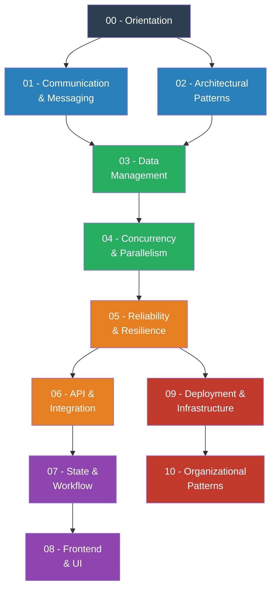

# Software Engineering Patterns — Complete Curriculum

> Patterns are not recipes. They are **pressure-release valves** for recurring forces in software systems.

## What This Is

A comprehensive, narrative-driven curriculum covering **10 pattern families** across software engineering. Every pattern is taught the same way: start with the pain, explore naïve solutions, discover the insight, then formalize the pattern.

## Curriculum Map

## Module Index

| # | Module | Focus |
|---|---|---|
| 00 | [Orientation](00-orientation/README.md) | What patterns are, how to evaluate them, forces model |
| 01 | [Communication & Messaging](01-communication-messaging/README.md) | How systems and components talk to each other |
| 02 | [Architectural Patterns](02-architectural-patterns/README.md) | How systems are structured at the highest level |
| 03 | [Data Management](03-data-management/README.md) | How data is stored, retrieved, cached, and kept consistent |
| 04 | [Concurrency & Parallelism](04-concurrency-parallelism/README.md) | How systems handle multiple things at once |
| 05 | [Reliability & Resilience](05-reliability-resilience/README.md) | How systems survive failure |
| 06 | [API & Integration](06-api-integration/README.md) | How services expose and consume functionality |
| 07 | [State & Workflow](07-state-workflow/README.md) | How to model state transitions and multi-step processes |
| 08 | [Frontend & UI](08-frontend-ui/README.md) | How UIs are structured and state is managed |
| 09 | [Deployment & Infrastructure](09-deployment-infrastructure/README.md) | How code gets to production safely |
| 10 | [Organizational Patterns](10-organizational-patterns/README.md) | How team structure shapes system design |

## How Each Pattern Is Taught

Every pattern follows this exact structure:

1. **The Problem** — A real-world scenario. No pattern name yet.
2. **Naïve Solutions** — What engineers try first, and why it breaks.
3. **The Insight** — The core idea that unlocks the pattern.
4. **The Pattern** — Formalized: name, definition, guarantees, non-guarantees.
5. **Mental Model** — How to think about it.
6. **Structure** — Mermaid diagram showing control/data/message flow.
7. **Code Example** — Real TypeScript and Go implementations.
8. **Gotchas & Beginner Mistakes** — What goes wrong in practice.
9. **Related & Confusable Patterns** — What to distinguish this from.
10. **When This Pattern Is the WRONG Choice** — When it causes harm.

## Prerequisites

- Comfortable reading TypeScript and Go
- Basic understanding of HTTP, databases, and distributed systems
- Experience building at least one backend service
