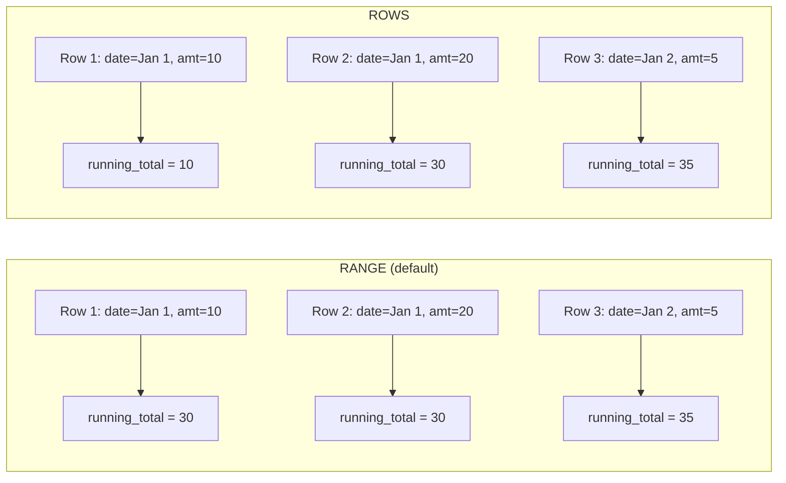
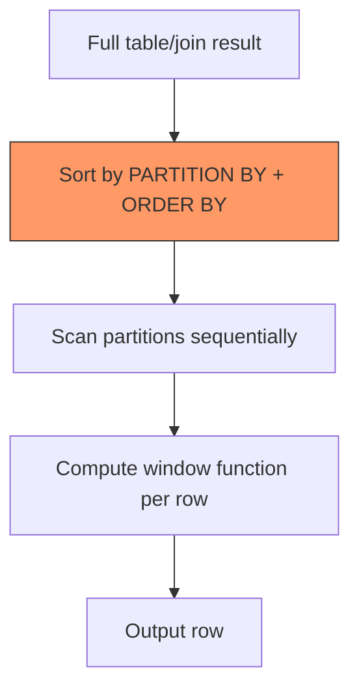

# Window Functions Beyond Basics

> **What mistake does this prevent?**
> Subtle bugs from misunderstanding frame clauses, silent performance cliffs from careless windowing, and wrong results that look right because the default frame isn't what you think it is.

You already know `ROW_NUMBER`, `RANK`, `LAG`, `LEAD`, and basic `OVER (PARTITION BY ... ORDER BY ...)`.

This file is about everything that goes wrong after you stop reading the tutorial.

---

## 1. The Default Frame Will Betray You

When you write:

```sql
SELECT
  order_id,
  amount,
  SUM(amount) OVER (ORDER BY order_date) AS running_total
FROM orders;
```

PostgreSQL applies the **default frame**:

```
RANGE BETWEEN UNBOUNDED PRECEDING AND CURRENT ROW
```

Not `ROWS BETWEEN`. `RANGE`.

**The difference:**

- `ROWS` = physical rows in the partition
- `RANGE` = logical range of the `ORDER BY` value

If two rows share the same `order_date`, `RANGE` includes **both** in the frame for **both** rows. Your "running total" jumps by the sum of all ties at once.



**Production consequence:** Financial reports with duplicate timestamps produce silently wrong running totals. Nobody notices until an auditor does.

**Rule:** If you want a deterministic row-by-row accumulation, always use `ROWS`, never rely on the default.

---

## 2. ROWS vs RANGE vs GROUPS

PostgreSQL 11+ added `GROUPS`:

| Mode | Unit | Includes ties? |
|------|------|---------------|
| `ROWS` | Physical row position | No — each row is distinct |
| `RANGE` | Logical value of ORDER BY expression | Yes — peers are lumped together |
| `GROUPS` | Peer groups (rows with same ORDER BY value) | Yes — but counts groups, not rows |

**When to use GROUPS:**

When you want "the previous 3 distinct dates" rather than "the previous 3 rows":

```sql
SELECT
  sale_date,
  revenue,
  AVG(revenue) OVER (
    ORDER BY sale_date
    GROUPS BETWEEN 2 PRECEDING AND CURRENT ROW
  ) AS avg_last_3_days
FROM daily_sales;
```

With `ROWS BETWEEN 2 PRECEDING`, you'd get exactly 3 rows — which might be 3 sales on the same day. With `GROUPS`, you get all rows within the last 3 distinct `sale_date` values.

---

## 3. EXCLUDE Clauses

PostgreSQL supports `EXCLUDE` in frame specifications:

```sql
ROWS BETWEEN 1 PRECEDING AND 1 FOLLOWING EXCLUDE CURRENT ROW
```

Options:

| Clause | Effect |
|--------|--------|
| `EXCLUDE NO OTHERS` | Default. Include everything in frame. |
| `EXCLUDE CURRENT ROW` | Remove the current row from the frame |
| `EXCLUDE GROUP` | Remove the current row and all its peers |
| `EXCLUDE TIES` | Remove peers of current row, keep current row |

**Real use case:** Moving average that excludes the current data point (leave-one-out validation):

```sql
SELECT
  sensor_id,
  reading_time,
  value,
  AVG(value) OVER (
    PARTITION BY sensor_id
    ORDER BY reading_time
    ROWS BETWEEN 5 PRECEDING AND 5 FOLLOWING
    EXCLUDE CURRENT ROW
  ) AS neighbor_avg
FROM sensor_readings;
```

If `value` deviates significantly from `neighbor_avg`, it's an anomaly.

---

## 4. FILTER Clause on Aggregates

Not technically a window-only feature, but devastatingly useful with windows:

```sql
SELECT
  department,
  employee_id,
  salary,
  COUNT(*) FILTER (WHERE salary > 100000) OVER (PARTITION BY department) AS high_earners,
  AVG(salary) FILTER (WHERE is_active) OVER (PARTITION BY department) AS avg_active_salary
FROM employees;
```

Without `FILTER`, you'd need a `CASE WHEN` inside the aggregate, which is verbose and error-prone with NULLs:

```sql
-- Fragile alternative
AVG(CASE WHEN is_active THEN salary END) -- NULLs for inactive, AVG ignores NULLs... usually
```

`FILTER` is cleaner, more explicit, and avoids the NULL-interaction trap.

---

## 5. Performance Reality of Window Functions

### How PostgreSQL Executes Window Functions



**The sort is the bottleneck.** Every `OVER` clause with a different `PARTITION BY` or `ORDER BY` requires a separate sort pass.

```sql
-- Two different sorts required
SELECT
  ROW_NUMBER() OVER (ORDER BY created_at) AS global_rank,     -- Sort 1
  ROW_NUMBER() OVER (PARTITION BY dept ORDER BY salary) AS dept_rank  -- Sort 2
FROM employees;
```

### What to Watch For

| Symptom | Cause | Fix |
|---------|-------|-----|
| Slow window query on large table | Sort spills to disk | Add `work_mem` or reduce partition size |
| Same query, two window functions, 2x slower | Different sort orders | Consolidate OVER clauses where possible |
| Memory pressure | Large partitions materialized | Consider pre-aggregating |

### Consolidation Trick

If multiple window functions share the same `PARTITION BY` and `ORDER BY`, PostgreSQL sorts **once**:

```sql
-- ONE sort, THREE window functions
SELECT
  ROW_NUMBER() OVER w AS rn,
  LAG(amount) OVER w AS prev_amount,
  SUM(amount) OVER w AS running_sum
FROM orders
WINDOW w AS (PARTITION BY customer_id ORDER BY order_date);
```

The `WINDOW` clause isn't just syntactic sugar — it signals to the planner that one sort suffices.

---

## 6. Window Functions You Probably Aren't Using

### `NTH_VALUE`

Get the Nth value in the frame:

```sql
SELECT
  employee_id,
  salary,
  NTH_VALUE(salary, 2) OVER (
    PARTITION BY department
    ORDER BY salary DESC
    ROWS BETWEEN UNBOUNDED PRECEDING AND UNBOUNDED FOLLOWING
  ) AS second_highest_salary
FROM employees;
```

**Warning:** Without the explicit frame `ROWS BETWEEN UNBOUNDED PRECEDING AND UNBOUNDED FOLLOWING`, `NTH_VALUE` uses the default frame and may return NULL for early rows in the partition.

### `NTILE`

Distribute rows into N roughly-equal buckets:

```sql
SELECT
  customer_id,
  lifetime_value,
  NTILE(4) OVER (ORDER BY lifetime_value DESC) AS quartile
FROM customers;
```

Useful for segmentation. But be aware: with uneven division, earlier buckets get one extra row. With 10 rows and `NTILE(3)`, you get buckets of 4, 3, 3.

### `PERCENT_RANK` and `CUME_DIST`

```sql
SELECT
  student_id,
  score,
  PERCENT_RANK() OVER (ORDER BY score) AS percentile,   -- 0.0 to 1.0
  CUME_DIST() OVER (ORDER BY score) AS cumulative_dist   -- fraction of rows <= current
FROM exam_results;
```

---

## 7. The "Window Functions in WHERE" Trap

This doesn't work:

```sql
-- ERROR: window functions are not allowed in WHERE
SELECT * FROM orders
WHERE ROW_NUMBER() OVER (PARTITION BY customer_id ORDER BY order_date DESC) = 1;
```

Window functions execute **after** `WHERE` and `GROUP BY` in the logical query order:


**Solution:** Subquery or CTE:

```sql
WITH ranked AS (
  SELECT *,
    ROW_NUMBER() OVER (PARTITION BY customer_id ORDER BY order_date DESC) AS rn
  FROM orders
)
SELECT * FROM ranked WHERE rn = 1;
```

Or use `DISTINCT ON` for this specific pattern (PostgreSQL-specific, often faster):

```sql
SELECT DISTINCT ON (customer_id) *
FROM orders
ORDER BY customer_id, order_date DESC;
```

---

## 8. Thinking Traps Summary

| Trap | What goes wrong | Prevention |
|------|----------------|------------|
| Default frame with ties | Running totals jump unexpectedly | Always specify `ROWS BETWEEN` explicitly |
| Multiple OVER clauses | Hidden sort multiplication | Use `WINDOW` clause, consolidate |
| `LAST_VALUE` without frame | Returns current row, not last in partition | Use `ROWS BETWEEN UNBOUNDED PRECEDING AND UNBOUNDED FOLLOWING` |
| Window in WHERE | Syntax error | Wrap in CTE/subquery |
| Large partitions | Sort spills, OOM | Check `EXPLAIN` for Sort Method, increase `work_mem` |
| `NTH_VALUE` with default frame | NULL for early rows | Explicit unbounded frame |

---

## Related Files

- [04_subqueries_ctes_windows.md](../04_subqueries_ctes_windows.md) — foundational window function coverage
- [07_explain_analyze.md](../07_explain_analyze.md) — how to spot window sort costs in EXPLAIN
- [Internals/05_query_planner_optimizer.md](../Internals/05_query_planner_optimizer.md) — how the planner costs sort operations
