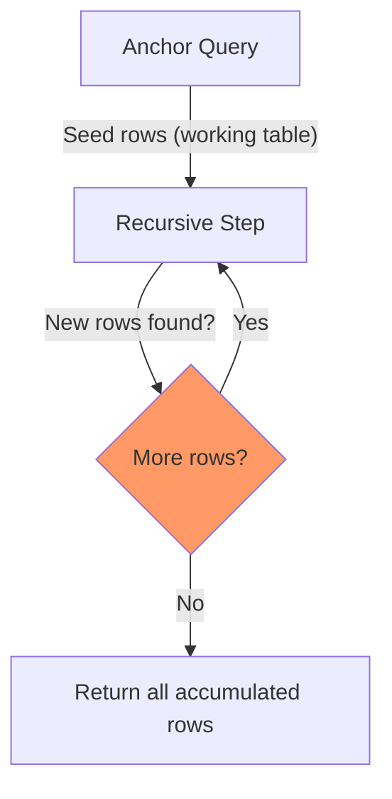
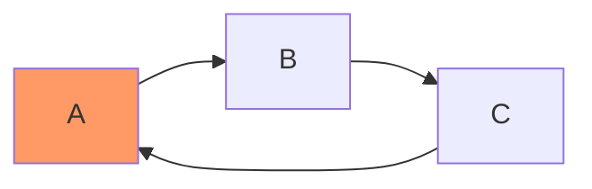
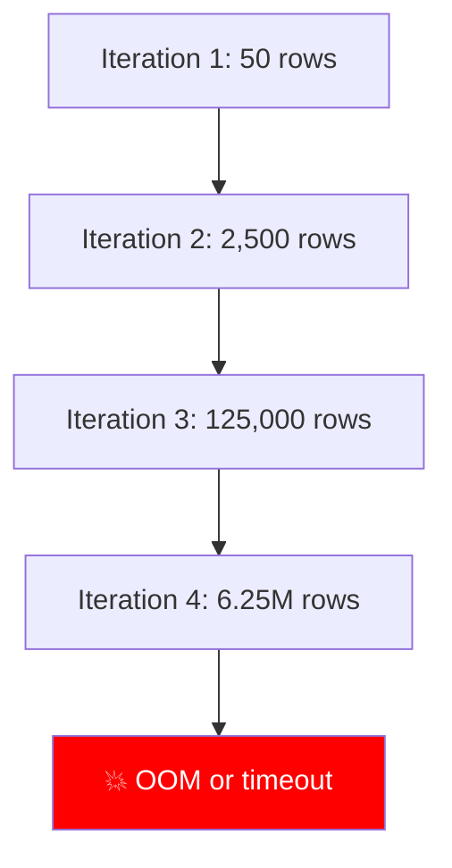

# Recursive CTEs in Practice

> **What mistake does this prevent?**
> Infinite loops that take down production, queries that silently return wrong results because the recursion termination is subtly broken, and performance disasters where a recursive CTE does in 30 seconds what a proper approach does in 30 milliseconds.

You already know the basic recursive CTE structure. This file is about what goes wrong when you actually use them.

---

## 1. The Structure You Already Know (Quick Refresher)

```sql
WITH RECURSIVE tree AS (
  -- Base case (anchor)
  SELECT id, parent_id, name, 1 AS depth
  FROM categories
  WHERE parent_id IS NULL

  UNION ALL

  -- Recursive step
  SELECT c.id, c.parent_id, c.name, t.depth + 1
  FROM categories c
  JOIN tree t ON c.parent_id = t.id
)
SELECT * FROM tree;
```



**The critical mental model:** PostgreSQL maintains a *working table*. Each iteration, the recursive step runs against **only the rows from the previous iteration**, not all accumulated rows. New results replace the working table. This continues until the working table is empty.

---

## 2. UNION vs UNION ALL — The Silent Correctness Bug

```sql
-- UNION: deduplicates each iteration
WITH RECURSIVE ... UNION ...

-- UNION ALL: keeps duplicates
WITH RECURSIVE ... UNION ALL ...
```

**Most tutorials use `UNION ALL`** because it's faster (no dedup step). But in **graph traversal** (not just trees), `UNION ALL` can revisit nodes and loop forever.



With `UNION ALL` on this graph, the recursion never terminates. With `UNION`, duplicates are dropped and the recursion stops.

**But `UNION` has a cost:** Deduplication on every iteration. For large result sets, this is expensive.

**Rule of thumb:**
- Trees (no cycles possible): `UNION ALL`
- Graphs (cycles possible): `UNION` or manual cycle detection

---

## 3. Cycle Detection (PostgreSQL 14+)

PostgreSQL 14 added built-in cycle detection:

```sql
WITH RECURSIVE traversal AS (
  SELECT id, parent_id, ARRAY[id] AS path, false AS is_cycle
  FROM nodes
  WHERE id = 1

  UNION ALL

  SELECT n.id, n.parent_id, t.path || n.id, n.id = ANY(t.path)
  FROM nodes n
  JOIN traversal t ON n.parent_id = t.id
  WHERE NOT t.is_cycle
)
SELECT * FROM traversal WHERE NOT is_cycle;
```

Or with the cleaner syntax:

```sql
WITH RECURSIVE traversal AS (
  SELECT id, parent_id, name
  FROM nodes WHERE id = 1

  UNION ALL

  SELECT n.id, n.parent_id, n.name
  FROM nodes n
  JOIN traversal t ON n.parent_id = t.id
)
CYCLE id SET is_cycle USING path
SELECT * FROM traversal WHERE NOT is_cycle;
```

**Production lesson:** If your data can ever have cycles (user-created hierarchies, org charts with mistakes, category trees with bad imports), you **must** have cycle detection. Without it, the query hangs and eventually OOMs your database.

---

## 4. Depth Limiting — Your Safety Net

Even without cycles, unbounded recursion is dangerous:

```sql
WITH RECURSIVE tree AS (
  SELECT id, parent_id, name, 1 AS depth
  FROM categories WHERE parent_id IS NULL

  UNION ALL

  SELECT c.id, c.parent_id, c.name, t.depth + 1
  FROM categories c
  JOIN tree t ON c.parent_id = t.id
  WHERE t.depth < 100  -- Safety limit
)
SELECT * FROM tree;
```

**Why this matters:**
- Corrupted data can create unexpectedly deep hierarchies
- A single bad `parent_id` update can create a cycle
- PostgreSQL has no built-in recursion depth limit (pre-14)
- The query will consume memory proportional to recursion depth

**Always add depth limits in production.** The limit should be generous (you don't want to silently truncate real data), but finite.

---

## 5. Path Building — The Most Useful Pattern

Building the full path during recursion is invaluable for debugging and display:

```sql
WITH RECURSIVE tree AS (
  SELECT
    id,
    name,
    name::text AS full_path,
    ARRAY[id] AS id_path,
    1 AS depth
  FROM categories
  WHERE parent_id IS NULL

  UNION ALL

  SELECT
    c.id,
    c.name,
    t.full_path || ' > ' || c.name,
    t.id_path || c.id,
    t.depth + 1
  FROM categories c
  JOIN tree t ON c.parent_id = t.id
  WHERE NOT c.id = ANY(t.id_path)  -- Cycle detection via path
)
SELECT * FROM tree ORDER BY full_path;
```

Result:
```
Electronics
Electronics > Computers
Electronics > Computers > Laptops
Electronics > Phones
Electronics > Phones > Smartphones
```

**The `ARRAY[id]` path serves double duty:** readable hierarchy AND cycle detection.

---

## 6. Performance: Why Recursive CTEs Can Be Catastrophic

### The Exponential Blowup Problem

Consider a many-to-many relationship (not a tree):

```sql
-- "Find all users connected to user 1 through friendships"
WITH RECURSIVE connected AS (
  SELECT user_id, friend_id FROM friendships WHERE user_id = 1

  UNION ALL

  SELECT f.user_id, f.friend_id
  FROM friendships f
  JOIN connected c ON f.user_id = c.friend_id
)
SELECT DISTINCT friend_id FROM connected;
```

In a social graph with 10,000 users and average 50 friends each, this query explores:
- Iteration 1: 50 rows
- Iteration 2: 50 × 50 = 2,500 rows
- Iteration 3: 2,500 × 50 = 125,000 rows
- Iteration 4: 6,250,000 rows

**Without cycle detection and `UNION ALL`, this is exponential.** Even with `UNION`, it's slow because dedup happens per iteration.



### When NOT to Use Recursive CTEs

| Scenario | Better alternative |
|----------|-------------------|
| Graph traversal at scale | Materialized path column, `ltree` extension |
| Finding shortest paths | Application-level BFS with visited set |
| Transitive closure of large graph | Pre-computed closure table |
| Deep hierarchies (>100 levels) | Nested set model or `ltree` |

### When Recursive CTEs Are Fine

- Org charts (bounded depth, tree structure)
- Category hierarchies (bounded depth)
- Bill of materials (bounded, tree-ish)
- Generating series (bounded iterations)
- Small graph traversals (<10K nodes)

---

## 7. The `ltree` Alternative

For hierarchies that are read-heavy and deep, PostgreSQL's `ltree` extension is dramatically faster:

```sql
CREATE EXTENSION IF NOT EXISTS ltree;

-- Store path directly
CREATE TABLE categories (
  id SERIAL PRIMARY KEY,
  name TEXT NOT NULL,
  path ltree NOT NULL
);

-- Index it
CREATE INDEX idx_categories_path ON categories USING GIST (path);

-- Find all descendants of 'Electronics.Computers'
SELECT * FROM categories WHERE path <@ 'electronics.computers';

-- Find ancestors
SELECT * FROM categories WHERE path @> 'electronics.computers.laptops';

-- Find at specific depth
SELECT * FROM categories WHERE nlevel(path) = 3;
```

**Trade-off:** Path must be maintained on writes (moves are expensive), but reads are O(log n) instead of O(depth × branching factor).

---

## 8. Practical Patterns

### Generate a Date Series (Non-Hierarchical Recursion)

```sql
WITH RECURSIVE dates AS (
  SELECT '2024-01-01'::date AS d
  UNION ALL
  SELECT d + 1 FROM dates WHERE d < '2024-12-31'
)
SELECT d FROM dates;
```

But `generate_series` is better for this:

```sql
SELECT generate_series('2024-01-01'::date, '2024-12-31'::date, '1 day'::interval)::date;
```

### Flatten a JSONB Tree

```sql
WITH RECURSIVE flat AS (
  SELECT
    key,
    value,
    key AS path
  FROM jsonb_each('{"a": {"b": {"c": 1}, "d": 2}}'::jsonb)

  UNION ALL

  SELECT
    child.key,
    child.value,
    flat.path || '.' || child.key
  FROM flat, jsonb_each(flat.value) AS child
  WHERE jsonb_typeof(flat.value) = 'object'
)
SELECT path, value FROM flat
WHERE jsonb_typeof(value) != 'object';
```

### Bill of Materials with Quantity Roll-Up

```sql
WITH RECURSIVE bom AS (
  SELECT
    component_id,
    component_name,
    quantity,
    1 AS level
  FROM bill_of_materials
  WHERE assembly_id = 'BIKE-001'

  UNION ALL

  SELECT
    b.component_id,
    b.component_name,
    b.quantity * bom.quantity,  -- Multiply quantities down the tree
    bom.level + 1
  FROM bill_of_materials b
  JOIN bom ON b.assembly_id = bom.component_id
  WHERE bom.level < 20
)
SELECT component_id, component_name, SUM(quantity) AS total_needed
FROM bom
GROUP BY component_id, component_name;
```

---

## 9. Thinking Traps Summary

| Trap | What breaks | Prevention |
|------|------------|------------|
| `UNION ALL` on graphs | Infinite loop, OOM | Use `UNION` or manual cycle detection |
| No depth limit | Corrupted data → runaway query | Always `WHERE depth < N` |
| Exponential fan-out | Query runs for hours | Pre-compute or use `ltree` |
| Assuming recursion = tree | Graphs have multiple paths to same node | Track visited nodes in array |
| Large result set in recursion | Memory exhaustion | Limit early, filter in anchor |

---

## Related Files

- [04_subqueries_ctes_windows.md](../04_subqueries_ctes_windows.md) — basic CTE and recursive CTE coverage
- [11_postgres_specific_features.md](../11_postgres_specific_features.md) — `ltree` and other extensions
- [Internals/05_query_planner_optimizer.md](../Internals/05_query_planner_optimizer.md) — how the planner handles CTEs
