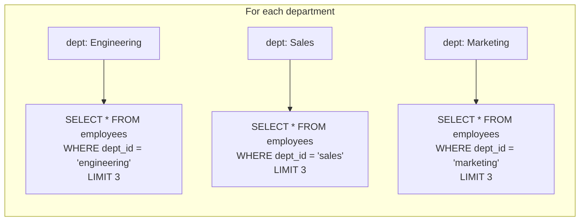
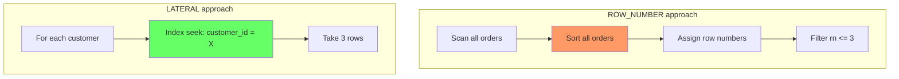
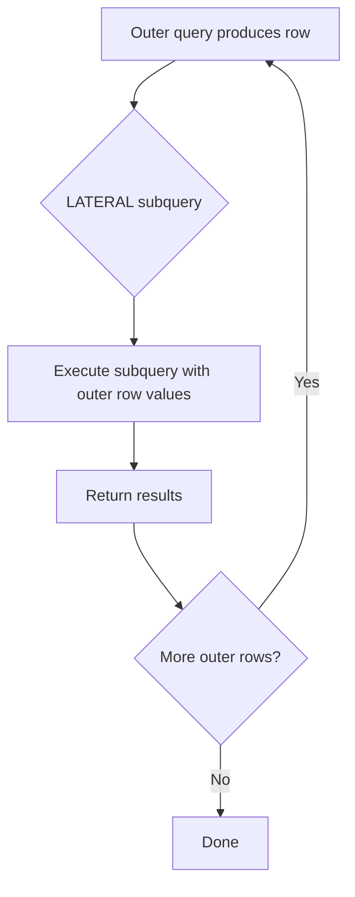

# LATERAL Joins Deep Dive

> **What mistake does this prevent?**
> Writing impossibly complex subqueries, or falling back to application-level loops, when a single `LATERAL` join would solve the problem cleanly and efficiently.

You've seen LATERAL mentioned. This file is about building the mental model for when it's the *only* good option, and understanding its performance characteristics.

---

## 1. The Core Idea

A normal join cannot reference columns from another table in the `FROM` clause:

```sql
-- This is ILLEGAL in standard SQL:
SELECT *
FROM departments d,
     (SELECT * FROM employees WHERE department_id = d.id LIMIT 3) sub;
-- ERROR: d.id cannot be referenced here
```

`LATERAL` lifts this restriction:

```sql
-- This is LEGAL:
SELECT *
FROM departments d,
LATERAL (SELECT * FROM employees WHERE department_id = d.id LIMIT 3) sub;
```

**Mental model:** A `LATERAL` subquery is like a `foreach` loop. For each row in the left side, the right side executes with access to that row's columns.



---

## 2. When LATERAL Unlocks Impossible Queries

### Pattern 1: Top-N Per Group (With LIMIT)

The classic problem — get the 3 most recent orders per customer:

**Without LATERAL (common approach):**
```sql
WITH ranked AS (
  SELECT *, ROW_NUMBER() OVER (PARTITION BY customer_id ORDER BY order_date DESC) AS rn
  FROM orders
)
SELECT * FROM ranked WHERE rn <= 3;
```

This **sorts the entire orders table**, assigns row numbers, then filters. For 100M orders, that's a lot of wasted work.

**With LATERAL:**
```sql
SELECT c.id, c.name, recent.*
FROM customers c,
LATERAL (
  SELECT order_id, order_date, amount
  FROM orders o
  WHERE o.customer_id = c.id
  ORDER BY o.order_date DESC
  LIMIT 3
) recent;
```

**Why this can be faster:** If there's an index on `orders(customer_id, order_date DESC)`, each LATERAL invocation is an index lookup + 3-row fetch. No full table sort.



**But:** If you're fetching top-N for *all* customers and the table is small, the `ROW_NUMBER` approach may be faster because a single sort is cheaper than thousands of index lookups. **Check `EXPLAIN ANALYZE`.**

### Pattern 2: Dependent Function Calls

```sql
SELECT
  u.id,
  u.email,
  plan.*
FROM users u,
LATERAL get_user_subscription_details(u.id) AS plan;
```

Without `LATERAL`, you can't call a set-returning function that depends on columns from another table in the FROM clause.

### Pattern 3: Unpivoting with Computed Values

```sql
SELECT
  s.id,
  s.store_name,
  metrics.*
FROM stores s,
LATERAL (
  VALUES
    ('revenue', s.q1_revenue + s.q2_revenue + s.q3_revenue + s.q4_revenue),
    ('avg_quarterly', (s.q1_revenue + s.q2_revenue + s.q3_revenue + s.q4_revenue) / 4.0),
    ('max_quarterly', GREATEST(s.q1_revenue, s.q2_revenue, s.q3_revenue, s.q4_revenue))
) AS metrics(metric_name, value);
```

### Pattern 4: Closest Match / Nearest Neighbor

Find the nearest warehouse to each customer:

```sql
SELECT
  c.id,
  c.name,
  nearest.*
FROM customers c,
LATERAL (
  SELECT
    w.id AS warehouse_id,
    w.name AS warehouse_name,
    ST_Distance(c.location, w.location) AS distance
  FROM warehouses w
  ORDER BY c.location <-> w.location  -- KNN index operator
  LIMIT 1
) nearest;
```

This pattern is **impossible** without LATERAL because the `ORDER BY` depends on `c.location`.

---

## 3. LEFT JOIN LATERAL — Don't Drop Rows

`LATERAL` with a comma (implicit cross join) **drops rows** where the subquery returns nothing:

```sql
-- Customer with ZERO orders? Gone from results.
SELECT c.*, recent.*
FROM customers c,
LATERAL (
  SELECT * FROM orders WHERE customer_id = c.id LIMIT 1
) recent;
```

Use `LEFT JOIN LATERAL ... ON true` to preserve all left-side rows:

```sql
SELECT c.*, recent.*
FROM customers c
LEFT JOIN LATERAL (
  SELECT * FROM orders WHERE customer_id = c.id LIMIT 1
) recent ON true;
```

The `ON true` looks weird but is correct — the join condition is handled inside the LATERAL subquery's `WHERE`.

---

## 4. Performance Characteristics

### Execution Model



| Factor | Impact |
|--------|--------|
| Outer row count | LATERAL runs once per outer row |
| Inner query efficiency | Index on filter columns is critical |
| LIMIT in LATERAL | Can short-circuit inner execution |
| No LIMIT in LATERAL | Each invocation may scan significant data |

### When LATERAL Wins

1. **Top-N per group** with good indexes and many groups
2. **Few outer rows**, each needing a complex correlated lookup
3. **Set-returning functions** that depend on outer columns
4. **KNN / nearest-neighbor** queries

### When LATERAL Loses

1. **Large outer table + unindexed inner query** = nested loop disaster
2. **All rows needed anyway** (no LIMIT) = hash/merge join would be faster
3. **Planner chooses nested loop** when hash join would be better — LATERAL forces nested loop semantics

### Diagnosing LATERAL Performance

In `EXPLAIN ANALYZE`, look for:

```
->  Nested Loop (actual rows=... loops=10000)
      ->  Seq Scan on customers (actual rows=10000)
      ->  Index Scan on orders (actual rows=3 loops=10000)
```

The key metric is `loops=`. If it's 10,000 and each loop is cheap (index scan, few rows), you're fine. If each loop is expensive (seq scan, many rows), you have a problem.

---

## 5. LATERAL vs Correlated Subquery in SELECT

These are semantically similar:

```sql
-- Correlated subquery in SELECT (returns ONE value)
SELECT
  c.id,
  (SELECT MAX(order_date) FROM orders WHERE customer_id = c.id) AS last_order
FROM customers c;

-- LATERAL (can return multiple columns/rows)
SELECT c.id, latest.order_date, latest.amount
FROM customers c
LEFT JOIN LATERAL (
  SELECT order_date, amount
  FROM orders WHERE customer_id = c.id
  ORDER BY order_date DESC LIMIT 1
) latest ON true;
```

**When to use which:**
- Single scalar value → correlated subquery in SELECT is fine
- Multiple columns from the same correlated lookup → LATERAL
- Multiple rows per outer row → LATERAL (correlated subquery in SELECT is illegal for this)

---

## 6. Thinking Traps

| Trap | What happens | Prevention |
|------|-------------|------------|
| LATERAL without index on inner table | Nested loop of sequential scans | Always ensure inner query can index-seek |
| Implicit CROSS JOIN (comma syntax) | Rows with no match disappear | Use `LEFT JOIN LATERAL ... ON true` |
| LATERAL without LIMIT | Full correlated scan per outer row | Always ask: "Do I need all rows or just N?" |
| Assuming LATERAL is always faster | Planner can't choose hash/merge join | Benchmark both approaches with `EXPLAIN ANALYZE` |
| LATERAL in UPDATE/DELETE | Surprising behavior with row visibility | Test carefully, prefer CTEs for data modification |

---

## Related Files

- [11_postgres_specific_features.md](../11_postgres_specific_features.md) — introductory LATERAL coverage
- [04_subqueries_ctes_windows.md](../04_subqueries_ctes_windows.md) — correlated subqueries as alternative
- [07_explain_analyze.md](../07_explain_analyze.md) — reading nested loop plans
