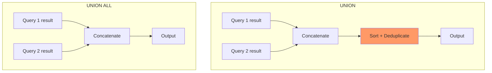
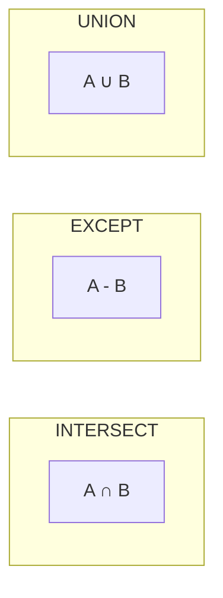

# Set Operations at Scale

> **What mistake does this prevent?**
> Performance disasters from misusing `UNION` when you meant `UNION ALL`, subtle bugs from `INTERSECT`/`EXCEPT` NULL handling that differs from `JOIN` NULL handling, and queries that materialize millions of rows unnecessarily.

---

## 1. UNION vs UNION ALL — The Cost of Deduplication

```sql
-- UNION: sorts + deduplicates
SELECT email FROM customers
UNION
SELECT email FROM newsletter_subscribers;

-- UNION ALL: just concatenates
SELECT email FROM customers
UNION ALL
SELECT email FROM newsletter_subscribers;
```



### The Performance Difference

For two result sets of N rows each:

| Operation | Time Complexity | Memory |
|-----------|----------------|--------|
| `UNION ALL` | O(N) — just append | O(1) — streaming |
| `UNION` | O(N log N) — sort + dedup | O(N) — must hold all rows |
| `UNION` with HashAggregate | O(N) average case | O(N) — hash table |

**In `EXPLAIN`:**

```
-- UNION ALL
Append (rows=200000)
  -> Seq Scan on customers
  -> Seq Scan on newsletter_subscribers

-- UNION (PostgreSQL chooses Sort or Hash)
Unique (rows=150000)
  -> Sort (sort key: ALL columns)
    -> Append (rows=200000)
      -> Seq Scan on customers
      -> Seq Scan on newsletter_subscribers
```

**Rule:** Use `UNION ALL` unless you specifically need deduplication. This is the most common unnecessary performance tax in SQL.

### When UNION Is Actually Needed

- Combining overlapping data sources (user appears in both tables)
- Eliminating duplicate rows after a complex transformation
- When the business requirement is "unique values from both sets"

### When People Use UNION but Shouldn't

```sql
-- BAD: Using UNION to combine non-overlapping partitions
SELECT * FROM orders_2023
UNION
SELECT * FROM orders_2024;

-- GOOD: No overlap possible between years, use UNION ALL
SELECT * FROM orders_2023
UNION ALL
SELECT * FROM orders_2024;
```

If you **know** the sets are disjoint, `UNION` wastes time proving what you already know.

---

## 2. INTERSECT and EXCEPT

### INTERSECT — Rows in Both

```sql
-- Customers who are ALSO newsletter subscribers
SELECT email FROM customers
INTERSECT
SELECT email FROM newsletter_subscribers;
```

### EXCEPT — Rows in First but Not Second

```sql
-- Customers who are NOT newsletter subscribers
SELECT email FROM customers
EXCEPT
SELECT email FROM newsletter_subscribers;
```

**The trap:** `EXCEPT` is not commutative. `A EXCEPT B ≠ B EXCEPT A`.



### INTERSECT ALL / EXCEPT ALL

These preserve duplicates with multiplicity:

```sql
-- If 'alice@test.com' appears 3 times in A and 2 times in B:
-- INTERSECT ALL returns it 2 times (min)
-- EXCEPT ALL returns it 1 time (3 - 2)
```

This is rarely used but exists. Be aware it's different from the non-ALL versions.

---

## 3. NULL Handling — The Subtle Difference from JOINs

**In JOINs:** `NULL = NULL` is `NULL` (falsy). Two NULLs never match.

**In set operations:** `NULL` is considered **equal** to `NULL` for deduplication purposes.

```sql
-- These are treated as the same row in UNION/INTERSECT/EXCEPT:
SELECT NULL::text AS email
UNION
SELECT NULL::text AS email;
-- Returns: ONE row with NULL

-- But a JOIN would NOT match them:
SELECT * FROM a JOIN b ON a.email = b.email;
-- NULL emails never join
```

**Production consequence:** If you're converting a JOIN-based approach to `INTERSECT` or vice versa, NULL handling changes. Results will differ for rows with NULL values.

---

## 4. Set Operations with Many Columns

Set operations compare **all columns**. This creates problems:

```sql
-- Comparing by ALL columns including ones you don't care about
SELECT id, email, last_login FROM source_a
EXCEPT
SELECT id, email, last_login FROM source_b;
-- If same user logged in at different times, they're "different"
```

**Fix:** Only select the columns that define "sameness":

```sql
SELECT email FROM source_a
EXCEPT
SELECT email FROM source_b;
```

Or use a more explicit approach:

```sql
SELECT a.*
FROM source_a a
WHERE NOT EXISTS (
  SELECT 1 FROM source_b b WHERE b.email = a.email
);
```

The `NOT EXISTS` approach gives you control over which columns define the match, which the `EXCEPT` approach does not.

---

## 5. Performance at Scale

### Materialization Problem

Every branch of a set operation is **fully materialized** before the set logic runs:

```sql
-- Both subqueries run to completion before UNION/UNION ALL processes them
(SELECT ... FROM massive_table_1 WHERE complex_condition)
UNION ALL
(SELECT ... FROM massive_table_2 WHERE other_condition);
```

For `UNION ALL`, this is fine — PostgreSQL can stream results. But for `UNION`, `INTERSECT`, `EXCEPT`, all results must be collected for comparison.

### Index Usage

Set operations **cannot use indexes** for the deduplication/comparison step. The sort/hash happens on the combined result.

```sql
-- The index on customers(email) helps the WHERE clause
-- But the UNION dedup uses a Sort or HashAggregate, not the index
SELECT email FROM customers WHERE active = true
UNION
SELECT email FROM prospects WHERE converted = true;
```

### Optimizing Complex Unions

**Bad: Filter after UNION**
```sql
SELECT * FROM (
  SELECT * FROM orders_us
  UNION ALL
  SELECT * FROM orders_eu
) combined
WHERE order_date > '2024-01-01';
```

**Better: Filter before UNION** (push predicate down)
```sql
SELECT * FROM orders_us WHERE order_date > '2024-01-01'
UNION ALL
SELECT * FROM orders_eu WHERE order_date > '2024-01-01';
```

PostgreSQL's optimizer sometimes pushes predicates down into `UNION ALL` branches, but **doesn't always do it**. Be explicit.

---

## 6. EXCEPT as a Data Validation Tool

`EXCEPT` is incredibly useful for comparing datasets:

```sql
-- Find rows in expected but not in actual (missing)
SELECT * FROM expected_results
EXCEPT
SELECT * FROM actual_results;

-- Find rows in actual but not in expected (extra)
SELECT * FROM actual_results
EXCEPT
SELECT * FROM expected_results;

-- If both return empty, datasets are identical
```

This is a common pattern in:
- Migration validation (old system vs new system)
- ETL pipeline testing
- Regression testing of query rewrites

---

## 7. Combining Set Operations (Precedence)

`INTERSECT` binds tighter than `UNION` and `EXCEPT`:

```sql
-- This:
SELECT * FROM a
UNION
SELECT * FROM b
INTERSECT
SELECT * FROM c;

-- Means:
SELECT * FROM a
UNION
(SELECT * FROM b INTERSECT SELECT * FROM c);

-- NOT:
(SELECT * FROM a UNION SELECT * FROM b)
INTERSECT
SELECT * FROM c;
```

**Always use parentheses** when combining multiple set operations. Don't rely on precedence.

---

## 8. Thinking Traps Summary

| Trap | Consequence | Prevention |
|------|------------|------------|
| `UNION` instead of `UNION ALL` | Unnecessary sort on millions of rows | Default to `UNION ALL`, use `UNION` only when dedup needed |
| NULL equality in set ops | Different results than equivalent JOIN | Be aware: set ops treat NULL = NULL |
| Filter after UNION instead of before | Full materialization then filter | Push predicates into each branch |
| `EXCEPT` column mismatch | Wrong "sameness" definition | Only select columns that define identity |
| Missing parentheses | Wrong precedence with INTERSECT | Always parenthesize mixed set operations |

---

## Related Files

- [03_joins_demystified.md](../03_joins_demystified.md) — JOIN alternatives to set operations
- [07_explain_analyze.md](../07_explain_analyze.md) — reading HashAggregate and Sort nodes
- [09_nulls_three_valued_logic.md](../09_nulls_three_valued_logic.md) — NULL behavior differences
