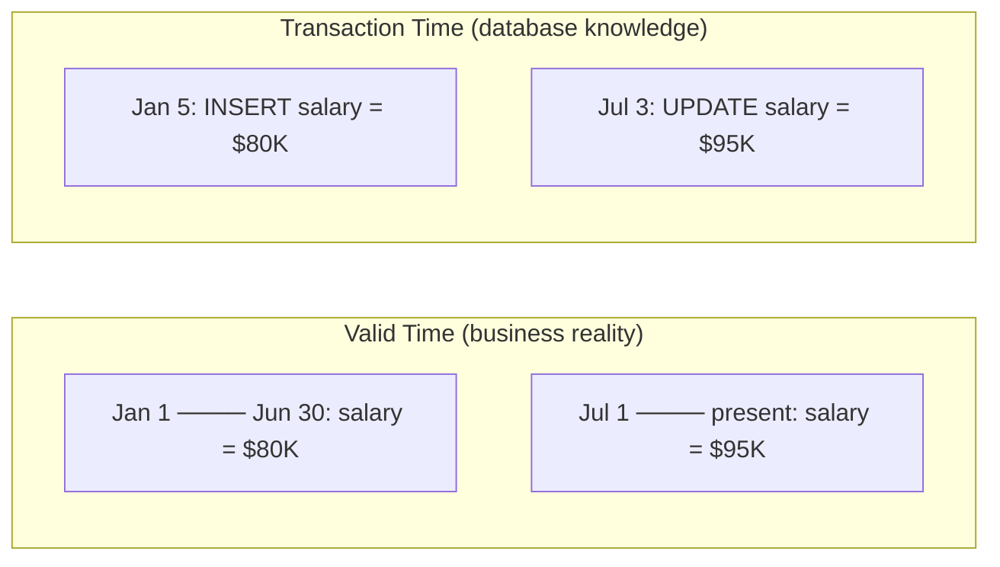
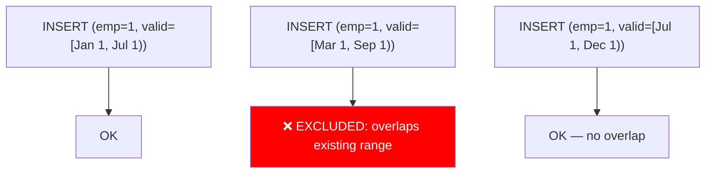
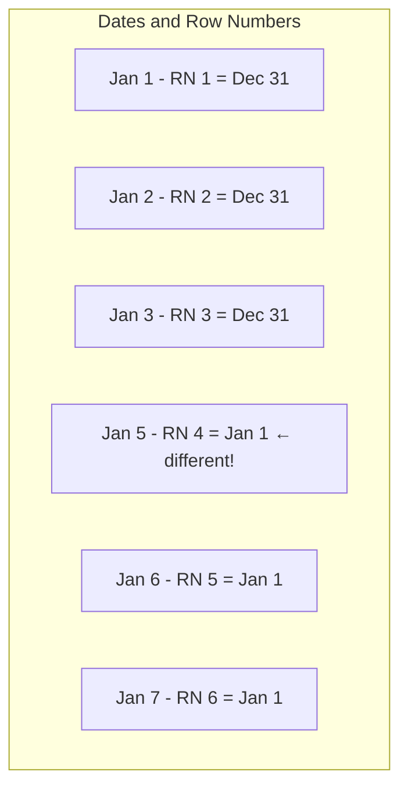

# Temporal Queries and Time-Based Modeling

> **What mistake does this prevent?**
> Losing the history of your data, building "current state only" schemas that can't answer "what was true on March 3rd?", and time-zone bugs that silently corrupt temporal queries.

---

## 1. The Two Kinds of Time

Every real system has (at least) two time dimensions:

| Dimension | Question it Answers | Example |
|-----------|-------------------|---------|
| **Valid time** (business time) | "When was this true in the real world?" | Employee's salary was $80K from Jan 1 to June 30 |
| **Transaction time** (system time) | "When did the database learn about this?" | We recorded the salary change on Jan 5 |



### Valid-Time Only (Most Common)

Track when something was true in the real world:

```sql
CREATE TABLE employee_salaries (
  employee_id INT NOT NULL,
  salary NUMERIC NOT NULL,
  valid_from DATE NOT NULL,
  valid_to DATE,  -- NULL = current
  PRIMARY KEY (employee_id, valid_from)
);
```

### Transaction-Time Only (Audit Trail)

Track when the database changed:

```sql
CREATE TABLE employee_salaries (
  employee_id INT NOT NULL,
  salary NUMERIC NOT NULL,
  recorded_at TIMESTAMPTZ NOT NULL DEFAULT now(),
  superseded_at TIMESTAMPTZ  -- NULL = current record
);
```

### Bi-Temporal (Both)

Track both — what was true AND when we knew it:

```sql
CREATE TABLE employee_salaries (
  employee_id INT NOT NULL,
  salary NUMERIC NOT NULL,
  valid_from DATE NOT NULL,
  valid_to DATE,
  recorded_at TIMESTAMPTZ NOT NULL DEFAULT now(),
  superseded_at TIMESTAMPTZ
);
```

**Bi-temporal is hard.** You need it when regulators ask: "On February 15th, what did you *believe* the customer's status was?" — which is different from what their status *actually was* on February 15th.

---

## 2. PostgreSQL Range Types — The Right Tool

Instead of `valid_from`/`valid_to` columns, use PostgreSQL's native range types:

```sql
CREATE TABLE employee_salaries (
  employee_id INT NOT NULL,
  salary NUMERIC NOT NULL,
  valid_during DATERANGE NOT NULL,
  EXCLUDE USING GIST (employee_id WITH =, valid_during WITH &&)
);
```

That `EXCLUDE` constraint is powerful — it prevents overlapping valid periods for the same employee **at the database level**.



### Range Operations

```sql
-- Does a range contain a specific date?
SELECT * FROM employee_salaries
WHERE valid_during @> '2024-03-15'::date;

-- Do two ranges overlap?
WHERE range1 && range2

-- What's the intersection?
SELECT range1 * range2

-- Is a range empty?
SELECT isempty(daterange('2024-01-01', '2024-01-01'));  -- true (empty)

-- Upper and lower bounds
SELECT lower(valid_during), upper(valid_during) FROM employee_salaries;
```

### Why Ranges Beat Two Columns

| Problem | Two columns | Range type |
|---------|-------------|------------|
| Overlap prevention | Application logic or complex CHECK | `EXCLUDE USING GIST` |
| "What was true on date X?" | `WHERE valid_from <= X AND (valid_to > X OR valid_to IS NULL)` | `WHERE valid_during @> X` |
| NULL semantics for "current" | Special-case logic everywhere | `upper(valid_during) IS NULL` or use `upper_inf()` |
| Indexing | Two-column index, partial effectiveness | GiST index, purpose-built |

---

## 3. Point-in-Time Queries

The most common temporal query: "What was the state at time T?"

### With Range Types

```sql
-- What was everyone's salary on March 15, 2024?
SELECT employee_id, salary
FROM employee_salaries
WHERE valid_during @> '2024-03-15'::date;
```

### Without Range Types (Two Columns)

```sql
SELECT employee_id, salary
FROM employee_salaries
WHERE valid_from <= '2024-03-15'
  AND (valid_to > '2024-03-15' OR valid_to IS NULL);
```

The second form is error-prone. People forget the NULL check. People use `>=` instead of `>` for the end date. People mix up inclusive vs exclusive bounds.

### Indexing for Point-in-Time

```sql
-- GiST index for range containment
CREATE INDEX idx_salary_valid ON employee_salaries USING GIST (valid_during);

-- For two-column approach
CREATE INDEX idx_salary_time ON employee_salaries (valid_from, valid_to);
```

---

## 4. Gaps and Islands — The Classic Temporal Problem

Given a sequence of events, find contiguous periods (islands) and breaks between them (gaps):

```sql
-- User login sessions (when were they active?)
CREATE TABLE user_activity (
  user_id INT,
  activity_date DATE
);

-- Data: user 1 active on Jan 1-3, Gap on Jan 4, active Jan 5-7
```

### Finding Islands (Contiguous Ranges)

```sql
WITH grouped AS (
  SELECT
    user_id,
    activity_date,
    activity_date - ROW_NUMBER() OVER (
      PARTITION BY user_id ORDER BY activity_date
    )::int AS grp
  FROM user_activity
)
SELECT
  user_id,
  MIN(activity_date) AS island_start,
  MAX(activity_date) AS island_end,
  COUNT(*) AS consecutive_days
FROM grouped
GROUP BY user_id, grp
ORDER BY user_id, island_start;
```

**How it works:** When dates are consecutive, `date - row_number` produces the same value. Any gap creates a new group value.



---

## 5. Slowly Changing Dimensions (SCD)

A concept from data warehousing that every application eventually needs:

### Type 1: Overwrite (No History)

```sql
UPDATE customers SET address = '456 New St' WHERE id = 1;
-- Old address is gone forever
```

### Type 2: Add New Row (Full History)

```sql
-- Close current record
UPDATE customer_history
SET valid_to = CURRENT_DATE
WHERE customer_id = 1 AND valid_to IS NULL;

-- Insert new record
INSERT INTO customer_history (customer_id, address, valid_from, valid_to)
VALUES (1, '456 New St', CURRENT_DATE, NULL);
```

### Type 2 with Ranges (Better)

```sql
-- Close and insert atomically
WITH closed AS (
  UPDATE customer_history
  SET valid_during = daterange(lower(valid_during), CURRENT_DATE)
  WHERE customer_id = 1 AND upper_inf(valid_during)
  RETURNING customer_id
)
INSERT INTO customer_history (customer_id, address, valid_during)
SELECT 1, '456 New St', daterange(CURRENT_DATE, NULL);
```

### Type 3: Add Column (Limited History)

```sql
ALTER TABLE customers ADD COLUMN previous_address TEXT;

UPDATE customers
SET previous_address = address, address = '456 New St'
WHERE id = 1;
```

Only remembers one previous value. Rarely sufficient.

---

## 6. Timezone Traps in Temporal Data

### The Cardinal Rule

**Store timestamps in UTC.** Always. `TIMESTAMPTZ` in PostgreSQL stores UTC internally and converts on display.

```sql
-- WRONG: TIMESTAMP WITHOUT TIME ZONE
CREATE TABLE events (
  event_time TIMESTAMP  -- What timezone? Nobody knows. Forever.
);

-- RIGHT: TIMESTAMP WITH TIME ZONE
CREATE TABLE events (
  event_time TIMESTAMPTZ  -- Stored as UTC, displayed in session timezone
);
```

### The Aggregation Trap

```sql
-- "Orders per day" — but whose day?
SELECT DATE(order_time) AS day, COUNT(*)
FROM orders
GROUP BY DATE(order_time);
```

If `order_time` is `TIMESTAMPTZ`, `DATE()` converts using the **session timezone**. Different sessions → different groupings → different daily counts.

**Fix:** Be explicit about timezone:

```sql
SELECT
  DATE(order_time AT TIME ZONE 'America/New_York') AS day,
  COUNT(*)
FROM orders
GROUP BY DATE(order_time AT TIME ZONE 'America/New_York');
```

### Date Ranges and Timezones

```sql
-- "All orders on January 15, 2024 in New York time"
-- WRONG:
WHERE order_time >= '2024-01-15' AND order_time < '2024-01-16'

-- RIGHT:
WHERE order_time >= '2024-01-15 00:00:00 America/New_York'
  AND order_time <  '2024-01-16 00:00:00 America/New_York'
```

The "wrong" version depends on session timezone. The "right" version is explicit.

---

## 7. Temporal Joins

Joining two temporal tables on overlapping time periods:

```sql
-- What was each employee's salary AND department at any point in time?
SELECT
  e.employee_id,
  s.salary,
  d.department_name,
  s.valid_during * d.valid_during AS overlapping_period
FROM employees e
JOIN employee_salaries s ON s.employee_id = e.id
JOIN employee_departments d ON d.employee_id = e.id
  AND s.valid_during && d.valid_during;  -- Overlapping ranges
```

The `&&` operator checks for overlap. The `*` operator computes the intersection.

---

## 8. Thinking Traps Summary

| Trap | Consequence | Prevention |
|------|------------|------------|
| `TIMESTAMP` without timezone | Ambiguous times, wrong aggregations | Always use `TIMESTAMPTZ` |
| Two columns instead of range types | NULL bugs, overlap not prevented | Use `DATERANGE`/`TSTZRANGE` with EXCLUDE |
| No overlap constraint | Contradictory data (two salaries at once) | `EXCLUDE USING GIST` |
| Grouping by date without timezone | Different results per session | Explicit `AT TIME ZONE` |
| SCD Type 1 when you need history | "What was true last month?" — can't answer | Design for temporal queries upfront |

---

## Related Files

- [10_constraints_schema_design.md](../10_constraints_schema_design.md) — exclusion constraints
- [11_postgres_specific_features.md](../11_postgres_specific_features.md) — range types
- [Advanced_SQL/01_window_functions_beyond_basics.md](01_window_functions_beyond_basics.md) — window functions for gaps-and-islands
