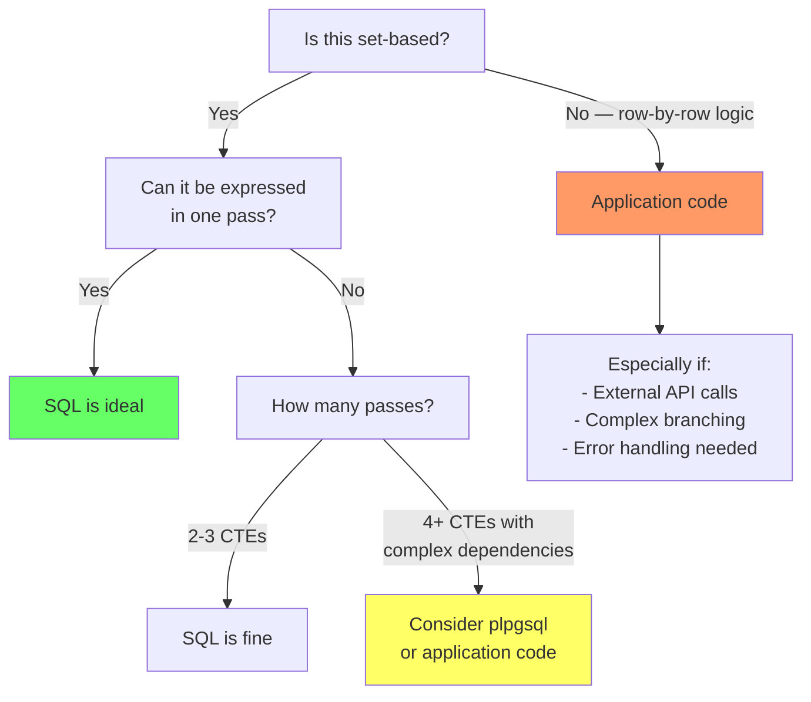

# SQL as a Programming Language

> **What mistake does this prevent?**
> Writing 500-line SQL queries that nobody can debug, falling into procedural thinking where set-based thinking would be 100x faster, and not knowing when to escape SQL into `plpgsql` or application code.

---

## 1. When SQL Stops Being Readable

SQL was designed for set-based operations. It becomes painful when you try to make it do:

- Conditional branching on row-level state
- Iterative processing with side effects
- String manipulation and formatting
- Complex business rules with many exceptions

**The moment your SQL has 4+ levels of nesting or 3+ CTEs doing transformations, stop and ask: is this the right layer?**

---

## 2. CASE — SQL's If/Else (And Its Limits)

### Simple CASE

```sql
SELECT
  order_id,
  CASE status
    WHEN 'pending'   THEN 'Awaiting processing'
    WHEN 'shipped'   THEN 'In transit'
    WHEN 'delivered'  THEN 'Complete'
    ELSE 'Unknown'
  END AS status_label
FROM orders;
```

### Searched CASE (More Powerful)

```sql
SELECT
  order_id,
  amount,
  CASE
    WHEN amount >= 10000 THEN 'enterprise'
    WHEN amount >= 1000  THEN 'business'
    WHEN amount >= 100   THEN 'standard'
    ELSE 'micro'
  END AS tier
FROM orders;
```

### When CASE Becomes a Code Smell

```sql
-- This is a business rules engine crammed into SQL
SELECT
  customer_id,
  CASE
    WHEN region = 'EU' AND product_type = 'digital' AND amount > 1000 THEN
      CASE
        WHEN vat_registered THEN amount * 0.0
        WHEN country = 'DE' THEN amount * 0.19
        WHEN country = 'FR' THEN amount * 0.20
        WHEN country = 'NL' THEN amount * 0.21
        ELSE amount * 0.20  -- Default EU VAT
      END
    WHEN region = 'US' AND state IN ('CA', 'NY', 'TX') THEN
      CASE
        WHEN state = 'CA' THEN amount * 0.0725
        WHEN state = 'NY' THEN amount * 0.08
        WHEN state = 'TX' THEN amount * 0.0625
      END
    ELSE 0
  END AS tax_amount
FROM orders;
```

**This should be a lookup table:**

```sql
CREATE TABLE tax_rules (
  region TEXT,
  country TEXT,
  state TEXT,
  product_type TEXT,
  vat_registered BOOLEAN DEFAULT false,
  tax_rate NUMERIC NOT NULL
);

SELECT o.*, o.amount * COALESCE(t.tax_rate, 0) AS tax_amount
FROM orders o
LEFT JOIN tax_rules t ON
  t.region = o.region
  AND (t.country = o.country OR t.country IS NULL)
  AND (t.state = o.state OR t.state IS NULL)
  AND (t.product_type = o.product_type OR t.product_type IS NULL);
```

Data-driven beats logic-driven. Tax rules change; rewriting CASE statements is not how you want to handle that.

---

## 3. Decision Framework: SQL vs Application Code



### SQL Excels At

- Filtering, joining, aggregating
- Window functions over ordered sets
- Set operations (UNION, INTERSECT, EXCEPT)
- Recursive traversal of hierarchies
- Bulk data transformations

### SQL Struggles With

- Row-by-row conditional logic with side effects
- String parsing beyond basic patterns
- Error handling and retries
- External service calls
- Complex branching that changes per-row behavior

---

## 4. DO Blocks — Ad-Hoc Procedural Code

When you need a one-off procedural operation without creating a function:

```sql
DO $$
DECLARE
  batch_size INT := 1000;
  affected INT;
BEGIN
  LOOP
    UPDATE large_table
    SET processed = true
    WHERE id IN (
      SELECT id FROM large_table
      WHERE processed = false
      LIMIT batch_size
      FOR UPDATE SKIP LOCKED
    );
    
    GET DIAGNOSTICS affected = ROW_COUNT;
    RAISE NOTICE 'Processed % rows', affected;
    
    EXIT WHEN affected = 0;
    COMMIT;  -- Requires PostgreSQL 11+ in procedures
  END LOOP;
END $$;
```

**Use cases:**
- Batched data migrations
- One-off data fixes
- Complex conditional DDL

**Don't** use `DO` blocks for regular application queries.

---

## 5. Generated Columns — Computed Values Without Triggers

PostgreSQL 12+ supports stored generated columns:

```sql
CREATE TABLE products (
  price NUMERIC NOT NULL,
  tax_rate NUMERIC NOT NULL DEFAULT 0.10,
  total_price NUMERIC GENERATED ALWAYS AS (price * (1 + tax_rate)) STORED
);
```

**Limitations:**
- Cannot reference other tables
- Cannot use subqueries
- Only `STORED` (computed on write), not `VIRTUAL` (computed on read)
- Cannot be part of a PRIMARY KEY

**When to use:** Derived values that are expensive to compute repeatedly and depend only on same-row columns.

---

## 6. The Readability Threshold

### Naming CTEs for Self-Documentation

```sql
-- BAD: What is this doing?
WITH a AS (...), b AS (...), c AS (...)
SELECT * FROM c;

-- GOOD: CTEs as named steps
WITH
  active_subscriptions AS (
    SELECT * FROM subscriptions WHERE status = 'active'
  ),
  revenue_by_plan AS (
    SELECT plan_id, SUM(amount) AS total_revenue
    FROM active_subscriptions
    GROUP BY plan_id
  ),
  plans_needing_review AS (
    SELECT r.*, p.name
    FROM revenue_by_plan r
    JOIN plans p ON p.id = r.plan_id
    WHERE r.total_revenue < 1000
  )
SELECT * FROM plans_needing_review;
```

### The "Could I Explain This in a Code Review?" Test

If you can't explain what a query does in 2-3 sentences, it's too complex for a single query. Split it:

1. **Into multiple queries** executed from application code
2. **Into a database function** with meaningful parameter names
3. **Into a view** that encapsulates the common part

### Views as Abstraction

```sql
CREATE VIEW active_customer_summary AS
SELECT
  c.id,
  c.name,
  c.email,
  COUNT(o.id) AS order_count,
  SUM(o.amount) AS lifetime_value,
  MAX(o.order_date) AS last_order_date
FROM customers c
LEFT JOIN orders o ON o.customer_id = c.id
WHERE c.is_active = true
GROUP BY c.id, c.name, c.email;

-- Now queries become simple
SELECT * FROM active_customer_summary WHERE lifetime_value > 10000;
```

---

## 7. SQL Anti-Patterns That Signal "Wrong Layer"

| Pattern | Why it's a smell | Better approach |
|---------|------------------|-----------------|
| Multiple UPDATEs in sequence with CASE | Procedural thinking in SQL | Single UPDATE with CASE, or application logic |
| Cursor loops in plpgsql | Row-by-row processing | Set-based query or application batch |
| Dynamic SQL in functions | Building queries from strings | Parameterized queries from application |
| 10+ CTEs in a chain | Query is a program | Break into views or application steps |
| `FORMAT()` for building SQL | SQL injection risk, hard to debug | Prepared statements from application |
| Recursive CTE for iteration | Using recursion as a loop | `generate_series()` or application loop |

---

## 8. When to Use plpgsql Functions

```sql
CREATE OR REPLACE FUNCTION close_expired_subscriptions()
RETURNS INT AS $$
DECLARE
  closed_count INT;
BEGIN
  WITH expired AS (
    UPDATE subscriptions
    SET status = 'expired',
        expired_at = now()
    WHERE status = 'active'
      AND current_period_end < now()
    RETURNING id
  )
  SELECT COUNT(*) INTO closed_count FROM expired;

  -- Log the operation
  INSERT INTO subscription_audit (action, count, performed_at)
  VALUES ('close_expired', closed_count, now());

  RETURN closed_count;
END;
$$ LANGUAGE plpgsql;
```

**Use plpgsql when:**
- You need to combine DML with conditional logic **atomically**
- Error handling with `EXCEPTION` blocks is needed
- You want to encapsulate a multi-step operation that should be a single database call
- Performance-critical code that benefits from staying in-database

**Don't use plpgsql when:**
- The logic is business rules that change frequently
- You need to call external services
- The function would need unit testing (hard to test in-database)
- An ORM could handle it with a simple query

---

## 9. Thinking Traps Summary

| Trap | What breaks | Prevention |
|------|------------|------------|
| Nested CASE 4 levels deep | Nobody can maintain it | Use lookup tables or application code |
| Using SQL for string formatting | Fragile, slow, unreadable | Do formatting in application layer |
| "One query to rule them all" | Undebuggable, untestable | Break into logical steps |
| Cursor loops for batch processing | 100x slower than set-based | Rewrite as bulk UPDATE/INSERT |
| Business rules in SQL | Hard to change, test, version | Keep rules in application, data in SQL |

---

## Related Files

- [04_subqueries_ctes_windows.md](../04_subqueries_ctes_windows.md) — CTE patterns
- [12_sql_vs_orm.md](../12_sql_vs_orm.md) — when to use SQL vs ORM
- [11_postgres_specific_features.md](../11_postgres_specific_features.md) — PostgreSQL-specific SQL features
