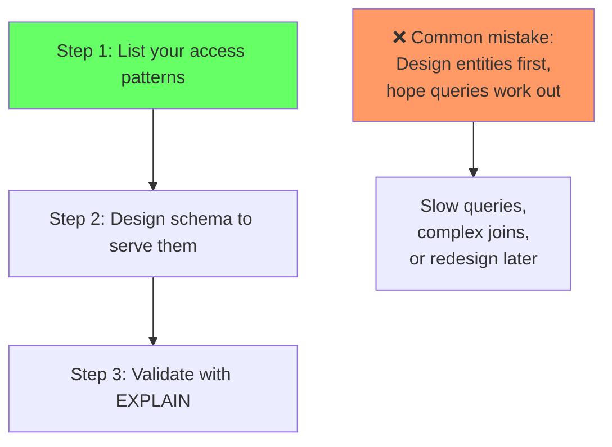
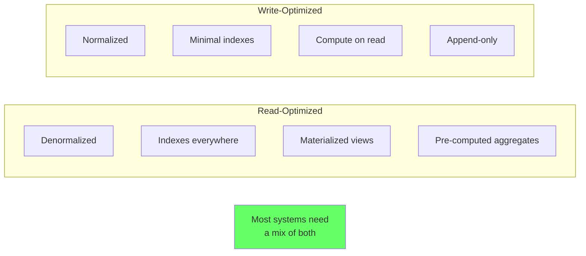
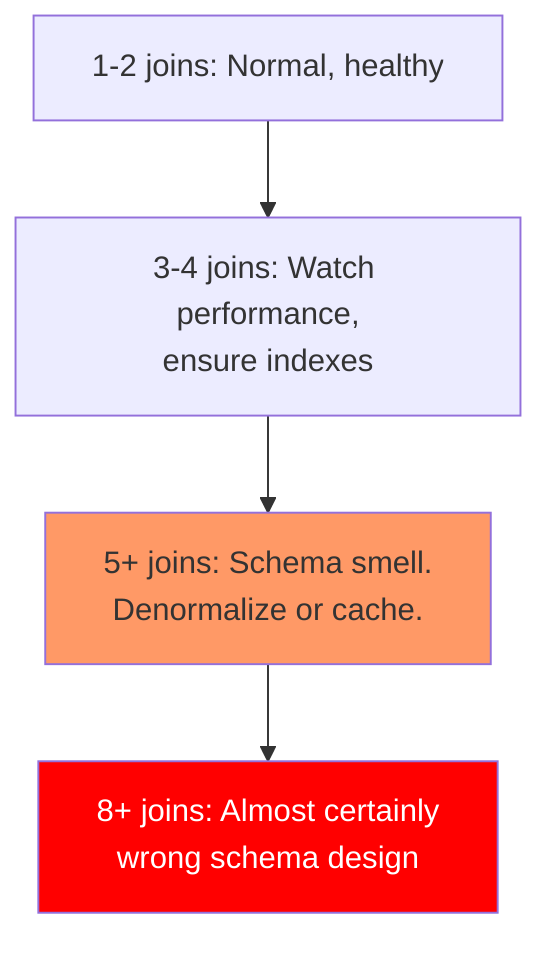

# Modeling for Access Patterns

> **What mistake does this prevent?**
> Designing a perfectly normalized schema that requires 12-table joins for the most common query, or a denormalized schema that makes writes a nightmare — because you didn't think about *how* the data would be accessed.

---

## 1. The Core Principle

**Schema design is access pattern design.**

Your schema determines:
- Which queries are fast (single index lookup)
- Which queries are possible but slow (multi-join + sort)
- Which queries are impossible without remodeling

Most developers design schemas by thinking about entities and relationships. Production engineers design schemas by thinking about **queries**.



---

## 2. Enumerate Before You Design

Before writing `CREATE TABLE`, write down your top 10-20 queries:

```
1. Get user by ID                              → single row lookup (primary key)
2. Get user by email                           → single row lookup (unique index)
3. List orders for a user, newest first        → range scan by user_id, sorted
4. Get order with line items and products      → join order → line_items → products
5. Dashboard: orders per day in last 30 days   → aggregate, time range
6. Search products by name (fuzzy)             → full-text or trigram search
7. Get user's current subscription             → latest record per user
8. Leaderboard: top 100 users by score         → sorted scan, limit
```

For each query, note:
- **Frequency**: 1000/sec vs 1/hour
- **Latency requirement**: < 5ms vs < 5s
- **Result size**: 1 row vs 10,000 rows

**High-frequency, low-latency queries drive your schema.** Rare queries can tolerate slower access patterns.

---

## 3. Read-Optimized vs Write-Optimized

Every schema decision is a read/write tradeoff:

| Decision | Reads faster | Writes faster |
|----------|-------------|---------------|
| Denormalize (store derived data) | ✓ No joins needed | ✗ Must update in multiple places |
| Normalize (store facts once) | ✗ Joins required | ✓ Single point of update |
| Add index | ✓ Faster lookups | ✗ Slower inserts/updates |
| Materialized view | ✓ Pre-computed | ✗ Must refresh |
| Counter column | ✓ O(1) read | ✗ Write contention |
| Compute on read | ✗ CPU per query | ✓ No extra storage |



---

## 4. Common Access Pattern Solutions

### Pattern: Latest Record Per Entity

"Get the user's current subscription"

**Approach 1: Status column**
```sql
CREATE TABLE subscriptions (
  id SERIAL PRIMARY KEY,
  user_id INT NOT NULL,
  plan TEXT NOT NULL,
  is_current BOOLEAN DEFAULT true,
  created_at TIMESTAMPTZ DEFAULT now()
);

-- Index for the common query
CREATE UNIQUE INDEX idx_current_sub ON subscriptions (user_id) WHERE is_current = true;

-- Query is trivial
SELECT * FROM subscriptions WHERE user_id = 123 AND is_current = true;
```

Trade-off: Must maintain `is_current` flag atomically on changes.

**Approach 2: Temporal with DISTINCT ON**
```sql
CREATE TABLE subscriptions (
  id SERIAL PRIMARY KEY,
  user_id INT NOT NULL,
  plan TEXT NOT NULL,
  created_at TIMESTAMPTZ DEFAULT now()
);

CREATE INDEX idx_sub_user_time ON subscriptions (user_id, created_at DESC);

-- Query using DISTINCT ON
SELECT DISTINCT ON (user_id) *
FROM subscriptions
WHERE user_id = 123
ORDER BY user_id, created_at DESC;
```

Trade-off: No flag maintenance, but query is slightly more complex.

### Pattern: Aggregation Dashboard

"Orders per day for the last 30 days"

**Approach 1: Compute on read**
```sql
SELECT DATE(order_date) AS day, COUNT(*)
FROM orders
WHERE order_date >= CURRENT_DATE - 30
GROUP BY DATE(order_date);
```

Fine for small-to-medium tables with an index on `order_date`.

**Approach 2: Pre-computed daily stats**
```sql
CREATE TABLE daily_order_stats (
  stat_date DATE PRIMARY KEY,
  order_count INT NOT NULL,
  total_revenue NUMERIC NOT NULL
);

-- Updated by a cron job or trigger
SELECT * FROM daily_order_stats
WHERE stat_date >= CURRENT_DATE - 30;
```

Better for large tables where aggregation is expensive.

### Pattern: Feed / Timeline

"Show the 50 most recent posts from people I follow"

**Naive (fan-out on read):**
```sql
SELECT p.*
FROM posts p
JOIN follows f ON f.following_id = p.author_id
WHERE f.follower_id = 123
ORDER BY p.created_at DESC
LIMIT 50;
```

Requires joining posts × follows for every feed load. Gets slow with many follows.

**Better (materialized feed):**
```sql
CREATE TABLE feed_items (
  user_id INT NOT NULL,
  post_id INT NOT NULL,
  created_at TIMESTAMPTZ NOT NULL,
  PRIMARY KEY (user_id, created_at, post_id)
);

-- Fan-out on WRITE: when someone posts, insert into all followers' feeds
-- Read is a simple range scan:
SELECT * FROM feed_items WHERE user_id = 123 ORDER BY created_at DESC LIMIT 50;
```

Trade-off: Write amplification (1 post → N feed items), but reads are O(1).

---

## 5. The Join Depth Rule



If your most common query requires 5+ joins, your schema isn't serving your access pattern. Options:

1. **Denormalize** — store the joined data redundantly
2. **Materialized view** — pre-compute the join
3. **JSONB column** — embed related data
4. **Rethink the schema** — maybe the entity model is wrong

---

## 6. Indexing Strategy Follows Access Patterns

Don't index speculatively. Index based on queries:

```sql
-- Access pattern: "Get orders for customer, newest first"
-- Index strategy:
CREATE INDEX idx_orders_customer_date ON orders (customer_id, order_date DESC);

-- Access pattern: "Find pending orders older than 24 hours"
-- Index strategy (partial):
CREATE INDEX idx_orders_pending_old ON orders (created_at)
  WHERE status = 'pending';

-- Access pattern: "Search products by name"
-- Index strategy (trigram):
CREATE EXTENSION IF NOT EXISTS pg_trgm;
CREATE INDEX idx_products_name_trgm ON products USING GIN (name gin_trgm_ops);
```

### The Composite Index Decision

```
Query: WHERE customer_id = ? AND status = ? ORDER BY created_at DESC

Index options:
  (customer_id, status, created_at DESC)  — serves WHERE + ORDER BY
  (customer_id, created_at DESC)          — serves WHERE on customer + ORDER BY
  (status)                                — only serves WHERE on status (low selectivity, probably useless)
```

Design the index for the query, not the table.

---

## 7. When to Denormalize

Denormalization is not a failure. It's a design choice. Denormalize when:

| Signal | Example |
|--------|---------|
| Join is always needed | Order always displayed with customer name |
| Join is expensive | Aggregating across 5 tables for every dashboard load |
| Data changes rarely | Product category name changes once a year |
| Read:write ratio is very high | 1000 reads per 1 write |

```sql
-- Normalized (requires join every read)
SELECT o.*, c.name AS customer_name
FROM orders o
JOIN customers c ON c.id = o.customer_id;

-- Denormalized (no join needed)
ALTER TABLE orders ADD COLUMN customer_name TEXT;
-- Must be updated when customer name changes (rare)
```

**The cost:** You must keep the denormalized data consistent. This is either:
- Application responsibility (error-prone)
- Trigger-based (reliable but hidden)
- Eventual consistency (refresh periodically)

---

## 8. Thinking Traps Summary

| Trap | What breaks | Prevention |
|------|------------|------------|
| Design entities first, queries later | Most common query is 8-table join | Write queries before CREATE TABLE |
| Normalize everything | Read-heavy workloads are slow | Denormalize for top access patterns |
| Denormalize everything | Write complexity explodes | Denormalize selectively, document tradeoffs |
| Index everything | Write performance tanks | Index only for actual access patterns |
| Ignore query frequency | Optimize rare admin query, ignore hot path | Profile and prioritize by frequency × latency |

---

## Related Files

- [10_constraints_schema_design.md](../10_constraints_schema_design.md) — constraint mechanics
- [06_indexes_and_performance.md](../06_indexes_and_performance.md) — index types and strategy
- [Data_Modeling/02_normalization_vs_denormalization.md](02_normalization_vs_denormalization.md) — deeper normalization tradeoffs
