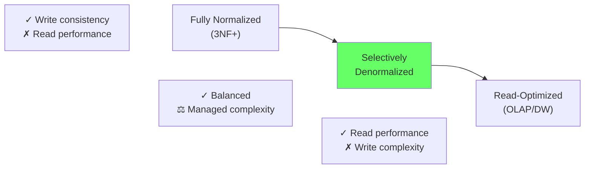
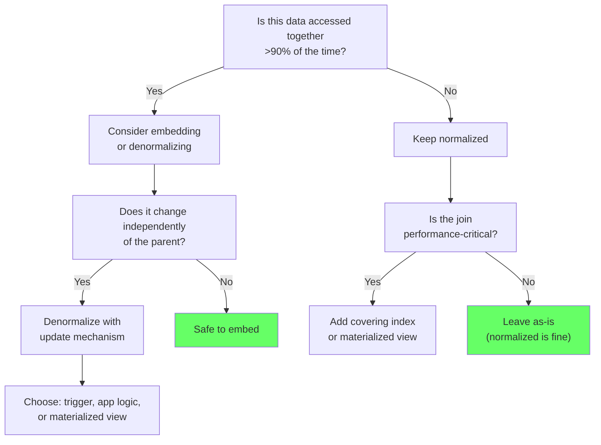

# Normalization vs Denormalization — Real Tradeoffs

> **What mistake does this prevent?**
> Treating normalization as a religion or denormalization as a sin, instead of understanding both as tools with measurable costs — and choosing based on your system's actual pain points.

---

## 1. What Normalization Actually Buys You

Normalization isn't about following rules (1NF/2NF/3NF). It's about **eliminating update anomalies**.

```sql
-- UNNORMALIZED: customer address stored in every order
CREATE TABLE orders (
  id SERIAL PRIMARY KEY,
  customer_name TEXT,
  customer_email TEXT,
  customer_address TEXT,  -- Duplicated across all orders
  product_name TEXT,
  amount NUMERIC
);
```

**Problems:**
- Customer moves → must update every order row (update anomaly)
- 1000 orders × 1 customer = 1000 copies of the same address
- Inconsistency: some orders have old address, some have new

```sql
-- NORMALIZED
CREATE TABLE customers (id SERIAL PRIMARY KEY, name TEXT, email TEXT, address TEXT);
CREATE TABLE orders (id SERIAL PRIMARY KEY, customer_id INT REFERENCES customers, amount NUMERIC);
```

**What you gain:** Single source of truth. Update address once, all orders reference the correct customer.

**What you lose:** Every time you display an order with customer info, you need a JOIN.

---

## 2. The Normalization Spectrum

It's not binary. It's a spectrum based on your workload:



Most production OLTP systems should be **selectively denormalized** — normalized by default, with targeted denormalization for hot read paths.

---

## 3. When Normalization Hurts

### Problem 1: The N+1 Join Chain

Displaying an order detail page:

```sql
SELECT
  o.id, o.order_date, o.status,
  c.name, c.email,                             -- Join 1
  a.street, a.city, a.zip,                     -- Join 2
  li.quantity, li.unit_price,                   -- Join 3
  p.name AS product_name, p.sku,               -- Join 4
  cat.name AS category_name,                   -- Join 5
  s.tracking_number, s.carrier                 -- Join 6
FROM orders o
JOIN customers c ON c.id = o.customer_id
JOIN addresses a ON a.id = o.shipping_address_id
JOIN line_items li ON li.order_id = o.id
JOIN products p ON p.id = li.product_id
JOIN categories cat ON cat.id = p.category_id
LEFT JOIN shipments s ON s.order_id = o.id;
```

6 joins for the most common page in the application. Each join has:
- Planner cost (choosing join strategy)
- I/O cost (reading from multiple indexes and heap pages)
- Memory cost (hash tables for hash joins)

### Problem 2: Aggregation Across Normalized Tables

"Total revenue by product category for last 30 days":

```sql
SELECT cat.name, SUM(li.quantity * li.unit_price) AS revenue
FROM line_items li
JOIN orders o ON o.id = li.order_id
JOIN products p ON p.id = li.product_id
JOIN categories cat ON cat.id = p.category_id
WHERE o.order_date >= CURRENT_DATE - 30
GROUP BY cat.name;
```

Touching 4 tables for a dashboard number that's queried every second.

---

## 4. Denormalization Patterns That Work

### Pattern 1: Cache Column

Store a derived value that's expensive to compute:

```sql
ALTER TABLE customers ADD COLUMN order_count INT DEFAULT 0;
ALTER TABLE customers ADD COLUMN lifetime_value NUMERIC DEFAULT 0;

-- Maintain via trigger or application logic
CREATE OR REPLACE FUNCTION update_customer_stats()
RETURNS TRIGGER AS $$
BEGIN
  UPDATE customers
  SET order_count = order_count + 1,
      lifetime_value = lifetime_value + NEW.amount
  WHERE id = NEW.customer_id;
  RETURN NEW;
END;
$$ LANGUAGE plpgsql;

CREATE TRIGGER trg_order_stats
  AFTER INSERT ON orders
  FOR EACH ROW EXECUTE FUNCTION update_customer_stats();
```

**Risk:** Trigger failures, race conditions on concurrent updates, eventual consistency bugs.

### Pattern 2: Materialized View

Pre-compute a complex query:

```sql
CREATE MATERIALIZED VIEW category_revenue AS
SELECT
  cat.id AS category_id,
  cat.name AS category_name,
  SUM(li.quantity * li.unit_price) AS revenue_30d
FROM line_items li
JOIN orders o ON o.id = li.order_id
JOIN products p ON p.id = li.product_id
JOIN categories cat ON cat.id = p.category_id
WHERE o.order_date >= CURRENT_DATE - 30
GROUP BY cat.id, cat.name;

CREATE UNIQUE INDEX ON category_revenue (category_id);

-- Refresh periodically
REFRESH MATERIALIZED VIEW CONCURRENTLY category_revenue;
```

**Risk:** Stale data between refreshes. `CONCURRENTLY` avoids blocking reads but requires a unique index.

### Pattern 3: Embedding via JSONB

Store related data inline for read-heavy, write-rare scenarios:

```sql
CREATE TABLE orders (
  id SERIAL PRIMARY KEY,
  customer_id INT REFERENCES customers,
  -- Snapshot of customer info at time of order
  customer_snapshot JSONB NOT NULL,
  -- Embedded line items (if always read together)
  line_items JSONB NOT NULL,
  created_at TIMESTAMPTZ DEFAULT now()
);

-- Query without joins
SELECT
  id,
  customer_snapshot->>'name' AS customer_name,
  jsonb_array_length(line_items) AS item_count
FROM orders WHERE id = 123;
```

**Risk:** JSONB is opaque to the schema — no constraints, no foreign keys, schema changes in JSONB require data migration.

### Pattern 4: Summary Tables

Periodically-refreshed aggregation tables:

```sql
CREATE TABLE daily_stats (
  stat_date DATE NOT NULL,
  category_id INT NOT NULL,
  order_count INT NOT NULL,
  total_revenue NUMERIC NOT NULL,
  PRIMARY KEY (stat_date, category_id)
);

-- Populated by a scheduled job (cron, pg_cron, or application)
INSERT INTO daily_stats (stat_date, category_id, order_count, total_revenue)
SELECT
  CURRENT_DATE - 1,
  p.category_id,
  COUNT(*),
  SUM(li.quantity * li.unit_price)
FROM line_items li
JOIN orders o ON o.id = li.order_id
JOIN products p ON p.id = li.product_id
WHERE o.order_date >= CURRENT_DATE - 1 AND o.order_date < CURRENT_DATE
GROUP BY p.category_id
ON CONFLICT (stat_date, category_id)
DO UPDATE SET order_count = EXCLUDED.order_count, total_revenue = EXCLUDED.total_revenue;
```

---

## 5. Decision Framework



### Quick Reference

| Scenario | Strategy |
|----------|----------|
| Always read together, rarely changes | Embed (JSONB or columns) |
| Dashboard aggregation, high frequency | Materialized view or summary table |
| Counter/total, real-time requirement | Trigger-maintained column |
| Historical snapshot (order ↔ customer at order time) | Copy into JSONB at write time |
| Data changes independently | Keep normalized, optimize with indexes |

---

## 6. Measuring the Tradeoff

Before denormalizing, measure:

```sql
-- How long does the normalized query take?
EXPLAIN (ANALYZE, BUFFERS) SELECT ... FROM orders JOIN ... JOIN ...;

-- How often is it called?
SELECT calls, mean_exec_time
FROM pg_stat_statements
WHERE query LIKE '%FROM orders JOIN%';

-- Total time cost per day: calls × mean_time
-- If < 1% of total DB time, don't denormalize
-- If > 10% of total DB time, consider it
```

---

## 7. Thinking Traps Summary

| Trap | What breaks | Prevention |
|------|------------|------------|
| "Always normalize to 3NF" | Read-heavy paths require 8-table joins | Denormalize hot read paths |
| "Denormalize everything for speed" | Write complexity, inconsistency bugs | Normalize by default, denormalize selectively |
| Trigger-based denormalization without testing | Silent trigger failures, data drift | Monitor consistency, periodic reconciliation |
| JSONB for everything | No constraints, no type safety, schema drift | Use JSONB sparingly, validate in application |
| Premature denormalization | Complexity without measuring the problem | Measure query cost first, then optimize |

---

## Related Files

- [Data_Modeling/01_modeling_for_access_patterns.md](01_modeling_for_access_patterns.md) — access-pattern-first design
- [10_constraints_schema_design.md](../10_constraints_schema_design.md) — constraints and schema patterns
- [Data_Modeling/06_jsonb_as_escape_hatch.md](06_jsonb_as_escape_hatch.md) — JSONB deep dive
