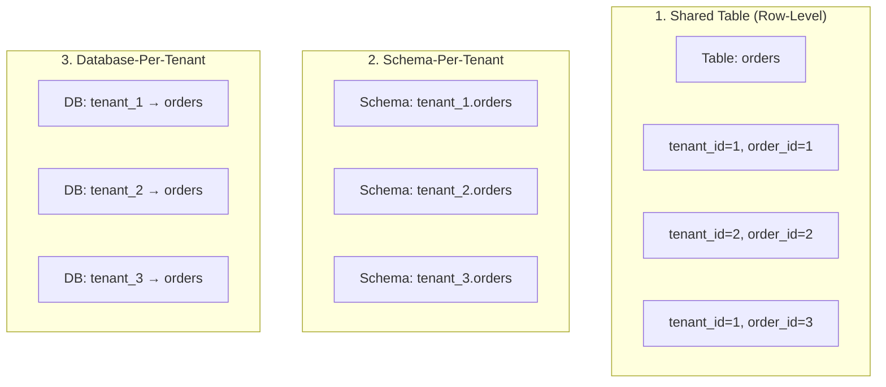
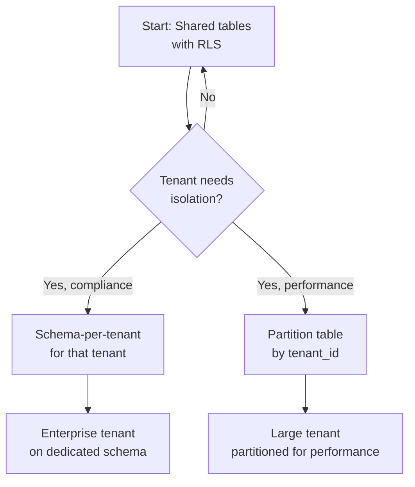
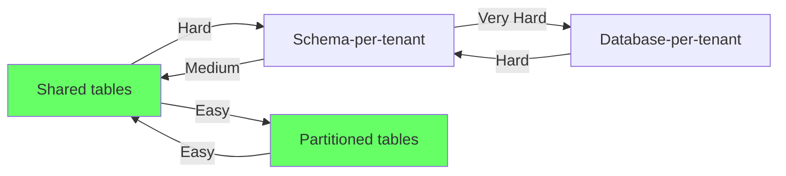

# Multi-Tenant Schema Strategies

> **What mistake does this prevent?**
> Choosing a tenancy model that seems elegant at 10 tenants and becomes unmanageable at 10,000 — or one that's impossible to migrate away from when requirements change.

---

## 1. The Three Models



| Model | Isolation | Complexity | Scale limit | Customization |
|-------|-----------|-----------|-------------|---------------|
| Shared table (row-level) | Low (app-enforced) | Low | 100K+ tenants | None |
| Schema-per-tenant | Medium (DB-enforced) | Medium | ~1,000 tenants | Per-tenant schema changes |
| Database-per-tenant | High (full isolation) | High | ~100 tenants | Full independence |

---

## 2. Shared Table (Row-Level Tenancy)

Every table has a `tenant_id` column. All tenants share all tables.

```sql
CREATE TABLE orders (
  id SERIAL PRIMARY KEY,
  tenant_id INT NOT NULL,
  customer_id INT NOT NULL,
  amount NUMERIC NOT NULL,
  created_at TIMESTAMPTZ DEFAULT now()
);

-- CRITICAL: tenant_id in every query
CREATE INDEX idx_orders_tenant ON orders (tenant_id, created_at DESC);

-- CRITICAL: enforce isolation
ALTER TABLE orders ENABLE ROW LEVEL SECURITY;

CREATE POLICY tenant_isolation ON orders
  USING (tenant_id = current_setting('app.current_tenant')::int);
```

### What Goes Right

- Simplest operationally — one schema, one set of migrations
- Works at massive scale (Shopify runs this way with millions of tenants)
- Connection pooling is straightforward
- Cross-tenant queries are trivial (for analytics)

### What Goes Wrong

| Problem | Mechanism | Mitigation |
|---------|-----------|------------|
| **Noisy neighbor** | One tenant's huge query slows everyone | `statement_timeout`, query throttling |
| **Forgotten WHERE** | Missing `tenant_id` filter leaks data | RLS (mandatory), linting |
| **Index bloat** | All tenants indexed together | Partition by tenant_id (large tenants) |
| **Data size imbalance** | One tenant has 90% of data | Table partitioning by tenant |
| **Compliance** | "Our data must be in EU region" | Can't separate per-tenant |

### The `tenant_id` Everywhere Rule

```sql
-- EVERY query must include tenant_id. No exceptions.

-- BAD: Forgot tenant_id
SELECT * FROM orders WHERE customer_id = 456;

-- GOOD: Always filtered
SELECT * FROM orders WHERE tenant_id = 123 AND customer_id = 456;

-- BEST: RLS handles it automatically
SET app.current_tenant = '123';
SELECT * FROM orders WHERE customer_id = 456;
-- RLS adds: AND tenant_id = 123 implicitly
```

### Composite Primary Keys and Foreign Keys

```sql
-- Option A: tenant_id in primary key (enables partitioning but complex FKs)
CREATE TABLE orders (
  tenant_id INT NOT NULL,
  order_id SERIAL,
  PRIMARY KEY (tenant_id, order_id)
);

CREATE TABLE line_items (
  tenant_id INT NOT NULL,
  line_item_id SERIAL,
  order_id INT NOT NULL,
  PRIMARY KEY (tenant_id, line_item_id),
  FOREIGN KEY (tenant_id, order_id) REFERENCES orders (tenant_id, order_id)
);

-- Option B: tenant_id as regular column (simpler FKs, can't partition by tenant easily)
CREATE TABLE orders (
  id SERIAL PRIMARY KEY,
  tenant_id INT NOT NULL
);
```

---

## 3. Schema-Per-Tenant

Each tenant gets their own PostgreSQL schema. All schemas have the same table structure (usually).

```sql
-- Create schema for new tenant
CREATE SCHEMA tenant_42;

-- Create tables in tenant schema
CREATE TABLE tenant_42.orders (
  id SERIAL PRIMARY KEY,
  customer_id INT NOT NULL,
  amount NUMERIC NOT NULL
);

-- Route queries via search_path
SET search_path = 'tenant_42';
SELECT * FROM orders;  -- Reads tenant_42.orders
```

### What Goes Right

- Strong isolation (schema-level permissions)
- Per-tenant backup/restore possible (`pg_dump -n tenant_42`)
- Per-tenant schema customization possible
- No risk of missing `tenant_id` filter

### What Goes Wrong

| Problem | Mechanism | Why it hurts |
|---------|-----------|-------------|
| **Migration complexity** | Must run migration on every schema | 1000 schemas × 1 ALTER = 1000 DDL operations |
| **Connection pooling** | `search_path` is session state | PgBouncer transaction mode breaks this |
| **Catalog bloat** | PostgreSQL catalogs grow with schemas | Planner slows down, `pg_dump` slows down |
| **Cross-tenant queries** | Must UNION across schemas | Analytics becomes a nightmare |
| **Provisioning time** | Creating new tenant = creating schema + tables | Seconds, not milliseconds |

### The PgBouncer Problem

In PgBouncer transaction mode, `SET search_path` doesn't stick between transactions:

```sql
-- Transaction 1
SET search_path = 'tenant_42';
SELECT * FROM orders;
-- Connection returned to pool

-- Transaction 2 (possibly different connection!)
SELECT * FROM orders;
-- search_path is wrong! May read from public or another tenant
```

**Solutions:**
1. PgBouncer session mode (less multiplexing)
2. Fully-qualified table names (`SELECT * FROM tenant_42.orders`)
3. `SET LOCAL search_path = 'tenant_42'` inside each transaction

---

## 4. Database-Per-Tenant

Each tenant gets a completely separate PostgreSQL database.

### What Goes Right

- Maximum isolation (separate storage, separate connections)
- Independent maintenance (VACUUM, REINDEX per tenant)
- Independent backup/restore
- Easy to move a tenant to a different server

### What Goes Wrong

- **Operational nightmare at scale** — 500 databases = 500 things to monitor, backup, migrate
- **Connection explosion** — each DB needs its own connection pool
- **Cross-tenant is impossible** — no SQL across databases without `dblink` or `postgres_fdw`
- **Resource waste** — shared buffers, WAL, background workers per database

### When to Use It

- You have <50 tenants
- Regulatory requirement for physical data separation
- Tenants have wildly different schemas
- Each tenant is large enough to justify dedicated resources

---

## 5. Hybrid Approach

The pragmatic approach for growing SaaS:



### Partitioning by Tenant

PostgreSQL partitioning can give you the performance benefits of tenant isolation without the operational complexity:

```sql
-- Partition by tenant (list partitioning)
CREATE TABLE orders (
  id SERIAL,
  tenant_id INT NOT NULL,
  amount NUMERIC NOT NULL,
  created_at TIMESTAMPTZ DEFAULT now()
) PARTITION BY LIST (tenant_id);

-- Small tenants share a default partition
CREATE TABLE orders_default PARTITION OF orders DEFAULT;

-- Large tenants get their own partition
CREATE TABLE orders_tenant_42 PARTITION OF orders FOR VALUES IN (42);
CREATE TABLE orders_tenant_99 PARTITION OF orders FOR VALUES IN (99);
```

**Benefit:** Queries filtered by `tenant_id` only scan the relevant partition. Vacuum runs per-partition.

---

## 6. Migration Between Models



**Start with shared tables + RLS.** It's the easiest to implement and the easiest to evolve from. You can always partition later or extract specific tenants to schemas.

---

## 7. Decision Matrix

| Factor | Shared Tables | Schema-Per-Tenant | DB-Per-Tenant |
|--------|--------------|-------------------|---------------|
| Number of tenants | Unlimited | <1,000 | <50 |
| Isolation | App/RLS | Schema-level | Physical |
| Migration effort | One migration | N migrations | N migrations |
| Connection pooling | Standard | Complex | Per-DB pools |
| Cross-tenant analytics | Easy | Possible | Very hard |
| Compliance isolation | Weak | Medium | Strong |
| Per-tenant customization | None | Possible | Full |
| Operational overhead | Low | Medium | High |

---

## 8. Thinking Traps Summary

| Trap | What breaks | Prevention |
|------|------------|------------|
| Schema-per-tenant at 5K tenants | Catalog bloat, migration hell | Use shared tables + partitioning |
| Shared tables without RLS | One missing WHERE → data leak | RLS is mandatory, not optional |
| PgBouncer + search_path | Tenant cross-contamination | Fully-qualified names or session mode |
| "We'll migrate models later" | Migration between models is expensive | Choose carefully upfront |
| Same model for all tenants | Enterprise customers need isolation | Hybrid: shared default + isolated outliers |

---

## Related Files

- [Security_and_Governance/02_row_level_security.md](../Security_and_Governance/02_row_level_security.md) — RLS for tenant isolation
- [Data_Modeling/01_modeling_for_access_patterns.md](01_modeling_for_access_patterns.md) — access pattern design
- [10_constraints_schema_design.md](../10_constraints_schema_design.md) — schema design basics
