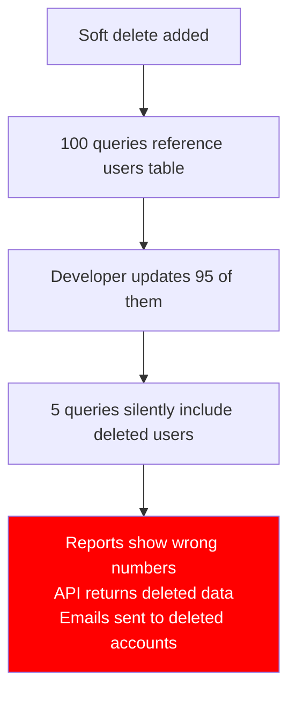
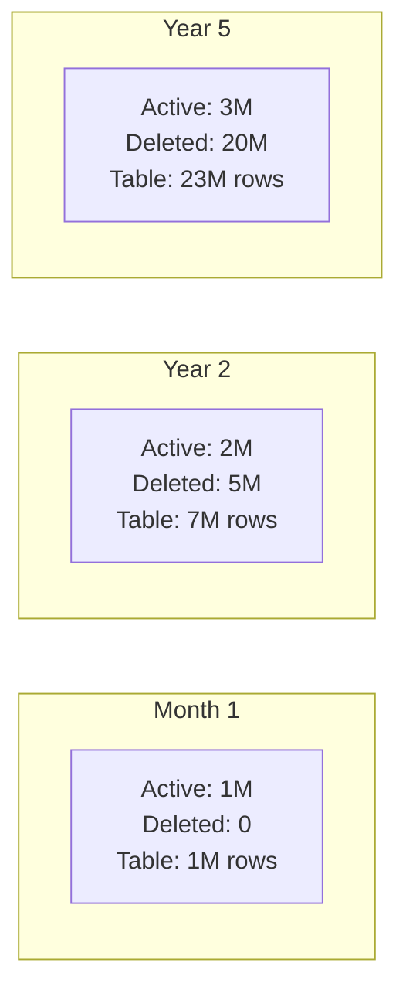
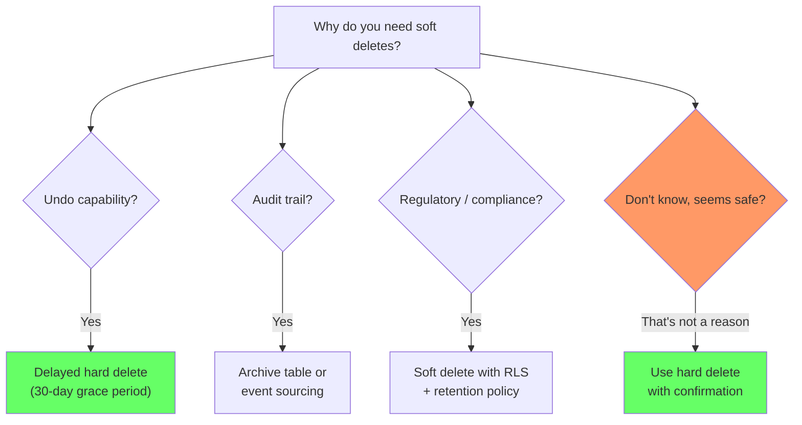

# Soft Deletes and Query Rot

> **What mistake does this prevent?**
> Implementing soft deletes and then watching every query in your application gradually slow down, every JOIN become subtly wrong, and every unique constraint become meaningless — because nobody thought through the consequences.

---

## 1. The Soft Delete Pattern

```sql
ALTER TABLE users ADD COLUMN deleted_at TIMESTAMPTZ;

-- "Delete" a user
UPDATE users SET deleted_at = now() WHERE id = 123;

-- "Select" only active users
SELECT * FROM users WHERE deleted_at IS NULL;
```

Simple. Attractive. And the beginning of a slow rot.

---

## 2. How Soft Deletes Rot Your Queries

### Problem 1: Every Query Must Filter

```sql
-- Without soft deletes: simple
SELECT * FROM users WHERE email = 'alice@example.com';

-- With soft deletes: must add filter EVERYWHERE
SELECT * FROM users WHERE email = 'alice@example.com' AND deleted_at IS NULL;
```

Every query, every join, every subquery, every report must include `AND deleted_at IS NULL`. Every developer who forgets it, includes deleted data in results.



### Problem 2: Unique Constraints Break

```sql
-- This constraint made sense without soft deletes:
ALTER TABLE users ADD CONSTRAINT unique_email UNIQUE (email);

-- Now: Alice is soft-deleted, Bob tries to sign up with same email
INSERT INTO users (email) VALUES ('alice@example.com');
-- ERROR: duplicate key value violates unique constraint

-- The deleted user blocks new registrations!
```

**"Fix" that creates more problems:**
```sql
-- Partial unique index (only active users)
CREATE UNIQUE INDEX idx_users_email_active ON users (email) WHERE deleted_at IS NULL;

-- But now: multiple "deleted" users can have the same email
-- Re-activation becomes ambiguous
-- Which deleted Alice do you restore?
```

### Problem 3: Foreign Keys Become Meaningless

```sql
-- orders.customer_id references users(id)
-- Soft-delete the customer
-- Orders now reference a "deleted" customer
-- JOIN orders ⟶ users returns nothing (if filtering deleted)
-- Orphaned orders everywhere

SELECT o.*, u.name
FROM orders o
JOIN users u ON u.id = o.customer_id AND u.deleted_at IS NULL;
-- Orders from deleted customers silently vanish from reports
```

### Problem 4: Performance Degradation

Over time, the ratio of deleted to active rows grows:



Indexes include deleted rows. Sequential scans read deleted rows. Buffer cache holds deleted rows. Your "3M user" system performs like a "23M user" system.

**Partial indexes help but don't solve everything:**
```sql
CREATE INDEX idx_users_active ON users (email) WHERE deleted_at IS NULL;
-- This index only has active rows — great for lookups
-- But any query without this specific WHERE still scans full index
```

### Problem 5: Cascading Soft Deletes

```sql
-- Hard delete cascades automatically:
-- DELETE FROM users WHERE id = 1 → orders, comments, etc. cascade

-- Soft delete? You must manually cascade:
UPDATE users SET deleted_at = now() WHERE id = 1;
UPDATE orders SET deleted_at = now() WHERE customer_id = 1;  -- Must remember
UPDATE comments SET deleted_at = now() WHERE user_id = 1;     -- Must remember
UPDATE reviews SET deleted_at = now() WHERE user_id = 1;      -- Will you remember?
```

---

## 3. Alternatives to Soft Deletes

### Alternative 1: Archive Table

Move deleted rows to a separate table:

```sql
-- Archive table mirrors the main table
CREATE TABLE users_archive (LIKE users INCLUDING ALL);
ALTER TABLE users_archive ADD COLUMN archived_at TIMESTAMPTZ DEFAULT now();

-- "Delete" = move to archive
WITH deleted AS (
  DELETE FROM users WHERE id = 123 RETURNING *
)
INSERT INTO users_archive SELECT *, now() FROM deleted;
```

**Advantages:**
- Main table only has active data
- Queries don't need filters
- Unique constraints work naturally
- Indexes stay lean

**Disadvantages:**
- Foreign keys break (archived row no longer exists in main table)
- Need to query two tables for "include archived" views
- More complex "undo delete" logic

### Alternative 2: Status Column with Explicit States

```sql
CREATE TYPE user_status AS ENUM ('active', 'suspended', 'deactivated', 'banned');

ALTER TABLE users ADD COLUMN status user_status NOT NULL DEFAULT 'active';

-- More explicit than a nullable timestamp
SELECT * FROM users WHERE status = 'active';
```

**Advantage:** Forces you to think about what "deleted" actually means in your domain. Usually it's not "deleted" — it's "deactivated", "suspended", "cancelled", etc.

### Alternative 3: Event Sourcing / Immutable Log

Don't delete at all. Keep an immutable log and derive current state:

```sql
CREATE TABLE user_events (
  event_id SERIAL PRIMARY KEY,
  user_id INT NOT NULL,
  event_type TEXT NOT NULL,  -- 'created', 'updated', 'deactivated', 'reactivated'
  event_data JSONB NOT NULL,
  occurred_at TIMESTAMPTZ DEFAULT now()
);

-- Current state is derived from events
CREATE MATERIALIZED VIEW current_users AS
SELECT DISTINCT ON (user_id) user_id, event_data
FROM user_events
WHERE event_type != 'deactivated'
ORDER BY user_id, occurred_at DESC;
```

See [05_immutable_data_and_audit_logs.md](05_immutable_data_and_audit_logs.md) for this pattern in depth.

### Alternative 4: Delayed Hard Delete

If "undo" is the requirement, delay the hard delete:

```sql
-- Mark for deletion
UPDATE users SET scheduled_deletion_at = now() + interval '30 days' WHERE id = 123;

-- Cron job: hard delete after grace period
DELETE FROM users
WHERE scheduled_deletion_at IS NOT NULL
  AND scheduled_deletion_at < now();
```

Simple, no query rot, and the "undo" window is explicit.

---

## 4. If You Must Use Soft Deletes

Sometimes you're stuck with them (regulatory requirements, existing codebase). Here's how to minimize damage:

### Use a View for Active Records

```sql
CREATE VIEW active_users AS
SELECT * FROM users WHERE deleted_at IS NULL;

-- All application queries use the view
SELECT * FROM active_users WHERE email = 'alice@example.com';

-- Admin queries use the table directly
SELECT * FROM users WHERE email = 'alice@example.com';
```

### Enforce via RLS

```sql
ALTER TABLE users ENABLE ROW LEVEL SECURITY;

-- Application role cannot see deleted users
CREATE POLICY hide_deleted ON users
  FOR SELECT
  USING (deleted_at IS NULL);

-- Admin role can see everything
CREATE POLICY admin_all ON users
  FOR ALL
  TO admin_role
  USING (true);
```

### Partial Indexes

```sql
-- Indexes that exclude deleted rows
CREATE INDEX idx_users_email_active ON users (email) WHERE deleted_at IS NULL;
CREATE INDEX idx_users_status_active ON users (status) WHERE deleted_at IS NULL;
```

### Lint for Missing Filters

In code review or CI:
```
# Check that every query touching soft-delete tables includes the filter
grep -r "FROM users" --include="*.sql" | grep -v "deleted_at IS NULL"
```

---

## 5. Decision Framework



---

## 6. Thinking Traps Summary

| Trap | What breaks | Prevention |
|------|------------|------------|
| "Soft delete is safer" | Every query needs a filter, many won't have it | Only use when you have a specific reason |
| Soft delete + unique constraint | Re-registration blocked by deleted accounts | Partial unique index or archive table |
| No partial indexes on soft-deleted tables | Full indexes include dead rows | Always create partial indexes for active records |
| Cascading soft deletes manually | Orphaned references, inconsistent state | Archive table or event sourcing |
| Soft deletes without a cleanup policy | Table grows forever, performance degrades | Periodic hard delete or archival |

---

## Related Files

- [10_constraints_schema_design.md](../10_constraints_schema_design.md) — unique constraints and partial indexes
- [Data_Modeling/05_immutable_data_and_audit_logs.md](05_immutable_data_and_audit_logs.md) — immutable alternatives
- [Security_and_Governance/05_data_privacy_and_pii.md](../Security_and_Governance/05_data_privacy_and_pii.md) — compliance-driven deletion requirements
