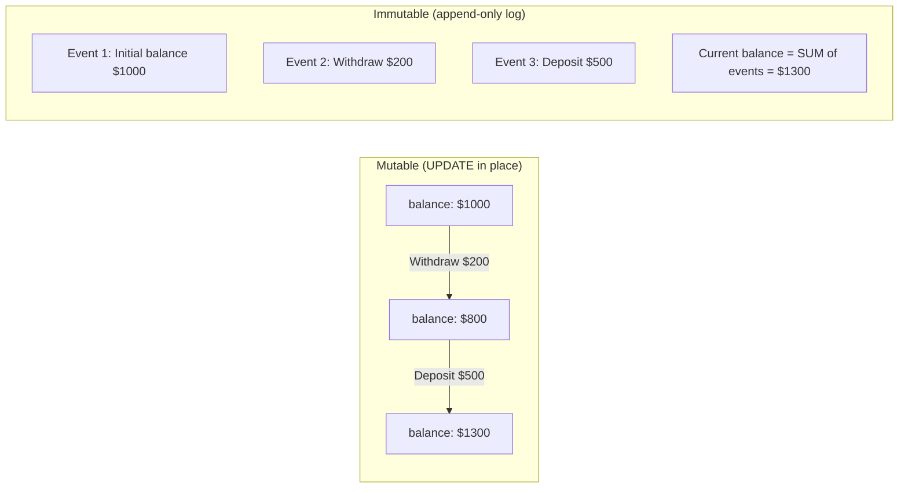
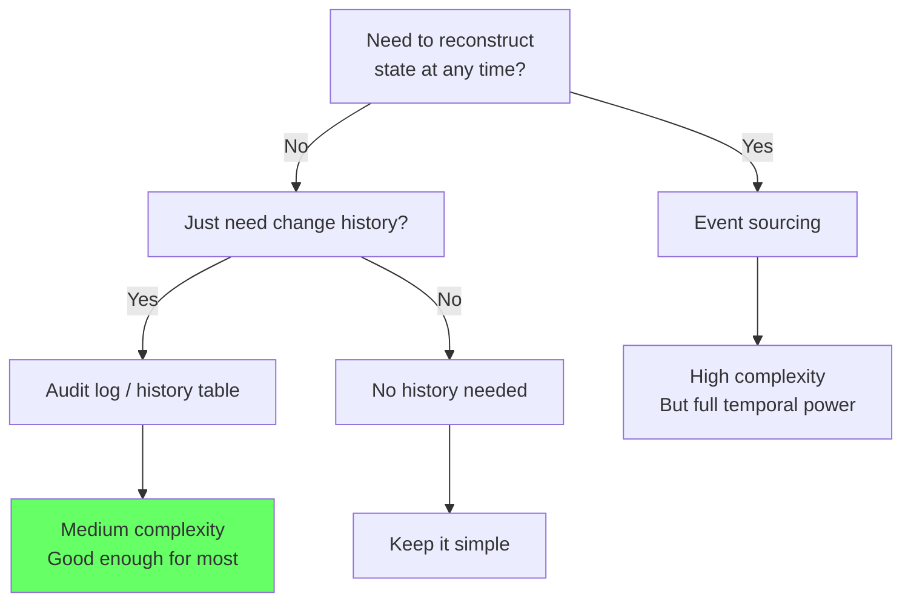
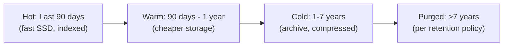

# Immutable Data and Audit Logs

> **What mistake does this prevent?**
> Losing the history of your data because you only stored current state, building audit logs that are easy to tamper with, and designing event tables that become unqueryable at scale.

---

## 1. Why Immutable Data Matters

Most databases store **current state**: the user's current email, the order's current status, the account's current balance.

But production systems need to answer:
- "What was the balance on March 5th?"
- "Who changed this field and when?"
- "What was the state of this order before it was cancelled?"
- "Can you prove this data wasn't tampered with?"



With immutable data, you can reconstruct the state at **any point in time**.

---

## 2. Audit Log Patterns

### Pattern 1: Trigger-Based Audit Log

The most common approach — triggers capture changes automatically:

```sql
-- Audit log table
CREATE TABLE audit_log (
  id BIGSERIAL PRIMARY KEY,
  table_name TEXT NOT NULL,
  record_id TEXT NOT NULL,
  action TEXT NOT NULL,  -- INSERT, UPDATE, DELETE
  old_data JSONB,
  new_data JSONB,
  changed_by TEXT DEFAULT current_setting('app.current_user', true),
  changed_at TIMESTAMPTZ DEFAULT now()
);

-- Generic audit trigger function
CREATE OR REPLACE FUNCTION audit_trigger_fn()
RETURNS TRIGGER AS $$
BEGIN
  IF TG_OP = 'INSERT' THEN
    INSERT INTO audit_log (table_name, record_id, action, new_data)
    VALUES (TG_TABLE_NAME, NEW.id::text, 'INSERT', to_jsonb(NEW));
    RETURN NEW;
  ELSIF TG_OP = 'UPDATE' THEN
    INSERT INTO audit_log (table_name, record_id, action, old_data, new_data)
    VALUES (TG_TABLE_NAME, NEW.id::text, 'UPDATE', to_jsonb(OLD), to_jsonb(NEW));
    RETURN NEW;
  ELSIF TG_OP = 'DELETE' THEN
    INSERT INTO audit_log (table_name, record_id, action, old_data)
    VALUES (TG_TABLE_NAME, OLD.id::text, 'DELETE', to_jsonb(OLD));
    RETURN OLD;
  END IF;
END;
$$ LANGUAGE plpgsql;

-- Attach to tables
CREATE TRIGGER trg_users_audit
  AFTER INSERT OR UPDATE OR DELETE ON users
  FOR EACH ROW EXECUTE FUNCTION audit_trigger_fn();
```

**Strengths:**
- Automatic — developers can't forget
- Captures all changes regardless of application
- Works with direct SQL, migrations, admin operations

**Weaknesses:**
- Adds latency to every write
- Audit table grows fast (large JSONB payloads)
- Doesn't capture *who* made the change (application user vs DB user)
- Trigger can be accidentally dropped

### Capturing Application Context

```sql
-- Set application context before operations
SET LOCAL app.current_user = 'alice@example.com';
SET LOCAL app.request_id = 'req-abc-123';

-- Trigger reads these:
changed_by TEXT DEFAULT current_setting('app.current_user', true),
request_id TEXT DEFAULT current_setting('app.request_id', true)
```

### Pattern 2: History Table (Per-Entity)

Instead of one monolithic audit log, maintain a history table per entity:

```sql
CREATE TABLE users (
  id SERIAL PRIMARY KEY,
  email TEXT NOT NULL,
  name TEXT NOT NULL,
  updated_at TIMESTAMPTZ DEFAULT now()
);

CREATE TABLE users_history (
  history_id BIGSERIAL PRIMARY KEY,
  id INT NOT NULL,           -- Same as users.id
  email TEXT NOT NULL,
  name TEXT NOT NULL,
  valid_from TIMESTAMPTZ NOT NULL,
  valid_to TIMESTAMPTZ,      -- NULL = was current at time of archival
  operation TEXT NOT NULL     -- INSERT, UPDATE
);
```

**Advantage:** Same structure as main table. Can query history with the same WHERE clauses. Can JOIN history tables for temporal queries.

**Disadvantage:** Schema changes must be applied to both tables. More tables to manage.

---

## 3. Event Sourcing Lite (In PostgreSQL)

Full event sourcing stores **events** as the source of truth, and derives current state.

```sql
-- Events are the truth
CREATE TABLE account_events (
  event_id BIGSERIAL PRIMARY KEY,
  account_id INT NOT NULL,
  event_type TEXT NOT NULL,
  event_data JSONB NOT NULL,
  occurred_at TIMESTAMPTZ DEFAULT now(),
  -- Immutability: no UPDATEs allowed
  CONSTRAINT no_future_events CHECK (occurred_at <= now())
);

-- Make the table append-only (revoke UPDATE/DELETE)
REVOKE UPDATE, DELETE ON account_events FROM app_user;
```

### Deriving Current State

```sql
-- Option 1: Materialized view (refreshed periodically)
CREATE MATERIALIZED VIEW account_balances AS
SELECT
  account_id,
  SUM(CASE
    WHEN event_type = 'deposit' THEN (event_data->>'amount')::numeric
    WHEN event_type = 'withdrawal' THEN -(event_data->>'amount')::numeric
    ELSE 0
  END) AS balance,
  MAX(occurred_at) AS last_activity
FROM account_events
GROUP BY account_id;

-- Option 2: Maintained by trigger on event insert
CREATE TABLE account_balances (
  account_id INT PRIMARY KEY,
  balance NUMERIC NOT NULL DEFAULT 0,
  last_event_id BIGINT NOT NULL DEFAULT 0
);
```

### When to Use Event Sourcing vs Simple Audit Log



---

## 4. Immutability Enforcement

### Database-Level Immutability

```sql
-- Prevent modifications to audit/event tables
CREATE OR REPLACE FUNCTION prevent_modification()
RETURNS TRIGGER AS $$
BEGIN
  RAISE EXCEPTION 'Modifications to % are not allowed', TG_TABLE_NAME;
END;
$$ LANGUAGE plpgsql;

CREATE TRIGGER trg_prevent_update
  BEFORE UPDATE ON account_events
  FOR EACH ROW EXECUTE FUNCTION prevent_modification();

CREATE TRIGGER trg_prevent_delete
  BEFORE DELETE ON account_events
  FOR EACH ROW EXECUTE FUNCTION prevent_modification();
```

### Privilege-Level Immutability

```sql
-- Create a role that can only INSERT
CREATE ROLE event_writer;
GRANT INSERT ON account_events TO event_writer;
-- No UPDATE or DELETE granted
-- Application connects as event_writer
```

---

## 5. Querying History Efficiently

### Point-in-Time State

```sql
-- "What was the user's profile on March 15th?"
SELECT *
FROM users_history
WHERE id = 123
  AND valid_from <= '2024-03-15'
  AND (valid_to > '2024-03-15' OR valid_to IS NULL)
LIMIT 1;
```

### Change Log for an Entity

```sql
-- "Show all changes to user 123"
SELECT action, old_data, new_data, changed_at, changed_by
FROM audit_log
WHERE table_name = 'users' AND record_id = '123'
ORDER BY changed_at DESC;
```

### Diff Between Versions

```sql
-- Using JSONB diff to show what changed
SELECT
  changed_at,
  changed_by,
  jsonb_each(new_data) AS new,
  jsonb_each(old_data) AS old
FROM audit_log
WHERE table_name = 'users' AND record_id = '123'
  AND action = 'UPDATE';

-- Or more usefully, compute the diff:
SELECT
  changed_at,
  key,
  old_data->>key AS old_value,
  new_data->>key AS new_value
FROM audit_log,
LATERAL jsonb_object_keys(new_data) AS key
WHERE table_name = 'users'
  AND record_id = '123'
  AND action = 'UPDATE'
  AND old_data->>key IS DISTINCT FROM new_data->>key;
```

---

## 6. Scaling Audit Logs

Audit tables grow fast. At 10M writes/day with JSONB payloads, the audit table can grow by 10+ GB/day.

### Partitioning by Time

```sql
CREATE TABLE audit_log (
  id BIGSERIAL,
  table_name TEXT NOT NULL,
  record_id TEXT NOT NULL,
  action TEXT NOT NULL,
  old_data JSONB,
  new_data JSONB,
  changed_at TIMESTAMPTZ DEFAULT now()
) PARTITION BY RANGE (changed_at);

-- Create monthly partitions
CREATE TABLE audit_log_2024_01 PARTITION OF audit_log
  FOR VALUES FROM ('2024-01-01') TO ('2024-02-01');
CREATE TABLE audit_log_2024_02 PARTITION OF audit_log
  FOR VALUES FROM ('2024-02-01') TO ('2024-03-01');
-- ... etc

-- Drop old partitions after retention period
DROP TABLE audit_log_2023_01;
```

### Retention Policy



---

## 7. Thinking Traps Summary

| Trap | What breaks | Prevention |
|------|------------|------------|
| Audit log without partitioning | Unbounded growth, slow queries | Partition by time, drop old partitions |
| Mutable audit table | Auditors can't trust the data | Enforce immutability via triggers + privileges |
| JSONB payloads without size limits | 10 KB per audit row × millions = terabytes | Store only changed fields, not full snapshots |
| No application context in audit | "Who changed this?" → "The database user" → useless | Set session variables for app user context |
| Triggers on high-write tables | Write latency increase | Async audit via logical replication or CDC |

---

## Related Files

- [Data_Modeling/04_soft_deletes_and_query_rot.md](04_soft_deletes_and_query_rot.md) — alternatives to deletion
- [Advanced_SQL/05_temporal_queries_and_time.md](../Advanced_SQL/05_temporal_queries_and_time.md) — temporal data modeling
- [Security_and_Governance/06_compliance_driven_schema_design.md](../Security_and_Governance/06_compliance_driven_schema_design.md) — regulatory audit requirements
