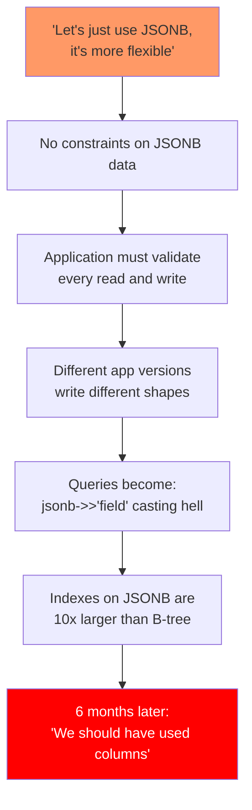
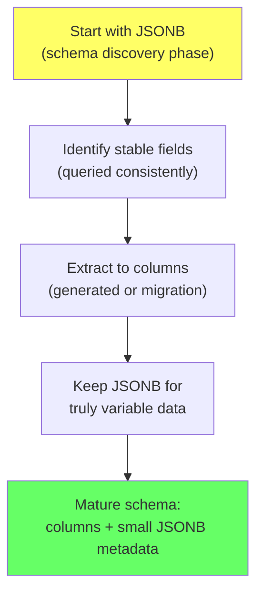

# JSONB as an Escape Hatch

> **What mistake does this prevent?**
> Using JSONB because it feels flexible, then discovering 18 months later that you've built a schemaless database inside your relational database — with no constraints, no type safety, no join capability, and query performance that makes you question your career choices.

The existing [11_postgres_specific_features.md](../11_postgres_specific_features.md) covers JSONB syntax and operators. This file is about **when JSONB is the right answer, when it's the wrong answer, and how to know the difference.**

---

## 1. When JSONB Is Justified

JSONB is the right choice when:

| Scenario | Why JSONB Works |
|----------|----------------|
| **Schema varies per row** | Different products have different attributes (shoes have size, laptops have RAM) |
| **External data passthrough** | Storing webhook payloads, API responses you don't control |
| **User-defined fields** | Tenants define custom fields; schema is per-tenant |
| **Metadata / tags** | Auxiliary data that's queried rarely |
| **Rapid prototyping** | Schema isn't settled yet; JSONB buys time |
| **Sparse columns** | 200 possible attributes, each row has 5-10 |

### The Common Thread

JSONB is justified when **the schema itself is data** — when the shape of the data changes without code changes.

---

## 2. When JSONB Is Technical Debt



### Red Flags: You're Misusing JSONB

| Sign | What's really happening |
|------|------------------------|
| Every query does `->>'field'` casting | You know the schema; use columns |
| You're joining on JSONB fields | JSONB was meant to avoid joins... now you need them |
| You added a GIN index and it's 5x the table size | GIN indexes on arbitrary JSONB are enormous |
| Different code paths produce different JSONB shapes | No schema = no contract = bugs |
| You're doing `WHERE data->>'status' = 'active'` | `status` is a known field; it should be a column |

### The Rule

**If you know the field name at development time, it should be a column.**

```sql
-- BAD: Known fields in JSONB
CREATE TABLE orders (
  id SERIAL PRIMARY KEY,
  data JSONB NOT NULL
  -- data contains: {"status": "pending", "amount": 99.99, "customer_id": 123}
);

-- GOOD: Known fields as columns, unknown as JSONB
CREATE TABLE orders (
  id SERIAL PRIMARY KEY,
  status TEXT NOT NULL,
  amount NUMERIC NOT NULL,
  customer_id INT NOT NULL,
  metadata JSONB  -- truly variable data: tags, custom fields, etc.
);
```

---

## 3. The Hybrid Pattern (Best Practice)

Structure your data with strong columns for known fields and JSONB for the genuinely variable parts:

```sql
CREATE TABLE products (
  id SERIAL PRIMARY KEY,
  name TEXT NOT NULL,
  price NUMERIC NOT NULL,
  category_id INT NOT NULL REFERENCES categories,
  created_at TIMESTAMPTZ DEFAULT now(),

  -- Variable attributes that differ by category
  attributes JSONB NOT NULL DEFAULT '{}',

  -- Constraint: validate JSONB has minimum required fields
  CONSTRAINT valid_attributes CHECK (
    jsonb_typeof(attributes) = 'object'
  )
);

-- Shoes: {"size": "10", "color": "black", "material": "leather"}
-- Laptops: {"ram_gb": 16, "storage_gb": 512, "cpu": "M2"}
-- Books: {"isbn": "978-3-16-148410-0", "pages": 342}
```

### Indexing the Variable Part

```sql
-- GIN index for containment queries (@>)
CREATE INDEX idx_products_attrs ON products USING GIN (attributes);

-- Or targeted expression indexes for known frequent queries
CREATE INDEX idx_products_color ON products ((attributes->>'color'))
  WHERE attributes ? 'color';

CREATE INDEX idx_products_ram ON products (((attributes->>'ram_gb')::int))
  WHERE attributes ? 'ram_gb';
```

---

## 4. JSONB Performance Reality

### Query Performance

| Operation | Column | JSONB |
|-----------|--------|-------|
| Equality filter | B-tree: O(log n) | GIN + `@>`: O(log n) but 2-5x slower |
| Range filter | B-tree: very fast | Expression index or sequential scan |
| Sort | B-tree: trivial | Must cast + sort: slow |
| Join | Hash/merge join: fast | Extract + cast + join: slow |
| Aggregation | Direct: fast | Extract + cast + aggregate: slow |

### Storage

```sql
-- Column storage: typed, compact
-- "active" as TEXT: 6 bytes
-- 42 as INT: 4 bytes

-- JSONB storage: self-describing, larger
-- {"status": "active"} → ~30 bytes (key names stored per row)
-- {"count": 42} → ~20 bytes
```

For 10M rows, storing `status` as a column vs in JSONB:
- Column: ~60 MB
- JSONB: ~300 MB (5x storage overhead)

### GIN Index Size

GIN indexes on JSONB can be **enormous**:

```sql
-- Check index sizes
SELECT
  indexrelname,
  pg_size_pretty(pg_relation_size(indexrelid)) AS index_size,
  pg_size_pretty(pg_relation_size(idx.indrelid)) AS table_size
FROM pg_stat_user_indexes idx
WHERE indexrelname LIKE '%jsonb%' OR indexrelname LIKE '%gin%';
```

A GIN index on a JSONB column with varied keys can be 2-10x the table size. Targeted expression indexes on specific JSONB paths are much smaller.

---

## 5. JSONB Schema Validation

PostgreSQL doesn't validate JSONB structure. You must enforce it yourself:

### CHECK Constraints

```sql
ALTER TABLE products ADD CONSTRAINT valid_product_attrs CHECK (
  jsonb_typeof(attributes) = 'object'
  AND (
    CASE
      WHEN category_id = 1 THEN  -- Shoes
        attributes ? 'size' AND attributes ? 'color'
      WHEN category_id = 2 THEN  -- Laptops
        attributes ? 'ram_gb' AND attributes ? 'storage_gb'
      ELSE true
    END
  )
);
```

### Application-Level Validation

More practical for complex schemas — validate in your application using JSON Schema or Zod/Yup:

```typescript
// Application validates before writing
const shoeSchema = z.object({
  size: z.string(),
  color: z.string(),
  material: z.string().optional(),
});

// PostgreSQL stores the validated JSONB without knowing its schema
```

### Generated Columns (Extract Key Fields)

When you find yourself querying a JSONB field frequently:

```sql
-- Extract to a generated column
ALTER TABLE products ADD COLUMN color TEXT
  GENERATED ALWAYS AS (attributes->>'color') STORED;

-- Now you can index and query it like a regular column
CREATE INDEX idx_products_color ON products (color);

SELECT * FROM products WHERE color = 'black';
```

This is the migration path from JSONB to columns: extract the fields that have stabilized.

---

## 6. JSONB Migration Strategy



### The Extraction Migration

```sql
-- Step 1: Add column
ALTER TABLE products ADD COLUMN color TEXT;

-- Step 2: Backfill
UPDATE products SET color = attributes->>'color' WHERE attributes ? 'color';

-- Step 3: Add index
CREATE INDEX idx_products_color ON products (color);

-- Step 4: Update application to write to column
-- Step 5: Remove from JSONB (optional, or keep for backward compat)
```

---

## 7. JSONB vs Separate Tables

Before reaching for JSONB, consider whether a proper relational model works:

```sql
-- JSONB approach
CREATE TABLE products (
  id SERIAL PRIMARY KEY,
  attributes JSONB  -- {"color": "black", "size": "10"}
);

-- Relational approach (EAV - Entity-Attribute-Value)
CREATE TABLE product_attributes (
  product_id INT REFERENCES products,
  attribute_name TEXT NOT NULL,
  attribute_value TEXT NOT NULL,
  PRIMARY KEY (product_id, attribute_name)
);
```

| Factor | JSONB | EAV Table |
|--------|-------|-----------|
| Read all attributes at once | Excellent (single column) | Requires pivot or multiple rows |
| Filter by specific attribute | GIN or expression index | B-tree on (attribute_name, attribute_value) |
| Add new attribute type | No schema change | No schema change |
| Type safety | None (all text in JSONB) | None (all text) |
| Constraints | CHECK on JSONB | Regular constraints |
| Space efficiency | Keys duplicated per row | Keys stored once per attribute |

**JSONB wins** when you always read/write all attributes together.
**EAV wins** when you need to query by individual attributes frequently across many rows.

---

## 8. Thinking Traps Summary

| Trap | What breaks | Prevention |
|------|------------|------------|
| "JSONB for everything" | Performance, type safety, constraints all degraded | Use columns for known fields |
| GIN index on large JSONB | Index 5x the table size | Use targeted expression indexes |
| No schema validation | Different app versions write different shapes | CHECK constraints or application validation |
| Joining on JSONB fields | Performance disaster | Extract to columns if you need to join |
| JSONB in hot query paths | 2-5x slower than columnar access | Extract to columns or generated columns |
| Never extracting stable fields | JSONB calcifies into permanent tech debt | Periodically review and extract stable fields |

---

## Related Files

- [11_postgres_specific_features.md](../11_postgres_specific_features.md) — JSONB syntax and operators
- [Data_Modeling/01_modeling_for_access_patterns.md](01_modeling_for_access_patterns.md) — design for access patterns
- [Data_Modeling/02_normalization_vs_denormalization.md](02_normalization_vs_denormalization.md) — schema tradeoffs
