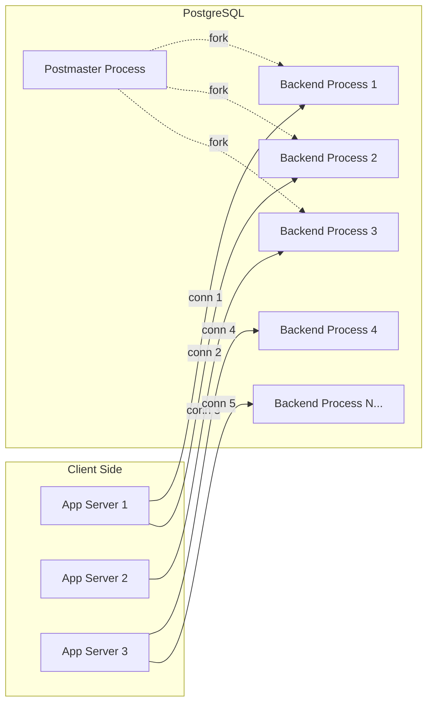
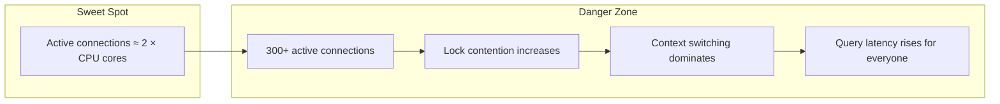
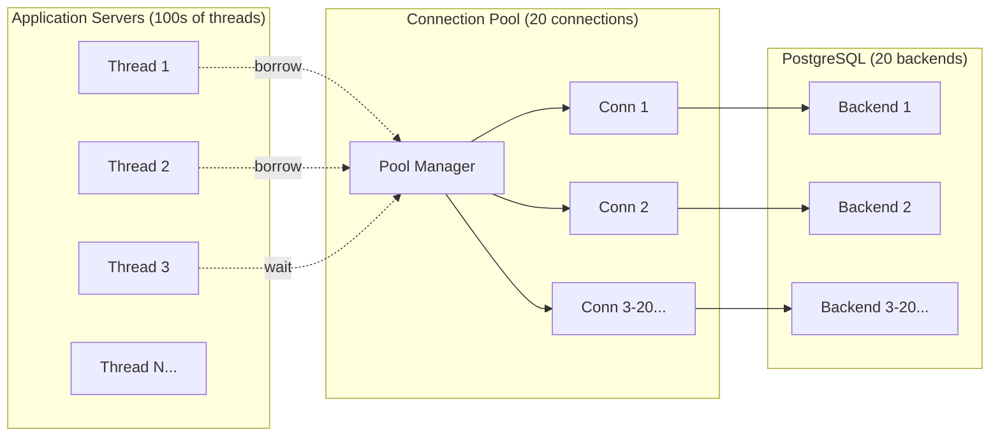
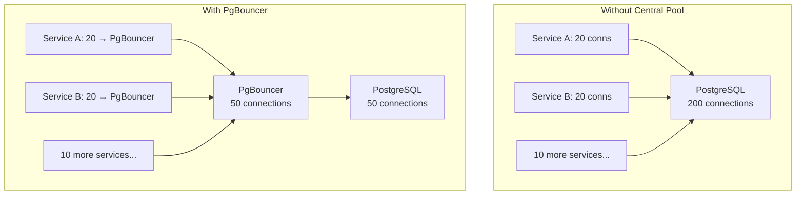

# Connection Management

> **What mistake does this prevent?**
> "Too many connections" errors at 3 AM, connection leaks that slowly strangle your database, and choosing the wrong PgBouncer mode which silently breaks prepared statements.

---

## 1. How PostgreSQL Handles Connections

Every client connection spawns a **dedicated backend process** on the PostgreSQL server. This is a `fork()`, not a thread.



**Each backend process costs:**
- ~5-10 MB of RAM (baseline, before query execution)
- A process slot in the OS
- Shared memory access overhead
- Context-switching cost when active

### The `max_connections` Trap

Default `max_connections` is 100. Many teams bump it to 500 or 1000 thinking "more = better."

**Reality:**
- 500 connections × 10 MB = 5 GB just for idle connections
- Context-switching between 500 processes degrades performance
- At ~300 active connections, PostgreSQL's performance typically **drops**
- The optimal number of *active* connections is roughly `2 × CPU cores + disk spindles`



---

## 2. Connection Pooling — Why It's Mandatory

Without pooling, each web request opens a connection, runs a query, closes the connection. The overhead:

| Step | Time |
|------|------|
| TCP handshake | ~0.5 ms (local), 1-50 ms (remote) |
| TLS handshake | 1-5 ms |
| PostgreSQL auth | 1-10 ms |
| Fork backend process | 1-5 ms |
| Query execution | Variable |
| Connection teardown | ~1 ms |

For a query that takes 2 ms, connection setup can be **5x the query time**.

A connection pool maintains pre-established connections and lends them to clients:



### Where to Pool

| Layer | Tool | Best for |
|-------|------|----------|
| Application | HikariCP, SQLAlchemy pool, Prisma pool | Single app, simple setup |
| Middleware | PgBouncer, Pgpool-II | Multi-service, serverless, high fan-out |
| Cloud | RDS Proxy, Supabase pooler, Neon | Managed environments |

---

## 3. PgBouncer — The Mental Model

PgBouncer sits between your application and PostgreSQL. It maintains a small pool of real PostgreSQL connections and multiplexes many client connections onto them.

### Three Pooling Modes

```mermaid
flowchart TD
    subgraph "Session Mode"
        S1["Client gets connection"] --> S2["Keeps it until DISCONNECT"]
        S2 --> S3["Connection returned to pool"]
    end

    subgraph "Transaction Mode"
        T1["Client gets connection"] --> T2["Keeps it for ONE transaction"]
        T2 --> T3["Connection returned at COMMIT/ROLLBACK"]
        T3 --> T4["Next query may get different connection"]
    end

    subgraph "Statement Mode"
        ST1["Client gets connection for ONE statement"]
        ST1 --> ST2["Connection returned immediately"]
    end
```



| Mode | Multiplexing | Breaks |
|------|-------------|--------|
| **Session** | Lowest (1:1 while connected) | Nothing |
| **Transaction** | High (conn shared between txns) | Prepared statements, SET, LISTEN/NOTIFY, temp tables, session variables |
| **Statement** | Highest (conn shared between statements) | Multi-statement transactions, everything Transaction breaks |

### Transaction Mode — The Right Default (Usually)

Transaction mode gives the best connection efficiency. But it breaks features that depend on **session state**:

```sql
-- These break in transaction mode:
PREPARE my_stmt AS SELECT * FROM users WHERE id = $1;  -- Session-scoped
SET search_path = 'tenant_123';  -- Session-scoped
LISTEN my_channel;  -- Session-scoped
CREATE TEMP TABLE tmp_data (...);  -- Session-scoped
```

**PgBouncer 1.21+ (2023)** added `DEALLOCATE ALL` and `DISCARD ALL` support for prepared statements, making transaction mode compatible with most ORMs. Check your version.

### Configuration That Matters

```ini
[pgbouncer]
pool_mode = transaction
max_client_conn = 1000      ; Clients that can connect to PgBouncer
default_pool_size = 20       ; Connections to PostgreSQL PER database/user pair
min_pool_size = 5            ; Keep this many connections warm
reserve_pool_size = 5        ; Emergency connections for burst
reserve_pool_timeout = 3     ; Seconds before using reserve pool
server_idle_timeout = 300    ; Close idle server connections after 5 min
client_idle_timeout = 0      ; Don't timeout idle clients (let app handle it)
query_wait_timeout = 120     ; Error if client waits >2 min for a connection
```

---

## 4. Connection Exhaustion — Diagnosis and Prevention

### Symptoms

- `FATAL: too many connections for role "myapp"`
- `FATAL: sorry, too many clients already`
- Application connection timeouts
- Sudden latency spikes across all queries

### Common Causes

| Cause | Mechanism | Fix |
|-------|-----------|-----|
| **Connection leak** | App opens connection, exception occurs, connection never returned | Use `try/finally` or connection pool with `maxLifetime` |
| **Long-running transactions** | Rails console with open transaction holds connection | Set `idle_in_transaction_session_timeout` |
| **No pool or pool too large** | Each microservice opens 20+ connections | Central PgBouncer, right-size per-service pools |
| **Migrations running** | `ALTER TABLE` acquires lock, other connections queue | Migrate during low traffic, use `lock_timeout` |
| **Monitoring connections** | Each monitoring tool holds a connection | Dedicated monitoring user with reserved connections |

### Essential PostgreSQL Settings

```sql
-- Kill idle transactions after 5 minutes
ALTER SYSTEM SET idle_in_transaction_session_timeout = '5min';

-- Statement timeout (safety net)
ALTER SYSTEM SET statement_timeout = '30s';

-- Reserve connections for superuser (emergency access)
ALTER SYSTEM SET superuser_reserved_connections = 3;
```

### Monitoring Connections

```sql
-- Current connection count by state
SELECT state, COUNT(*)
FROM pg_stat_activity
GROUP BY state;

-- Connections by application
SELECT application_name, COUNT(*)
FROM pg_stat_activity
GROUP BY application_name;

-- Long-running idle transactions (connection holders)
SELECT pid, now() - xact_start AS txn_duration, query, state
FROM pg_stat_activity
WHERE state = 'idle in transaction'
  AND xact_start < now() - interval '1 minute'
ORDER BY txn_duration DESC;

-- Kill a specific connection
SELECT pg_terminate_backend(pid);
```

---

## 5. Connection Management in Microservices

Each microservice with its own connection pool multiplies the problem:

```
10 microservices × 20 connections each = 200 connections to PostgreSQL
```

But most of those connections are idle most of the time.



**Rule:** One PgBouncer per PostgreSQL instance, all services connect through it.

---

## 6. Serverless and Connection Challenges

Serverless functions (Lambda, Cloud Functions) create a unique problem: each invocation may create a new connection that lives only for the function's execution.

```
1000 concurrent Lambda invocations = 1000 connection attempts
```

**Solutions:**
- **RDS Proxy / Supabase Pooler:** Managed connection pooling
- **PgBouncer in a sidecar:** Self-managed pooling
- **Connection-aware serverless frameworks:** Prisma Data Proxy, Neon serverless driver

---

## 7. Thinking Traps Summary

| Trap | What breaks | Prevention |
|------|------------|------------|
| `max_connections = 1000` | CPU thrashing, memory pressure | Keep real connections low, use pooling |
| No connection pooling | Connection setup dominates latency | Always pool |
| PgBouncer transaction mode + prepared statements | Silent failures or errors | Use PgBouncer 1.21+ or session mode |
| No `idle_in_transaction_session_timeout` | Leaked transactions hold connections forever | Set to 5-10 minutes |
| Per-service pools without central pooler | Connection count explosion | PgBouncer as central gateway |
| No monitoring of `pg_stat_activity` | Blind to connection problems | Dashboard for connection states |

---

## Related Files

- [08_transactions_isolation_locking.md](../08_transactions_isolation_locking.md) — transaction behavior
- [Internals/10_replication_and_scaling.md](../Internals/10_replication_and_scaling.md) — connection pooling with replicas
- [Migration/03_schema_changes_and_locks.md](../Migration/03_schema_changes_and_locks.md) — migrations and connection impact
