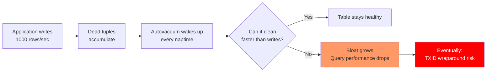
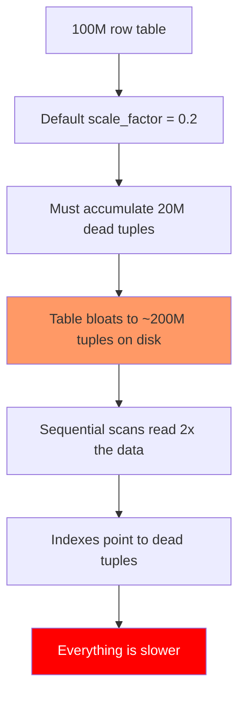
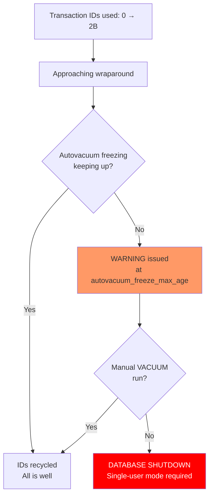

# Autovacuum Deep Dive

> **What mistake does this prevent?**
> Table bloat that silently doubles your storage costs, queries that degrade over months because dead tuples accumulate, and transaction ID wraparound — a ticking time bomb that forces PostgreSQL into single-user mode.

The existing [Internals/09_vacuum_and_maintenance.md](../Internals/09_vacuum_and_maintenance.md) covers *what* vacuum does. This file covers what goes wrong when autovacuum can't keep up, and how to fix it.

---

## 1. Why Autovacuum Falls Behind

Autovacuum runs in the background. It's throttled to avoid impacting your workload. This means it can lose the race against high-write tables.



### The Throttling Problem

Autovacuum is deliberately slow:

```sql
SHOW autovacuum_vacuum_cost_delay;   -- 2ms (default) — pause between work
SHOW autovacuum_vacuum_cost_limit;   -- 200 (default) — work units before pausing
SHOW vacuum_cost_page_hit;           -- 1 — cost of reading page from cache
SHOW vacuum_cost_page_miss;          -- 2 — cost of reading page from disk  (PG 17 changed this to 2)
SHOW vacuum_cost_page_dirty;         -- 20 — cost of dirtying a page
```

At default settings, autovacuum reads ~100 pages from cache, then sleeps 2ms. On a table with millions of dead tuples, this takes hours.

---

## 2. Tuning Autovacuum for Hot Tables

### Global Tuning (Affects All Tables)

```sql
-- More aggressive globally
ALTER SYSTEM SET autovacuum_vacuum_cost_delay = '0';     -- No sleeping (PG 12+ default is 2ms)
ALTER SYSTEM SET autovacuum_vacuum_cost_limit = 1000;     -- More work per cycle
ALTER SYSTEM SET autovacuum_max_workers = 5;              -- More parallel workers (default: 3)
ALTER SYSTEM SET autovacuum_naptime = '15s';              -- Check more frequently (default: 1min)
```

### Per-Table Tuning (The Real Solution)

Hot tables need individual attention:

```sql
-- This table gets 10,000 writes/second — default thresholds are too relaxed
ALTER TABLE events SET (
  autovacuum_vacuum_threshold = 1000,           -- Start vacuum after 1000 dead tuples (default: 50)
  autovacuum_vacuum_scale_factor = 0.01,        -- ...or 1% of table (default: 0.2 = 20%)
  autovacuum_analyze_threshold = 500,
  autovacuum_analyze_scale_factor = 0.005,
  autovacuum_vacuum_cost_delay = 0              -- No throttling for this table
);
```

### The Scale Factor Problem

Default trigger: `threshold + scale_factor × live_tuples`

For a 100M row table: `50 + 0.2 × 100,000,000 = 20,000,050 dead tuples` before vacuum starts.

**20 million dead tuples** before autovacuum even wakes up. Your table has doubled in size by then.



**Fix for large tables:** Set `autovacuum_vacuum_scale_factor = 0` and use a fixed `autovacuum_vacuum_threshold`:

```sql
ALTER TABLE huge_table SET (
  autovacuum_vacuum_scale_factor = 0,
  autovacuum_vacuum_threshold = 10000  -- Vacuum every 10K dead tuples regardless of table size
);
```

---

## 3. Transaction ID Wraparound — The Time Bomb

PostgreSQL uses 32-bit transaction IDs. There are ~4.2 billion possible values. When you run out, PostgreSQL must freeze old transaction IDs to reclaim them.

If vacuum can't freeze tuples fast enough:

```
WARNING: database "mydb" must be vacuumed within 10000000 transactions
HINT: To avoid a database shutdown, execute a database-wide VACUUM.
```

If ignored:

```
ERROR: database is not accepting commands to avoid wraparound data loss in database "mydb"
HINT: Stop the postmaster and vacuum that database in single-user mode.
```

**Your database shuts down.** Reads and writes stop. This is not theoretical — it happens in production.



### Monitoring for Wraparound

```sql
-- How close are your databases to wraparound?
SELECT
  datname,
  age(datfrozenxid) AS txid_age,
  current_setting('autovacuum_freeze_max_age')::int AS freeze_max_age,
  round(100.0 * age(datfrozenxid) / current_setting('autovacuum_freeze_max_age')::int, 1) AS pct_to_wraparound
FROM pg_database
ORDER BY txid_age DESC;

-- Which tables are furthest behind?
SELECT
  schemaname,
  relname,
  age(relfrozenxid) AS txid_age,
  pg_size_pretty(pg_total_relation_size(oid)) AS total_size
FROM pg_class
WHERE relkind = 'r'
ORDER BY age(relfrozenxid) DESC
LIMIT 20;
```

**Alert at 50% of `autovacuum_freeze_max_age`.** Default is 200M, so alert at 100M.

---

## 4. When Autovacuum Gets Blocked

Autovacuum is polite. It gives way to other operations:

| Blocker | What happens |
|---------|-------------|
| Long-running transaction | Vacuum can't remove tuples visible to that transaction |
| `ACCESS EXCLUSIVE` lock (DDL) | Vacuum waits, then starts over |
| Heavy table writes | Vacuum competes for I/O |
| Another vacuum on same table | Second vacuum skips the table |

### The Long Transaction Problem

```sql
-- This innocent query in a Rails console:
BEGIN;
SELECT COUNT(*) FROM users;
-- Developer goes to lunch...
-- Autovacuum cannot clean ANY table because this transaction's snapshot is old
```

Dead tuples accumulate across **all tables** because vacuum can't remove rows visible to uncommitted transactions.

```sql
-- Find the blockers
SELECT
  pid,
  now() - xact_start AS txn_age,
  state,
  query
FROM pg_stat_activity
WHERE xact_start IS NOT NULL
ORDER BY xact_start ASC
LIMIT 5;
```

**Prevention:**
```sql
ALTER SYSTEM SET idle_in_transaction_session_timeout = '5min';
```

---

## 5. Monitoring Autovacuum Health

### Key Queries

```sql
-- Last vacuum/analyze per table
SELECT
  schemaname,
  relname,
  last_vacuum,
  last_autovacuum,
  last_analyze,
  last_autoanalyze,
  n_dead_tup,
  n_live_tup,
  round(100.0 * n_dead_tup / NULLIF(n_live_tup + n_dead_tup, 0), 1) AS dead_pct
FROM pg_stat_user_tables
ORDER BY n_dead_tup DESC
LIMIT 20;

-- Currently running autovacuum workers
SELECT
  pid,
  query,
  now() - query_start AS duration
FROM pg_stat_activity
WHERE query LIKE 'autovacuum:%';

-- Tables that need vacuuming but haven't been
SELECT
  schemaname || '.' || relname AS table_name,
  n_dead_tup,
  last_autovacuum,
  now() - last_autovacuum AS time_since_vacuum
FROM pg_stat_user_tables
WHERE n_dead_tup > 10000
  AND (last_autovacuum IS NULL OR last_autovacuum < now() - interval '1 hour')
ORDER BY n_dead_tup DESC;
```

### Metrics to Alert On

| Metric | Warning Threshold | Critical |
|--------|------------------|----------|
| Dead tuple ratio | >20% | >50% |
| Time since last vacuum | >1 hour (hot tables) | >24 hours |
| Transaction age (`age(relfrozenxid)`) | >100M | >150M |
| Autovacuum workers at max | Sustained | —  |
| Table bloat ratio | >30% | >50% |

---

## 6. Estimating Table Bloat

```sql
-- Rough bloat estimate using pgstattuple extension
CREATE EXTENSION IF NOT EXISTS pgstattuple;

SELECT
  table_len,
  tuple_count,
  tuple_len,
  dead_tuple_count,
  dead_tuple_len,
  round(100.0 * dead_tuple_len / NULLIF(table_len, 0), 1) AS bloat_pct
FROM pgstattuple('my_table');
```

**If bloat exceeds 50%, VACUUM won't help** — it only marks space as reusable, it doesn't reclaim it. You need:

1. `VACUUM FULL` — rewrites entire table, takes `ACCESS EXCLUSIVE` lock (downtime)
2. `pg_repack` — rewrites table online, no exclusive lock (preferred)
3. `CLUSTER` — rewrites table ordered by an index, takes exclusive lock

---

## 7. Thinking Traps Summary

| Trap | What breaks | Prevention |
|------|------------|------------|
| Default `scale_factor` on large tables | Millions of dead tuples before vacuum runs | Set `scale_factor = 0`, use fixed threshold |
| Ignoring wraparound warnings | Database shutdown, single-user mode required | Monitor `age(relfrozenxid)`, alert at 50% |
| Long idle transactions | Vacuum blocked across ALL tables | `idle_in_transaction_session_timeout` |
| Never checking `n_dead_tup` | Silent bloat growth | Dashboard with dead tuple monitoring |
| Thinking `VACUUM FULL` is the answer | Extended downtime for large tables | Use `pg_repack` for online rewrite |

---

## Related Files

- [Internals/09_vacuum_and_maintenance.md](../Internals/09_vacuum_and_maintenance.md) — foundational VACUUM coverage
- [Internals/06_mvcc_and_visibility.md](../Internals/06_mvcc_and_visibility.md) — why dead tuples exist
- [Production_Postgres/03_table_bloat_and_hot_updates.md](03_table_bloat_and_hot_updates.md) — HOT updates to reduce vacuum load
