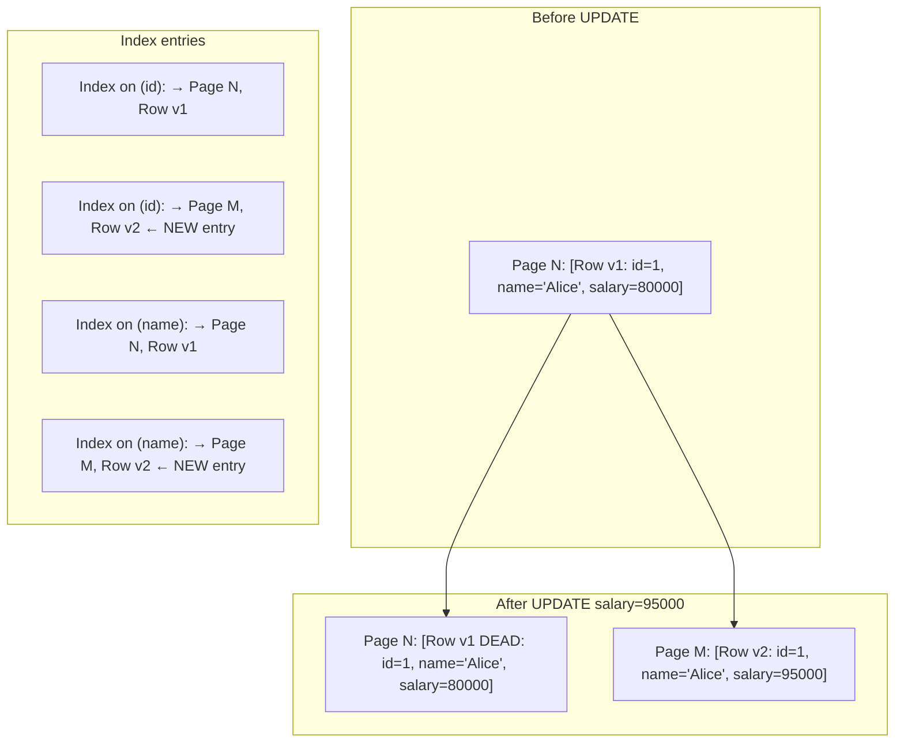
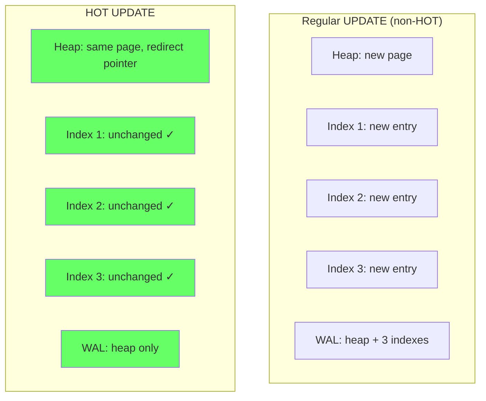
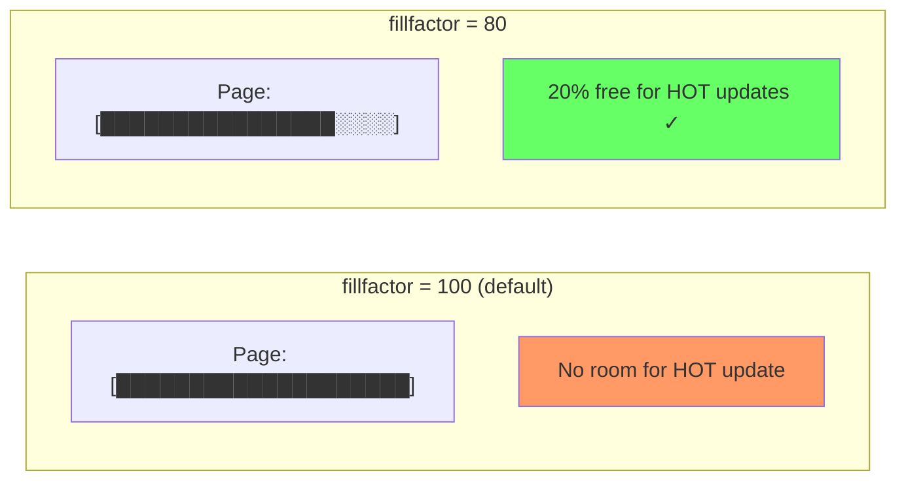
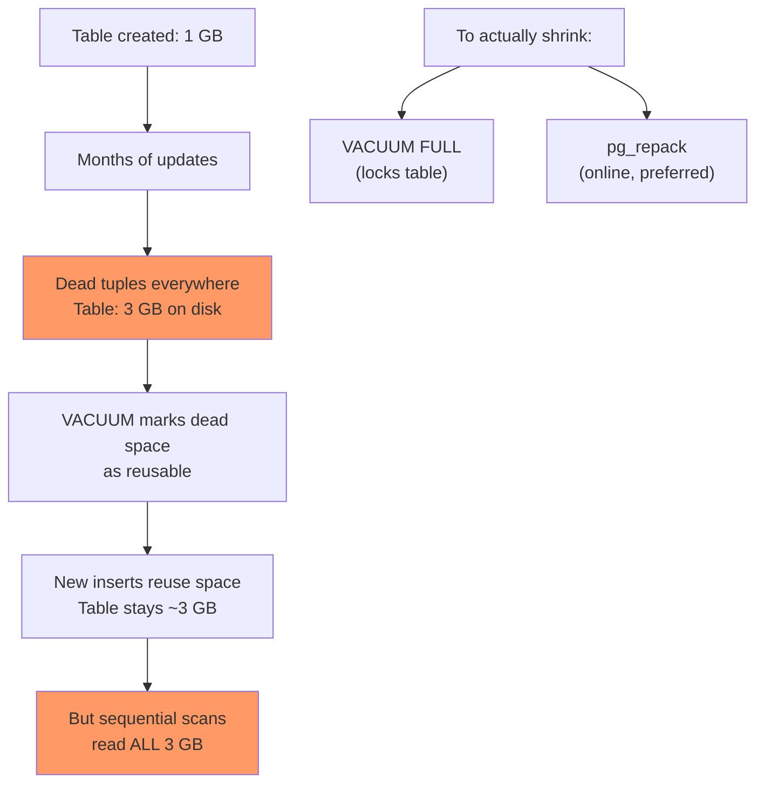
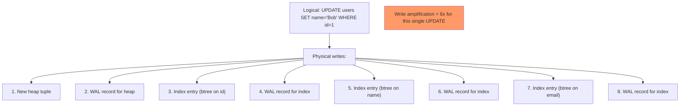

# Table Bloat and HOT Updates

> **What mistake does this prevent?**
> A 10 GB table that grows to 50 GB because every UPDATE creates a new tuple version, and not knowing that a simple schema change (adding `fillfactor`) could have prevented it.

---

## 1. Why Updates Are Expensive in PostgreSQL

PostgreSQL's MVCC means every `UPDATE` creates a **new physical copy** of the entire row. The old version remains until VACUUM removes it.



**The cost of a regular UPDATE:**

1. Write new tuple to (possibly different) heap page
2. Mark old tuple as dead (set `xmax`)
3. Insert **new index entries in EVERY index** on the table
4. WAL log all of the above

If a table has 5 indexes, updating one column writes to the heap + 5 index trees + WAL entries for all of it.

---

## 2. HOT Updates — The Optimization You Need

**Heap-Only Tuples (HOT)** is PostgreSQL's optimization for the common case: updating a column that isn't indexed.

When a HOT update happens:

1. New tuple is written to the **same heap page** as the old tuple
2. **No new index entries** are created
3. Old tuple gets a "redirect" pointer to the new tuple
4. VACUUM can clean up the chain efficiently



### Conditions for HOT

A HOT update happens when **ALL** of these are true:

1. **Updated column is NOT in any index** (including partial and expression indexes)
2. **New tuple fits on the same page** as the old tuple (there's free space)
3. No index covers the updated column

If **any** condition fails, it's a regular (cold) update with full index maintenance.

### Checking HOT Update Ratio

```sql
SELECT
  schemaname,
  relname,
  n_tup_upd,
  n_tup_hot_upd,
  round(100.0 * n_tup_hot_upd / NULLIF(n_tup_upd, 0), 1) AS hot_pct
FROM pg_stat_user_tables
WHERE n_tup_upd > 0
ORDER BY n_tup_upd DESC;
```

**Target: >90% HOT updates on frequently-updated tables.** If it's low, investigate why.

---

## 3. fillfactor — Making Room for HOT

By default, PostgreSQL fills heap pages to 100%. There's no room for a HOT update.

`fillfactor` tells PostgreSQL to leave space on each page:

```sql
-- Leave 20% free space on each page for HOT updates
ALTER TABLE events SET (fillfactor = 80);

-- You must rewrite the table for this to take effect on existing pages
VACUUM FULL events;  -- Or use pg_repack
```



### Choosing fillfactor

| Table pattern | Recommended fillfactor | Why |
|--------------|----------------------|-----|
| Append-only (logs, events) | 100 (default) | No updates, don't waste space |
| Frequent updates, non-indexed columns | 70-80 | Room for HOT updates |
| Frequent updates, updated columns are indexed | 100 | HOT won't help anyway |
| High churn (status columns toggling) | 60-70 | Many updates per row lifecycle |

---

## 4. Measuring Table Bloat

### Quick Estimate

```sql
-- Compare actual table size vs estimated minimum size
SELECT
  schemaname || '.' || relname AS table_name,
  pg_size_pretty(pg_total_relation_size(relid)) AS total_size,
  pg_size_pretty(pg_relation_size(relid)) AS table_size,
  n_live_tup,
  n_dead_tup,
  round(100.0 * n_dead_tup / NULLIF(n_live_tup + n_dead_tup, 0), 1) AS dead_pct
FROM pg_stat_user_tables
ORDER BY pg_total_relation_size(relid) DESC
LIMIT 20;
```

### Accurate Estimate (pgstattuple)

```sql
CREATE EXTENSION IF NOT EXISTS pgstattuple;

-- Detailed bloat analysis (slow on large tables — reads every page)
SELECT * FROM pgstattuple('my_table');

-- Index bloat
SELECT * FROM pgstatindex('my_table_pkey');
```

### The Bloat Lifecycle



**Key insight:** Regular VACUUM prevents bloat from growing further, but it **doesn't shrink the table**. Once bloated, you need a rewrite operation.

---

## 5. Index Bloat — The Hidden Problem

Indexes bloat too, and it's often worse than table bloat:

```sql
-- Index size vs expected size
SELECT
  indexrelname AS index_name,
  pg_size_pretty(pg_relation_size(indexrelid)) AS index_size,
  idx_scan,
  idx_tup_read,
  idx_tup_fetch
FROM pg_stat_user_indexes
WHERE schemaname = 'public'
ORDER BY pg_relation_size(indexrelid) DESC;
```

### Why Index Bloat Matters More

- Indexes are accessed on almost every query
- B-tree pages that are half-empty are never reclaimed by regular VACUUM
- A bloated index means more pages to traverse = slower lookups

### Fixing Index Bloat

```sql
-- REINDEX (locks table for writes during rebuild)
REINDEX INDEX CONCURRENTLY my_index;  -- PG 12+, minimal locking

-- Or drop and recreate
CREATE INDEX CONCURRENTLY new_idx ON my_table (col);
DROP INDEX old_idx;
ALTER INDEX new_idx RENAME TO old_idx;
```

---

## 6. Write Amplification — The Cascading Cost

Every logical write (one `INSERT`, `UPDATE`, or `DELETE`) causes multiple physical writes:



### Reducing Write Amplification

| Strategy | Effect |
|----------|--------|
| Fewer indexes | Fewer index writes per UPDATE |
| HOT updates (fillfactor + unindexed columns) | Eliminates index writes |
| Batch writes | Amortize WAL overhead |
| `wal_compression = on` | Compress full-page images in WAL |
| Appropriate checkpoint interval | Fewer full-page writes |

### The "Too Many Indexes" Pattern

```sql
-- Find unused indexes (candidates for removal)
SELECT
  schemaname || '.' || relname AS table,
  indexrelname AS index,
  pg_size_pretty(pg_relation_size(indexrelid)) AS size,
  idx_scan AS times_used
FROM pg_stat_user_indexes
WHERE idx_scan = 0
  AND indexrelname NOT LIKE '%pkey%'
  AND indexrelname NOT LIKE '%unique%'
ORDER BY pg_relation_size(indexrelid) DESC;
```

Every unused index is a pure write tax. Remove it.

---

## 7. Practical Checklist for Update-Heavy Tables

```sql
-- 1. Check HOT update ratio
SELECT relname, n_tup_hot_upd, n_tup_upd,
       round(100.0 * n_tup_hot_upd / NULLIF(n_tup_upd, 0), 1) AS hot_pct
FROM pg_stat_user_tables WHERE n_tup_upd > 1000 ORDER BY n_tup_upd DESC;

-- 2. Set fillfactor on frequently-updated tables
ALTER TABLE my_hot_table SET (fillfactor = 80);

-- 3. Avoid indexing columns that change often
-- DON'T: CREATE INDEX ON orders (status);  -- status changes frequently
-- DO:    Use partial index: CREATE INDEX ON orders (id) WHERE status = 'pending';

-- 4. Monitor bloat regularly
-- 5. Remove unused indexes
-- 6. Set per-table autovacuum for hot tables
```

---

## 8. Thinking Traps Summary

| Trap | What breaks | Prevention |
|------|------------|------------|
| Default fillfactor on update-heavy tables | No HOT updates, full index maintenance every time | Set fillfactor 70-80 |
| Indexing frequently-changing columns | Every UPDATE rewrites all indexes | Partial indexes or avoid indexing mutable columns |
| Ignoring index bloat | Slower queries, wasted RAM | Monitor with `pgstatindex`, `REINDEX CONCURRENTLY` |
| Not checking HOT ratio | Unnecessary I/O amplification | Monitor `pg_stat_user_tables.n_tup_hot_upd` |
| Too many indexes | Massive write amplification | Audit unused indexes, remove aggressively |

---

## Related Files

- [Internals/06_mvcc_and_visibility.md](../Internals/06_mvcc_and_visibility.md) — why UPDATE creates new rows
- [Internals/09_vacuum_and_maintenance.md](../Internals/09_vacuum_and_maintenance.md) — VACUUM mechanics
- [06_indexes_and_performance.md](../06_indexes_and_performance.md) — index types and costs
- [Production_Postgres/02_autovacuum_deep_dive.md](02_autovacuum_deep_dive.md) — tuning vacuum for high-churn tables
