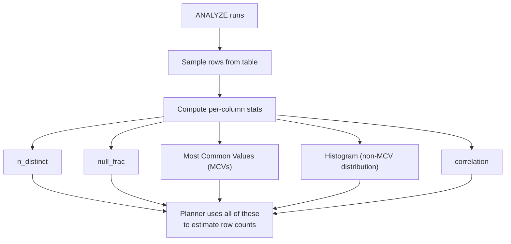
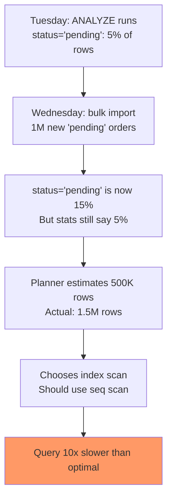
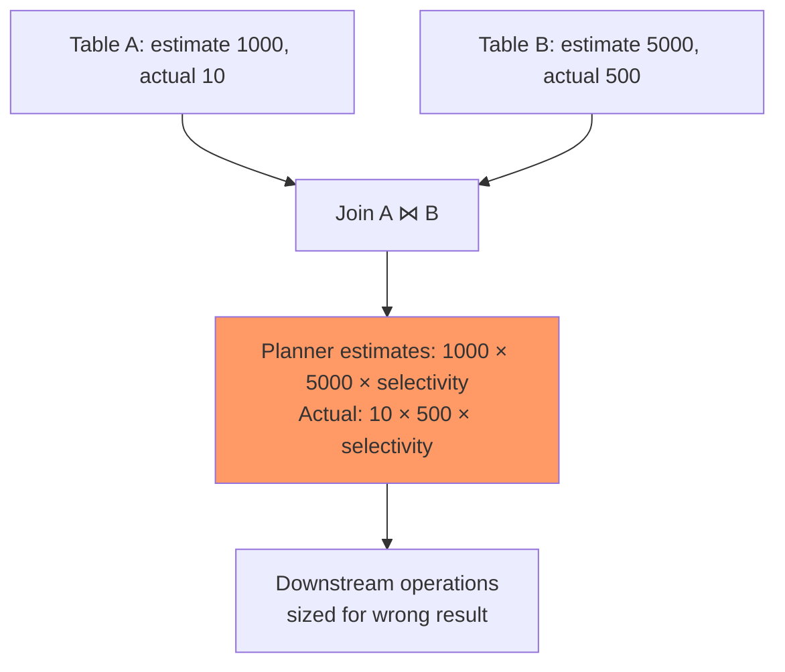

# Statistics, ANALYZE, and When the Planner Lies

> **What mistake does this prevent?**
> Queries that run perfectly in development but are 1000x slower in production because the planner chose the wrong plan based on stale, missing, or misleading statistics.

The existing [Internals/05_query_planner_optimizer.md](../Internals/05_query_planner_optimizer.md) covers how the planner works. This file covers when it makes wrong decisions and how to fix them.

---

## 1. What Statistics PostgreSQL Maintains

For each column, `ANALYZE` collects:

```sql
SELECT
  attname,
  n_distinct,     -- Estimated distinct values (-1 = unique, -0.5 = 50% unique)
  null_frac,      -- Fraction of NULLs (0.0 to 1.0)
  avg_width,      -- Average column width in bytes
  correlation     -- Physical vs logical ordering (-1 to 1)
FROM pg_stats
WHERE tablename = 'orders'
  AND schemaname = 'public';
```

Plus:
- **Most Common Values (MCV)**: The N most frequent values and their frequencies
- **Histogram**: Distribution of non-MCV values in equal-frequency buckets



---

## 2. How the Planner Uses Statistics to Choose Plans

The planner's job is to estimate how many rows each operation will produce. This drives plan choice:

```sql
EXPLAIN SELECT * FROM orders WHERE status = 'pending';
```

Planner thinks:
1. Table has 10,000,000 rows
2. `status` has MCV showing `'pending'` frequency = 0.05 (5%)
3. Estimated rows = 10,000,000 × 0.05 = 500,000
4. 500,000 rows = too many for index scan → sequential scan

If the statistics are wrong (actual pending orders = 50, not 500,000), the planner chooses a catastrophically wrong plan.

---

## 3. When Statistics Go Stale

### The Problem

Autovacuum runs `ANALYZE` as part of its cycle. But the threshold is based on:

```
analyze threshold = autovacuum_analyze_threshold + autovacuum_analyze_scale_factor × n_live_tup
```

Default: `50 + 0.1 × n_live_tup`

For a 100M row table: 10,000,050 changes before re-analysis.

**Scenario:**



### Fixing Stale Stats

```sql
-- Manual analyze on specific table
ANALYZE orders;

-- Analyze specific columns (faster)
ANALYZE orders (status, created_at);

-- Per-table autovacuum tuning for hot tables
ALTER TABLE orders SET (
  autovacuum_analyze_threshold = 1000,
  autovacuum_analyze_scale_factor = 0.01
);
```

### Check When Stats Were Last Computed

```sql
SELECT
  schemaname,
  relname,
  last_analyze,
  last_autoanalyze,
  n_mod_since_analyze  -- Changes since last analyze
FROM pg_stat_user_tables
WHERE n_mod_since_analyze > 10000
ORDER BY n_mod_since_analyze DESC;
```

---

## 4. Correlated Columns — The Planner's Blind Spot

The planner assumes columns are **independent**. This is often wrong.

```sql
-- "Find orders from New York that shipped via USPS"
SELECT * FROM orders
WHERE city = 'New York' AND shipping_method = 'USPS';
```

Planner thinks:
- P(city = 'New York') = 0.05
- P(shipping_method = 'USPS') = 0.30
- P(both) = 0.05 × 0.30 = 0.015 = 1.5%

But in reality, 80% of New York orders ship via USPS (because of a local warehouse). Actual selectivity is 4%, not 1.5%.

### Extended Statistics (PostgreSQL 10+)

```sql
-- Tell PostgreSQL these columns are correlated
CREATE STATISTICS orders_city_shipping (dependencies)
ON city, shipping_method FROM orders;

ANALYZE orders;  -- Must re-analyze after creating the statistic
```

Types of extended statistics:

| Type | What it captures | When to use |
|------|-----------------|-------------|
| `dependencies` | Functional dependency (X determines Y) | `WHERE city = 'X' AND state = 'Y'` (state depends on city) |
| `ndistinct` | N-distinct for column combinations | `GROUP BY city, state` (fewer combos than product) |
| `mcv` (PG 12+) | Most common value combinations | Multi-column equality filters |

```sql
-- Create with multiple types
CREATE STATISTICS orders_geo (dependencies, ndistinct, mcv)
ON city, state, zip_code FROM orders;

ANALYZE orders;

-- Check if they're being used
SELECT * FROM pg_stats_ext WHERE statistics_name = 'orders_geo';
```

---

## 5. Skewed Data — The MCV Problem

When data distribution is highly skewed, estimation varies wildly by value:

```sql
-- 99% of rows have status = 'completed'
-- 0.1% have status = 'pending'
-- Planner knows this from MCVs... if stats are current
```

**The problem with non-MCV values:**

If a value isn't in the MCV list, the planner estimates its frequency from the histogram. For rare values, this can be way off.

```sql
-- Increase statistics target for important columns
ALTER TABLE orders ALTER COLUMN status SET STATISTICS 1000;  -- Default is 100
ANALYZE orders;
```

Higher `STATISTICS` target = more MCV entries + more histogram buckets = better estimates for skewed data.

```sql
-- Global default
ALTER SYSTEM SET default_statistics_target = 200;  -- Default is 100
```

---

## 6. When the Planner Is Provably Wrong

### Diagnosing Bad Estimates

```sql
EXPLAIN (ANALYZE, BUFFERS) SELECT * FROM orders WHERE status = 'pending';
```

Look for discrepancies between `rows=` (estimate) and `actual rows=`:

```
Seq Scan on orders  (cost=0.00..250000.00 rows=500000 width=100)
                    (actual time=0.015..150.000 rows=50 loops=1)
```

Estimated: 500,000. Actual: 50. Off by 10,000x. The planner chose seq scan when index scan would have been instant.

### Quick Fixes (In Order of Preference)

1. **Run `ANALYZE`** — stale stats are the #1 cause
2. **Increase statistics target** on the column
3. **Create extended statistics** for correlated columns
4. **Use partial indexes** that pre-filter the rare condition

### The Nuclear Option: Plan Hints (Don't)

PostgreSQL intentionally does not support query hints (`/*+ USE_INDEX */`). The philosophy: fix the statistics, don't override the planner.

**But you can nudge the planner:**

```sql
-- Discourage sequential scans (testing only!)
SET enable_seqscan = off;

-- Encourage specific join strategies
SET enable_hashjoin = off;   -- Force merge or nested loop
SET enable_nestloop = off;   -- Force hash or merge join
```

**Never use these in production permanently.** They affect ALL queries in the session, not just the one you're tuning.

---

## 7. Estimates Through Joins — Error Multiplication

Estimation errors compound through query plans:



A 100x error in each input table can produce a 10,000x error in the join estimate. This cascades: the next join multiplies the error again.

### Symptoms of Cascading Estimation Errors

- Hash join chosen but runs out of `work_mem` (spills to disk)
- Nested loop chosen for what should be a hash join
- Materialize nodes in the plan (intermediate result spooled to disk)
- Sort operations that spill to disk unexpectedly

---

## 8. The `pg_stat_statements` Connection

Query statistics complement planner statistics:

```sql
CREATE EXTENSION IF NOT EXISTS pg_stat_statements;

-- Find queries where planning time is high relative to execution
SELECT
  query,
  calls,
  mean_exec_time,
  mean_plan_time,
  round(mean_plan_time / NULLIF(mean_exec_time, 0) * 100, 1) AS plan_pct
FROM pg_stat_statements
WHERE calls > 100
ORDER BY mean_plan_time DESC
LIMIT 20;
```

High planning time suggests the planner is struggling with the query — possibly because of many possible plans (many joins) or expensive statistic lookups.

---

## 9. Thinking Traps Summary

| Trap | What breaks | Prevention |
|------|------------|------------|
| Never manually running ANALYZE | Stats stale after bulk loads | `ANALYZE` after large data changes |
| Default statistics target on skewed columns | Rare values estimated wrong | Increase `STATISTICS` to 500-1000 |
| Correlated columns | Selectivity underestimated by orders of magnitude | Create extended statistics |
| 10,000x estimation gap | Wrong plan (seq scan vs index scan) | Check `EXPLAIN ANALYZE`, compare estimated vs actual |
| Disabling plan types globally | Breaks other queries | Never `SET enable_* = off` in production |

---

## Related Files

- [Internals/05_query_planner_optimizer.md](../Internals/05_query_planner_optimizer.md) — foundational planner coverage
- [07_explain_analyze.md](../07_explain_analyze.md) — reading EXPLAIN output
- [06_indexes_and_performance.md](../06_indexes_and_performance.md) — index selection and planner interaction
