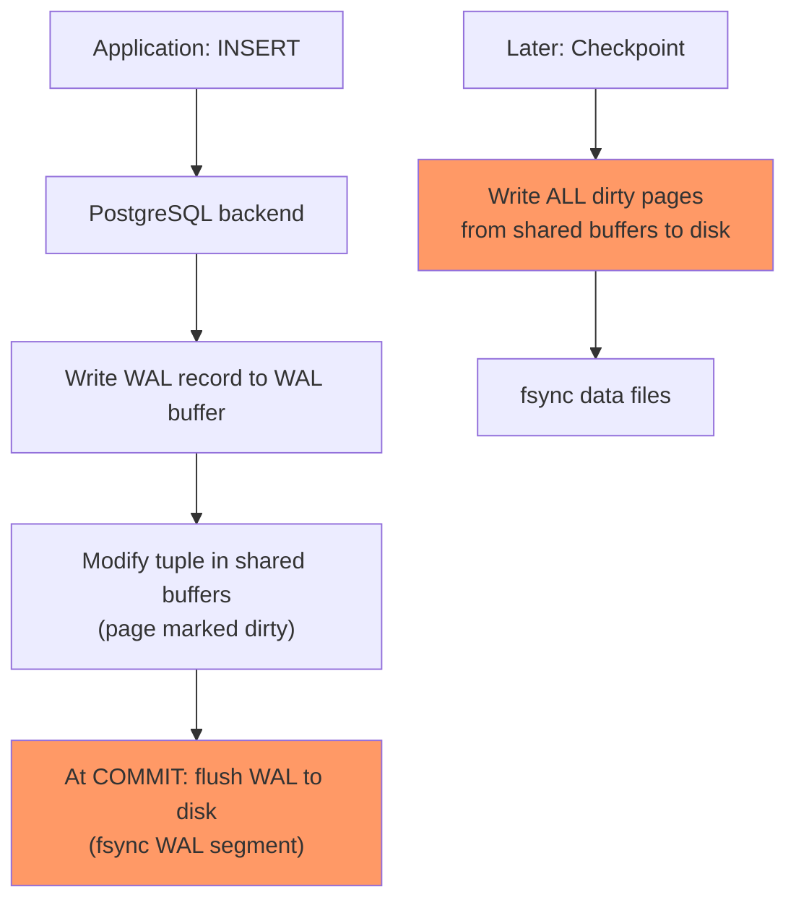
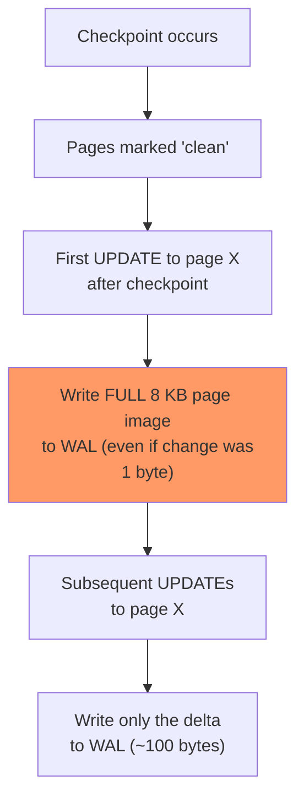
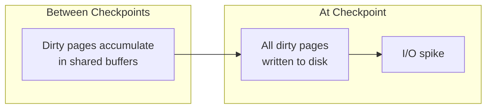

# Write Amplification and WAL

> **What mistake does this prevent?**
> Saturating your disk I/O with writes that aren't your actual data, misconfiguring checkpoints so that recovery takes hours, and not understanding why your write-heavy workload is 3x slower than expected.

The existing [Internals/11_failures_and_recovery.md](../Internals/11_failures_and_recovery.md) covers WAL for crash recovery. This file covers WAL as a **performance problem**.

---

## 1. The Write Path — What Actually Happens

When your application executes `INSERT INTO orders VALUES (...)`:



**Two different write paths:**
1. **WAL writes**: Sequential, at commit time (fast, always happens)
2. **Data file writes**: Random, at checkpoint time (expensive, batched)

---

## 2. Full-Page Writes — The Hidden Amplifier

After a checkpoint, the **first time** a page is modified, PostgreSQL writes the **entire 8 KB page** to WAL, not just the changed bytes. This is called a Full-Page Write (FPW).

**Why:** If a crash happens mid-write to a data file, the page could be partially written (torn page). The full-page image in WAL allows recovery to restore the complete page.



### The Math

If a checkpoint touches 10,000 pages, and then each page is modified:
- First modification: 10,000 × 8 KB = 80 MB of WAL just for full-page images
- Actual data written: maybe 1 MB

**80x write amplification** from full-page writes alone.

### Mitigation

```sql
-- Compress full-page images (PostgreSQL 12+)
ALTER SYSTEM SET wal_compression = 'on';  -- or 'lz4' / 'zstd' in PG 15+

-- Increase checkpoint distance (fewer checkpoints = fewer FPW bursts)
ALTER SYSTEM SET checkpoint_timeout = '15min';      -- Default: 5min
ALTER SYSTEM SET max_wal_size = '4GB';               -- Default: 1GB
```

---

## 3. Checkpoints — The I/O Storm

A checkpoint forces all dirty pages in shared buffers to disk. This can be a massive burst of random I/O.



### Checkpoint Tuning

```sql
-- Spread checkpoint I/O over time
ALTER SYSTEM SET checkpoint_completion_target = 0.9;  -- Use 90% of interval (default: 0.9)

-- How often (at minimum) to checkpoint
ALTER SYSTEM SET checkpoint_timeout = '15min';

-- WAL size that triggers checkpoint
ALTER SYSTEM SET max_wal_size = '4GB';
-- When this much WAL accumulates, checkpoint starts regardless of timeout
```

### The Tradeoff

| Setting | Smaller values | Larger values |
|---------|---------------|---------------|
| `checkpoint_timeout` | More frequent checkpoints, more FPW, smoother recovery | Less frequent, less FPW, longer recovery time |
| `max_wal_size` | Checkpoints triggered by WAL volume sooner | More WAL stored before checkpoint, longer recovery |
| `checkpoint_completion_target` | I/O concentrated in burst | I/O spread out (less spiky) |

**Recovery time depends on WAL between checkpoints.** If you checkpoint every 15 minutes instead of 5, crash recovery replays up to 15 minutes of WAL.

### Monitoring Checkpoints

```sql
-- Check checkpoint frequency
SELECT * FROM pg_stat_bgwriter;
-- Key fields:
--   checkpoints_timed    (on schedule)
--   checkpoints_req      (forced by WAL size - bad if high)
--   buffers_checkpoint    (pages written at checkpoint)
--   checkpoint_write_time (ms spent writing)
--   checkpoint_sync_time  (ms spent on fsync)
```

If `checkpoints_req` is significantly > 0, you're generating WAL faster than `max_wal_size` allows. Increase it.

---

## 4. Total Write Amplification Breakdown

For a single `INSERT` of a 100-byte row into a table with 3 indexes:

| Write | What | Size |
|-------|------|------|
| WAL: heap insert | Logical change record | ~150 bytes |
| WAL: index insert #1 | B-tree leaf modification | ~100 bytes |
| WAL: index insert #2 | B-tree leaf modification | ~100 bytes |
| WAL: index insert #3 | B-tree leaf modification | ~100 bytes |
| WAL: full-page image (heap) | First touch after checkpoint | 8,192 bytes |
| WAL: full-page image (index #1) | First touch after checkpoint | 8,192 bytes |
| WAL: full-page image (index #2) | Maybe (if different page) | 8,192 bytes |
| WAL: full-page image (index #3) | Maybe (if different page) | 8,192 bytes |
| Data files (at checkpoint) | Dirty heap page | 8,192 bytes |
| Data files (at checkpoint) | Dirty index pages | 8,192 × 3 bytes |

**Worst case:** 100 bytes of user data → ~57 KB of actual disk I/O.

**That's 570x write amplification.**

---

## 5. WAL Sizing and Archiving

### How Much WAL Is Generated

```sql
-- WAL generated in last 5 minutes
SELECT
  pg_wal_lsn_diff(pg_current_wal_lsn(), '0/0') AS total_wal_bytes,
  pg_size_pretty(pg_wal_lsn_diff(pg_current_wal_lsn(), '0/0')) AS total_wal;

-- WAL rate (reset stats first, then check after interval)
SELECT pg_stat_reset_shared('wal');
-- ... wait ...
SELECT * FROM pg_stat_wal;
```

### WAL Archiving for Point-in-Time Recovery

```sql
-- Enable WAL archiving
ALTER SYSTEM SET archive_mode = 'on';
ALTER SYSTEM SET archive_command = 'cp %p /archive/%f';
-- Requires restart

-- Or use pg_receivewal for continuous streaming
-- (runs as a separate process)
```

WAL archiving enables:
- Point-in-time recovery (PITR) to any timestamp
- Continuous backup with minimal data loss
- Replica setup from a base backup + WAL stream

---

## 6. Reducing Write Amplification

### Strategy 1: Fewer Indexes

Every index doubles the write cost for its pages. Remove unused indexes ruthlessly.

### Strategy 2: HOT Updates

Avoid indexing frequently-updated columns. Use `fillfactor` to enable HOT updates. (See [03_table_bloat_and_hot_updates.md](03_table_bloat_and_hot_updates.md))

### Strategy 3: Batch Writes

```sql
-- BAD: 1000 individual INSERTs (1000 separate WAL records)
INSERT INTO events VALUES (...);
INSERT INTO events VALUES (...);
-- ... 998 more

-- GOOD: Batch INSERT (shared WAL overhead)
INSERT INTO events VALUES
  (...),
  (...),
  -- ... 998 more
;

-- BEST: COPY (binary protocol, minimal WAL)
COPY events FROM STDIN;
```

### Strategy 4: Unlogged Tables

For data you can afford to lose on crash (caches, temp data, materialization):

```sql
CREATE UNLOGGED TABLE session_cache (
  session_id TEXT PRIMARY KEY,
  data JSONB,
  expires_at TIMESTAMPTZ
);
-- No WAL writes! But data is LOST on crash and not replicated.
```

### Strategy 5: Commit Batching

```sql
-- Allow PostgreSQL to batch commits (trades latency for throughput)
ALTER SYSTEM SET synchronous_commit = 'off';
-- Commits return before WAL is flushed to disk
-- Up to wal_writer_delay (200ms default) of commits can be lost on crash
-- Data is NEVER corrupted, just lost

-- Or per-transaction for non-critical writes:
SET LOCAL synchronous_commit = 'off';
```

---

## 7. WAL Monitoring Checklist

```sql
-- 1. Checkpoint frequency and cause
SELECT checkpoints_timed, checkpoints_req,
       checkpoint_write_time, checkpoint_sync_time
FROM pg_stat_bgwriter;

-- 2. WAL generation rate
SELECT * FROM pg_stat_wal;

-- 3. Current WAL position
SELECT pg_current_wal_lsn(), pg_walfile_name(pg_current_wal_lsn());

-- 4. Pending WAL files (should be bounded by max_wal_size)
SELECT COUNT(*) FROM pg_ls_waldir();

-- 5. Replication lag (if replicas exist)
SELECT client_addr, state,
       pg_wal_lsn_diff(sent_lsn, replay_lsn) AS replay_lag_bytes
FROM pg_stat_replication;
```

---

## 8. Thinking Traps Summary

| Trap | What breaks | Prevention |
|------|------------|------------|
| Default checkpoint settings on write-heavy systems | Constant FPW storms, I/O saturation | Increase `checkpoint_timeout` and `max_wal_size` |
| Too many indexes on write-heavy tables | 5x+ write amplification per index | Audit and remove unused indexes |
| `synchronous_commit = on` for all writes | Latency tax on non-critical writes | Per-transaction `synchronous_commit = off` where safe |
| Not monitoring `checkpoints_req` | WAL-triggered checkpoints = misconfigured | Alert if `checkpoints_req` > 10% of total |
| UNLOGGED tables for important data | Data lost on crash, not replicated | Only for truly ephemeral data |

---

## Related Files

- [Internals/11_failures_and_recovery.md](../Internals/11_failures_and_recovery.md) — WAL for crash recovery
- [Production_Postgres/03_table_bloat_and_hot_updates.md](03_table_bloat_and_hot_updates.md) — HOT updates to reduce writes
- [Internals/10_replication_and_scaling.md](../Internals/10_replication_and_scaling.md) — WAL-based replication
