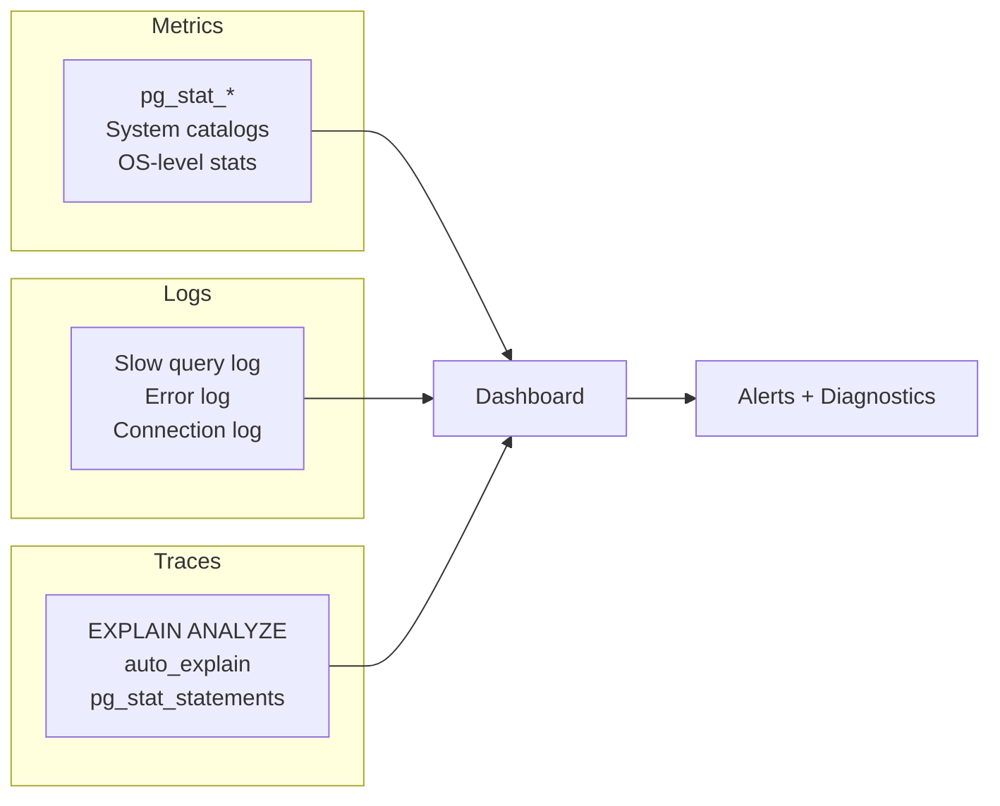
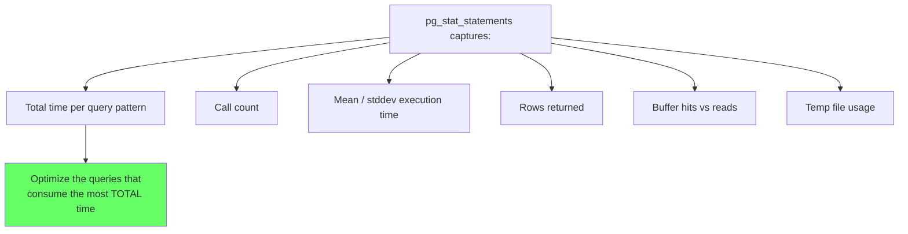
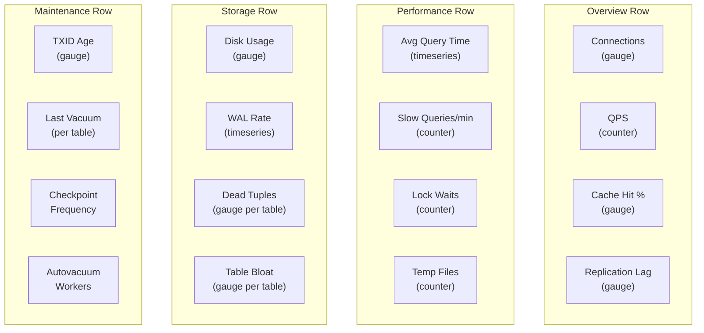
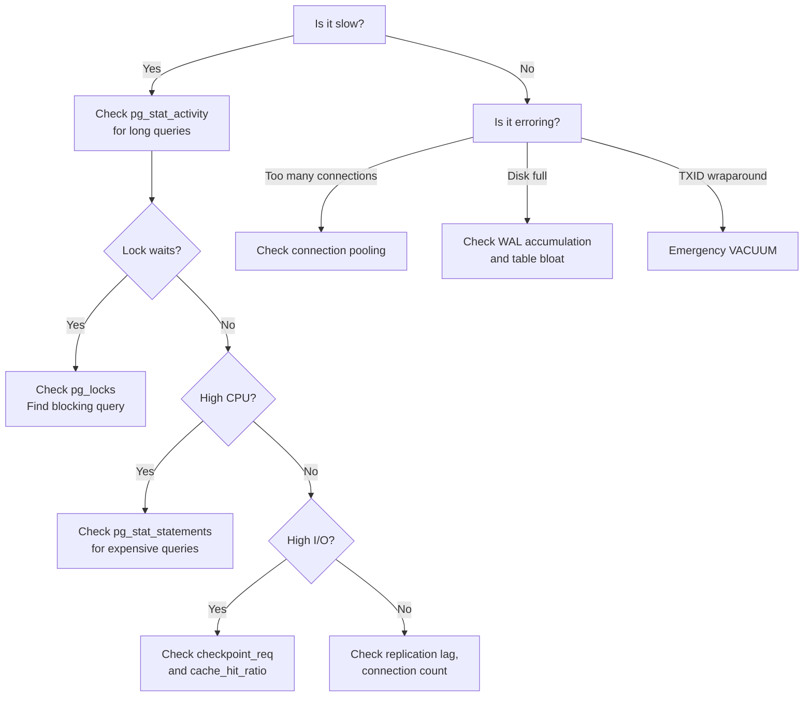

# Monitoring and Observability

> **What mistake does this prevent?**
> Flying blind in production — not knowing your database is dying until customers tell you, missing the slow degradation that leads to outages, and not having the data to diagnose problems after they happen.

---

## 1. The Three Pillars for PostgreSQL



---

## 2. The Metrics That Actually Matter

### Tier 1: Alert on These

| Metric | Source | Warning | Critical |
|--------|--------|---------|----------|
| Connection count | `pg_stat_activity` | >80% of `max_connections` | >95% |
| Replication lag (bytes) | `pg_stat_replication` | >10 MB | >100 MB |
| Transaction ID age | `age(datfrozenxid)` | >100M | >150M |
| Long-running queries | `pg_stat_activity` | >5 min | >30 min |
| Idle in transaction | `pg_stat_activity` | >5 min | >30 min |
| Disk usage | OS | >80% | >90% |
| Dead tuple ratio | `pg_stat_user_tables` | >20% | >50% |

### Tier 2: Dashboard, Don't Alert

| Metric | Source | Why |
|--------|--------|-----|
| Cache hit ratio | `pg_stat_database` | <99% means RAM is insufficient |
| Checkpoint frequency | `pg_stat_bgwriter` | Frequent forced checkpoints = WAL misconfigure |
| Temp file usage | `pg_stat_database` | Queries spilling to disk = more `work_mem` needed |
| Index usage | `pg_stat_user_indexes` | Unused indexes = pure write tax |
| Table bloat | `pgstattuple` | Growing bloat = vacuum problems |
| Commits/rollbacks | `pg_stat_database` | High rollback rate = application problems |

### Tier 3: Investigate When Something Is Wrong

| Metric | Source | Use |
|--------|--------|-----|
| Lock waits | `pg_stat_activity` + `pg_locks` | Debug contention |
| Buffer allocation | `pg_stat_bgwriter` | RAM pressure diagnosis |
| WAL generation rate | `pg_stat_wal` | Write workload sizing |
| Seq scan ratio | `pg_stat_user_tables` | Missing index detection |

---

## 3. Essential Monitoring Queries

### Connection Health

```sql
-- Connection breakdown
SELECT
  state,
  wait_event_type,
  COUNT(*) AS count,
  MAX(now() - state_change) AS max_duration
FROM pg_stat_activity
WHERE backend_type = 'client backend'
GROUP BY state, wait_event_type
ORDER BY count DESC;
```

### Cache Hit Ratio

```sql
-- Should be > 99% for OLTP workloads
SELECT
  datname,
  round(100.0 * blks_hit / NULLIF(blks_hit + blks_read, 0), 2) AS cache_hit_pct
FROM pg_stat_database
WHERE datname = current_database();
```

If below 99%, your working set exceeds `shared_buffers` + OS page cache. Either increase RAM or optimize query patterns.

### Slow Queries Right Now

```sql
-- Currently running queries over 30 seconds
SELECT
  pid,
  now() - query_start AS duration,
  state,
  wait_event_type,
  wait_event,
  LEFT(query, 100) AS query_preview
FROM pg_stat_activity
WHERE state != 'idle'
  AND query_start < now() - interval '30 seconds'
  AND backend_type = 'client backend'
ORDER BY duration DESC;
```

### Lock Contention

```sql
-- Who's blocking whom
SELECT
  blocked.pid AS blocked_pid,
  blocked.query AS blocked_query,
  blocking.pid AS blocking_pid,
  blocking.query AS blocking_query,
  now() - blocked.query_start AS blocked_duration
FROM pg_stat_activity blocked
JOIN pg_locks bl ON bl.pid = blocked.pid AND NOT bl.granted
JOIN pg_locks gl ON gl.database = bl.database
  AND gl.relation = bl.relation
  AND gl.pid != bl.pid
  AND gl.granted
JOIN pg_stat_activity blocking ON blocking.pid = gl.pid
ORDER BY blocked_duration DESC;
```

### Table Health Overview

```sql
SELECT
  schemaname || '.' || relname AS table_name,
  pg_size_pretty(pg_total_relation_size(relid)) AS total_size,
  seq_scan,
  idx_scan,
  round(100.0 * idx_scan / NULLIF(seq_scan + idx_scan, 0), 1) AS idx_scan_pct,
  n_tup_ins,
  n_tup_upd,
  n_tup_del,
  n_dead_tup,
  last_autovacuum,
  last_autoanalyze
FROM pg_stat_user_tables
ORDER BY pg_total_relation_size(relid) DESC
LIMIT 20;
```

---

## 4. pg_stat_statements — Query-Level Insights

The single most valuable extension for production PostgreSQL:

```sql
CREATE EXTENSION IF NOT EXISTS pg_stat_statements;
```

```sql
-- Top 10 queries by total time
SELECT
  LEFT(query, 80) AS query,
  calls,
  round(total_exec_time::numeric, 2) AS total_ms,
  round(mean_exec_time::numeric, 2) AS mean_ms,
  round(stddev_exec_time::numeric, 2) AS stddev_ms,
  rows,
  round(100.0 * shared_blks_hit / NULLIF(shared_blks_hit + shared_blks_read, 0), 1) AS cache_hit_pct
FROM pg_stat_statements
ORDER BY total_exec_time DESC
LIMIT 10;
```



### Finding Optimization Candidates

```sql
-- Queries with high stddev (inconsistent performance)
SELECT
  LEFT(query, 80),
  calls,
  round(mean_exec_time::numeric, 2) AS mean_ms,
  round(stddev_exec_time::numeric, 2) AS stddev_ms,
  round(stddev_exec_time / NULLIF(mean_exec_time, 0), 2) AS cv  -- coefficient of variation
FROM pg_stat_statements
WHERE calls > 100
ORDER BY stddev_exec_time DESC
LIMIT 10;
```

High coefficient of variation = query is fast sometimes, slow other times. Usually indicates plan flipping due to stale statistics.

---

## 5. auto_explain — Automatic Query Plans

Capture `EXPLAIN` output for slow queries automatically:

```sql
-- Enable auto_explain
ALTER SYSTEM SET shared_preload_libraries = 'auto_explain';  -- Requires restart
ALTER SYSTEM SET auto_explain.log_min_duration = '1s';        -- Log plans for queries > 1s
ALTER SYSTEM SET auto_explain.log_analyze = 'on';             -- Include actual times
ALTER SYSTEM SET auto_explain.log_buffers = 'on';             -- Include buffer stats
ALTER SYSTEM SET auto_explain.log_format = 'json';            -- Machine-parseable
```

Or enable per-session without restart:

```sql
LOAD 'auto_explain';
SET auto_explain.log_min_duration = '500ms';
```

---

## 6. Logging Configuration

```sql
-- Log slow queries
ALTER SYSTEM SET log_min_duration_statement = '1000';  -- Log queries > 1 second

-- Log connection events (for connection leak debugging)
ALTER SYSTEM SET log_connections = 'on';
ALTER SYSTEM SET log_disconnections = 'on';

-- Log lock waits
ALTER SYSTEM SET log_lock_waits = 'on';
ALTER SYSTEM SET deadlock_timeout = '1s';

-- Log temporary file usage (queries spilling to disk)
ALTER SYSTEM SET log_temp_files = '0';  -- Log all temp files

-- Log autovacuum (when it takes long)
ALTER SYSTEM SET log_autovacuum_min_duration = '1000';  -- Log vacuum > 1s

-- Log checkpoints
ALTER SYSTEM SET log_checkpoints = 'on';
```

---

## 7. Building a PostgreSQL Dashboard

Whether you use Grafana + Prometheus, Datadog, or custom tooling, include these panels:



---

## 8. What to Do When Something Is Wrong

### Decision Tree



---

## 9. Thinking Traps Summary

| Trap | What breaks | Prevention |
|------|------------|------------|
| No `pg_stat_statements` | Can't identify top queries | Install it day one |
| Not logging slow queries | Problems invisible until they're emergencies | `log_min_duration_statement = 1000` |
| Alerting on everything | Alert fatigue, real alerts missed | Tier your metrics, alert only on Tier 1 |
| No baseline | Don't know what "normal" looks like | Collect metrics continuously, compare to baseline |
| Monitoring only app metrics | DB problems invisible until cascading failure | DB dashboard is mandatory |

---

## Related Files

- [07_explain_analyze.md](../07_explain_analyze.md) — reading EXPLAIN output
- [Production_Postgres/04_statistics_and_analyze.md](04_statistics_and_analyze.md) — when the planner lies
- [Production_Postgres/01_connection_management.md](01_connection_management.md) — connection monitoring
