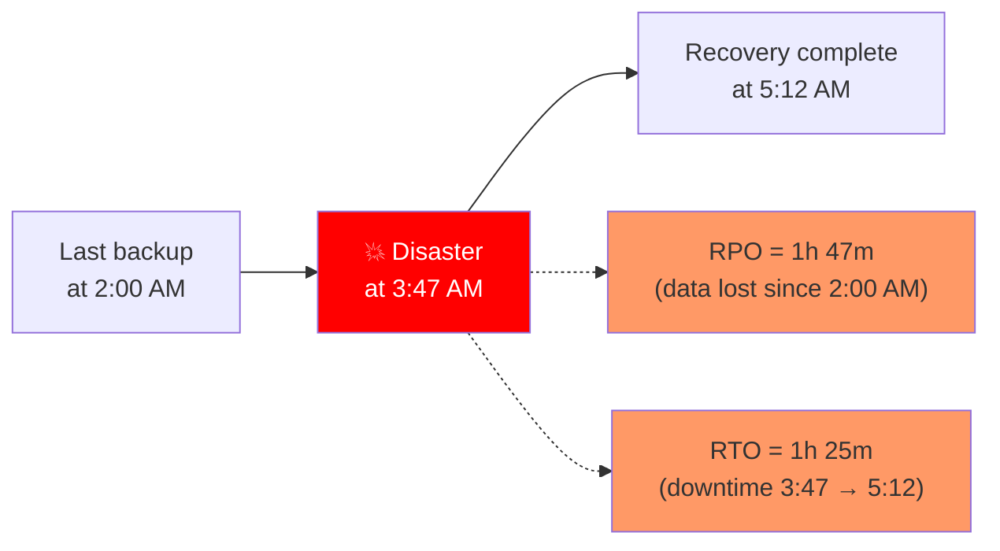
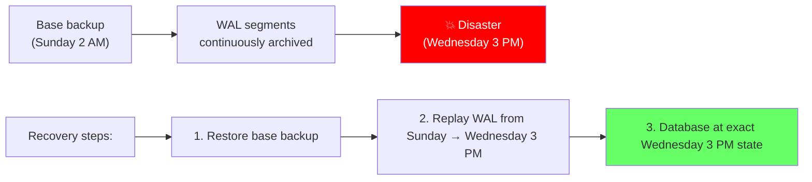
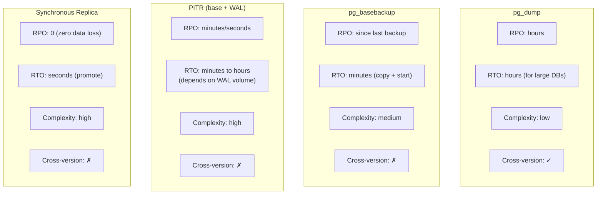

# Backup and Restore Strategies

> **What mistake does this prevent?**
> Discovering your backup doesn't work when you need to restore, not understanding RPO/RTO tradeoffs until a disaster happens, and choosing the wrong backup strategy for your workload.

---

## 1. RPO and RTO — The Two Numbers That Matter

Before choosing a backup strategy, you need two numbers from your business:

| Metric | Question | Example |
|--------|----------|---------|
| **RPO** (Recovery Point Objective) | How much data can we afford to lose? | "No more than 5 minutes of transactions" |
| **RTO** (Recovery Time Objective) | How long can we be down? | "Must be back online within 1 hour" |



| RPO Target | Required Strategy |
|------------|-------------------|
| 24 hours | Daily `pg_dump` |
| 1 hour | Hourly `pg_dump` or WAL archiving |
| 5 minutes | Continuous WAL archiving |
| 0 (zero data loss) | Synchronous replication |

---

## 2. Logical Backups — pg_dump

`pg_dump` creates a logical snapshot of the database: SQL statements or COPY data that can recreate the database.

```bash
# Plain SQL format (human-readable, slow to restore)
pg_dump -h localhost -U myuser mydb > backup.sql

# Custom format (compressed, parallel restore, recommended)
pg_dump -Fc -h localhost -U myuser mydb > backup.dump

# Directory format (parallel dump AND restore)
pg_dump -Fd -j 4 -h localhost -U myuser mydb -f backup_dir/
```

### Strengths

- Portable across PostgreSQL versions (can restore to newer version)
- Selective: dump specific tables, schemas, or data
- Human-readable (plain format)
- No special setup required

### Weaknesses

- **Slow for large databases** (serializes everything)
- Point-in-time is the moment `pg_dump` started
- Locks tables briefly at start (consistent snapshot)
- Restore time: comparable to initial data load

### Restore

```bash
# Plain SQL
psql -h localhost -U myuser mydb < backup.sql

# Custom format (supports parallel restore)
pg_restore -Fc -j 4 -h localhost -U myuser -d mydb backup.dump

# Restore single table
pg_restore -Fc -t orders -h localhost -U myuser -d mydb backup.dump
```

### When to Use pg_dump

- Databases < 100 GB
- Schema changes between backup/restore (version upgrades)
- Selective table backup
- Development environment seeding
- RPO measured in hours is acceptable

---

## 3. Physical Backups — pg_basebackup

`pg_basebackup` copies the raw data directory — an exact binary copy of the database.

```bash
# Basic backup
pg_basebackup -h localhost -U replication_user -D /backups/base -Fp -Xs -P

# Compressed
pg_basebackup -h localhost -U replication_user -D /backups/base -Ft -z -Xs -P
```

### Strengths

- **Fast**: copies files, doesn't serialize data
- Foundation for Point-in-Time Recovery (PITR)
- Foundation for setting up replicas
- Includes all databases in the cluster

### Weaknesses

- Not portable across major PostgreSQL versions
- All-or-nothing (entire cluster)
- Requires replication connection setup
- Restore requires starting PostgreSQL against the backup

### When to Use pg_basebackup

- Databases > 100 GB
- PITR requirement (combined with WAL archiving)
- Setting up replication
- RPO measured in minutes

---

## 4. Point-in-Time Recovery (PITR)

PITR combines a base backup with continuous WAL archiving to restore to **any point in time**.



### Setup

```sql
-- Enable WAL archiving
ALTER SYSTEM SET wal_level = 'replica';            -- Required
ALTER SYSTEM SET archive_mode = 'on';               -- Enable archiving
ALTER SYSTEM SET archive_command = 'cp %p /archive/%f';  -- Where to store WAL
-- Requires restart
```

### Recovery

Create `recovery.signal` (PG 12+) or `recovery.conf` (PG 11-) in the data directory:

```
# postgresql.conf for recovery
restore_command = 'cp /archive/%f %p'
recovery_target_time = '2024-03-15 14:30:00 UTC'
recovery_target_action = 'promote'  -- become primary after recovery
```

### WAL Management Tools

| Tool | What it does |
|------|-------------|
| `pgBackRest` | Industry-standard backup tool with compression, encryption, PITR, parallel |
| `barman` | Backup and Recovery Manager by 2ndQuadrant |
| `wal-g` | Archival and restoration tool, cloud-native |
| `pg_receivewal` | Continuous WAL streaming to archive |

**Use pgBackRest or barman for production.** Raw `archive_command` with `cp` is fragile.

---

## 5. Backup Strategy Comparison



### Recommended Strategy by Database Size

| Size | Strategy | RPO | RTO |
|------|----------|-----|-----|
| < 10 GB | Daily `pg_dump` + WAL archiving | Minutes | < 1 hour |
| 10-100 GB | Weekly `pg_basebackup` + WAL archiving | Minutes | 1-4 hours |
| 100 GB - 1 TB | Daily `pg_basebackup` (pgBackRest) + WAL archiving + replica | Minutes | 1-2 hours |
| > 1 TB | Incremental backups (pgBackRest) + WAL + replica | Seconds | Minutes |

---

## 6. Testing Backups — The Most Neglected Practice

**If you haven't tested your restore, you don't have a backup.**

```bash
# Monthly restore test procedure:
# 1. Restore to a test server
pg_restore -Fc -j 4 -h test-server -U admin -d test_restore latest_backup.dump

# 2. Run validation queries
psql -h test-server -d test_restore -c "SELECT COUNT(*) FROM critical_table;"

# 3. Compare row counts with production
# 4. Run application smoke tests against restored database
# 5. Measure restore time (track RTO)
# 6. Document and report
```

### What Goes Wrong

| Failure Mode | How it happens |
|-------------|----------------|
| Backup file corrupted | Disk failure, incomplete copy, no checksums |
| Missing WAL segments | Gap in archive, archive_command failed silently |
| Permissions wrong | Restored to different user, can't access objects |
| Extensions missing | `pg_dump` includes `CREATE EXTENSION` but extension not installed on target |
| Version mismatch | `pg_basebackup` from PG 14, trying to restore on PG 16 |
| Out of disk space | Backup succeeded, restore target too small |

---

## 7. Cloud-Managed Backups

| Provider | Backup Method | PITR | Retention |
|----------|---------------|------|-----------|
| AWS RDS | Automated snapshots + WAL | Yes, to the second | Up to 35 days |
| GCP Cloud SQL | Automated + on-demand | Yes | Up to 365 days |
| Azure Database | Automated | Yes, up to 35 days | Configurable |
| Supabase | Daily + PITR (Pro) | Pro plan only | 7-30 days |

**Even with managed backups, test your restore.**

Cloud providers handle the mechanics but:
- Restore creates a NEW instance (migration needed)
- Cross-region restore may be needed (configure beforehand)
- Logical export may still be needed for version upgrades

---

## 8. Thinking Traps Summary

| Trap | What breaks | Prevention |
|------|------------|------------|
| Never testing restores | Discover backup is broken during disaster | Monthly restore tests |
| `pg_dump` on 500 GB database | 8-hour backup, 12-hour restore | Use `pg_basebackup` + WAL |
| No WAL archiving | RPO = time since last backup | Enable continuous WAL archiving |
| `archive_command` with `cp` | Silent failures, gaps | Use pgBackRest or barman |
| Backup on same disk as data | Disk failure loses both | Backup to different storage / cloud |
| No monitoring of backup success | Backups silently stopped days ago | Alert on backup age |

---

## Related Files

- [Internals/11_failures_and_recovery.md](../Internals/11_failures_and_recovery.md) — crash recovery and WAL
- [Production_Postgres/05_write_amplification_and_wal.md](05_write_amplification_and_wal.md) — WAL behavior
- [Internals/10_replication_and_scaling.md](../Internals/10_replication_and_scaling.md) — replication as a backup complement
