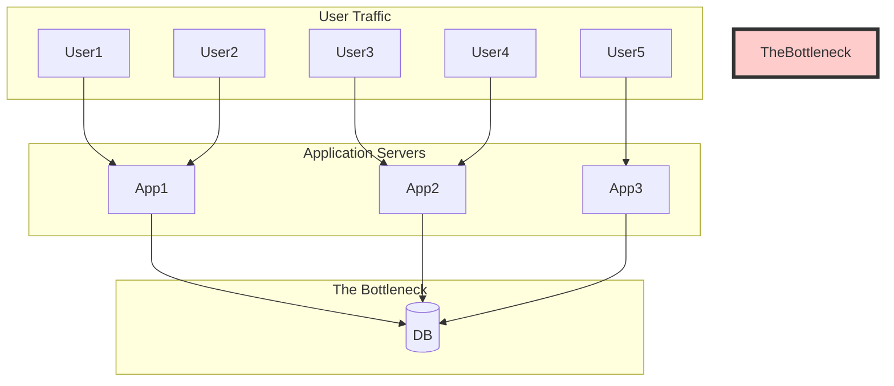

# Why Scaling Exists: The Inevitable Doom of a Single Box

Alright, let's get real. You've built your app. It's beautiful. It works on your laptop. You deploy it to a server, a single, lonely machine somewhere in a data center. For a while, life is good. Users trickle in. The database hums along, fat, dumb, and happy.

Then, success happens. And success is a brutal, unforgiving monster.

This document is about that monster and why it will always, *always* eat your single server for breakfast.

---

### 1. Intuition: The Overworked Bartender

Imagine your database is a bartender at a tiny, one-person bar.

*   **One customer?** Easy. The bartender can chat, make a fancy cocktail, and wipe the counter.
*   **Ten customers?** Okay, things get busy. No more chit-chat. Drinks get simpler. A line forms.
*   **One hundred customers?** It's chaos. The bartender is just slinging drinks, spilling half of them. Orders are wrong. People are angry. The bar is on fire.

That's your single database server under load. It's a single entity with a finite capacity to do work. Every new user, every API call, every query is another customer screaming for a drink.

**Scaling is the process of not letting your bar burn down.** It's about hiring more bartenders, building a bigger bar, or opening entirely new bars.

---

### 2. Machine-Level Explanation: The Four Horsemen of the Apocalypse

Your server isn't an abstract cloud thingy. It's a physical machine with real limits. When we say a server "falls over," we mean one of these four fundamental resources has been exhausted.

#### a. CPU (Central Processing Unit)

*   **What it does:** The brain. It executes instructions, runs calculations, sorts data, and processes query logic.
*   **Why it breaks:** Complex queries with many joins, `ORDER BY` clauses on large datasets, or poorly indexed lookups make the CPU sweat. At 100% CPU, the server is literally thinking as hard as it can. New requests have to wait in a queue, and everything grinds to a halt. The machine becomes unresponsive.
*   **Production Gotcha:** A classic "genius" move is to run analytics queries (e.g., "calculate the average order value for all users in the last year") on your main production database. This is like asking the bartender to write a novel during happy hour. The CPU gets pegged, and real users trying to log in are stuck waiting.

#### b. RAM (Random Access Memory)

*   **What it does:** The server's short-term memory. It's where the database holds data it's actively working with. Reading from RAM is thousands of times faster than reading from disk. Databases *love* RAM. They use it for caching, holding query results, and managing connections.
*   **Why it breaks:** When the working set of data (the "hot" data your users access frequently) is larger than the available RAM, the database has to constantly fetch data from the slow, slow disk. This is called "cache thrashing." The server spends all its time swapping data between RAM and disk instead of serving queries.
*   **Production Gotcha:** You have 16GB of RAM. Your main table grows to 50GB. Suddenly, performance falls off a cliff. Why? Because the database can no longer keep the indexes and frequently accessed rows in memory. Every query is a trip to the disk, and the disk is a snail on valium compared to RAM.

#### c. Disk I/O (Input/Output)

*   **What it does:** The long-term storage (HDD or SSD). This is where your data actually lives.
*   **Why it breaks:** The disk has a physical limit on how fast it can read and write data (IOPS - Input/Output Operations Per Second). Write-heavy applications (logging, analytics, event streams) can saturate the disk. When the disk queue is full, the database has to wait. And when the database waits, everyone waits.
*   **Production Gotcha:** "Write amplification." You update a single field in a row. The database doesn't just change those few bytes. It often has to write a whole new page of data to disk, update indexes, and write to a transaction log. One logical write becomes many physical writes. Congrats, you're killing your disk without even realizing it.

#### d. Network

*   **What it does:** The pipe that connects your database to the application servers and the outside world.
*   **Why it breaks:** A network card has a finite bandwidth (e.g., 1 Gbps, 10 Gbps). If you're pulling huge result sets (e.g., `SELECT * FROM huge_table`) or have a massive number of connections, you can saturate the pipe.
*   **Production Gotcha:** A developer accidentally ships code that fetches 10,000 rows for a user's dashboard every time it loads. Ten users hit the page at once. Your app servers pull gigabytes of data from the database, choking the network. The database is fine, the app server is fine, but the pipe between them is clogged. The database is now crying because no one can hear its answers.

---

### 3. Diagrams: The March to Oblivion

#### The Happy Beginning

Life is simple. One app server, one database.


#### The Inevitable Bottleneck

As traffic grows, the database becomes the single point of contention. All roads lead to the same, overworked machine.



---

### 4. Code/Query Example: The Query of Death

This looks innocent, right?

```sql
SELECT *
FROM posts
WHERE published = true
ORDER BY created_at DESC
LIMIT 10;
```

**What the machine is actually doing:**

1.  It might have to scan the *entire* `posts` table if there's no index on `published`.
2.  Even with an index, if `published = true` matches millions of rows, it has to load all of them into memory.
3.  Then, it has to sort all of those millions of rows by `created_at`. This is a massive CPU and RAM operation.
4.  Finally, after all that work, it throws away all but 10 rows.

On a small table, this is instant. On a table with 100 million posts, this query can single-handedly bring your server to its knees.

---

### 5. Production Gotchas & Common Misconceptions

*   **Misconception:** "My queries are fast now, so they'll be fast forever."
    *   **Reality:** Performance is not static. It's a function of your data volume. A query's performance degrades as the table size grows. You must design for the future, not for today.
*   **Gotcha:** **Connection Limits.** Databases can only handle a certain number of open connections. A misconfigured connection pool in your application can easily exhaust all available connections, leading to a "connection storm." The database is healthy, but it refuses to talk to anyone new. It's like the bartender putting a "closed" sign on the door because the bar is physically full.
*   **Gotcha:** **Lock Contention.** Two users try to update the same row at the same time. The first one gets a lock. The second one has to wait. Now imagine this with thousands of users. This "lock contention" can bring your write throughput to a grinding halt. The database spends more time managing who gets to talk than actually doing work.

---

### 6. Interview Note

**Question:** "We're seeing high latency on our main database. What are the first four things you would check?"

**Beginner Answer:** "I'd check the code to see if the queries are slow."

**Good Answer:** "I'd look at the database server's monitoring dashboards. Specifically, I'd check CPU utilization, RAM usage, disk I/O, and network throughput to identify the bottleneck."

**Excellent Senior Answer:** "I'd start with the four core resources: CPU, RAM, I/O, and network. But I'd also immediately check for non-resource bottlenecks like high connection counts or lock contention, which are common culprits in production systems. I'd ask if there were any recent deployments, as performance issues are often triggered by code changes. I'd also want to know the p95 and p99 latency, not just the average, to understand the worst-case user experience. Average latency hides the real pain."
