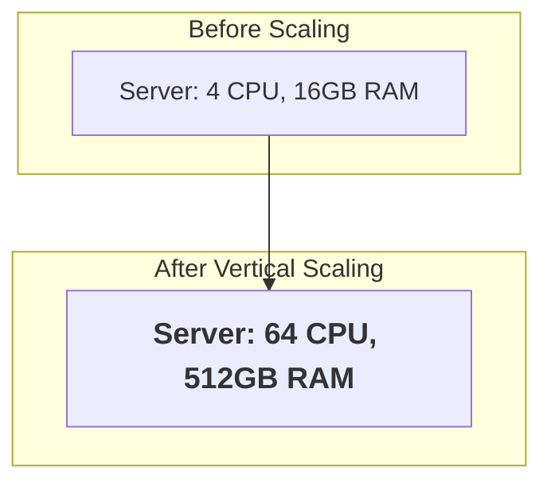
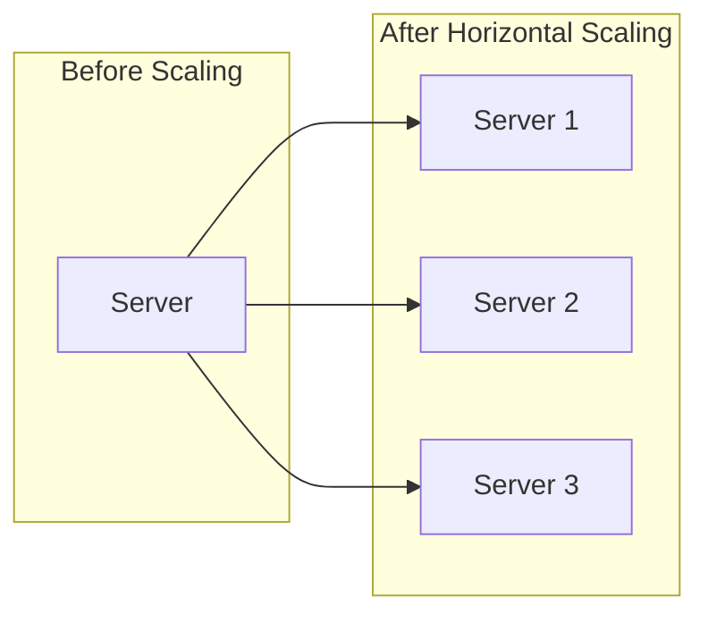

# Vertical vs. Horizontal Scaling: Bigger Box or More Boxes?

Okay, so your first server is on fire. We've established that. The bartender is overwhelmed, the CPU is melting, and users are complaining on Twitter.

You have to do *something*.

Fundamentally, you have two choices. This is one of the most critical forks in the road in system design. Your decision here will echo for years.

1.  **Vertical Scaling (Scaling Up):** Get a bigger, beefier server.
2.  **Horizontal Scaling (Scaling Out):** Get more servers.

Let's break it down.

---

### 1. Intuition: The Restaurant Analogy

*   **Vertical Scaling:** Your restaurant is too busy. You fire your one tiny stove and buy a massive, industrial-grade, eight-burner Vulcan range. It's the same kitchen, but now you have a much more powerful stove. You can cook more food, faster.

*   **Horizontal Scaling:** Your restaurant is too busy. You keep your original stove, but you lease the space next door and build a second, identical kitchen. Now you have two kitchens, each with its own stove, working in parallel.

The choice seems simple, but the implications are profound.

---

### 2. Machine-Level Explanation: The Guts of the Choice

#### Vertical Scaling (The "Bigger Box" Approach)

This is the path of least resistance. You're just making the single machine more powerful.

*   **How it works:** You throw money at the problem. You upgrade from a 4-core CPU to a 64-core CPU. You go from 16GB of RAM to 512GB of RAM. You switch from slow HDDs to face-meltingly fast NVMe SSDs.
*   **The Machine's Perspective:** The operating system and the database software (like PostgreSQL or MySQL) don't really know the difference. They just see more resources available to them. The database can now hold the entire dataset in RAM, the CPU can handle more complex sorts, and the disk can absorb more writes.
*   **The Good:** It's simple. You don't change your application code. Your connection string stays the same. Your `SELECT` queries with `JOIN`s still work perfectly. For a while, it's magical.
*   **The Bad (and this is a BIG bad):**
    1.  **You Hit a Wall:** There is a physical limit to how big a single machine can be. You can't buy a server with 500 CPUs or a petabyte of RAM. This wall is absolute.
    2.  **It Gets EXPENSIVE:** The cost of high-end hardware grows exponentially. The biggest, baddest server from a cloud provider can cost more than a luxury car, per year.
    3.  **Single Point of Failure (SPOF):** You still have one box. If that machine's power supply dies, or the data center has a network outage, or a sysadmin trips over the power cord... your entire application is down. Hard down. Vertical scaling does nothing for reliability.



#### Horizontal Scaling (The "More Boxes" Approach)

This is the heart of modern distributed systems. You're spreading the load across multiple, often commodity, machines.

*   **How it works:** Instead of one giant database server, you have two, or ten, or a thousand smaller database servers. Each one holds a piece of the data or handles a portion of the load.
*   **The Machine's Perspective:** This is where everything changes. The system is no longer one machine; it's a *fleet*. The machines need to talk to each other over the network. A query that used to be a simple function call inside one machine might now involve multiple network hops between different machines.
*   **The Good:**
    1.  **Effectively Infinite Scale:** There is no upper limit to how many servers you can add to a cluster. Google, Facebook, Netflix—they all run on hundreds of thousands of commodity servers.
    2.  **Cost-Effective:** A fleet of cheap, "dumb" servers is often far cheaper than one monolithic beast.
    3.  **Fault Tolerance:** If one server dies, the others can pick up the slack. Your application can stay online. This is the foundation of high availability.
*   **The Bad:** It's *insanely* complex. You've just traded a hardware problem for a distributed systems problem. And distributed systems problems are where things go sideways, fast. Now you have to worry about:
    *   How do I split the data? (Sharding)
    *   How do I keep the data in sync? (Replication)
    *   How do I run a query that needs data from two different machines? (Distributed Joins)
    *   What happens if the network between them is slow or breaks? (Network Partitions)
    *   Congrats, you accidentally built a distributed nightmare.



---

### 3. Code/Query Example: The Breaking Point

Let's go back to our innocent-looking join.

```sql
SELECT u.name, o.item
FROM users u
JOIN orders o ON u.id = o.user_id
WHERE u.id = 123;
```

*   **On a single, vertically scaled server:** This is trivial. The database engine finds user 123, finds their orders using the index on `user_id`, and returns the result. It's all happening in one machine's memory.

*   **On a horizontally scaled system:** This is a whole different ball game.
    *   The `users` table might live on Server A.
    *   The `orders` table might live on Server B.

Now the query becomes a distributed transaction:

1.  Your application asks the router/coordinator: "Where is user 123?"
2.  The router says: "Server A."
3.  Your app connects to Server A: `SELECT * FROM users WHERE id = 123;`
4.  Your app gets the user data.
5.  Your app then connects to Server B: `SELECT * FROM orders WHERE user_id = 123;`
6.  Your app gets the order data.
7.  Your app, in its own code, *performs the join* by combining the results from the two calls.

What used to be one database query is now a multi-step process orchestrated by your application, involving multiple network round-trips. **Joins become network calls.** And network calls are not free, sadly.

---

### 4. Production Gotchas & Common Misconceptions

*   **Misconception:** "Horizontal scaling is always better."
    *   **Reality:** Don't introduce the complexity of a distributed system until you *absolutely have to*. Squeeze every last drop of performance out of a single box first. Vertical scaling is a perfectly valid strategy, up to a point.
*   **Gotcha:** **The "Bigger Box" Trap.** Teams often vertically scale a few times, pushing the problem down the road. Their code and architecture remain dependent on the single-server model. When they finally hit the vertical scaling wall, they are forced to re-architect their entire application for horizontal scaling under extreme pressure. It's a painful, expensive process that could have been planned for.
*   **Gotcha:** **Latency vs. Throughput.**
    *   **Vertical scaling** is great for reducing the *latency* of a single complex query. The bigger box can just power through it faster.
    *   **Horizontal scaling** is great for increasing the *throughput* of many simple queries. You have more "bartenders" to handle more customers at once, even if each individual drink takes a bit longer to coordinate.

---

### 5. Interview Note

**Question:** "You're designing a new system. Do you start with a plan for vertical or horizontal scaling?"

**Beginner Answer:** "Horizontal scaling, because it's more scalable."

**Good Answer:** "I'd start with a single, powerful database instance (vertical scaling). It's simpler and avoids premature optimization. However, I would design the application to be stateless and ensure the data model has a clear 'tenant ID' or 'user ID' that could be used as a shard key in the future. This prepares us for an eventual, less painful migration to horizontal scaling when we hit the limits of the single machine."

**Excellent Senior Answer:** "The default is to start vertically but architect horizontally. This means we use a single database, but the application layer is built with the assumption that the database *could* be split later. We'd avoid things that are hard to untangle in a distributed world, like cross-cutting foreign key constraints or relying heavily on global, sequential IDs. We'd also implement a data access layer that abstracts away the database topology, so from the application's perspective, it's just talking to a 'database service'. When the time comes to scale out, we change the internals of that service, not the entire application. This buys us the simplicity of a single server today with the flexibility for a distributed system tomorrow."
