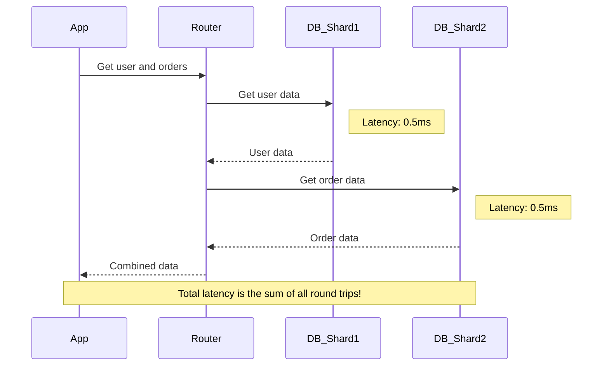
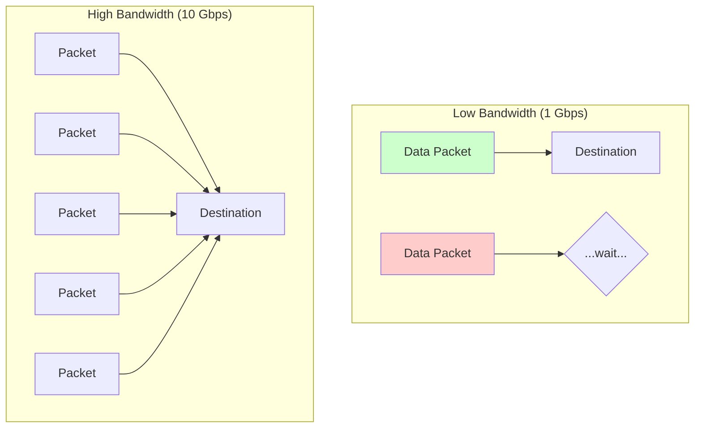

# Latency & Bandwidth: The Two Numbers That Rule Your (Distributed) World

If you want to understand scaling, you need to stop thinking about servers as magical boxes and start thinking about the pipes between them. In distributed systems, the network is not reliable, it's not instantaneous, and it will be the source of your deepest frustrations.

Two numbers govern this world: **Latency** and **Bandwidth**. They are not the same thing, and confusing them will lead you to build distributed monoliths that are slow, brittle, and a nightmare to debug.

---

### 1. Intuition: Trucks and Highways

This is the best analogy for latency and bandwidth, period.

*   **Bandwidth:** This is the **width of the highway**. How many lanes does it have? A 10-lane highway has more bandwidth than a 2-lane country road. It can carry more cars (data) at the same time.

*   **Latency:** This is the **speed limit and the distance to your destination**. It's the time it takes for a *single car* to get from Point A to Point B, assuming no traffic. This is governed by the speed of light and the number of routers, switches, and other things that have to touch your packet along the way.

**The Key Insight:** You can always add more lanes to a highway (increase bandwidth). But you cannot, under any circumstances, make a car travel faster than the speed of light. **Latency is a much harder problem to solve than bandwidth.**

---

### 2. Machine-Level Explanation: What the Wires Are Doing

Let's put some real numbers on this. These are rough, but they are critical for building a mental model.

| Action                                       | Latency (Time)                | Analogy                               |
| -------------------------------------------- | ----------------------------- | ------------------------------------- |
| L1 Cache Reference                           | ~0.5 ns                       | Grabbing a tool from your pocket      |
| L2 Cache Reference                           | ~7 ns                         | Grabbing a tool from your toolbelt    |
| **Main Memory (RAM) Reference**              | **~100 ns**                   | Walking to your toolbox in the room   |
| **Round Trip in Same Datacenter (Network)**  | **~500,000 ns (0.5 ms)**      | **Flying to another city**            |
| **Round Trip USA to Europe (Network)**       | **~150,000,000 ns (150 ms)**  | **Flying to the moon**                |
| Read 1 MB from RAM                           | ~250,000 ns (0.25 ms)         | Reading a chapter of a book         |
| Read 1 MB from SSD                           | ~1,000,000 ns (1 ms)          | Reading the whole book                |
| Read 1 MB from HDD                           | ~20,000,000 ns (20 ms)        | Researching the book in a library     |

*Source: [Latency Numbers Every Programmer Should Know](https://gist.github.com/jboner/2841832)*

**Look at that jump!** A network call *within the same building* is thousands of times slower than a RAM access. A call across the ocean is *millions* of times slower.

This is why we said in the last section: **"Joins become network calls."** You've just traded a 100-nanosecond operation for a 500,000-nanosecond operation. At a minimum.

---

### 3. Diagrams: Visualizing the Pain

#### Latency: The Unavoidable Delay

Every hop adds time. There's no way around it.



#### Bandwidth: The Size of the Pipe

Latency is the time for one packet. Bandwidth is how many packets you can send at once.


In the high bandwidth example, you can send more data *in the same time period*, but the time for the *first packet* to arrive (latency) is the same.

---

### 4. Code/Query Example: The N+1 Catastrophe

This is a classic, and it's a perfect illustration of ignoring latency.

You want to get the last 10 posts and their authors.

**The "N+1" Bad Way:**

```javascript
// 1. Get the 10 posts (1 query)
const posts = db.query("SELECT * FROM posts ORDER BY created_at DESC LIMIT 10");

// 2. Loop through the posts and get each author (10 more queries!)
const postsWithAuthors = posts.map(post => {
  // This query runs for EACH post. This is the "+N" part.
  const author = db.query(`SELECT name FROM users WHERE id = ${post.author_id}`);
  return { ...post, author_name: author.name };
});
```

**What the machine is actually doing:**

*   1 network round trip for the `posts` query.
*   10 *more* network round trips for the `users` queries.
*   **Total: 11 network calls.**

If each call has 1ms of latency, this operation takes *at least* 11ms. If the database is far away, it could be hundreds of milliseconds.

**The Good Way (Reducing Latency):**

```javascript
// 1. Get the 10 posts (1 query)
const posts = db.query("SELECT * FROM posts ORDER BY created_at DESC LIMIT 10");

// 2. Get all the author IDs from the posts
const authorIds = posts.map(p => p.author_id); // e.g., [5, 8, 12, 5, ...]

// 3. Get all the authors in a single query (1 query)
const authors = db.query(`SELECT id, name FROM users WHERE id IN (${authorIds.join(',')})`);

// 4. Join the data in your application code (0 network calls)
const postsWithAuthors = posts.map(post => {
    const author = authors.find(a => a.id === post.author_id);
    return { ...post, author_name: author.name };
});
```

**What the machine is doing now:**

*   1 network round trip for `posts`.
*   1 network round trip for `users`.
*   **Total: 2 network calls.**

You've just made the operation 5x faster by being smart about latency. You sent slightly more data over the wire in the second query (higher bandwidth usage), but you dramatically cut down the number of round trips.

---

### 5. Production Gotchas & Common Misconceptions

*   **Misconception:** "I have a 10 Gigabit connection, my network is fast."
    *   **Reality:** Your bandwidth is high, but that says nothing about your latency. A cross-country request on a 10-gigabit line is still going to take ~60ms. The highway is wide, but the country is also wide.
*   **Gotcha:** **Chatty Protocols.** Some application frameworks or ORMs are incredibly "chatty." They make many small requests to the database instead of one larger, more efficient one. This is the N+1 problem in disguise. In a distributed system, this chattiness will kill your performance.
*   **Gotcha:** **p50 vs p99 Latency.** Your *average* (p50) latency might be 2ms. But your *99th percentile* (p99) latency might be 200ms. This means 1% of your users are having a terrible time. This "long tail" latency is often caused by network hiccups, packet loss, or a brief moment of congestion. You must monitor and optimize for the tail, not just the average.

---

### 6. Interview Note

**Question:** "You need to fetch a piece of data from another service. What's more important, latency or bandwidth?"

**Beginner Answer:** "Bandwidth, so I can get the data quickly." (Wrong - confuses the two)

**Good Answer:** "Latency is almost always the first concern. The time it takes to establish the connection and get the first byte back often dominates the total time for small requests. I'd focus on minimizing the number of round trips, even if it means sending a bit more data in each request."

**Excellent Senior Answer:** "It depends on the use case. For most interactive, user-facing operations, latency is king. We need to minimize round trips via techniques like batching (like the N+1 fix) or GraphQL, which allows the client to request exactly what it needs in a single call. For background jobs, analytics, or data replication, bandwidth is more of a concern. We're moving large volumes of data where the transfer time itself is significant. But even then, a high-latency link can cripple the throughput of a high-bandwidth connection because of how protocols like TCP handle acknowledgements. So, you can never truly ignore latency."
