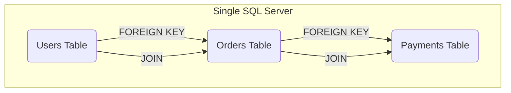

# Why SQL is "Harder" to Scale: The Relational Curse

So, we've established that horizontal scaling (adding more machines) is the path to near-infinite scale and reliability. We've also established that it's a distributed systems nightmare.

Now we get to the heart of it: why is this nightmare so much worse for a traditional SQL database like PostgreSQL or MySQL? Why do NoSQL databases like MongoDB or Cassandra seem to have an easier time with this?

The answer isn't that "SQL doesn't scale." That's a lazy, incorrect cliché. The truth is that the very features that make SQL databases so powerful and reliable on a single machine become massive liabilities in a distributed world.

---

### 1. Intuition: The Tightly-Knit Team

Imagine your single-server SQL database is a small, tightly-knit team of experts working in one room.
*   They all share the same whiteboard (memory).
*   They can talk to each other instantly (function calls).
*   They have a shared, consistent understanding of the project's state. If one person updates the plan, everyone else sees it immediately.
*   They have strict rules about how to change the plan to prevent mistakes (ACID compliance).

This is your relational database: `JOIN`s, `FOREIGN KEY` constraints, and `TRANSACTION`s are the team's communication protocols.

**Horizontal scaling is like telling this team they now have to work in different buildings across the city.**
*   The shared whiteboard is gone.
*   Instant communication is replaced by phone calls (network hops).
*   There's no guarantee that everyone has the latest version of the plan (consistency issues).
*   A simple decision that used to take seconds now requires a conference call with diplomacy and negotiation (distributed transactions).

The very thing that made them efficient—their tight integration—is now their biggest bottleneck.

---

### 2. Machine-Level Explanation: The Features That Bite Back

#### a. The `JOIN`

*   **On one machine:** A `JOIN` is a beautiful, highly-optimized operation. The database engine has sophisticated algorithms to combine data from different tables, all happening within the same memory space. It's a pointer-chasing, memory-scanning dance.
*   **Across multiple machines:** As we've seen, a `JOIN` becomes a network call. If `users` is on Shard A and `profiles` is on Shard B, a `JOIN` between them is no longer a database-internal operation. It has to be coordinated, often by the application itself, involving multiple network round trips. The database can't just "reach over" to the other machine's memory.

#### b. `FOREIGN KEY` Constraints

*   **On one machine:** This is your data integrity guardian angel. You try to insert an `order` for a `user_id` that doesn't exist? The database slaps your hand and says "NOPE." It's a simple, synchronous check.
    ```sql
    INSERT INTO orders (user_id, item) VALUES (999, 'magic beans');
    -- ERROR: FOREIGN KEY constraint failed. User 999 does not exist.
    ```
*   **Across multiple machines:** How do you enforce this? If `orders` are being written to Shard C and `users` live on Shard A, Shard C has no idea if `user_id` 999 is valid. To check, it would have to make a synchronous network call to Shard A *during the insert transaction*. This would grind your write throughput to a halt. Consequently, most large-scale sharded SQL systems **drop foreign key constraints entirely**. You trade automated data integrity for performance, and push the responsibility for maintaining that integrity up to the application layer.

#### c. `ACID` Transactions

*   **On one machine:** `ACID` (Atomicity, Consistency, Isolation, Durability) is the bedrock of relational databases. A transaction is all-or-nothing. It's a sacred pact.
    ```sql
    BEGIN;
    UPDATE accounts SET balance = balance - 100 WHERE id = 1; -- from
    UPDATE accounts SET balance = balance + 100 WHERE id = 2; -- to
    COMMIT;
    ```
    The database guarantees that either both updates happen, or neither does.
*   **Across multiple machines:** What if `account` 1 is on Shard A and `account` 2 is on Shard B? Now you need a **distributed transaction**. This is one of the hardest problems in computer science. The system needs a "coordinator" to manage the transaction across the shards. This is typically done with a protocol called **Two-Phase Commit (2PC)**, which we'll cover in detail later. It involves multiple network round trips and is slow, brittle, and a massive operational headache. Most scaled systems avoid them like the plague.

---

### 3. Diagrams

#### The Monolithic Paradise

On a single server, everything is connected and consistent. Life is easy.



#### The Distributed Nightmare

When you shard the tables, the clean lines become messy, cross-network dependencies.

```mermaid
graph TD
    subgraph "Shard A"
        users(Users Table)
    end

    subgraph "Shard B"
        orders(Orders Table)
    end

    subgraph "Shard C"
        payments(Payments Table)
    end

    users -.-> orders
    orders -.-> payments

    style users fill:#cde4ff
    style orders fill:#ccffcc
    style payments fill:#fff0c1

    note "This is now a network call"
```
The solid lines of the `FOREIGN KEY` are gone, replaced by dotted lines representing *application-level* relationships. The `JOIN` now has to happen in the application, fetching data from all three shards.

---

### 4. Production Gotchas & Common Misconceptions

*   **Misconception:** "NoSQL databases don't have joins or transactions."
    *   **Reality:** They often do, but they are implemented differently and have different guarantees. A "join" in a document database like MongoDB is often done by embedding documents (denormalization). A "transaction" might only be guaranteed at the single-document level, not across the entire database. They sacrifice relational features for horizontal scalability.
*   **Gotcha:** **The "Distributed Monolith".** This is a classic failure pattern. A team "shards" their SQL database but keeps all the `JOIN`s and cross-shard queries. They build a system that looks distributed but still behaves like a monolith, with every request causing a storm of cross-shard network traffic. The performance is often *worse* than the original single server because of the added network latency. Congrats, you've invented a slow, complicated, and expensive database.
*   **Gotcha:** **Sequence-based IDs.** Many applications use auto-incrementing integers for primary keys (`BIGSERIAL`, `AUTO_INCREMENT`). In a distributed system, this is a disaster. How do you ensure IDs are unique across all shards without creating a central "ID generating" bottleneck? This is a surprisingly tricky problem, often solved by using UUIDs or other distributed ID generation schemes (like Twitter's Snowflake).

---

### 5. Interview Note

**Question:** "Why is it harder to scale a relational database horizontally compared to a NoSQL database?"

**Beginner Answer:** "Because SQL doesn't scale." (Incorrect and a huge red flag).

**Good Answer:** "It's harder because the core features of relational databases—joins, foreign keys, and ACID transactions—are designed to work on a single machine. When you distribute the data across multiple machines, these features become extremely expensive to implement, as they require cross-network communication and complex coordination protocols. NoSQL databases often relax these constraints, for example by encouraging denormalization instead of joins, which makes them easier to partition."

**Excellent Senior Answer:** "The core challenge is the tight coupling inherent in the relational model. Features like foreign keys and multi-statement ACID transactions create a strong consistency model that assumes a single source of truth. In a distributed SQL system, maintaining this model requires protocols like two-phase commit for transactions and synchronous cross-shard lookups for referential integrity, which introduces significant latency and operational fragility. NoSQL systems, by contrast, were often designed from the ground up for horizontal scaling. They typically default to a looser consistency model, favor denormalization to avoid distributed joins, and limit transaction scope to a single item or partition. This 'shared-nothing' architectural approach allows for much easier partitioning and scaling, but it comes at the cost of shifting the burden of maintaining data integrity and consistency to the application developer."
