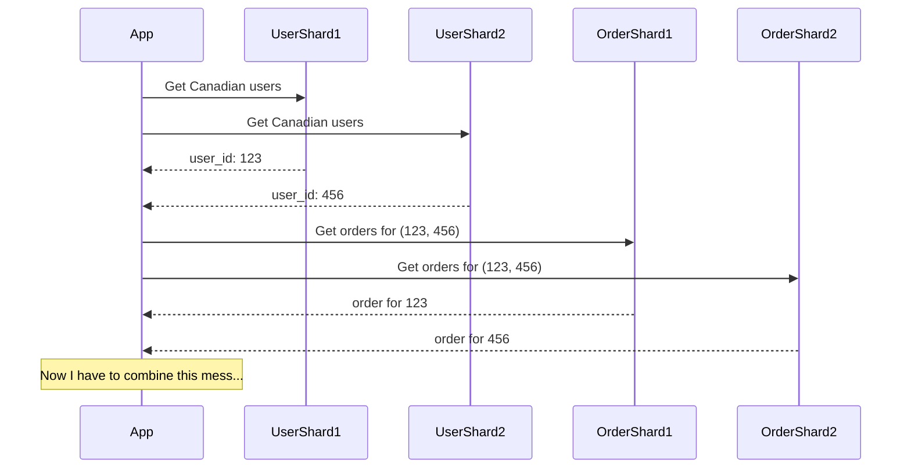
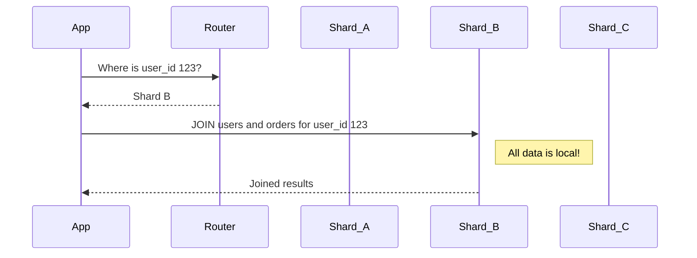

# Distributed Joins: The Network is Your New Query Planner

You can't escape it. You've sharded your database, and now you have a query that needs data from `users` (on Shard A) and `orders` (on Shard B). You need to do a `JOIN`.

In a single-server world, this was the database's job. The query planner would look at your tables, your indexes, and the `JOIN` condition, and figure out the most efficient way to combine the data.

In a distributed world, **you** are the query planner. Or, more accurately, your application is. The simple, elegant `JOIN` keyword is gone, replaced by a messy, multi-step dance across the network.

---

### 1. Intuition: The Scavenger Hunt

Imagine you're trying to assemble a full profile for a customer, including their personal info and their purchase history.

*   **Single Server:** You walk into a library, and the librarian hands you a single, perfectly organized binder with everything you need.

*   **Distributed System:** The librarian hands you a note that says, "The user info is in a filing cabinet in the basement of the building across the street. The purchase history is on a USB drive hidden in a coffee shop three blocks away."

Your simple data retrieval task has become a scavenger hunt. You have to:
1.  Go to the first location.
2.  Get the first piece of data.
3.  Use that data to figure out where to go next.
4.  Go to the second location.
5.  Get the second piece of data.
6.  Combine them yourself back at your desk.

This is a distributed join. It's a series of sequential network calls, orchestrated by your application.

---

### 2. Machine-Level Explanation: The Two Main Strategies

Let's take our classic query:

```sql
SELECT u.name, o.item
FROM users u
JOIN orders o ON u.id = o.user_id
WHERE u.country = 'Canada';
```

Assume `users` are sharded by `id` and `orders` are sharded by `order_id`. This is a common scenario and it's a painful one for this query.

#### Strategy 1: Application-Side Join (The Most Common Way)

This is the scavenger hunt we described. The application acts as the coordinator.

**The Steps:**

1.  **Query Fan-Out:** The application has to ask *every single `users` shard* for Canadian users. It can't know which shard holds which country.
    *   App -> User Shard 1: `SELECT id, name FROM users WHERE country = 'Canada';`
    *   App -> User Shard 2: `SELECT id, name FROM users WHERE country = 'Canada';`
    *   App -> User Shard N: `SELECT id, name FROM users WHERE country = 'Canada';`

2.  **Gather Results:** The app collects all the `user_id`s from all the shards. Let's say it gets back `[123, 456, 789]`.

3.  **Second Query Fan-Out:** Now, for each `user_id`, the app has to find their orders. But `orders` are sharded by `order_id`, not `user_id`! So again, the app has to ask *every single `orders` shard* for the orders belonging to these users.
    *   App -> Order Shard 1: `SELECT user_id, item FROM orders WHERE user_id IN (123, 456, 789);`
    *   App -> Order Shard 2: `SELECT user_id, item FROM orders WHERE user_id IN (123, 456, 789);`
    *   App -> Order Shard M: `SELECT user_id, item FROM orders WHERE user_id IN (123, 456, 789);`

4.  **Final Join:** The application gathers all the user data and all the order data and then, in its own memory, performs the final join to match users to their orders.

**This is a performance disaster.** You have a `N x M` query explosion, where N is the number of user shards and M is the number of order shards. The network traffic is immense. This is the "distributed monolith" we warned about.

#### Strategy 2: Co-location (The "Be Smart About It" Way)

If you know you'll frequently join `users` and `orders`, you don't shard them independently. You **co-locate** them. This means you guarantee that a user and all of their orders live on the **same shard**.

How? By using the **same shard key** for both tables. You decide to shard *everything* by `user_id`.

*   The `users` table is sharded by `id` (which is the `user_id`).
*   The `orders` table is sharded by `user_id`.

Now, let's re-run our query:

```sql
SELECT u.name, o.item
FROM users u
JOIN orders o ON u.id = o.user_id
WHERE u.id = 123; -- Let's simplify to a single user for clarity
```

**The New Steps:**

1.  **Find the Shard:** The application asks the router: "Which shard holds data for `user_id = 123`?"
2.  **Router:** "That's on Shard B."
3.  **Execute on One Shard:** The application sends the *original SQL query* directly to Shard B.
    *   App -> Shard B: `SELECT u.name, o.item FROM users u JOIN orders o ON u.id = o.user_id WHERE u.id = 123;`

Shard B has all the data it needs locally to perform the join. The join happens entirely within that one database server. What was a distributed nightmare is now a single, efficient query to the correct machine.

---

### 3. Diagrams

#### Application-Side Join: A Messy Conversation



#### Co-located Join: A Clean, Direct Query



---

### 4. Production Gotchas & Common Misconceptions

*   **Misconception:** "My database framework/ORM will handle distributed joins for me."
    *   **Reality:** It might, but it will likely do it using the inefficient application-side join strategy. An ORM has no magical way of knowing your data is co-located. It will perform the scavenger hunt, and you'll be left wondering why your pages are loading so slowly.
*   **Gotcha:** **The Co-location Tradeoff.** Co-location is powerful, but it's not free. You've now tightly coupled the `users` and `orders` tables. What if you have a query that only needs `orders` data, but it's sharded by `user_id`? You might have to do a fan-out query anyway. Choosing a shard key forces you to decide which access patterns are most important to optimize.
*   **Gotcha:** **Cross-shard joins are sometimes unavoidable.** What if you need to join `orders` (sharded by `user_id`) with `products` (sharded by `product_id`)? You can't co-locate them. In these cases, you have to fall back to application-side joins or, more commonly, **denormalization**. You might store the `product_name` directly on the `orders` table to avoid the join altogether. This is a core concept of NoSQL, but it's used heavily in sharded SQL systems too.

---

### 5. Interview Note

**Question:** "You have a sharded SQL database. How would you implement a join between two large tables that live on different shards?"

**Beginner Answer:** "I'd just write the `JOIN` query and let the database figure it out." (Shows a lack of understanding of sharding).

**Good Answer:** "The most common approach is an application-side join. I would query the first table to get the keys I need, then use those keys to query the second table, and finally perform the join in the application code. I'd be very careful about the N+1 problem and batch my queries to the second table."

**Excellent Senior Answer:** "My first question would be: 'Can we avoid the join?' The best distributed join is no join at all. I'd investigate if we can co-locate the data by sharding both tables on the same key, like `user_id`. This would allow us to send the join query directly to a single shard, which is vastly more efficient. If co-location isn't possible because our access patterns conflict, I'd consider denormalization—adding the required fields from one table to the other to eliminate the need for the join at read time. As a last resort, I'd implement an application-side join, but I'd be highly aware of the performance implications, the risk of query fan-out, and I would add extensive monitoring and circuit breakers. In some advanced systems, you might even have a dedicated scatter-gather query engine, but that's a very heavy tool for a specific problem."
