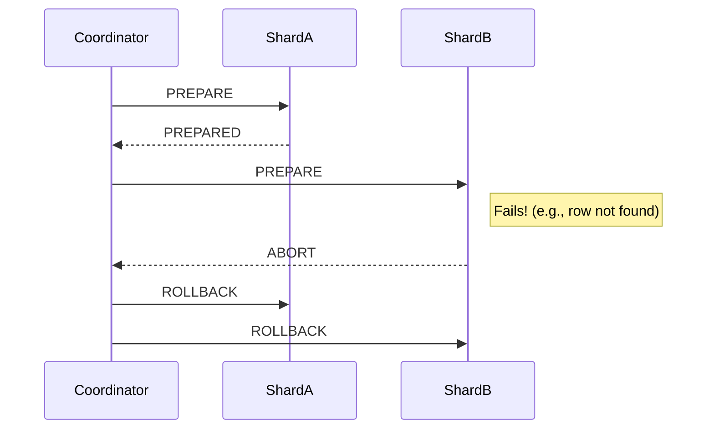

# Distributed Transactions: Diplomacy Between Machines

If a distributed join is a scavenger hunt, a distributed transaction is negotiating a peace treaty between two warring nations over a crackly satellite phone, where either nation might randomly explode at any moment.

It is, without a doubt, one of the most complex and failure-prone aspects of distributed systems. The goal is simple: you need to change data on multiple database shards, and you need it to be **atomic**. All the changes must succeed, or none of them should.

This is the "A" in ACID, and it's devilishly hard to maintain when your data lives in different buildings.

---

### 1. Intuition: The Nuclear Launch Codes

Imagine you and a colleague are in separate, locked bunkers. To launch a missile, you both have to turn your keys at the same time.

A central commander (the "coordinator") can't just yell "TURN THE KEYS!" What if one of you doesn't hear? Or your key is broken?

Instead, the commander uses a two-phase protocol:

1.  **Phase 1 (The "Prepare" Phase):** The commander calls you. "Get ready to turn your key. Put your hand on it. Confirm you are ready and that your key is working. Do NOT turn it yet, but promise me you will if I give the final order." You check your console, confirm everything is green, and reply, "I am prepared." You have now *locked in* your decision. You can't back out. You can't go on a coffee break. You must wait for the final command. The commander does the same with your colleague.

2.  **Phase 2 (The "Commit" Phase):** If the commander gets a "Prepared" confirmation from *both* of you, they issue the final command: "Commit! Turn the keys!" You both turn your keys. The launch is successful.

What if something goes wrong?

*   If you had replied "I am NOT prepared" in Phase 1 (maybe your console was offline), the commander would immediately issue an "Abort!" command to you and your colleague.
*   If the commander gets a "Prepared" from you, but your colleague's line goes dead, the commander issues an "Abort!" to you. Your colleague, having never promised anything, eventually times out and does nothing.

This is the essence of **Two-Phase Commit (2PC)**, the classic algorithm for distributed transactions.

---

### 2. Machine-Level Explanation: Two-Phase Commit (2PC)

Let's translate the analogy to a database transaction. You want to move $100 from a user's savings account to their checking account.

*   `savings` account for user 123 is on **Shard A**.
*   `checking` account for user 123 is on **Shard B**.

An **application server** acts as the **Transaction Coordinator**.

```sql
-- THE GOAL:
BEGIN;
UPDATE savings SET balance = balance - 100 WHERE user_id = 123; -- Shard A
UPDATE checking SET balance = balance + 100 WHERE user_id = 123; -- Shard B
COMMIT;
```

Here's how 2PC orchestrates this:

#### Phase 1: Prepare

1.  **Coordinator -> Shard A:** "PREPARE: I want to `UPDATE savings SET balance = balance - 100`. Can you do this? Don't do it yet, but lock the row and promise me you can."
2.  **Shard A:**
    *   Starts a local transaction.
    *   Acquires a lock on the savings row for user 123.
    *   Performs the update in its transaction log, but *does not commit it*.
    *   Replies to Coordinator: "**PREPARED**."
3.  **Coordinator -> Shard B:** "PREPARE: I want to `UPDATE checking SET balance = balance + 100`. Can you do this?"
4.  **Shard B:**
    *   Starts a local transaction.
    *   Acquires a lock on the checking row for user 123.
    *   Performs the update in its transaction log.
    *   Replies to Coordinator: "**PREPARED**."

At this point, both shards have locked the necessary resources and promised they can complete the action. They are in a "prepared" state.

#### Phase 2: Commit

5.  **Coordinator:** "Excellent, I have 'PREPARED' from all participants."
6.  **Coordinator -> Shard A:** "COMMIT."
7.  **Shard A:** Commits its local transaction, making the change permanent and releasing the lock. Replies "**DONE**."
8.  **Coordinator -> Shard B:** "COMMIT."
9.  **Shard B:** Commits its local transaction, releasing the lock. Replies "**DONE**."
10. **Coordinator:** "Success!" The distributed transaction is complete.

---

### 3. Diagrams: The Failure Modes Are The Important Part

The happy path is easy. The protocol is defined by what happens when things go wrong.

#### Failure during Phase 1

If any shard cannot prepare, the whole thing is aborted.



#### Failure during Phase 2 (The Nightmare Scenario)

This is where 2PC gets its terrible reputation.

What happens if the Coordinator gets "PREPARED" from both shards, tells Shard A to "COMMIT," and then the **Coordinator crashes** before it can tell Shard B to commit?

*   **Shard A:** Has committed the debit. The money is gone from savings.
*   **Shard B:** Is still in the "prepared" state. It has the checking row locked, waiting for a final command that will never come. It doesn't know if it should commit or abort. It is stuck in limbo.

This is the **blocking problem** of 2PC. The shards are blocked, holding locks and waiting for the coordinator to recover. While they are blocked, those rows are unavailable for any other transaction. If the coordinator is down for an hour, those rows are locked for an hour. This can cause cascading failures throughout your system.

---

### 4. Production Gotchas & Common Misconceptions

*   **Misconception:** "I need distributed transactions for my application to work."
    *   **Reality:** You would be amazed at what you can achieve without them. The vast majority of large-scale systems **do not use distributed transactions**. They are too slow and too dangerous.
*   **Gotcha:** **Performance is Terrible.** 2PC is incredibly slow. It involves multiple network round trips and holds locks for the entire duration of the coordination. Your transaction throughput will be abysmal.
*   **The Alternative: Sagas & Idempotency.** Instead of a single, atomic distributed transaction, most systems use an "eventual consistency" model.
    *   **Example: The Bank Transfer Saga**
        1.  Debit the savings account on Shard A.
        2.  Publish an event: `MoneyDebited {user_id: 123, amount: 100}`.
        3.  A separate service listens for this event and credits the checking account on Shard B.
    *   **But what if the credit fails?** The crediting service can retry. If it keeps failing, it can publish a `CreditFailed` event. Another service can then attempt to refund the original debit.
    *   This is a **Saga**. It's a series of local transactions that are coordinated via asynchronous messaging. It's not atomic, but it's far more scalable and resilient. The key is to make each step **idempotent** (you can run it multiple times with the same result) and **retriable**.

---

### 5. Interview Note

**Question:** "You need to implement a feature that requires updating records on two different database shards atomically. How would you do it?"

**Beginner Answer:** "I'd use a distributed transaction."

**Good Answer:** "A distributed transaction using a protocol like Two-Phase Commit would provide the strongest consistency guarantees. However, I'm aware that 2PC is slow and has significant failure modes, particularly the blocking problem if the coordinator fails. I would only use it if absolute, in-the-moment atomicity is a strict business requirement, like in a core banking system."

**Excellent Senior Answer:** "My first instinct is to avoid a distributed transaction at all costs. I would strongly advocate for redesigning the workflow to use a Saga pattern. We could perform the first local transaction, then publish an event to trigger the second transaction asynchronously. This gives us much better performance and fault tolerance. We'd need to build compensating actions to handle failures in the second step, for example, a process to refund the first transaction if the second one ultimately fails after several retries. This 'eventual consistency' model is how most high-throughput systems are built. If the business insists on strict atomicity, I would implement 2PC but would require a highly available, clustered transaction coordinator (not my application server) and extensive monitoring and alerting for any transactions that get stuck in the 'prepared' state. It's a huge operational burden that should be avoided if at all possible."
