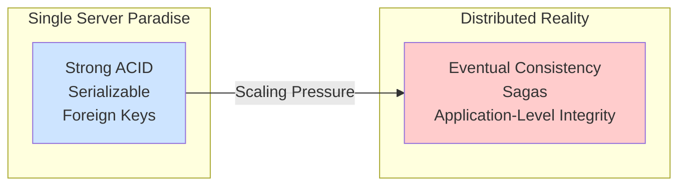

# ACID Tradeoffs: The Price of "Correctness"

ACID. It's the four-letter word that database purists tattoo on their knuckles. Atomicity, Consistency, Isolation, Durability. It's the promise that your relational database makes to you: "I will not mess up your data, no matter what."

On a single server, this promise is relatively easy to keep. But as we've seen, in a distributed world, keeping this promise is incredibly expensive. The network, the latency, the possibility of any machine dying at any time—it all conspires against ACID.

Scaling a SQL database is a story of reluctantly, carefully, and consciously giving up some of the ACID guarantees you used to take for granted. You don't abandon them, but you trade them for performance and availability.

---

### 1. Intuition: The Fast Food Kitchen vs. The Michelin Star Restaurant

*   **A Michelin Star Restaurant (Full ACID):** Every ingredient is perfect (Consistency). Every dish for a table comes out at the exact same time (Atomicity). The chefs for one order don't interfere with the chefs for another (Isolation). Once the food is served, it's served (Durability). This process is slow, meticulous, and expensive, but the result is guaranteed to be "correct."

*   **A Fast Food Kitchen (Relaxed ACID):** The goal is speed and volume.
    *   **Atomicity?** You get your burger first, and your fries come a minute later. The "order" isn't delivered as one atomic unit.
    *   **Isolation?** Multiple workers are grabbing from the same bin of fries. Sometimes they bump into each other. It's chaotic, but it's parallel.
    *   **Consistency?** Sometimes you get an extra pickle, sometimes you don't. The state isn't perfectly consistent from one burger to the next.

The fast-food kitchen can serve thousands of customers an hour. The Michelin restaurant can serve a few dozen. When you scale, you are pushing your database to behave more like the fast-food kitchen.

---

### 2. Machine-Level Explanation: Trading Guarantees for Speed

Let's break down the ACID properties and see how they suffer in a distributed environment.

#### A: Atomicity (All or Nothing)

*   **The Promise:** A transaction of multiple statements completes entirely, or not at all.
*   **The Distributed Cost:** As we saw with Two-Phase Commit, guaranteeing atomicity across shards requires a slow, blocking coordination protocol.
*   **The Tradeoff:** Most scaled systems abandon true distributed atomicity in favor of **Sagas**. A Saga is a sequence of local transactions. If a step fails, you execute compensating transactions to "undo" the previous steps. It's eventual atomicity, not immediate. You accept that for a brief period, the system might be in an inconsistent state (money debited from savings but not yet credited to checking).

#### C: Consistency (The "C" is a Lie)

*   **The Promise:** Any transaction will bring the database from one valid state to another. This is about enforcing your rules (constraints, triggers).
*   **The Distributed Cost:** Enforcing a `FOREIGN KEY` constraint requires a synchronous network call to another shard. This is a performance killer.
*   **The Tradeoff:** You **drop the foreign key constraints** at the database level. The `users` and `orders` tables no longer have a DB-enforced link. The responsibility for ensuring an order isn't created for a non-existent user moves from the database to the **application code**. You trade database-level consistency for application-level consistency. This is a huge mental shift.

#### I: Isolation (Don't Talk to Strangers)

*   **The Promise:** Concurrent transactions will not interfere with each other. The highest level, `SERIALIZABLE`, makes it seem as if transactions are running one after another, not at the same time.
*   **The Distributed Cost:** True serializable isolation across a distributed system is almost impossibly slow. It would require a global lock manager, which becomes an instant bottleneck.
*   **The Tradeoff:** You dramatically lower the isolation level. Instead of `SERIALIZABLE`, you use `READ COMMITTED` or `REPEATABLE READ`. This opens you up to subtle race conditions and anomalies (lost updates, phantom reads), but it allows for much greater concurrency. You accept a small risk of weirdness in exchange for the ability for many users to write to the system at once.

#### D: Durability (It's Saved, For Real)

*   **The Promise:** Once a transaction is committed, it will remain so, even in the event of a power loss or crash.
*   **The Distributed Cost:** This one is actually the *least* compromised, but with a twist. When your coordinator tells a shard to `COMMIT`, that shard still makes it durable on its own disk. The problem is **replication lag**.
*   **The Tradeoff:** The write is durable on the primary replica, but it might take milliseconds or even seconds to be copied to the secondary replicas. If the primary fails before the write is replicated, the "durable" write is lost. This is a major source of production incidents. So you trade absolute durability for "durable, assuming the replication pipeline doesn't break."

---

### 3. Diagrams

#### The Spectrum of Consistency

Scaling is a journey from left to right on this spectrum.



#### Isolation Levels: A Slippery Slope

Lowering isolation is like removing the dividers between assembly line workers. It's faster, but they might start interfering with each other.

```mermaid
graph TD
    Serializable["Serializable<br/>(Safest, Slowest)"]
    --> RepeatableRead["Repeatable Read"]
    --> ReadCommitted["Read Committed"]
    --> ReadUncommitted["Read Uncommitted<br/>(Fastest, Wild West)"]

    note for Serializable "No weirdness allowed"
    note for ReadUncommitted "Anything can happen!"
```

---

### 4. Production Gotchas & Common Misconceptions

*   **Misconception:** "You have to choose between SQL and NoSQL to get scalable consistency."
    *   **Reality:** The tradeoffs are inherent to distributed systems, not the database model. Many large "SQL" deployments (like at Facebook or Google) have made the same tradeoffs. They use SQL as a query language, but they've built layers on top that manage eventual consistency, sagas, and application-level integrity. They've made their SQL databases *behave* more like NoSQL databases under the hood.
*   **Gotcha:** **Application-Level Complexity.** Every guarantee you give up at the database level becomes a problem you have to solve in your application. Dropped a foreign key? Now your code needs to check if the user exists before creating an order. Using a Saga? Now you need to write and test the compensating transactions. Your application code becomes much more complex and state-aware.
*   **Gotcha:** **Business Requirements.** You can't make these tradeoffs in a vacuum. You have to talk to the business. Is it okay if a user's new profile picture takes 2 seconds to appear everywhere (a consistency tradeoff)? Is it okay if, in a rare race condition, two people book the last seat on a flight (an isolation tradeoff)? The engineers propose the tradeoffs; the business decides what level of risk is acceptable.

---

### 5. Interview Note

**Question:** "What does it mean to trade consistency for performance when scaling a database?"

**Beginner Answer:** "It means you use a NoSQL database."

**Good Answer:** "It means you relax the strict ACID guarantees of a traditional single-server relational database. For example, you might drop foreign key constraints and enforce data integrity in the application to avoid slow, cross-shard checks. Or you might replace atomic distributed transactions with eventually consistent Sagas to improve write throughput."

**Excellent Senior Answer:** "It's about making deliberate, risk-assessed engineering decisions to move from strong consistency models to weaker ones in exchange for higher availability and performance. This isn't just a SQL vs. NoSQL debate; it's fundamental to distributed data systems. We might trade atomicity for eventual consistency using Sagas, which requires building robust compensating actions. We trade database-level consistency for application-level consistency by dropping foreign keys, which increases application complexity but removes a major bottleneck. We trade isolation for concurrency by lowering transaction isolation levels from `SERIALIZABLE` to `READ COMMITTED`, accepting the risk of certain data anomalies. Each of these decisions is a tradeoff between correctness, performance, and operational complexity, and the right choice depends entirely on the specific business requirements of the feature you're building."
