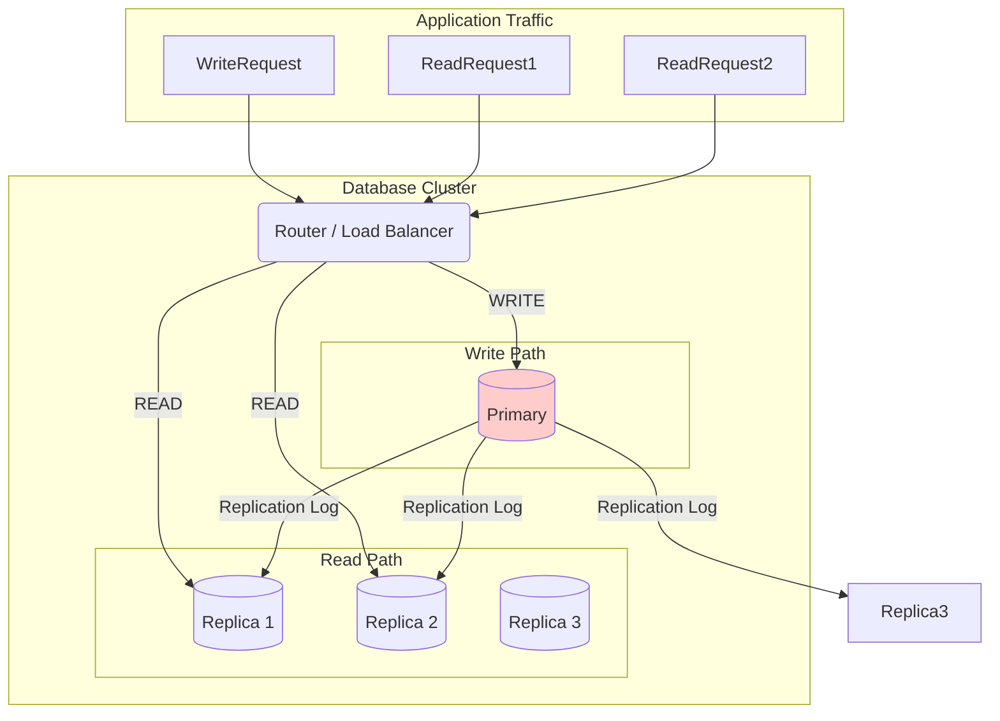
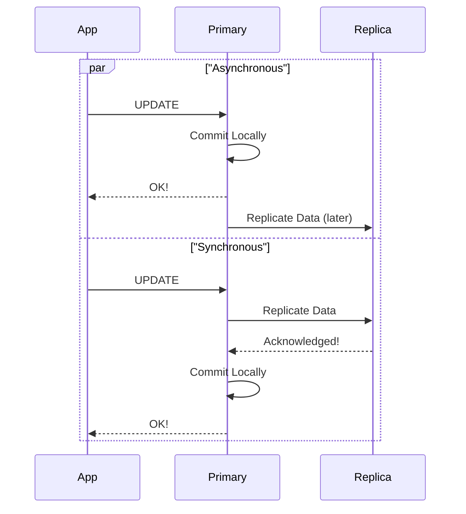

# Primary-Replica Architecture: The Art of Copying

Before you even think about the terrifying complexity of sharding (splitting your data), you'll almost certainly implement replication. It's the first and most important step in moving beyond a single, vulnerable server.

The concept is dead simple: **make copies of your data.**

The implementation, however, is where the devil hides. The most common pattern by far is **Primary-Replica Replication** (also known as Master-Slave, but the industry is moving away from this terminology).

---

### 1. Intuition: The Master Chef and the Apprentices

Imagine a master chef in a kitchen. This chef is the **only one** allowed to create new recipes or change existing ones. This is your **Primary** database. It is the single source of truth for all writes (`INSERT`, `UPDATE`, `DELETE`).

Now, this chef has several apprentices watching their every move. Each time the master chef finishes a recipe, they make perfect copies and hand them to the apprentices. The apprentices can't change the recipes, but they can show them to customers who ask. These are your **Replica** databases. They are read-only copies.

*   **A customer wants to place a new order (a `WRITE`)?** They *must* talk to the master chef (the Primary).
*   **A customer wants to see the menu (a `READ`)?** They can ask any of the apprentices (the Replicas).

This setup achieves two critical goals:
1.  **Read Scalability:** You can handle a massive number of reads by simply adding more apprentices.
2.  **High Availability:** If the master chef suddenly gets sick and collapses (the Primary server crashes), one of the apprentices can be promoted to take their place.

---

### 2. Machine-Level Explanation: The Binary Log

How does the apprentice "watch" the master chef? They read the chef's private notebook.

In database terms, this notebook is the **transaction log** (or **binary log** / **binlog** in MySQL, or **Write-Ahead Log** / **WAL** in PostgreSQL).

Here's the mechanical process:

1.  **A write comes to the Primary:**
    ```sql
    UPDATE users SET name = 'Alice' WHERE id = 123;
    ```
2.  **Primary writes to its log:** Before it even modifies the actual table data on disk, the Primary writes a record of this change to its transaction log. This log entry is like: `[Timestamp] Change row in 'users' table where id=123, set 'name' to 'Alice'`. This is a crucial step for durability (the "D" in ACID).
3.  **Primary applies the change:** It updates the table in its own storage.
4.  **Replica connects and reads:** The Replica database server has a process that is constantly connected to the Primary, asking, "Do you have any new log entries for me?"
5.  **Primary sends the log entry:** The Primary sends the new entry for the `UPDATE` statement over the network to the Replica.
6.  **Replica replays the log:** The Replica receives the log entry and "replays" it against its own copy of the data. It performs the exact same `UPDATE` on its `users` table.

Now, the Replica is in sync with the Primary (or at least, it's trying to be).

There are two main ways the Replica can read this log:

*   **Asynchronous Replication (The Most Common):** The Primary commits the write and tells the application "OK!" *before* the Replica has confirmed it received the change. This is fast, but risky. If the Primary crashes right after telling the app "OK!", the write is lost forever because it never made it to the Replica.
*   **Synchronous Replication:** The Primary waits to tell the application "OK!" until at least one Replica has confirmed it has received and saved the change. This is much safer and more durable, but it's also slower. The write latency now includes a network round trip to the Replica.

---

### 3. Diagrams

#### The Basic Architecture

A router or load balancer directs traffic. Writes go to one place, reads go to many.



#### Synchronous vs. Asynchronous Replication

The difference is all about when the `COMMIT` is acknowledged.



---

### 4. Production Gotchas & Common Misconceptions

*   **Misconception:** "Replication is the same as a backup."
    *   **Reality:** **NO. A thousand times, NO.** A replica is a *live* copy. If a developer accidentally runs `DELETE FROM users;` on the Primary, that `DELETE` will be faithfully and immediately replicated to all your replicas. Replication will not save you from application-level mistakes. You still need point-in-time backups.
*   **Gotcha:** **Read-After-Write Consistency.** This is the most common problem you'll face. A user changes their profile picture (a `WRITE` to the Primary), then immediately reloads their profile page (a `READ` from a Replica). If the change hasn't arrived at the Replica yet, the user sees their old picture. This is called **replication lag**. We'll dedicate the next entire section to this pain.
*   **Gotcha:** **How do you route the queries?** Your application can't just magically know which database to talk to. You need a system for this.
    1.  **Simple way:** Have two connection pools in your application: one for writes (pointing to the Primary) and one for reads (pointing to the Replicas). Your code has to be explicit: `db.getWriteConnection().execute(...)` vs `db.getReadConnection().query(...)`.
    2.  **Complex way:** Use a proxy or load balancer (like ProxySQL or HAProxy) that sits between your application and your databases. It inspects the queries and routes them automatically. `SELECT` queries go to replicas, `UPDATE` queries go to the primary. This is cleaner but adds another piece of infrastructure to manage.

---

### 5. Interview Note

**Question:** "You're tasked with improving the performance of a read-heavy application. What's your first step?"

**Beginner Answer:** "I'd try to optimize the queries."

**Good Answer:** "I would introduce one or more read replicas. By directing all the read traffic to these replicas, we can free up the primary server to focus solely on handling writes. This is a standard and effective pattern for scaling read throughput."

**Excellent Senior Answer:** "My first step would be to implement a primary-replica replication setup. I'd start with a single replica and configure asynchronous replication to minimize write latency on the primary. I'd then modify the application's data access layer to separate read and write traffic, directing reads to the replica's connection pool. However, this introduces the problem of replication lag. So, for specific critical flows where a user needs to see their own writes immediately—like updating their profile—I would build a mechanism to force those subsequent reads to go to the primary, bypassing the replica. For all other non-critical reads, the replica is fine. This gives us the performance benefit of read replicas while mitigating the most common user-facing consistency issue."
