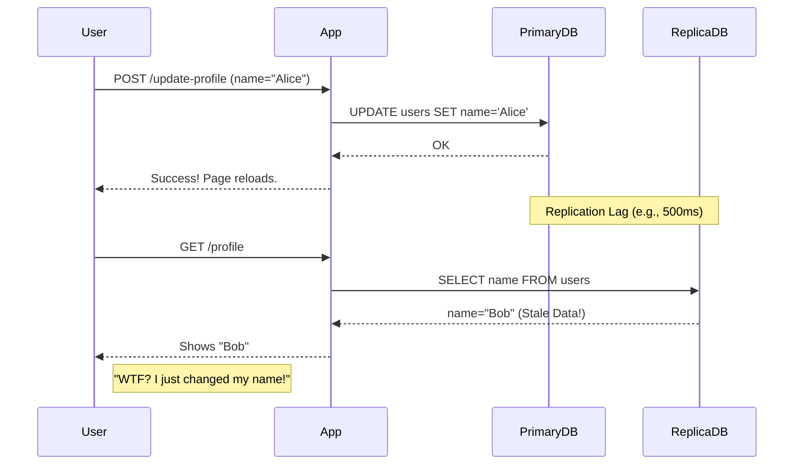
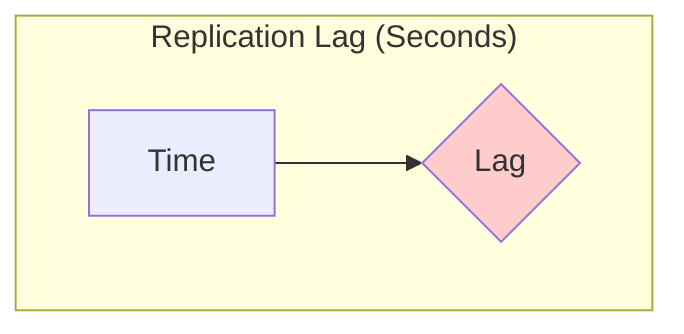

# Replication Lag & Stale Reads: The Ghost of Data Past

You've set up your primary-replica cluster. You're scaling reads. You feel like a distributed systems genius.

Then the bug reports start rolling in.

*   "I updated my username, but when I refreshed the page, it still showed my old one."
*   "I posted a comment, but it didn't show up in the thread. I posted it again, and now there are two!"
*   "I deleted an item from my cart, but it was still there when I went to checkout."

Welcome to the single most common, frustrating, and user-impacting problem in a replicated environment: **Replication Lag**.

---

### 1. Intuition: The Slow Mail Carrier

Think back to our master chef (the Primary) and the apprentices (the Replicas). The chef writes a new recipe and gives it to a mail carrier to deliver to the apprentices.

**Replication lag is the mail carrier's travel time.**

If the mail carrier is fast, the apprentices get the new recipe almost instantly. If the mail carrier gets stuck in traffic, is lazy, or has a mountain of mail to deliver, it could take seconds, minutes, or even hours for the recipe to arrive.

In that time, if a customer asks an apprentice for the recipe, they will be given the *old, stale version*. They are reading data from the past. This is a **stale read**.

---

### 2. Machine-Level Explanation: Why Does Lag Happen?

Replication is not instantaneous. It's a process with multiple steps, and any of them can become a bottleneck.

1.  **Primary Server Load:** If the Primary is overwhelmed with writes, it might fall behind on sending out the replication events from its transaction log. The mail carrier's outbox is overflowing.
2.  **Network Latency/Bandwidth:** The network is a physical pipe. If the Replica is in a different data center, or if you're replicating a huge amount of data (like a big `DELETE` or a schema change), the network can become the bottleneck. The mail truck is stuck in traffic.
3.  **Replica Server Load:** The Replica has to *apply* the writes it receives. If the Replica is busy serving a ton of expensive read queries, it might not have enough CPU or I/O capacity to keep up with the stream of writes coming from the Primary. The apprentice is too busy talking to customers to copy down the new recipes. This is a very common cause of lag. A read-only server can still be an overloaded server.

**How do you measure it?**
Most database systems expose a metric, often called `seconds_behind_master` or similar. This is the time difference between the timestamp of the last event replayed on the replica and the current time on the primary. Monitoring and alerting on this metric is **not optional**. It is a critical health signal of your database cluster.

---

### 3. Diagrams

#### The User-Facing Problem

This sequence diagram makes the problem painfully clear.

#### The Lag Monitoring View

You need a dashboard that looks like this. When the line goes up, your on-call engineer gets a page.

---

### 4. Production Gotchas & Mitigation Strategies

You can't eliminate lag, but you can and *must* manage it.

*   **Gotcha:** **Average lag is a useless metric.** Your average lag might be 50ms, but your p99 lag could be 5 seconds. That means 1% of the time, your replicas are dangerously out of date. You must monitor the peaks, not the average.

Here are the main strategies for dealing with lag:

#### Strategy 1: Read After Write Consistency (Read Your Own Writes)

This is the most important one. When a user writes something, their next read should come from the Primary.

*   **How it works:**
    1.  User POSTs a change.
    2.  Your application sends the `UPDATE` to the Primary.
    3.  For the *next few seconds*, for *that specific user*, your application code has a rule: "Any reads for this user's data must go to the Primary."
    4.  After a few seconds, you can go back to reading from the replicas for that user.
*   **Implementation:** This can be done via a session cookie, a flag in Redis, or other tricks. It adds application complexity but solves the most jarring user experience issue.

#### Strategy 2: Dedicated Replicas

Don't treat all replicas the same.
*   **"Live" Replicas:** Have one or two replicas that handle the reads for time-sensitive things, like the user-facing application. Don't run heavy analytics queries on these. Keep them as lightly loaded as possible so their lag is minimal.
*   **"Analytics" Replicas:** Have separate replicas for the data science team to run their monstrous, CPU-melting queries. It's okay if this data is a few minutes or even an hour old. This prevents them from impacting the production application's replicas.

#### Strategy 3: Lag-Based Routing

This is more advanced. Your load balancer or application can be smart enough to check the lag on all replicas.
*   If a replica's lag goes above a certain threshold (e.g., 5 seconds), the router temporarily stops sending it read traffic until it catches up. This prevents users from seeing excessively stale data.

---

### 5. Interview Note

**Question:** "You've implemented read replicas, but users are complaining that they don't see their changes after they save them. What's happening and how do you fix it?"

**Beginner Answer:** "The database is slow."

**Good Answer:** "This is a classic replication lag problem. The user's write goes to the primary, but their subsequent read is hitting a replica that hasn't received the change yet, so they see stale data. The solution is to implement a 'read-after-write' consistency model. For a short period after a user writes data, we should route that user's reads to the primary to ensure they see their own changes."

**Excellent Senior Answer:** "The root cause is replication lag, which leads to a break in read-after-write consistency. My immediate fix would be to implement read-your-own-writes. We can do this by setting a short-lived flag in a cookie or Redis upon a write, and our data access layer would check this flag to direct reads to the primary for that user. This is a tactical fix for the user experience.

Strategically, I'd investigate *why* the lag is happening. I'd check the monitoring for our replicas: are they CPU or I/O bound from serving too many reads? If so, I'd add more replicas to spread the load. Is the network saturated? I'd look at the volume of replicated data. I'd also consider creating separate replica pools: a low-lag pool for the user-facing application and a high-lag-acceptable pool for offline jobs and analytics, to prevent those workloads from impacting production traffic. Finally, I'd ensure we have robust alerting on replication lag to catch these issues proactively before users do."
