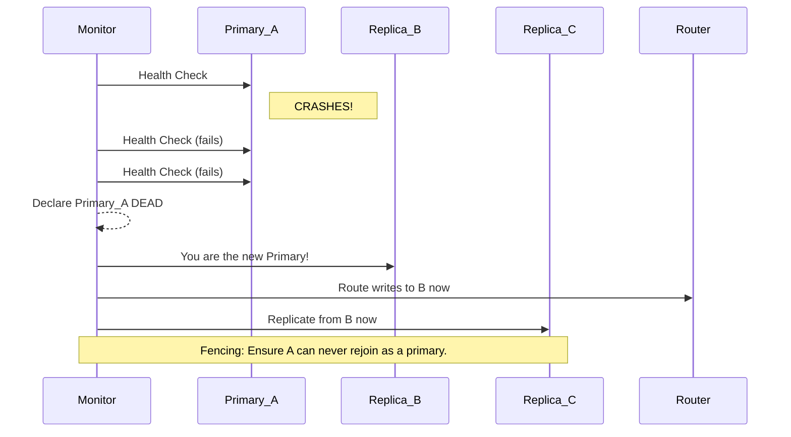

# Failover and Split-Brain: The Day Everything Breaks

Replication isn't just for scaling reads. Its other, arguably more important, job is **high availability**. When your Primary database server inevitably dies—and it *will* die—you need a way to keep your application online.

This process of promoting a replica to become the new primary is called **failover**.

It sounds simple. It is not. It is a frantic, high-stakes moment where you are seconds away from corrupting your data or having two master databases, a terrifying scenario known as **split-brain**.

---

### 1. Intuition: The Vice President Takes Over

Imagine the President (the Primary) and the Vice President (a Replica).

*   **The President suddenly has a heart attack.** They are offline. Incapacitated.
*   The Secret Service (an automated health checker) detects this.
*   A decision is made: **The VP must be sworn in as the new President.** This is **failover**.

But this process is fraught with peril:

*   **What if the President wasn't dead, just unconscious?** What if they wake up and start issuing orders again, not knowing the VP is now in charge? Now you have two Presidents giving conflicting commands. This is **split-brain**.
*   **What was the last order the President gave before collapsing?** Did the VP get the memo? If not, that last order is lost forever. This is **data loss due to replication lag**.
*   **Who decides to promote the VP?** What if the Secret Service agents disagree? You need a clear line of succession and a quorum to make the decision. This is **leader election**.

---

### 2. Machine-Level Explanation: The Unhappy Path

Let's walk through a failover event, step by painful step.

**The Setup:**
*   1 Primary (DB-A)
*   2 Replicas (DB-B, DB-C)
*   An automated monitoring system checking the health of DB-A.

**The Event:**
1.  **Primary Dies:** The power supply on DB-A fries. It goes completely offline.
2.  **Health Checks Fail:** The monitoring system tries to ping DB-A. It gets no response. It tries again. And again. After a configured timeout (e.g., 30 seconds), it declares the Primary is dead.
3.  **Leader Election:** The monitoring system now has to choose a new Primary. How does it choose?
    *   It should choose the replica with the **least replication lag**. DB-B is 10ms behind. DB-C is 5 seconds behind. DB-B is the clear winner. Promoting DB-C would mean losing 5 seconds of committed data.
    *   This process often involves a consensus algorithm like Raft or Paxos, or a coordination service like ZooKeeper or etcd, to ensure all parts of the system agree on the new leader.
4.  **The Promotion:** The system executes a command on DB-B: `PROMOTE`. This tells DB-B to stop being a read-only replica and become the new read-write Primary.
5.  **Re-Configuration:** This is the critical part.
    *   The router/load balancer must be updated to send all write traffic to DB-B now.
    *   The *other* replica, DB-C, must be told to stop replicating from the dead DB-A and start replicating from the new Primary, DB-B.
    *   The old Primary, DB-A, must be prevented from ever coming back online as a Primary. This is called **fencing** or **STONITH** (Shoot The Other Node In The Head). You have to kill it to prevent split-brain.

This entire process, if automated, might take 30-60 seconds. During that time, your application cannot perform any writes.

---

### 3. Diagrams

#### The Failover Process



#### The Split-Brain Nightmare

This is what happens if you don't have proper fencing. The old primary comes back online and doesn't know it's been deposed.

```mermaid
graph TD
    subgraph "Users"
        User1
        User2
    end

    subgraph "Two Primaries - Oh No"
        A[(Old Primary A)]
        B[(New Primary B)]
    end

    User1 --> A
    User2 --> B

    note for A "Accepting writes"
    note for B "Also accepting writes"

    style A fill:#ffcccc,stroke:#333,stroke-width:4px
    style B fill:#ffcccc,stroke:#333,stroke-width:4px

    subgraph "Result"
        C{Inconsistent Data!}
        D{Data Corruption!}
    end

    A --> C
    B --> D
```
At this point, your two databases have diverged. Their data is different. You have no single source of truth. Manually merging the data back together is a soul-crushing, error-prone, and sometimes impossible task.

---

### 4. Production Gotchas & Common Misconceptions

*   **Misconception:** "Failover is automatic, I don't need to worry about it."
    *   **Reality:** Automated failover is one of the most complex pieces of infrastructure to get right. It requires careful configuration, constant testing, and robust monitoring. Many teams opt for **manual failover**, where a human engineer is paged, assesses the situation, and manually runs the promotion scripts. It's slower, but less likely to go catastrophically wrong due to a bug in the automation.
*   **Gotcha:** **The Lag vs. Availability Tradeoff.** You have a choice when the primary dies:
    1.  **Prioritize Availability:** Promote the most available replica immediately, even if it has some lag. You accept some data loss to get the system back online for writes quickly.
    2.  **Prioritize Consistency:** Wait. Try to recover any last-minute writes from the dying primary. Refuse to promote a replica that is significantly behind. You accept a longer downtime to prevent any data loss.
    This is a business decision, not just a technical one. For a bank, consistency is key. For a social media site, availability might be more important.
*   **Gotcha:** **Fencing is Non-Negotiable.** You *must* have a mechanism to ensure the old primary cannot come back and accept writes. This can be done at the network level (blocking its IP), the power level (via a remote power switch), or at the database level (configuration that prevents it from starting in read-write mode). If you don't have fencing, you don't have high availability; you have a ticking time bomb.

---

### 5. Interview Note

**Question:** "Describe the process of a database failover and name the biggest risk associated with it."

**Beginner Answer:** "If the primary fails, a replica takes over."

**Good Answer:** "When a primary fails, a monitoring system detects the failure and initiates a failover. It chooses the best replica—ideally the one with the least replication lag—and promotes it to be the new primary. The application traffic is then rerouted to the new primary. The biggest risk is data loss if the chosen replica was lagging behind the old primary."

**Excellent Senior Answer:** "A failover is a complex orchestration. First, you need reliable failure detection, which is harder than it sounds. Once the primary is declared dead, a leader election process, often using a consensus tool like etcd, selects a new primary based on a combination of health, replication lag, and pre-configured priorities. This promotion is the easy part. The hard parts are the two 'R's: rerouting and reconfiguration. All write traffic must be rerouted to the new primary, and all other replicas must be reconfigured to follow the new primary.

The single biggest risk during this process is **split-brain**. This occurs if the old primary comes back online, unaware it has been replaced, and starts accepting writes. To prevent this, you must have a robust **fencing** mechanism to permanently isolate the old primary. Without fencing, your failover system is a liability, not an asset, as it creates a high risk of data divergence and corruption."
