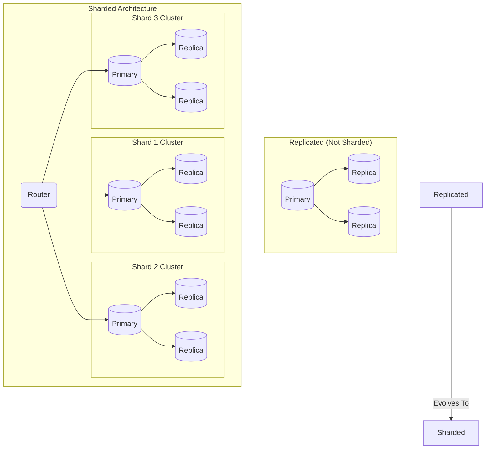
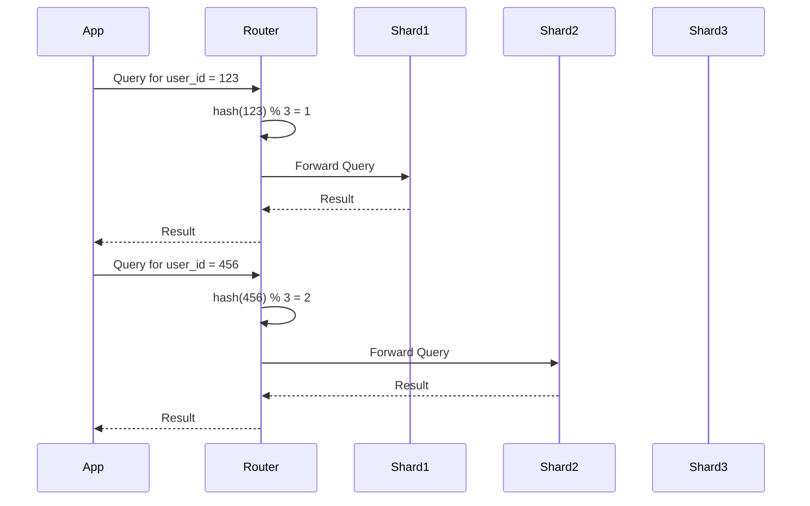

# Sharding Basics: Slicing Up the Monolith

You've scaled reads with replicas. You've made your system highly available with failover. But you still have a problem.

All of your writes are still going to a single primary server. You've scaled reads, but you haven't scaled *writes*.

The primary server's CPU is melting. Its disk is screaming. It can't handle the firehose of `INSERT`s and `UPDATE`s from your growing user base. Vertical scaling has reached its limit. You can't buy a bigger box.

This is the moment of truth. This is when you must turn to **sharding**.

Sharding, at its core, is **horizontal partitioning**. Instead of making the database bigger, you're breaking it into smaller, more manageable pieces, and spreading those pieces across many different servers.

---

### 1. Intuition: The Giant Dictionary

Imagine your database is a single, impossibly large dictionary. It's so big, one person can't lift it.

*   **Replication:** You make photocopies of the entire dictionary. Now many people can read it at once, but you still only have one master copy to update.

*   **Sharding:** You tear the dictionary into pieces.
    *   Volume 1 (A-G) goes to Server 1.
    *   Volume 2 (H-P) goes to Server 2.
    *   Volume 3 (Q-Z) goes to Server 3.

Now, if you want to look up the word "Apple," you know to go directly to Server 1. If you want to look up "Zebra," you go to Server 3. If you want to add a new word, you add it to the correct volume.

You've just partitioned your data. Each server (or "shard") is now responsible for only a subset of the data. You can now handle more writes and store more data than any single machine ever could.

---

### 2. Machine-Level Explanation: The Shard Key and the Router

This isn't magic. The system needs two key components to make this work:

1.  **The Shard Key:** This is the piece of data that decides which shard the rest of the data lives on. It's the "A" or "H" or "Q" in our dictionary analogy. In a real application, this is almost always something like `user_id`, `tenant_id`, or `item_id`. The choice of a shard key is the single most important decision you will make when sharding. A bad choice will lead to disaster.

2.  **The Router (or "Scatter-Gather" Layer):** Your application can no longer just connect to "the database." It needs to connect to a smart router. The application says, "I have a query for `user_id` 123." The router's job is to look at the shard key (`123`) and figure out which shard holds that user's data.

Here's the flow for a write:

1.  **Application:** "I want to `UPDATE users SET name='Charlie' WHERE id=456;`"
2.  **Router:**
    *   Extracts the shard key from the query. In this case, the key is `id`, and the value is `456`.
    *   It has a mapping function (a "partitioning function"). This could be as simple as `shard = hash(key) % num_shards`.
    *   Let's say `hash(456) % 3 = 2`. The router determines this data belongs on Shard 2.
3.  **Routing:** The router sends the `UPDATE` query directly and only to Shard 2.

Shard 1 and Shard 3 are completely undisturbed. They don't see the query, they don't do any work. You've successfully isolated the write to a small portion of your infrastructure.

---

### 3. Diagrams

#### From Replicated to Sharded

The architecture evolves. Each shard is now its own primary-replica cluster.

#### The Router's Job

The router is the traffic cop for your sharded database.

---

### 4. Production Gotchas & Common Misconceptions

*   **Misconception:** "Sharding is just for big data."
    *   **Reality:** Sharding is for **high throughput**, not just large data volumes. You might only have 500GB of data, but if you're getting 50,000 writes per second, a single primary can't handle that. Sharding allows you to parallelize those writes across many machines.
*   **Gotcha:** **Cross-Shard Joins.** We've covered this, but it bears repeating. Once you shard, `JOIN`s across shards become incredibly painful. This is why data modeling and choosing a shard key are so critical. You want to co-locate data that is accessed together.
*   **Gotcha:** **Operational Complexity.** You thought managing one primary-replica cluster was hard? Now you have dozens. You need automated provisioning, configuration management, monitoring, and backup for every single shard. Your operational overhead just grew by an order of magnitude.
*   **Gotcha:** **Not all data is easy to shard.** User data is a great candidate because it's naturally partitioned by `user_id`. But what about a table that maps usernames to user IDs? Every user needs to access it to log in. If you shard it, how do you find the right shard without knowing the user ID? This often leads to having some tables that are sharded and some that are "global" or replicated to all shards.

---

### 5. Interview Note

**Question:** "When would you decide to shard a database, and what are the main components you would need to build?"

**Beginner Answer:** "When the database gets too big."

**Good Answer:** "I'd decide to shard when we hit a write throughput bottleneck on the primary, or when the dataset becomes too large to be managed effectively on a single server. Sharding is primarily a solution for scaling writes. The main components are the shards themselves—which are typically their own primary-replica clusters—and a routing layer that sits in front of them. The router is responsible for inspecting incoming queries, extracting a shard key, and directing the query to the correct shard."

**Excellent Senior Answer:** "Sharding is the answer when vertical scaling of the write primary is no longer feasible or cost-effective. The decision should be driven by metrics showing sustained high CPU or I/O on the primary that can't be solved by query optimization. To implement it, you need more than just the shards and a router. You need a **partitioning strategy** defined by the **shard key**. This choice is critical and dictates your data co-location and future query patterns. You also need a robust **routing mesh** or proxy layer, which becomes a new critical, highly-available component. Furthermore, you need a plan for **rebalancing**—what happens when you need to add more shards? You can't just change the number of shards in your hash function without having to move all your data. This leads to needing a strategy like consistent hashing. Finally, the operational tooling for monitoring, backups, and schema migrations in a sharded environment is non-trivial and must be built out alongside the sharding implementation itself."
