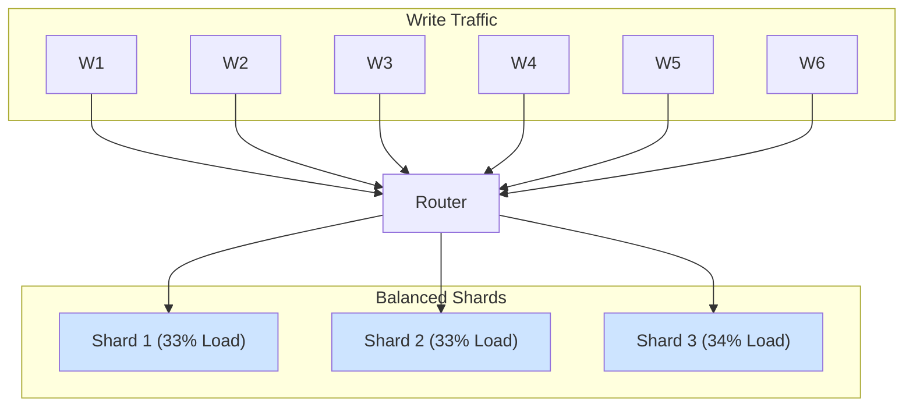
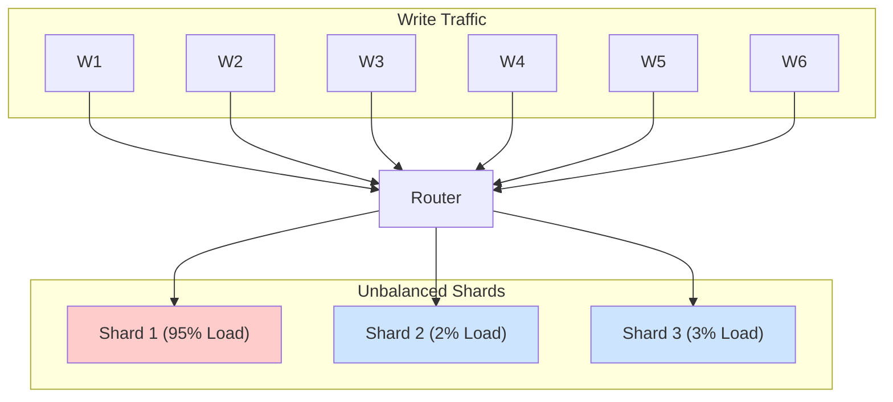

# Shard Keys & Hot Partitions: How to Ruin Your Life with One Bad Decision

You've decided to shard. You've accepted the operational complexity. You're ready to slice up your data.

Now you must make a choice. A single choice that will determine whether your new, beautifully complex distributed database is a screaming success or a smoldering crater.

You must choose the **shard key**.

The shard key is the column in your data that the router uses to decide which shard a piece of data belongs to. Get it right, and your load will be beautifully distributed. Get it wrong, and you'll have just created a distributed monolith with a single, massive bottleneck. This is called a **hot partition** or a **hotspot**.

---

### 1. Intuition: The Incompetent Bouncer

Imagine you're opening a massive new nightclub with 10 different rooms (shards). You hire 10 bouncers (routers) and give them a rule for distributing the crowd.

*   **A Good Sharding Strategy:** "If your last name starts with A-C, go to Room 1. D-F, Room 2, and so on." The crowd spreads out evenly. Every room is lively but not overwhelmed.

*   **A Bad Sharding Strategy:** "If your name is John, go to Room 1. Everyone else, split yourselves among the other 9 rooms."

What happens? Room 1 is immediately overwhelmed. There's a massive line out the door. People are angry. The fire marshal is on his way. Meanwhile, Rooms 2 through 10 are empty and silent.

You've failed to distribute the load. You've created a **hotspot**. The bouncer's bad rule (the shard key) is the cause.

---

### 2. Machine-Level Explanation: Good Keys vs. Bad Keys

A good shard key has two essential properties:

1.  **High Cardinality:** It has many, many possible values. `user_id` is a great example. You have millions of users. `gender` is a terrible example. You might have a handful of values.
2.  **Even Distribution:** The writes are spread evenly across the range of keys. The workload isn't all clustered around a few key values.

Let's look at some common choices and why they succeed or fail.

#### The Good: `user_id` or `tenant_id`

*   **Why it works:** In most applications (social networks, SaaS products, e-commerce), a user's activity is largely self-contained. By sharding on `user_id`, you co-locate all of a single user's data on one shard. This makes queries for that user's profile, orders, or posts extremely efficient. Since you have millions of users, the `hash(user_id) % num_shards` function distributes the load beautifully.
*   **This is the gold standard for most user-facing applications.**

#### The Bad: `timestamp`

*   **The Scenario:** You're building a logging system or an application with a real-time feed. You think, "I'll shard by the event timestamp!"
*   **The Horror Story:** What happens? *All new writes are happening "now."* Every single `INSERT` has a timestamp within a few milliseconds of the current time. If you're using range-based sharding (e.g., all timestamps from this hour go to Shard 8), then **100% of your write traffic is hammering a single shard**.
*   **The Result:** The "latest" shard is on fire. Its CPU is at 100%, its disk is saturated. The other, "older" shards are sitting idle, holding historical data and doing nothing. You've created the nightclub-for-Johns scenario. The database is now crying.

#### The Ugly: The "Celebrity" Problem (a.k.a. The Hot Tenant)

This is a more subtle but equally deadly problem. You've chosen a good shard key: `user_id`. Your load is generally well-distributed.

Then, Taylor Swift signs up for your app.

*   Taylor Swift's `user_id` (let's say it's `555`) maps to Shard 7.
*   She posts a photo. Millions of her followers rush to view it and comment on it.
*   Suddenly, Shard 7 is hit with a tsunami of read and write traffic. It's handling 90% of the load of the entire cluster.
*   The other shards are fine, but Shard 7 falls over. For everyone else whose `user_id` happens to map to Shard 7, the application is down. They are unlucky neighbors of a celebrity.

This is the **hot tenant** or **celebrity problem**. A single, highly active entity on an otherwise well-chosen shard key can still create a massive hotspot.

---

### 3. Diagrams

#### The Ideal Distribution

A good shard key leads to a balanced system.

#### The Hot Partition Nightmare

A bad shard key or a "celebrity" creates a massive imbalance.

---

### 4. Production Gotchas & Mitigation

*   **Gotcha:** **You can't easily change a shard key.** Once your data is distributed based on a key, changing that key means re-shuffling *all of your data*. This is a massive, complex, and risky migration. Choose your shard key as if it's a permanent decision.
*   **Mitigating Hot Tenants:** How do you handle Taylor Swift? This is a very hard problem.
    1.  **Detection:** First, you need monitoring to even know you have a hot tenant. You need to track load *per shard* and *per tenant*.
    2.  **Isolation:** One strategy is to manually move the hot tenant to their own dedicated shard. Shard 7 becomes the "Taylor Swift Shard." This is operationally complex but isolates the blast radius.
    3.  **Application-Level Caching:** For read hotspots, you can aggressively cache the celebrity's data at the application layer or in a system like Redis, preventing most reads from ever hitting the database shard.

---

### 5. Interview Note

**Question:** "What are the characteristics of a good shard key? Give an example of a good one and a bad one."

**Beginner Answer:** "It should be unique."

**Good Answer:** "A good shard key should have high cardinality and lead to an even distribution of the workload. `user_id` is a great example for a user-centric application because there are many users and their activity is generally spread out. A bad example would be something with low cardinality like `country_code`, because a few large countries would create massive hotspots, while smaller countries would sit on nearly empty shards."

**Excellent Senior Answer:** "A good shard key has high cardinality and distributes write load evenly, minimizing the risk of hot partitions. The canonical example is `tenant_id` or `user_id` for a SaaS application, as it naturally co-locates a user's data. A poor choice would be a sequential key or a timestamp, as this would cause all writes to land on a single shard, creating a severe hotspot.

However, even a good key like `user_id` is vulnerable to the 'celebrity problem,' where one highly active user can overload their assigned shard. A truly robust sharding strategy must account for this. This involves not just choosing a good initial key, but also having a plan for detecting and mitigating these hotspots. This could involve building the capability to dynamically split a hot shard or to isolate a hot tenant onto their own dedicated hardware. The choice of a shard key isn't just a one-time decision; it's about designing a system that can adapt to uneven load distribution."
