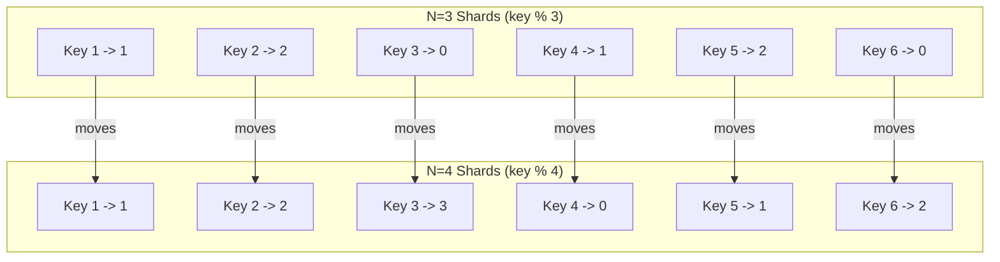

# Consistent Hashing & Rebalancing: Moving Day for Your Data

So you've sharded your database. You have 10 shards, and you're using a simple `hash(key) % 10` formula to route data. Everything is balanced and beautiful.

Then, success strikes again. Your 10 shards are starting to get full. You need to add more capacity. You need to go from 10 shards to 12.

You change your formula to `hash(key) % 12`.

And in that moment, you bring your entire system to its knees. You have just triggered a **catastrophic, full-system rebalance**.

---

### 1. Intuition: The Inflexible Librarian

Imagine your library has 10 shelves (shards). The librarian's rule is "take the book's ID number and the last digit tells you which shelf it's on."
*   Book #101 -> Shelf 1
*   Book #232 -> Shelf 2
*   Book #879 -> Shelf 9

This works perfectly. Now, the library buys two new shelves. It now has 12. The head librarian declares a new rule: "To find the shelf, take the book's ID number and calculate `ID % 12`."

What happens?
*   Book #101 -> `101 % 12 = 5`. It needs to move from Shelf 1 to Shelf 5.
*   Book #232 -> `232 % 12 = 4`. It needs to move from Shelf 2 to Shelf 4.
*   Book #879 -> `879 % 12 = 3`. It needs to move from Shelf 9 to Shelf 3.

Almost *every single book in the library* now needs to be moved to a new shelf. This is a "moving day" from hell. While you're reshuffling everything, no one can find any books. The library is effectively closed.

This is what happens when you use a simple modulo hash for sharding. A change in the number of shards causes a massive, chaotic reshuffling of nearly all your data.

---

### 2. Machine-Level Explanation: The Modulo Problem and The Consistent Hashing Solution

The problem with `hash(key) % N` is that the result depends entirely on `N` (the number of shards). When `N` changes, the result changes for almost every key.

**Consistent Hashing** is the clever, elegant solution to this problem. It's a way of distributing data such that when you add or remove a shard, only a small fraction of the data needs to move.

Here's how it works at a high level:

1.  **The Ring:** Imagine a ring or a circle representing all possible hash values (e.g., 0 to 2^32 - 1).

2.  **Placing Shards on the Ring:** You take each of your shards (Shard A, Shard B, Shard C) and hash their names or IP addresses. You use this hash value to place them at a point on the ring.

3.  **Placing Data on the Ring:** Now, when a new piece of data comes in (e.g., for `user_id=123`), you hash its key (`hash(123)`). This also gives you a point on the ring.

4.  **The Rule:** To find which shard the data belongs to, you start at the data's point on the ring and **walk clockwise until you find a shard**. That's its home.

**Why is this so much better?**

Let's see what happens when we add a new shard, Shard D.

1.  You hash Shard D's name and place it on the ring.
2.  Now, look at the data. For most data points, the next shard clockwise is still the same one it was before.
3.  The *only* data that needs to move is the data that lives on the ring *between* where Shard C and the new Shard D were placed. When you walk clockwise from that data, the first shard you hit is now D, not A.
4.  So, when you add Shard D, you only need to move a small slice of data from Shard A to Shard D. Shards B and C are completely unaffected.

You've gone from a full-system reshuffle to a small, targeted data migration. You've made rebalancing a manageable, online operation instead of a catastrophic downtime event.

---

### 3. Diagrams

#### The Modulo Hash Catastrophe

Adding one shard (`N=4`) changes the location of almost every key.



#### The Consistent Hashing Ring: A Picture of Stability

```mermaid
graph TD
    subgraph "Consistent Hash Ring"
        A(Shard A)
        B(Shard B)
        C(Shard C)

        D1(Data)
        D2(Data)
        D3(Data)
        D4(Data)
        D5(Data)
        D6(Data)

        A -- clockwise --> D1 -- clockwise --> D2 -- clockwise --> B
        B -- clockwise --> D3 -- clockwise --> D4 -- clockwise --> C
        C -- clockwise --> D5 -- clockwise --> D6 -- clockwise --> A
    end

    subgraph "Adding Shard D"
        A2(Shard A)
        B2(Shard B)
        C2(Shard C)
        D_NEW(Shard D)

        D5_2(Data)
        D6_2(Data)

        C2 -- clockwise --> D5_2 -- clockwise --> D_NEW
        D_NEW -- clockwise --> D6_2 -- clockwise --> A2
        
        note for D_NEW "Only data between C and A moves!"
    end

    style D_NEW fill:#ffcccc
```
In the "after" diagram, only data points D5 and D6 have to move from Shard A to the new Shard D. All other data stays exactly where it is.

---

### 4. Production Gotchas & Common Misconceptions

*   **Misconception:** "I need to implement my own consistent hashing ring."
    *   **Reality:** Please don't. This is a solved problem. Most sharded databases (like Cassandra or Riak) and caching systems (like Memcached) have this logic built-in. If you're building on top of a database like Vitess (for MySQL) or Citus (for PostgreSQL), they handle this for you. Understand the concept, but use a battle-tested implementation.
*   **Gotcha:** **Virtual Nodes (Vnodes).** The simple ring diagram has a flaw: if you just place your 3 shards on the ring, the "slices" of the ring they own might be very uneven in size. Shard A might get 50% of the keys, while B and C get 25% each. The solution is **virtual nodes**. Instead of just putting "Shard A" on the ring, you put "Shard A-1", "Shard A-2", ... "Shard A-64" on the ring at different hash locations. You do this for all your physical shards. This smooths out the distribution and ensures each physical shard gets a much more even slice of the pie.
*   **Gotcha:** **Rebalancing is still a big deal.** Even with consistent hashing, moving the data is a non-trivial operation. You have to:
    1.  Start writing new data for the moving slice to *both* the old and new shards.
    2.  Start a background job to copy the existing data for that slice from the old shard to the new one.
    3.  Once the copy is complete, switch reads for that slice over to the new shard.
    4.  Stop writing to the old shard.
    5.  Clean up the data from the old shard.
    This is an **online migration**, and it's a delicate, multi-step process that requires careful automation.

---

### 5. Interview Note

**Question:** "You're using a sharded database with 8 shards. You need to add 2 more. What happens to your data, and what mechanism would you use to minimize the impact?"

**Beginner Answer:** "I'd have to move all the data around."

**Good Answer:** "If we were using a simple modulo-based sharding strategy, adding new shards would cause a massive reshuffling of almost all the data, leading to huge downtime. To prevent this, we should use Consistent Hashing. With consistent hashing, adding 2 new shards would only require a small fraction of the data to be moved from the existing shards to the new ones, rather than a full rebalance."

**Excellent Senior Answer:** "Adding shards triggers a rebalancing process. A naive modulo-based partitioning scheme would be catastrophic, as changing the number of shards from 8 to 10 would remap the majority of keys, forcing a near-total data migration. The standard solution is to use a consistent hashing ring. When the two new shards are added to the ring, only the keys that now fall directly clockwise before them need to be moved. This significantly reduces the blast radius of the rebalance.

In a real system, this process is managed carefully. The rebalancing tool would first update the ring configuration, then start a stateful migration process. It would stream the necessary data from the source shards to the new target shards while potentially dual-writing new data to ensure no writes are lost. Once the data is fully copied and verified, the routing layer is updated to direct traffic for those key ranges to the new shards. This is a complex online migration that needs to be automated and monitored carefully to be performed safely in a live production environment."
