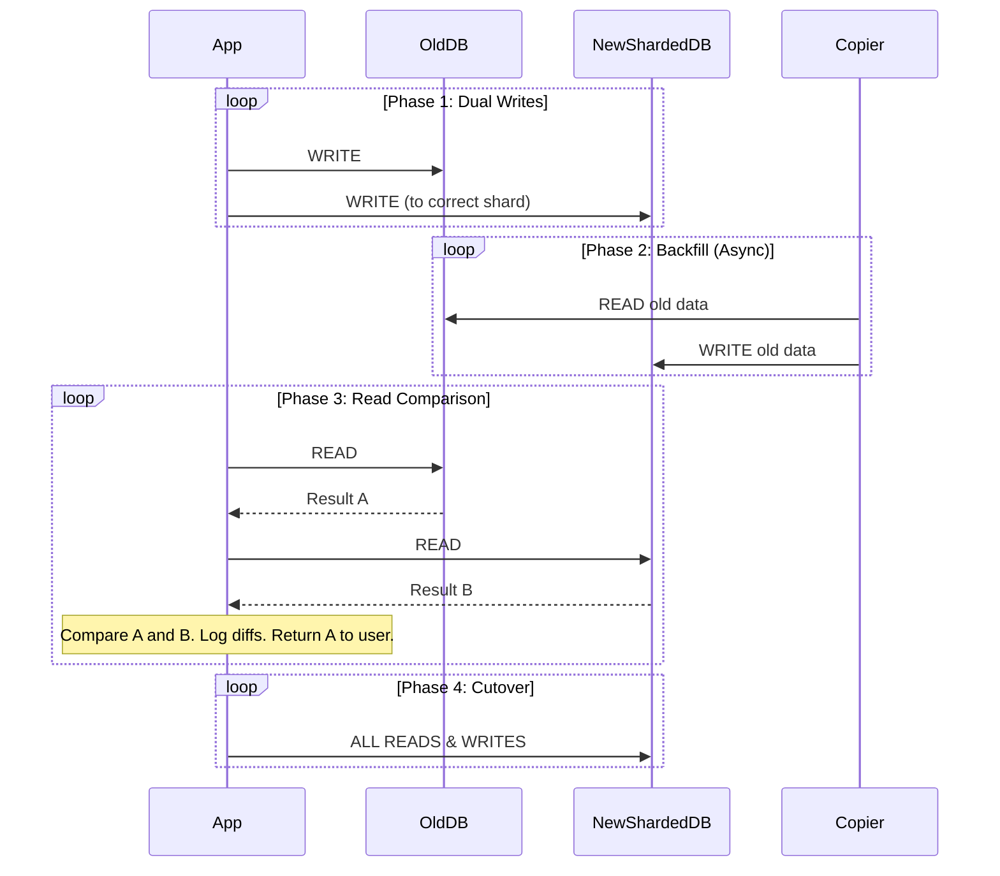

# Sharding Migration: Open-Heart Surgery on a Running Database

This is it. The big one.

You have a single, monolithic database that is on fire. You've done the analysis. You've chosen your shard key. You've designed your future-state sharded architecture.

Now you have to get there.

You have to perform a **sharding migration**: moving your data from your single primary to your new sharded cluster, all while the application is running and serving live traffic.

This is one of the most difficult and high-stakes operations in backend engineering. It's like performing open-heart surgery on a patient while they are running a marathon. There is no room for error.

---

### 1. Intuition: Moving Your Store to a New Mall

Imagine you own a single, massive, incredibly busy department store (your monolith DB). You've decided to close it and open a dozen smaller, specialized boutiques in a new mall across town (your sharded cluster).

How do you do this without closing down your business for a week?

You can't just lock the doors and move everything. You'd lose all your customers.

Instead, you'd do it in phases:
1.  **Build the new stores:** Get the new boutiques built and stocked, but keep them closed to the public.
2.  **Start sending new inventory to both places:** As new shipments arrive, you send them to your old warehouse *and* to the new boutiques' stockrooms. This is **dual writing**.
3.  **Backfill old inventory:** At night, when the main store is less busy, you start trucking your existing inventory over to the new boutiques. This is **backfilling**.
4.  **Open the new stores for some customers:** You start letting a few customers into the new boutiques to "test them out." You compare their receipts with the main store to make sure everything is correct. This is **dark traffic** or **read comparison**.
5.  **The Grand Opening (The Cutover):** You finally update your website and ads: "We've moved! Come visit us at our new locations!" You redirect all customers to the new boutiques and put a "Closed" sign on the old department store.

This careful, phased approach is the heart of a live sharding migration.

---

### 2. Machine-Level Explanation: The Dual-Write & Backfill Strategy

This is the most common and battle-tested strategy for online sharding migrations.

**The Goal:** To move from a single Primary DB to a sharded cluster with zero (or near-zero) downtime.

**The Phases:**

#### Phase 0: Pre-work
*   The new sharded cluster is fully provisioned and running, but receiving no traffic.
*   The application code is updated with a feature-flagged data access layer that knows how to talk to *both* the old database and the new sharded database.

#### Phase 1: Dual Writes

1.  You deploy the new code and flip a feature flag.
2.  Now, every time the application performs a write (`INSERT`, `UPDATE`, `DELETE`):
    *   It first writes to the **old monolithic database**.
    *   If that succeeds, it *also* writes the same data to the **new sharded database**. The code uses the shard key to route the write to the correct shard.
3.  **Crucially:** The write to the new database might fail (bugs happen!). This should be logged and monitored, but it should *not* fail the user's request. The old database is still the source of truth.

At the end of this phase, all *new* data is flowing into both systems simultaneously. The old data, however, still only exists in the monolith.

#### Phase 2: Backfill

1.  You start a background job (a "backfiller" or "copier").
2.  This job reads data from the old database in chunks (e.g., users 1-1000, then 1001-2000, etc.).
3.  For each chunk, it transforms the data as needed and writes it to the new sharded cluster, sending it to the correct shard.
4.  This is a slow, careful process that runs in the background, throttled to avoid overwhelming the old database. It can take days or even weeks for a very large database.

At the end of this phase, the new sharded cluster contains both the backfilled old data and the new data from the dual-writes. It should be *logically* equivalent to the old database.

#### Phase 3: Read Comparison (Verification)

1.  You flip another feature flag.
2.  Now, for a percentage of reads, the application does the following:
    *   It reads the data from the **old database**.
    *   It *also* reads the same data from the **new sharded database**.
    *   It compares the results. Are they identical?
    *   Any mismatches are logged for investigation. This is how you find bugs in your dual-write logic or your backfiller.
    *   The data from the **old database** is still the only data returned to the user. The read from the new system is "dark traffic."

This phase gives you confidence that the new system is behaving correctly and the data is consistent.

#### Phase 4: The Cutover

1.  The big moment. You've verified the data is consistent. The new system is stable.
2.  You flip the final feature flag.
3.  The application now sends **all reads and writes only to the new sharded database**.
4.  The old monolithic database is no longer receiving any traffic.
5.  You monitor like crazy.
6.  After a period of time (e.g., a week), when you are confident everything is stable, you can finally decommission the old database. Pop the champagne.

---

### 3. Diagrams

#### The Migration Flow

---

### 4. Production Gotchas & Common Misconceptions

*   **Misconception:** "We can just do it over a weekend."
    *   **Reality:** For any non-trivial system, a sharding migration is a multi-week or multi-month project. The backfilling process alone can take a very long time. Rushing it is the #1 cause of failure.
*   **Gotcha:** **Idempotency is Key.** Your dual-write and backfill jobs *will* fail and be retried. The logic must be idempotent. If you try to write the same user data twice during a backfill retry, the system should handle it gracefully (e.g., `INSERT ... ON CONFLICT DO NOTHING` or an `UPSERT`).
*   **Gotcha:** **Schema Changes.** What happens if you need to make a schema change (e.g., add a column) in the middle of the migration? You have to apply it to *both* the old and new databases, and ensure your backfiller and dual-write logic can handle it. This adds a massive layer of complexity. It's often best to freeze all non-critical schema changes during the migration period.
*   **Gotcha:** **Verification is everything.** Do not skip the read comparison phase. You will have bugs in your logic. It's inevitable. This is your only chance to find them before they impact users. GitHub, Stripe, and every other company that has done this successfully has written at length about the importance of their verification tools.

---

### 5. Interview Note

**Question:** "You're in charge of migrating a live, monolithic SQL database to a sharded architecture with no downtime. Outline your strategy."

**Beginner Answer:** "I'd take a backup, restore it to the new servers, and then switch over." (This implies a long downtime).

**Good Answer:** "I would use a dual-write and backfill strategy. I'd modify the application to write to both the old and new databases simultaneously. While that's happening, I'd run a background job to copy all the existing historical data over. Once the data is fully copied and in sync, I'd switch all traffic over to the new sharded system."

**Excellent Senior Answer:** "I'd lead a phased online migration, likely using the dual-write and backfill pattern, managed entirely via feature flags.
**Phase 1 (Dual Write):** Modify the DAL to write to the old monolith and, asynchronously, to the new sharded cluster. The new system's write path is not in the critical path of user requests.
**Phase 2 (Backfill):** Build a throttled, idempotent backfilling job to copy existing data from the monolith to the sharded cluster. This is a long-running, background process.
**Phase 3 (Verification):** This is the most critical phase. I'd implement a 'dark read' or 'shadowing' mode where for a percentage of requests, we read from both systems, compare the results in memory, and log any discrepancies. This allows us to validate the correctness of our new system with live traffic without impacting users.
**Phase 4 (Cutover):** Once the data is fully backfilled and the verification shows no discrepancies, we can perform the cutover. I'd do this gradually, first moving read traffic, then finally write traffic. The old system would be kept online as a hot standby for a safe rollback period before being decommissioned. The entire process would be governed by extensive monitoring on data consistency, system performance, and error rates."
