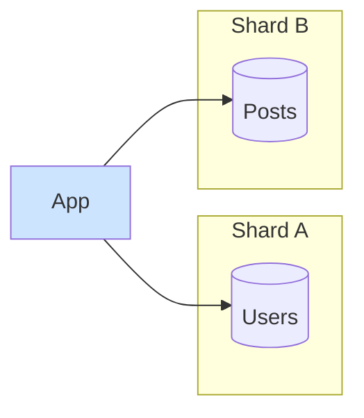
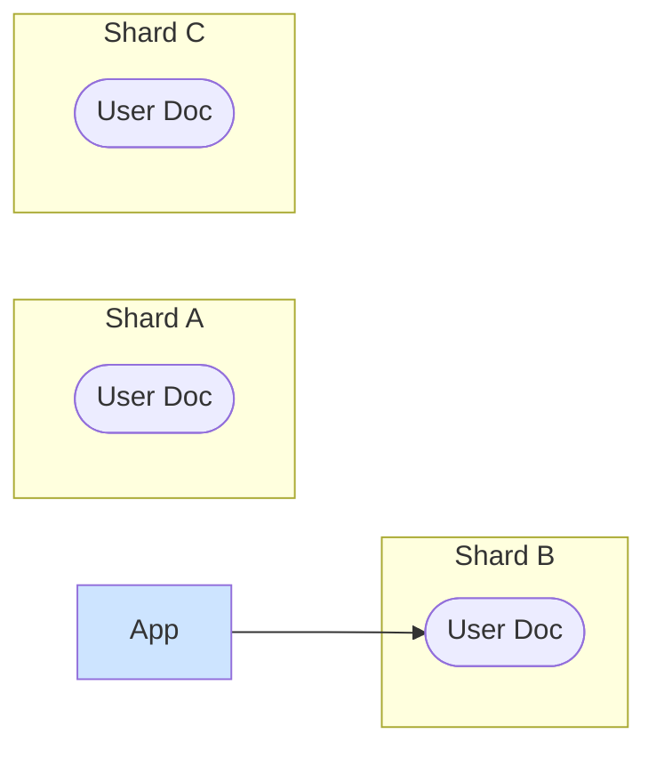

# Why NoSQL "Shards Easily": The Joy of Denormalization

For years, the mantra was "NoSQL scales." It was often presented as a kind of magic. While relational databases required complex heroics to scale horizontally, NoSQL databases like MongoDB and Cassandra seemed to be built for it from the ground up.

There is no magic.

The reason NoSQL databases shard "easily" is that they made a fundamental design tradeoff at the very beginning: they threw out the relational model. They abandoned the very features that make sharding a SQL database so hard.

---

### 1. Intuition: The Self-Contained Resume vs. The Interlinked Encyclopedia

*   **A Relational Database is an Encyclopedia:** The information is highly normalized and interconnected. The article about a "King" has a `See Also` link to the article about his "Country." The "Country" article links to the "Continent" article. To get the full picture, you have to follow these links (`JOIN`s). Sharding this is like tearing the encyclopedia into volumes; you constantly have to grab another volume to follow a link.

*   **A Document-Oriented NoSQL Database is a Stack of Resumes:** Each resume (or "document") is a self-contained unit. A person's resume doesn't just have their job title; it has the full description of the company they worked for *embedded inside it*. It contains their full address, not a link to an "address table."

Which of these is easier to tear in half and store in two different filing cabinets? The stack of resumes, obviously. Each resume is independent. You don't need to worry about links between them. This is the core idea behind document databases and why they are so much simpler to partition.

---

### 2. Machine-Level Explanation: Denormalization and The Lack of Joins

Let's look at a practical example: a user and their blog posts.

#### The Relational (SQL) Way: Normalized

You have two tables. This is clean, normalized, and avoids data duplication.

**`users` table:**
| id  | name  | email         |
| --- | ----- | ------------- |
| 123 | Alice | alice@aol.com |

**`posts` table:**
| id  | user_id | title        |
| --- | ------- | ------------ |
| 1   | 123     | "My First Post" |
| 2   | 123     | "Scaling Fun" |

To get the user and their posts, you need a `JOIN`. If `users` and `posts` are on different shards, this is a painful distributed join.

#### The Document (NoSQL) Way: Denormalized

You have one "collection" of user documents. Each document contains *everything* about that user, including an array of their posts.

**`users` collection (e.g., MongoDB):**
```json
{
  "_id": 123,
  "name": "Alice",
  "email": "alice@aol.com",
  "posts": [
    { "post_id": 1, "title": "My First Post", "content": "..." },
    { "post_id": 2, "title": "Scaling Fun", "content": "..." }
  ]
}
```

**How does this help sharding?**

1.  **No Joins:** To get a user and all their posts, you fetch a single document. The "join" was done at write time by embedding the data. This operation is always local to a single shard.
2.  **Natural Shard Key:** The document's primary key (`_id`, which is our `user_id`) is the perfect shard key. The entire document, a self-contained universe of the user's data, lives on one machine.

You've traded the relational model for a model that is pre-joined and optimized for retrieval. You've embraced **denormalization**.

**The Downsides of Denormalization:**
This isn't free.
*   **Data Duplication:** What if the user's name is also stored on a "comments" document? If the user changes their name, you now have to update it in multiple places. This is the classic update anomaly that normalization was designed to prevent.
*   **Larger Documents:** Documents can become large and unwieldy.
*   **Less Flexibility:** Your data is structured around a specific access pattern. If you suddenly need to query your data in a new way (e.g., "find all posts with the word 'scaling'"), it can be very inefficient, as you have to scan inside the arrays of every user document.

---

### 3. Diagrams

#### The Relational Join Path

A read requires crossing shard boundaries.



#### The Document Model Path

A read is always a single hop to the correct shard.


The application asks the router for the user, and the router sends it to the one shard that holds that entire document. Simple.

---

### 4. Production Gotchas & Common Misconceptions

*   **Misconception:** "NoSQL databases are 'schemaless'."
    *   **Reality:** This is a dangerous lie. They are not schemaless; they have an **implicit schema** that is enforced by your application code. If your code expects the `name` field to be a string, but some other part of your code writes it as a number, the database won't stop you. Your application will blow up at runtime instead. This shifts the burden of schema enforcement from the database to the developer and requires rigorous discipline.
*   **Gotcha:** **The Document Becomes the Bottleneck.** In the relational world, you could lock a single row. In the document world, the smallest unit of atomicity is often the entire document. If you want to add a new blog post and someone else wants to add a comment at the same time, you might have a conflict on the entire user document. This can re-introduce contention at a coarser level.
*   **Gotcha:** **Choosing the Right NoSQL Model.** "NoSQL" is a meaningless term. It just means "not relational." There are many types:
    *   **Document Databases (MongoDB):** Good for rich, self-contained objects. The "resume" model.
    *   **Key-Value Stores (Redis, DynamoDB):** A giant hash map. Blazing fast for simple lookups.
    *   **Column-Family Stores (Cassandra, HBase):** Like a table with a trillion columns. Optimized for wide datasets and heavy writes.
    *   **Graph Databases (Neo4j):** Optimized for relationships and traversing connections.
    Choosing the wrong type of NoSQL database for your problem is just as bad as choosing the wrong shard key.

---

### 5. Interview Note

**Question:** "Why are document databases like MongoDB often considered easier to scale horizontally than a traditional SQL database?"

**Beginner Answer:** "Because they're NoSQL and that's what NoSQL is for."

**Good Answer:** "They are easier to shard primarily because their data model encourages denormalization. By embedding related data within a single document, like putting a user's posts inside the user document, they eliminate the need for distributed joins. A query to get a user and their posts becomes a single read of one document, which can be easily directed to a single shard. This avoids the cross-shard coordination that makes scaling SQL difficult."

**Excellent Senior Answer:** "The 'scalability' of document databases stems directly from their rejection of the relational model's core tenets. They trade normalization and joins for the concept of a self-contained document. This co-locates data that is accessed together, making partitioning trivial—the document's ID becomes a natural shard key, and all reads for that entity are routed to a single machine. This design choice effectively pre-computes the result of a `JOIN` at write time.

However, this comes with significant tradeoffs that are pushed to the application layer. By denormalizing, you lose the data integrity guarantees of a relational database. An update to a piece of data might require a 'fan-out' write to multiple documents, and ensuring consistency across them becomes an application-level concern. So, while they are easier to *partition*, the overall complexity of maintaining data consistency is not eliminated; it's just moved from the database into the application code."
