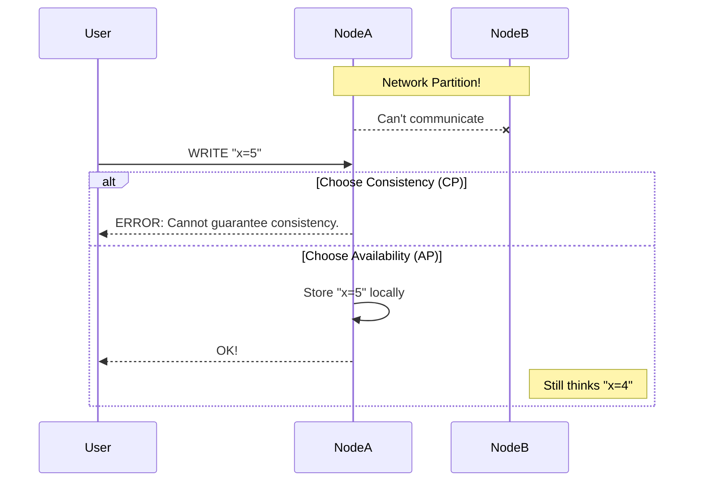

# The CAP Theorem in Practice: Pick Two, and Weep

The CAP Theorem is the "rock, paper, scissors" of distributed systems. It's a simple, brutal, and often misunderstood law that governs the tradeoffs you are forced to make when your system is distributed across multiple machines.

It was first proposed by Eric Brewer and later proven by Seth Gilbert and Nancy Lynch. It states that in any distributed data store, you can only provide **two** of the following three guarantees:

1.  **Consistency (C):** Every read receives the most recent write or an error. All nodes in the system have the same view of the data at the same time.
2.  **Availability (A):** Every request receives a (non-error) response, without the guarantee that it contains the most recent write. The system is always "up" for reads and writes.
3.  **Partition Tolerance (P):** The system continues to operate despite an arbitrary number of messages being dropped (or delayed) by the network between nodes.

Here's the kicker: in a real-world distributed system, **you cannot choose to sacrifice Partition Tolerance.** Network partitions (where some servers can't talk to other servers) are a fact of life. The network is not reliable. Switches fail, routers get congested, data centers lose connectivity.

Therefore, the CAP theorem isn't really "pick any two." It's: **"When a network partition happens, you must choose between Consistency and Availability."**

---

### 1. Intuition: The Two Generals

Imagine two generals, General A and General C, on two different hills, planning a coordinated attack. They communicate via messengers.

*   **The Goal:** They must attack at the same time to win. If one attacks and the other doesn't, they lose.
*   **The Problem:** The valley between them is dangerous. Any messenger could be captured (a network partition).

General A sends a messenger: "Attack at dawn." The messenger gets through. Now General C knows the plan. But General A doesn't know that C knows. If C attacks alone, he's doomed.

So General C sends a confirmation back: "I agree, attack at dawn." The messenger gets through. Now A knows that C knows. But C doesn't know that A knows that C knows...

You can see the infinite loop. There is no way for both generals to be 100% certain that they have a shared, consistent plan. This is the Two Generals' Problem, and it's a classic illustration of why perfect consistency is impossible in an unreliable network.

Now, let's apply this to CAP. A network partition happens. Your two database servers can't talk to each other. A user tries to write data. What do you do?

*   **Choose Consistency (Sacrifice Availability):** You refuse the write. You tell the user, "I'm sorry, I can't accept this write right now because I can't guarantee it will be replicated to the other server. The system is effectively 'down' for writes." You have chosen to be consistent by being unavailable. This is a **CP** system.

*   **Choose Availability (Sacrifice Consistency):** You accept the write on the server you can talk to. You tell the user, "Got it!" even though you know the other server is out of sync. The system is "up," but the two servers now have different versions of the truth. When the network partition heals, you'll have to figure out how to resolve these conflicts. This is an **AP** system.

---

### 2. Machine-Level Explanation: Real-World Systems

Let's map this to the databases we've been talking about.

#### CP Systems (Consistency + Partition Tolerance)

*   **Examples:** Traditional single-master SQL databases (PostgreSQL, MySQL), HBase.
*   **How they work:** In a primary-replica setup, if a replica can't talk to the primary, it might stop serving reads or report that it's stale. More importantly, if the primary thinks it can't talk to a quorum of its replicas (in a synchronous or semi-synchronous setup), it may refuse to accept writes to prevent a split-brain scenario. It sacrifices availability to ensure that anyone who *can* read the data gets a consistent view.
*   **The User Experience:** "The site is down for maintenance." or "Your request could not be completed. Please try again later."

#### AP Systems (Availability + Partition Tolerance)

*   **Examples:** Cassandra, DynamoDB, Riak.
*   **How they work:** These systems are often "masterless" or "multi-master." You can write to any node. If a node can't talk to its peers, it doesn't care. It accepts the write locally and stores it. It will try to sync up with the other nodes later when the network partition heals. This is where concepts like "eventual consistency" come from.
*   **The User Experience:** The site is always up. Writes are always accepted. But you might see weird things. You update your shopping cart on one request, but the next page load (which hits a different, not-yet-synced server) shows the old cart contents. The system is available, but not consistent.

---

### 3. Diagrams

#### The CAP Triangle

You can only live on one of the lines connecting the corners. Since P is a given, you're forced to live on the P-C line or the P-A line.

```mermaid
graph TD
    C(Consistency)
    A(Availability)
    P(Partition Tolerance)

    C -- CP Systems <br> (e.g., SQL) --> P
    A -- AP Systems <br> (e.g., Cassandra) --> P
    C -. In a perfect network... .-> A

    style P fill:#ffcccc
```

#### The Partition Event

This is the moment of choice.



---

### 4. Production Gotchas & Common Misconceptions

*   **Misconception:** "CAP is a binary choice."
    *   **Reality:** It's a spectrum. Modern databases offer "tunable consistency." In Cassandra, you can specify on a per-query basis how many nodes must acknowledge a write before it's considered successful. `QUORUM` writes provide strong consistency, while `ANY` writes provide high availability. You can make different tradeoffs for different parts of your application.
*   **Misconception:** "SQL is CP, NoSQL is AP."
    *   **Reality:** This is a gross oversimplification. A sharded SQL database with asynchronous replication that allows reads from lagging replicas is behaving like an AP system for reads. A MongoDB cluster configured for the highest level of write concern is behaving more like a CP system. The lines are very blurry. It's about the configuration, not the label.
*   **Gotcha:** **Conflict Resolution.** The biggest pain of an AP system is what happens when the partition heals. Node A thinks `x=5`. Node B was also accepting writes and thinks `x=6`. What's the correct value? This is **conflict resolution**. Some systems use a "last write wins" (LWW) policy based on timestamps. Others might store both values and force the application to resolve the conflict. This is a complex and critical part of designing an available system.

---

### 5. Interview Note

**Question:** "Explain the CAP theorem and give an example of a system that prioritizes Consistency over Availability."

**Beginner Answer:** "It says you can only have two of Consistency, Availability, and Partition Tolerance."

**Good Answer:** "The CAP theorem states that in a distributed system, you are forced to choose between Consistency and Availability in the event of a network partition. A system that prioritizes Consistency, a CP system, will refuse to respond to a request if it cannot guarantee that the data it's seeing is the most up-to-date version. A core banking system is a good example; you would rather the system be temporarily unavailable for writes than allow a transaction that could lead to an incorrect account balance."

**Excellent Senior Answer:** "The CAP theorem forces a fundamental tradeoff during a network partition: do you remain available but risk serving stale or conflicting data (AP), or do you guarantee consistency by becoming unavailable (CP)? Since partitions are inevitable, this choice is unavoidable.

A classic example of a CP system is a relational database configured for synchronous replication with a strict quorum. If the primary cannot confirm a write with a majority of its replicas, it will return an error rather than commit the write. This ensures no data divergence, but it sacrifices write availability during the partition.

In practice, however, it's not a binary choice. Modern systems offer tunable consistency. For instance, in an e-commerce app, we might demand CP behavior for the payment processing service (using a SQL DB with synchronous replication) but allow AP behavior for the 'recommended products' service (using Cassandra with eventual consistency). The key is to understand that CAP is not a system-wide label but a tradeoff you make on a per-feature, per-service basis, depending on the business requirements."
