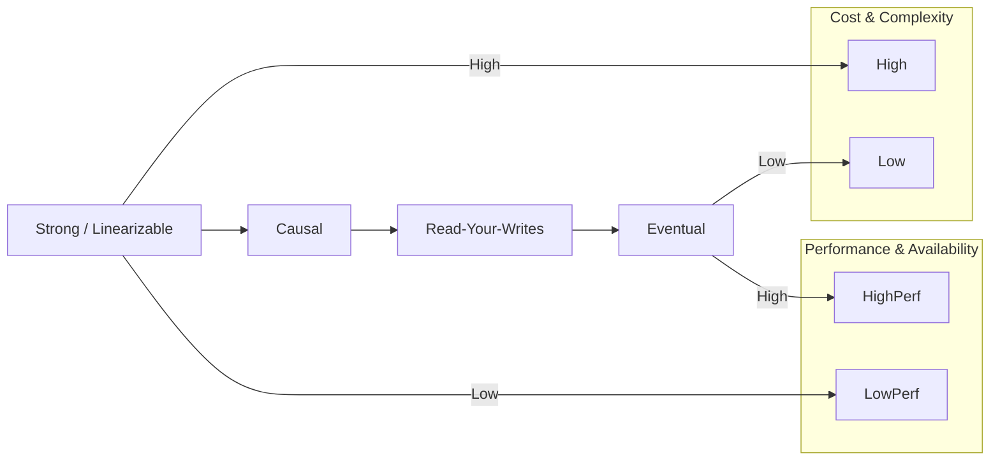
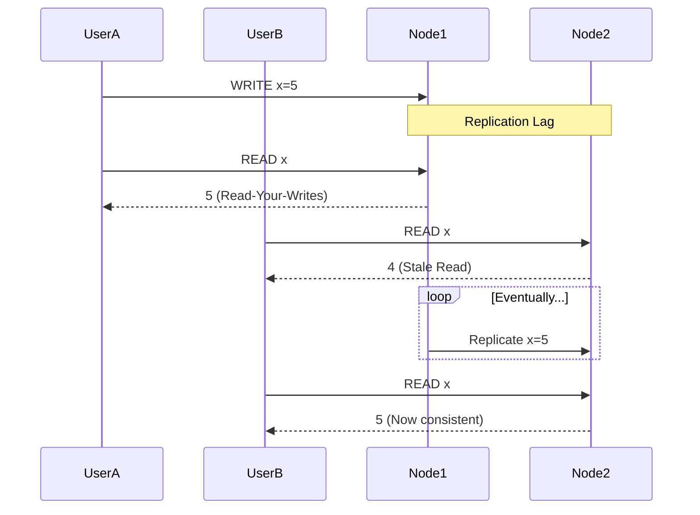

# Consistency Models: It's Not Just "Consistent" or "Not"

"Consistency" is one of the most overloaded and confusing words in distributed systems. The "C" in CAP and the "C" in ACID are not even the same thing!

*   **ACID "Consistency"** is about the database being in a valid state according to your rules (constraints, triggers). It's about application-level correctness.
*   **CAP "Consistency"** (also called **Linearizability** or **Strong Consistency**) is about all nodes having the same view of the data at the same time. It's about the perception of a single, unified timeline.

When we relax the "C" in CAP to gain availability, we don't just descend into chaos. We enter a world of different, weaker consistency models. Understanding this spectrum is critical to building systems that are both scalable and correct *enough* for their purpose.

---

### 1. Intuition: The Gossip Chain

Imagine a piece of news spreading through a group of friends.

*   **Strong Consistency (Linearizability):** There's a central town crier with a megaphone. When news happens, he shouts it, and everyone hears it at the exact same time. There is only one version of the truth. This is simple, but the town crier is a bottleneck.

*   **Eventual Consistency:** Alice tells Bob a secret. Bob tells Carol ten minutes later. Carol tells David an hour after that. Eventually, everyone will know the secret, but for a while, different people have different versions of the truth. Alice knows the secret, but David doesn't. The system is temporarily inconsistent, but it will *eventually* converge on the correct state.

*   **Causal Consistency:** This is a smarter form of gossip. If Alice tells Bob "I'm breaking up with my partner," and *then* tells him "I'm going on vacation," Bob will always hear those two pieces of news in the correct order. The cause (the breakup) precedes the effect (the vacation). However, Carol might hear about the vacation from a different friend before she hears about the breakup. Causal consistency preserves the order of related events for a single actor, but not unrelated events across different actors.

---

### 2. Machine-Level Explanation: A Tour of the Models

Let's get more formal. These models define the rules about the order and visibility of reads and writes.

#### 1. Strong Consistency (Linearizability)

*   **The Rule:** Once a write completes, all subsequent reads (no matter which server they hit) will see that value. The system behaves as if there is only one copy of the data, and all operations are atomic and instantaneous.
*   **How it's Achieved:** Requires slow, synchronous replication and coordination, often using consensus protocols like Paxos or Raft. This is what CP systems strive for.
*   **Use Case:** Core banking systems, stock exchanges, distributed locks. Anywhere you absolutely cannot tolerate stale data.

#### 2. Causal Consistency

*   **The Rule:** If operation A "causes" operation B (e.g., you write a post, then you edit it), then every node in the system will see A before it sees B. It preserves the logical flow of events for a single user or process.
*   **How it's Achieved:** By tracking the "vector clock" or version history of data. Each update carries with it the version of the data it's updating.
*   **Use Case:** Comment threads on a post. You want to see the comments in the order they were made, and you definitely want to see the original post before you see the comments on it.

#### 3. Read-Your-Writes Consistency

*   **The Rule:** A user will always see their own writes. After a user writes a value, any subsequent reads *from that same user* will return the updated value.
*   **How it's Achieved:** As we discussed in the replication section, this is usually done by routing a user's reads to the primary database for a short time after they perform a write.
*   **Use Case:** The "edit profile" page. It would be incredibly jarring for a user to change their name, hit save, and see their old name on the reloaded page.

#### 4. Eventual Consistency

*   **The Rule:** If no new updates are made to a given data item, all replicas will *eventually* return the last updated value. It makes no guarantees about *when* this will happen.
*   **How it's Achieved:** Asynchronous replication. This is the default behavior of most AP systems like Cassandra or DynamoDB.
*   **Use Case:** Social media likes, profile view counters, "users who liked this also liked...". It's okay if the 'like' count is off by a few for a couple of seconds. The system is highly available for writes, and the inconsistency is temporary and low-impact.

---

### 3. Diagrams

#### The Consistency Spectrum

It's not a binary choice; it's a range of tradeoffs.

#### Eventual Consistency in Action

Different users see different values at the same time.

---

### 4. Production Gotchas & Common Misconceptions

*   **Misconception:** "Eventual consistency means the data might be wrong."
    *   **Reality:** It means the data might be *stale*. The system guarantees that it will be correct *eventually*. The key is that the business logic must be able to tolerate this temporary staleness.
*   **Gotcha:** **Choosing a Model is a Business Decision.** You, the engineer, cannot decide that eventual consistency is "good enough" for the shopping cart. That's a product and business decision. Your job is to explain the tradeoffs: "We can make the 'add to cart' feature faster and more available, but it means there's a 0.01% chance a user might see an old version of their cart for a few seconds. Is that acceptable?"
*   **Gotcha:** **Monotonic Reads.** This is a subtle but important guarantee. It means that if you perform a series of reads, you will never see an older version of the data after you've seen a newer one. This can be violated if you have multiple replicas and your read requests are bouncing between them, one of which is more lagged than the other. This is incredibly confusing for users. Sticky sessions (sending a user's requests to the same replica for a period of time) can help mitigate this.

---

### 5. Interview Note

**Question:** "What does 'eventual consistency' mean, and when would it be an acceptable model to use?"

**Beginner Answer:** "It means the data will be consistent at some point."

**Good Answer:** "Eventual consistency is a model where, if no new writes occur, all replicas will eventually converge to the same state. It prioritizes availability over immediate consistency. It would be acceptable for features where temporary staleness is not critical to the user experience, such as social media likes, view counters, or non-critical user profile information. It would not be acceptable for something like a bank balance."

**Excellent Senior Answer:** "Eventual consistency is one of several weaker consistency models we can choose when we move away from strict linearizability. It guarantees liveness—that the system will eventually converge—but makes no promises on the timeline. This model is acceptable when the business logic can tolerate data staleness. For example, a 'like' count on a photo is a perfect use case.

However, 'eventual' is often not strong enough. We might need stronger guarantees like **Read-Your-Writes consistency**, which we can achieve by routing a user's reads to the primary post-write. Or we might need **Causal consistency** for something like a comment thread, to ensure replies are always seen after the comment they are replying to. The key is to analyze the specific data flow and user expectations for each feature and choose the *weakest possible* consistency model that is still correct for that feature's requirements. Choosing a model that is too strong adds unnecessary cost and latency, while choosing one that is too weak introduces bugs and a poor user experience."
