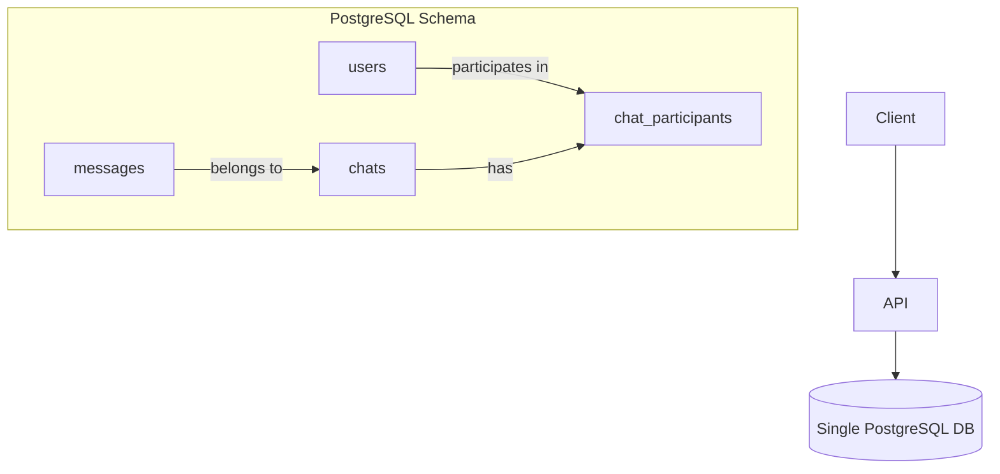
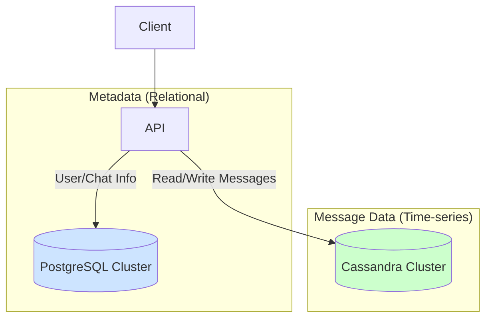

# System Design: A Production-Ready Chat App (e.g., WhatsApp, Discord)

Let's get our hands dirty. Theory is great, but the real test is applying it to a living, breathing system. We're going to design the data layer for a massive chat application like WhatsApp or Discord.

The core requirements are:
*   Users can send and receive 1-on-1 messages.
*   Users can be part of group chats.
*   Message delivery should be fast and reliable.
*   Users should see a consistent message history.
*   The system must scale to millions of concurrent users and billions of messages.

---

### 1. The V0 Architecture: The Monolithic Hope

Every great system starts simple. You're a startup, you need to ship.

*   **Database:** A single, beefy PostgreSQL server.
*   **Application:** A simple backend API (e.g., Node.js, Go).
*   **Communication:** Clients (iOS, Android, Web) connect to the API via WebSockets for real-time communication.

#### The V0 Schema:

This is a classic, normalized relational model.

**`users` table:**
| id (PK) | username | created_at |
|---|---|---|

**`chats` table (for metadata):**
| id (PK) | name (for groups) | is_group_chat | created_at |
|---|---|---|

**`chat_participants` table (many-to-many):**
| chat_id (FK) | user_id (FK) |
|---|---|

**`messages` table:**
| id (PK) | chat_id (FK) | sender_id (FK) | content | created_at |
|---|---|---|---|---|

#### How it Works:
1.  **Sending a message:**
    *   Client sends a message to the API via WebSocket.
    *   API `INSERT`s the message into the `messages` table.
    *   API finds all participants in the chat (a `JOIN` on `chat_participants`).
    *   API pushes the new message to all online participants via their WebSockets.
2.  **Fetching history:**
    *   Client requests messages for a chat.
    *   API does `SELECT * FROM messages WHERE chat_id = ? ORDER BY created_at DESC LIMIT 50;`

#### The Inevitable Pain:
This works beautifully for 10,000 users. It falls apart at 1,000,000.
*   **The `messages` table becomes monstrous.** Billions, then trillions of rows. `INSERT`s get slower. Indexes become huge and unwieldy. The single primary DB is on fire.
*   **`SELECT`ing message history** for a busy chat requires sorting a massive table on disk. It's slow.
*   **The single PostgreSQL server** is a single point of failure and a write bottleneck.

---

### 2. The V1 Architecture: Scaling for the Real World

We need to scale writes and handle the massive `messages` table. This is a perfect use case for a database that shards easily and is optimized for heavy writes and time-series data. **Enter Cassandra.**

Why Cassandra?
*   **Masterless Architecture:** Every node can accept writes, making it highly available (an AP system).
*   **Excellent Write Throughput:** It's designed to absorb a firehose of data.
*   **Horizontal Scalability:** Adding new nodes is trivial.
*   **Flexible Schema:** Its column-family model is perfect for our messages.

But we don't throw away PostgreSQL! It's still excellent for our relational data: users, chat metadata, participant lists. These tables are much smaller and require strong consistency.

#### The V1 "Hybrid" Architecture:

*   **PostgreSQL Cluster:** A primary-replica setup for `users`, `chats`, `chat_participants`. This data is relational and doesn't grow as fast.
*   **Cassandra Cluster:** A large, multi-node cluster for the `messages` table.
*   **API:** The backend service now knows how to talk to both databases.

#### The New `messages` Table in Cassandra:

Cassandra data modeling is all about the queries. You design your tables to answer your questions. Our main question is "get the messages for a chat, in order."

```cassandra
CREATE TABLE messages (
    chat_id uuid,
    message_id timeuuid, // A special UUID that includes a timestamp
    sender_id uuid,
    content text,
    PRIMARY KEY (chat_id, message_id)
) WITH CLUSTERING ORDER BY (message_id DESC);
```

**This schema is genius for a few reasons:**

1.  **The Partition Key:** `chat_id`. This is our **shard key**. All messages for a single chat live together on the same set of nodes. When you query for a chat's history, you go directly to the right place. This is co-location!
2.  **The Clustering Key:** `message_id`. Within a partition (a chat), messages are physically sorted on disk by `message_id` (which is time-based), in descending order.
3.  **The Query:** `SELECT * FROM messages WHERE chat_id = ?;` is now incredibly efficient. Cassandra just goes to the right partition and reads the rows off the disk in the exact order you need them. No expensive sorting of a giant table!

---

### 3. Diagrams

#### V0 Monolithic Architecture



#### V1 Hybrid Architecture



---

### 4. Production Gotchas & Failure Modes

*   **Hot Partitions:** What if a celebrity creates a massive public group chat? That single `chat_id` becomes a hotspot in Cassandra, overwhelming the nodes that hold its data. This is the "celebrity problem" again. You might need to further shard that specific chat, perhaps by `(chat_id, date)`.
*   **Consistency Tradeoffs:** We're using PostgreSQL (a CP system) and Cassandra (an AP system) together. What happens if you create a new chat in PostgreSQL, but the first message write to Cassandra fails? The user sees a chat with no messages. Your application code needs to be resilient to these cross-database inconsistencies.
*   **Message Ordering:** `timeuuid` is mostly ordered, but not perfectly. If two users send a message at the exact same microsecond, their order might be ambiguous. For a chat app, this is usually an acceptable tradeoff. For a financial system, it would not be.
*   **Idempotency:** Clients will disconnect and reconnect. They will retry sending messages. Your API *must* handle this gracefully. The client should generate a unique ID for each message, and the server should use this to deduplicate retries. `INSERT ... IF NOT EXISTS` is your friend.

---

### 5. Interview Note

**Question:** "Design the data layer for a scalable chat application like Discord."

**Beginner Answer:** "I'd use a SQL database with tables for users, chats, and messages."

**Good Answer:** "I'd start with a SQL database for relational data like users and chat metadata. But the messages table will be huge and write-heavy, so I would put that in a NoSQL database like Cassandra. I'd partition the messages by `chat_id` to co-locate all messages for a chat, and use a time-based clustering key to keep them sorted for efficient retrieval."

**Excellent Senior Answer:** "I'd propose a hybrid data model. For user and chat metadata—data that is highly relational and requires strong consistency—I'd use a standard replicated and sharded PostgreSQL cluster, sharded by `user_id` or `chat_id`.

For the core message firehose, which is essentially a time-series problem, a specialized NoSQL store is a better fit. I'd choose Cassandra for its high write throughput and linear scalability. The data model in Cassandra would be query-driven. The primary table would be partitioned by `chat_id` and clustered by a `timeuuid` message ID to ensure messages within a chat are physically co-located and sorted by time. This makes fetching recent messages for a chat a highly efficient disk read.

This hybrid approach has tradeoffs. We lose transactional consistency between the two systems. We'd need application-level logic to handle cases where creating a chat in Postgres succeeds but the first message write to Cassandra fails. We also need to be mindful of hot partitions in Cassandra if a single chat becomes extremely active, and have a strategy for potentially further subdividing that partition, for example by date."
