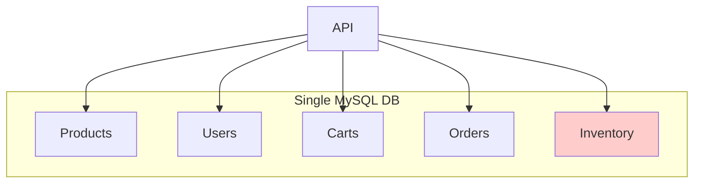
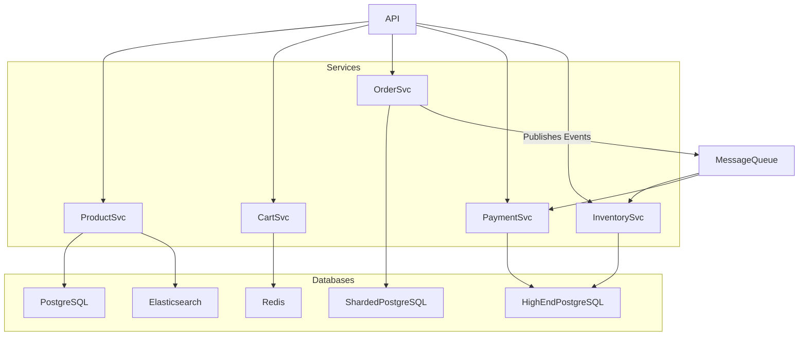

# System Design: A Production-Ready E-commerce Platform

E-commerce is a fascinating system design problem because it's not one problem; it's many different problems masquerading as one application.

*   **Product Catalog:** Read-heavy, needs to be searchable.
*   **User Profiles & Carts:** A mix of reads and writes, needs to be consistent for the user.
*   **Orders & Payments:** Write-heavy, demands the absolute strongest consistency guarantees.
*   **Inventory:** The ultimate high-contention, high-consistency challenge.

Trying to solve all of these with a single monolithic database is a recipe for disaster. A successful e-commerce platform embraces a polyglot persistence approach, using the right database for the right job.

---

### 1. The V0 Architecture: The WooCommerce Monolith

You're launching a small online store. You install a framework like Magento or WooCommerce on a single server with a single MySQL database.

#### The V0 Schema:
It's a beautifully normalized, foreign-key-laden paradise.

*   `users`
*   `products`
*   `shopping_carts`
*   `cart_items`
*   `orders`
*   `order_items`
*   `inventory`

Everything has foreign key constraints to everything else. An `order_item` must link to a valid `order` and a valid `product`. You can't create an `order` for a user that doesn't exist. The database guarantees correctness.

#### How it Works:
A user clicks "Checkout." This kicks off a single, massive database transaction:
```sql
BEGIN;

-- 1. Lock the inventory for the items in the cart.
SELECT quantity FROM inventory WHERE product_id IN (1, 2, 3) FOR UPDATE;

-- 2. Check if we have enough stock. If not, ROLLBACK.
-- (Application logic here)

-- 3. Decrease the inventory counts.
UPDATE inventory SET quantity = quantity - 1 WHERE product_id = 1;
UPDATE inventory SET quantity = quantity - 1 WHERE product_id = 2;
UPDATE inventory SET quantity = quantity - 1 WHERE product_id = 3;

-- 4. Create the order.
INSERT INTO orders (user_id, total_price) VALUES (123, 99.99);

-- 5. Create the order items.
INSERT INTO order_items (order_id, product_id) VALUES (LAST_INSERT_ID(), 1);
-- ... and so on

-- 6. Clear the shopping cart.
DELETE FROM cart_items WHERE cart_id = 456;

COMMIT;
```

#### The Inevitable Pain:
This is a textbook example of a system that works perfectly at low scale and then explodes.

*   **The Inventory Lock:** The `SELECT ... FOR UPDATE` statement places a lock on the inventory rows. If two people try to buy the same popular item at the same time, the second person's transaction has to wait for the first one to finish. Now imagine a Black Friday flash sale for a new iPhone. Thousands of people are trying to buy it at once. They all get stuck waiting for the same row-level lock. Your database's concurrency plummets. The database is now crying.
*   **Monolithic Bottleneck:** All services—browsing, cart management, checkout—are hitting the same database. A sale event that hammers the `orders` and `inventory` tables can slow down users who are just trying to browse the product catalog.
*   **Scaling is All-or-Nothing:** You can't scale the `orders` database independently of the `products` database. You have to scale the whole monolith.

---

### 2. The V1 Architecture: A Service-Oriented, Polyglot Approach

We break the monolith apart. We identify the different jobs the system is doing and create a service with its own dedicated database for each one.

*   **Product Service:** Manages products. This is read-heavy. A replicated PostgreSQL cluster is fine. To handle search, the data is also indexed into **Elasticsearch**.
*   **Cart Service:** Manages shopping carts. This data is often transient and user-specific. A **Redis** cluster is perfect. It's fast, and losing a shopping cart is not a catastrophic failure.
*   **Order Service:** Manages historical orders. This is write-heavy but simple. A sharded PostgreSQL or MySQL database (sharded by `user_id`) works well.
*   **Payment Service:** This is the most critical part. It talks to external payment gateways (like Stripe). It needs maximum consistency. A non-sharded, primary-replica PostgreSQL cluster is the right choice. You don't shard your payments database unless you are a massive, massive company.
*   **Inventory Service:** The heart of the problem. It needs to be fast, consistent, and handle high contention. This might stay on a very high-end, vertically-scaled RDBMS, or use a specialized database like Redis for atomic operations.

#### The New Checkout Flow (A Saga):

The single, massive transaction is gone. It's replaced by a **Saga**, a series of choreographed steps between services, often coordinated by a message queue (like RabbitMQ or Kafka).

1.  **User clicks "Checkout."** The API sends a `CreateOrder` command to the message queue.
2.  **Order Service:**
    *   Pulls the command from the queue.
    *   Creates an order in its own database with a status of `PENDING`.
    *   Publishes an `OrderCreated` event to the message queue.
3.  **Inventory Service:**
    *   Listens for `OrderCreated` events.
    *   Attempts to reserve the inventory for that order. It can use an atomic `DECRBY` command in Redis or a carefully crafted `UPDATE` in SQL.
    *   If successful, it publishes an `InventoryReserved` event.
    *   If it fails (out of stock), it publishes an `InventoryReservationFailed` event.
4.  **Payment Service:**
    *   Listens for `InventoryReserved` events.
    *   Charges the user's credit card via Stripe.
    *   If successful, it publishes a `PaymentCompleted` event.
    *   If it fails, it publishes a `PaymentFailed` event.
5.  **Order Service (again):**
    *   Listens for `PaymentCompleted` and updates the order status to `CONFIRMED`.
    *   Listens for `InventoryReservationFailed` or `PaymentFailed` and updates the order status to `FAILED`. It might also trigger a compensating transaction to release the inventory if it was already reserved.

This is an **eventually consistent** model. For a brief period, the order might be `PENDING` while the inventory hasn't been reserved yet. But this architecture is far more scalable and resilient than the monolithic transaction.

---

### 3. Diagrams

#### V0 Monolithic Architecture



#### V1 Microservices & Polyglot Persistence



---

### 4. Production Gotchas & Failure Modes

*   **The Out-of-Stock Problem:** In our Saga, what happens if the Inventory Service fails to reserve stock *after* the Payment Service has already charged the customer? This is a classic Saga failure. The Inventory Service must publish a `InventoryReservationFailed` event, and a **compensating service** must listen for this and trigger a refund via the Payment Service. Building and testing these compensating actions is critical.
*   **Idempotent Consumers:** Services consuming events from the message queue might see the same event twice (e.g., if an acknowledgement fails). Each step in the Saga must be **idempotent**. You can't charge a customer twice or reserve inventory twice for the same order. This is usually handled by tracking processed event IDs.
*   **Search Indexing Lag:** The Product Service writes to PostgreSQL, and a separate process syncs that data to Elasticsearch. This creates replication lag. You might add a new product and not be able to search for it for a few seconds. For most e-commerce sites, this is an acceptable tradeoff.

---

### 5. Interview Note

**Question:** "Design the database architecture for a large-scale e-commerce platform. Pay special attention to the checkout process."

**Beginner Answer:** "I'd use MySQL with tables for products, orders, and inventory."

**Good Answer:** "I would use a microservices architecture with different databases for different jobs. I'd use something like Redis for shopping carts, Elasticsearch for product search, and PostgreSQL for orders and user data. For the checkout process, I'd avoid a single large transaction and instead use a Saga pattern orchestrated over a message queue to coordinate the order, inventory, and payment services."

**Excellent Senior Answer:** "I'd advocate for a polyglot persistence model aligned with a service-oriented architecture. The key is to decouple the different workloads.
*   **Product Catalog:** A replicated PostgreSQL cluster for the canonical data, asynchronously streamed into Elasticsearch for rich search capabilities.
*   **Carts:** A Redis cluster for its speed and transience.
*   **Orders:** A sharded RDBMS (e.g., Vitess on MySQL), sharded by `user_id`, to store historical order data.
*   **Payments & Inventory:** These are the critical, high-contention components. I'd put them behind their own services with dedicated, likely vertically-scaled, databases to ensure strong consistency.

The checkout flow would be an asynchronous Saga, not a distributed transaction. An `OrderService` would act as the orchestrator, emitting events like `OrderCreated`. Downstream services (`InventoryService`, `PaymentService`) would subscribe to these events and perform their actions, emitting their own success or failure events. This makes the system eventually consistent but far more scalable and resilient. The most critical challenge is designing robust compensating transactions—for example, a workflow to automatically refund a payment if the inventory reservation fails after the fact. This ensures the system can fail gracefully and self-heal."
