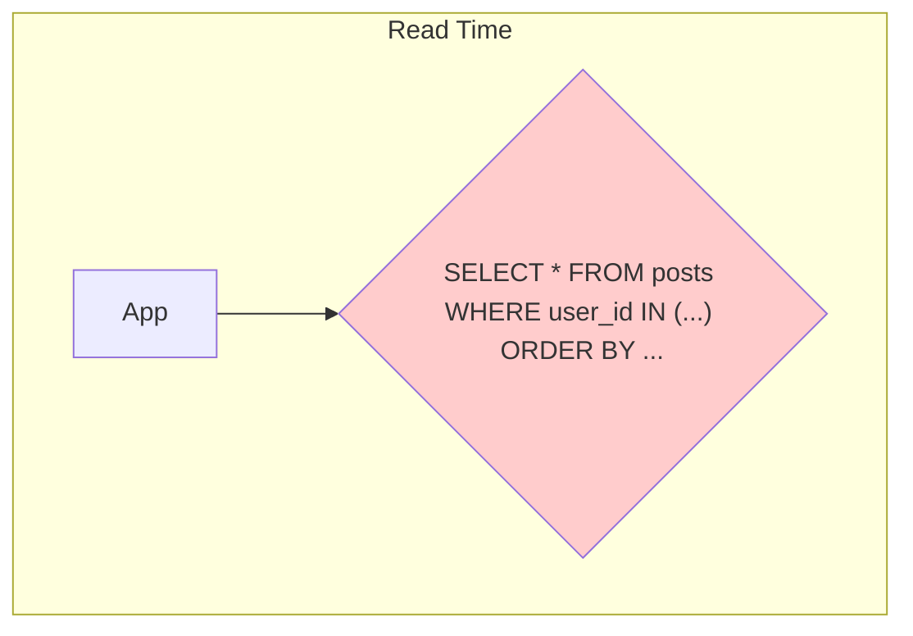
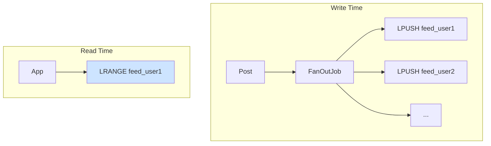
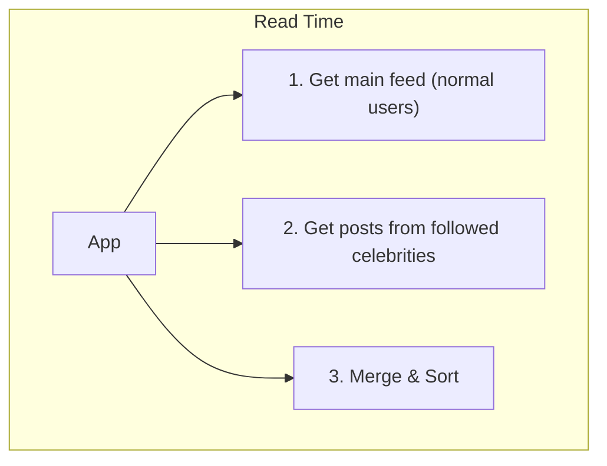

# System Design: A Production-Ready Social Media Feed (e.g., Twitter, Facebook)

Designing the data backend for a social media feed is one of the canonical system design interview questions. It's a perfect example of a system that is overwhelmingly **read-heavy**, and where the definition of "correct" is flexible.

When a user opens their Twitter or Facebook app, they expect to see their feed instantly. They don't care if it's missing a post from a few seconds ago. They care that it's *fast*. This allows us to make some fascinating tradeoffs between consistency and performance.

The core problem is this: a user's feed is a collection of posts from everyone they follow. At scale, computing this on-the-fly for every user is impossible.

---

### 1. The V0 Architecture: The "Fan-out on Read" Monolith

You're building "Chirper," the hot new social network. You start with a single PostgreSQL database.

#### The V0 Schema:
A simple, normalized model.

**`users` table:**
| id (PK) | username |
|---|---|

**`follows` table:**
| follower_id (FK to users) | followee_id (FK to users) |
|---|---|

**`posts` table:**
| id (PK) | user_id (FK to users) | content | created_at |
|---|---|---|---|

#### How it Works (Fan-out on Read):
1.  **A user posts:** `INSERT INTO posts (user_id, content) VALUES (123, 'hello world');` Simple.
2.  **A user requests their feed:** This is the hard part.
    *   Find all the people the user follows: `SELECT followee_id FROM follows WHERE follower_id = ?;` (e.g., returns `[123, 456, 789]`)
    *   Get the most recent posts from all those people: `SELECT * FROM posts WHERE user_id IN (123, 456, 789) ORDER BY created_at DESC LIMIT 50;`

#### The Inevitable Pain:
This works for your first 1,000 users. It dies a horrible death at 1,000,000.

*   **The Feed Query is a Monster:** The `SELECT` query to generate the feed is incredibly expensive. It's a multi-join, a `WHERE IN` on a potentially large list of IDs, and a `ORDER BY` on a massive, un-sharded `posts` table.
*   **High Latency:** As the `posts` table grows, this query gets slower and slower. Users are waiting seconds for their feed to load.
*   **The Celebrity Problem:** What happens when a user follows Taylor Swift (who has 100 million followers)? The `follows` table is fine. But what happens when Taylor Swift requests *her* feed? She follows 500 people. The query is manageable. What happens when one of her 100 million followers requests *their* feed? The system has to sift through all of Taylor's posts, along with posts from everyone else they follow. This is a read-side celebrity problem.

The "fan-out on read" approach, where you compute the feed at read time, does not scale.

---

### 2. The V1 Architecture: "Fan-out on Write" with a Caching Layer

We need to flip the model on its head. Instead of doing all the hard work when a user reads their feed, we'll do the work when a user *writes* a post. We will **pre-compute** the feeds.

This is a classic space-time tradeoff. We're going to use a lot more storage space to make reads incredibly fast.

#### The V1 Architecture:

*   **PostgreSQL/MySQL:** Still the source of truth for `users`, `follows`, and `posts`.
*   **Redis (or similar cache):** This is the star of the show. We will store the pre-computed feed for every user here. Redis is perfect because it's an in-memory key-value store, making it lightning fast for reads.

#### How it Works (Fan-out on Write):

1.  **A user posts:**
    *   The post is written to the `posts` table in the main SQL database.
    *   **The Magic Happens:** A background job (or a synchronous process) is triggered.
        a. It looks up everyone who follows the author: `SELECT follower_id FROM follows WHERE followee_id = ?;`
        b. For *each follower*, it prepends the new post's ID to a list stored in Redis. The key for this list is `feed_{follower_id}`.
        c. `LPUSH feed_456 post_id_999`
        d. `LPUSH feed_457 post_id_999`
        e. `LPUSH feed_458 post_id_999`
        f. ...and so on for all followers.
    *   The list in Redis is kept trimmed to a certain size (e.g., the latest 500 posts).

2.  **A user requests their feed:**
    *   The application asks Redis for the list at `feed_{user_id}`: `LRANGE feed_{user_id} 0 50`
    *   Redis returns a list of post IDs: `[post_id_999, post_id_987, ...]`
    *   This is incredibly fast—a single, simple Redis command.
    *   The application then "hydrates" these IDs by fetching the full post content from a different cache (or from the main DB if necessary): `MGET post_999 post_987 ...`

#### The New Celebrity Problem:
We've solved the read-side celebrity problem, but we've created a **write-side celebrity problem**.

What happens when Taylor Swift (100M followers) posts? Our background job now has to perform **100 million `LPUSH` operations** to Redis. This "fan-out" will take a long time and swamp our job queues and Redis cluster. This is a "thundering herd" of writes.

---

### 3. The V2 Architecture: The Hybrid Approach

To solve the write-side celebrity problem, we realize that not all users are created equal.

*   **Normal Users (most people):** We use the "fan-out on write" approach. It's efficient for users with a few hundred or a few thousand followers.
*   **Celebrities (verified users, >10,000 followers):** We don't fan out their posts on write. It's too expensive.

#### The Hybrid Feed Generation:

When a user requests their feed:
1.  Fetch the user's pre-computed feed from Redis (this contains posts from all the *normal* users they follow).
2.  Separately, identify the list of *celebrities* the user follows.
3.  Fetch the most recent posts directly from those celebrities (this can be from another cache or their own dedicated Redis lists).
4.  Merge the two lists (the Redis feed and the celebrity posts) in the application code, sort by time, and return the result to the user.

Now, when Taylor Swift posts, we do nothing. No fan-out. When her followers load their feeds, the application does a little extra work to pull in her latest posts and merge them in. We've traded a massive, slow write operation for a small, fast read operation, and only for the users who follow celebrities.

---

### 4. Diagrams

#### V0: Fan-out on Read

#### V1: Fan-out on Write

#### V2: Hybrid Model

---

### 5. Interview Note

**Question:** "Design the backend for the Twitter feed."

**Beginner Answer:** "I'd have a `posts` table and a `follows` table and `JOIN` them."

**Good Answer:** "A 'fan-out on read' approach won't scale. I'd use a 'fan-out on write' architecture. When a user posts, I'd have a background job that pushes the post ID into a Redis list for each of their followers. Then, when a user requests their feed, I can just read that list from Redis, which is very fast. This pre-computes the feed."

**Excellent Senior Answer:** "The core of a scalable feed is a 'fan-out on write' strategy, but a pure fan-out approach creates a write-side celebrity problem. I'd implement a hybrid model.

For the vast majority of users, we'll use fan-out on write: a post triggers an asynchronous job that injects the post ID into the Redis-based feed lists of their followers.

For high-follower 'celebrity' accounts, we do not fan out. It's too expensive. Instead, we handle them at read time. When a user requests their feed, the application fetches their pre-computed feed from Redis (containing posts from normal users) and, in parallel, fetches the latest posts from the few celebrities they follow. These two result sets are then merged and ranked in the application tier before being sent to the client.

This hybrid model optimizes for the common case (normal users) while gracefully handling the exceptional case (celebrities), preventing the massive write amplification that would otherwise bring the system down. The 'celebrity' status could be a flag on the user profile, determined by a follower count threshold."
