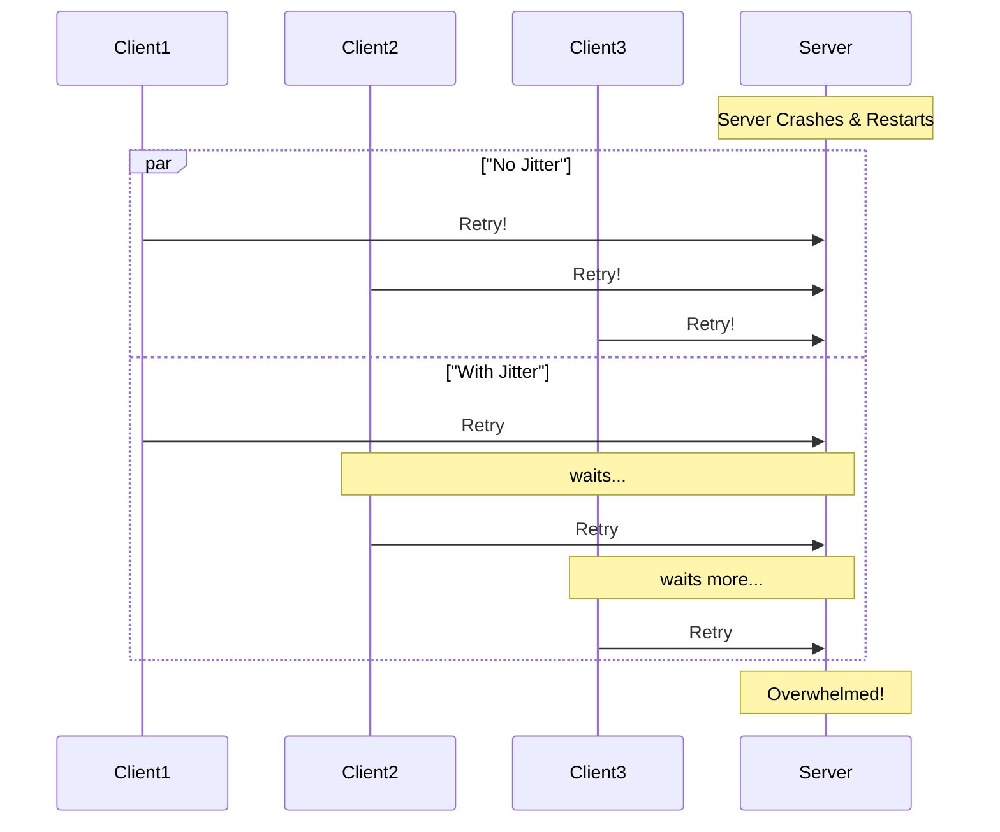

# Common Failure Patterns: A Litany of Production Horrors

In distributed systems, failure is not an 'if'; it's a 'when'. Your beautiful architecture diagrams with their clean lines and happy paths are a fantasy. The reality of production is a chaotic, unpredictable world where servers crash, networks partition, and disks fail.

This is not a theoretical exercise. These are the real, recurring nightmares that keep on-call engineers awake at night. Understanding these patterns is the first step to building systems that are resilient enough to survive them.

---

### 1. Replication Lag Incidents

We've discussed this before, but it's the most common failure mode of all.

*   **The Story:** A user updates their password. The write goes to the primary. They are immediately redirected to the login page. They try to log in with their new password. The login request is a `SELECT` that goes to a read replica. The replica hasn't received the password update yet. The login fails. The user is now convinced your site is broken and that you didn't save their new password.
*   **The Root Cause:** The system failed to provide **read-your-writes consistency**.
*   **The Lesson:** For critical, user-initiated workflows (login, profile updates, posting content), you *must* have a strategy to ensure the user sees their own writes. This usually means bypassing the replica and reading from the primary for a short time after a write.

---

### 2. Hot Partitions / Hotspots

You've sharded your database. You feel proud. Then, a single shard starts to melt.

*   **The Story:** It's launch day for a new video game. The game's item data is sharded by `item_id`. Everyone in the world is trying to buy the same hot new sword. All the reads and inventory checks for that one `item_id` are hammering a single database shard. That shard's CPU goes to 100%. The shard becomes unresponsive. Now, *all other items* that happen to live on that same shard are also unavailable. The system is partially down because one item became too popular.
*   **The Root Cause:** A poorly distributed workload, either from a bad shard key or the "celebrity problem."
*   **The Lesson:** Your sharding strategy must be sound. But even with a good strategy, you need **monitoring at the per-shard level**. When you detect a hot partition, you need a playbook. This could involve aggressive caching for the hot key, or even manually re-sharding the hot data to its own dedicated server.

---

### 3. Connection Storms

The database is healthy. The CPU is idle, the disk is fine. But no one can connect to it.

*   **The Story:** A developer deploys a small change to an application server. The change contains a bug: it no longer closes database connections properly after a query. Each web request opens a new connection and never closes it. Your database has a limit of 1,000 connections. Within minutes, your fleet of 100 application servers has opened 1,000 connections, and none of them are being released. The next request that tries to connect gets a "Too many connections" error. The entire site is down.
*   **The Root Cause:** A misconfigured or buggy client (your application server). The database is the victim, not the cause.
*   **The Lesson:** Connection pooling is critical, but it must be configured correctly. You need timeouts, limits, and health checks on your connection pools. You also need to monitor the number of active connections on your database. A sudden, sustained spike is a massive red flag.

---

### 4. Thundering Herd

Your site is down. You fix the problem and bring it back online. And then it immediately falls over again.

*   **The Story:** Your database server crashes. All of your application servers lose their connection and start returning errors to users. Users, being impatient, hit refresh. And again. And again. You finally get the database restarted. In that one instant, thousands of clients (browsers, app servers) that were all waiting to connect try to reconnect *at the exact same moment*. This massive, simultaneous flood of connection requests and queries overwhelms the newly started database before it can even get its bearings. It crashes again.
*   **The Root Cause:** A massive, synchronized retry from all clients at once.
*   **The Lesson:** Clients need to be well-behaved. They must implement **exponential backoff with jitter**.
    *   **Exponential Backoff:** If a connection fails, wait 1 second before retrying. If it fails again, wait 2 seconds. Then 4, then 8, and so on.
    *   **Jitter:** Don't all wait exactly 1 second. Wait a *random* amount of time between 0.5 and 1.5 seconds. This "jitter" spreads out the retry attempts and prevents them from all hitting at the same time.

---

### 5. Diagrams

#### The Connection Storm

A leak in the application layer floods the database.

```mermaid
graph TD
    subgraph "Application Servers"
        A1["App 1 (leaking)"]
        A2["App 2 (leaking)"]
        A3["App 3 (leaking)"]
    end

    subgraph "Database"
        DB[(DB Server <br> 1000 connection limit)]
    end

    A1 -- opens 100 connections --> DB
    A2 -- opens 100 connections --> DB
    A3 -- opens 100 connections --> DB
    
    Note over DB: Connections are never closed!
    
    subgraph "Result"
        style R fill:#ffcccc
        R{Connection Limit Reached <br> Site is Down}
    end

    DB --> R
```

#### The Thundering Herd

Without jitter, the retries all hit at once.



---

### 6. Interview Note

**Question:** "A user reports that they updated their profile, but when the page reloaded, they saw the old information. What's the most likely cause?"

**Answer:** "The most likely cause is replication lag. The user's write went to the primary database, but their subsequent read was served by a read replica that hadn't yet received the update. This is a break in read-your-writes consistency."

**Question:** "You've just fixed a database outage. As soon as it comes back online, it's immediately overwhelmed and crashes again. What is this phenomenon called, and how do you prevent it?"

**Answer:** "This is called a thundering herd problem. It's caused by all the clients trying to reconnect and retry their failed requests at the exact same moment. You prevent it by implementing exponential backoff with jitter in the clients. This staggers the retry attempts, allowing the server to gracefully handle the load as it comes back online."
