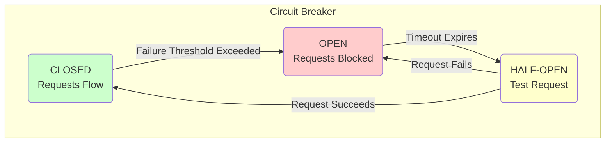

# Cascading Failures and Retry Storms: The Domino Effect

A single, small failure can trigger a chain reaction that brings down your entire system. This is a cascading failure. It's one of the most insidious and difficult-to-debug failure modes in distributed systems. Often, the component that initiates the cascade is long dead by the time you're paged, and you're left dealing with a dozen downstream services that are all on fire.

Retry storms are a common cause and amplifier of cascading failures.

---

### 1. The Anatomy of a Cascade

It always starts with one service.

*   **Service A** calls **Service B**.
*   **Service B** becomes slow or unresponsive (maybe due to a hot partition, a bad deploy, or a hardware issue).
*   **Service A**'s requests to Service B start to time out.

Now, the critical part: **How does Service A handle this timeout?**

*   **Bad Design:** Service A's connection pool to Service B fills up. All the threads in Service A are now blocked, waiting for a response from the slow Service B. Since all of Service A's threads are busy, it can no longer serve *any* requests, even requests that have nothing to do with Service B.
*   **The Cascade:** Now **Service C**, which depends on Service A, starts to see timeouts. Its connection pools fill up. It becomes unresponsive. The failure cascades from B to A to C, and so on, until the entire system is a gridlocked mess.

This is how a single slow service can cause a total system outage.

---

### 2. Retry Storms: Making a Bad Situation Worse

Retries are a good thing, right? They help you recover from transient errors. But when done naively, they can turn a small problem into a catastrophe.

*   **The Story:** Service B is slow. Service A times out and, being a "resilient" service, it immediately retries the request. And then it retries again. And again.
*   **The Amplification:** Let's say Service A normally sends 100 requests per second (RPS) to Service B. Now, for every one of those original requests, it's retrying 3 times. It's now sending **400 RPS** to Service B.
*   **The Storm:** Service B was already struggling to handle 100 RPS. The 400 RPS from Service A's retries completely overwhelms it. It grinds to a halt. Now, *every* request from A to B fails, triggering even more retries. This is a **retry storm**. You are effectively launching a denial-of-service attack against your own service.

---

### 3. The Solution: Circuit Breakers

You cannot prevent services from failing. But you can prevent the failure from spreading. The primary tool for this is the **Circuit Breaker** pattern.

Imagine an electrical circuit breaker in your house. If a device shorts out and draws too much current, the breaker trips, cutting off the flow of electricity and preventing a fire. The circuit breaker pattern does the same thing for network requests.

It works as a state machine:

1.  **CLOSED:** This is the normal state. Requests are allowed to flow from Service A to Service B. The circuit breaker monitors the requests for failures (like timeouts or 5xx errors).
2.  **OPEN:** If the failure rate exceeds a certain threshold (e.g., 50% of requests fail in a 10-second window), the circuit breaker "trips" and moves to the OPEN state.
    *   In this state, Service A **does not even try** to send a request to Service B. It fails fast, immediately returning an error.
    *   This is the crucial part: It protects Service B from the retry storm, giving it time to recover. It also protects Service A from blocking all its threads waiting for a slow service.
3.  **HALF-OPEN:** After a configured timeout (e.g., 30 seconds), the circuit breaker moves to the HALF-OPEN state.
    *   In this state, it allows a *single* request to go through to Service B.
    *   If that single request succeeds, the breaker assumes Service B has recovered and moves back to the CLOSED state.
    *   If that request fails, the breaker assumes Service B is still down and moves back to the OPEN state, starting the timeout again.

#### Diagram: The Circuit Breaker State Machine

---

### 4. Best Practices for Resilience

*   **Implement Circuit Breakers:** Use a library. Don't write your own. Polly for .NET, Hystrix/Resilience4j for Java, etc.
*   **Use Timeouts:** Never, ever make a network call without a timeout. The timeout should be aggressive. It's better to fail fast than to wait forever.
*   **Use Exponential Backoff with Jitter for Retries:** We discussed this before, but it's critical. Retries must be done carefully.
*   **Bulkhead Pattern:** Isolate resources. Don't let a failure in one part of your application (e.g., the connection pool for Service B) consume all the resources and take down the whole application.

---

### 5. Interview Note

**Question:** "Describe the circuit breaker pattern. Why is it important in a microservices architecture?"

**Answer:** "The circuit breaker pattern is a state machine that wraps network calls to prevent cascading failures. It monitors for failures, and if the error rate gets too high, it 'trips' or 'opens,' causing subsequent calls to fail fast without even hitting the network. This protects the downstream service from being overwhelmed by retries and prevents the calling service from consuming all its resources waiting for a slow dependency. After a timeout, it enters a 'half-open' state to probe if the downstream service has recovered. It's critical in microservices because it contains failures to a single service, preventing a localized problem from causing a total system outage."
