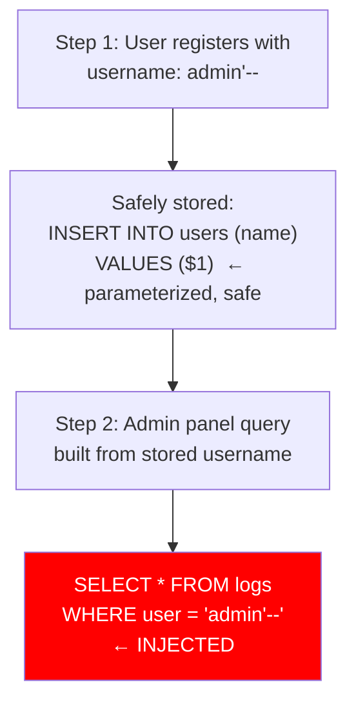
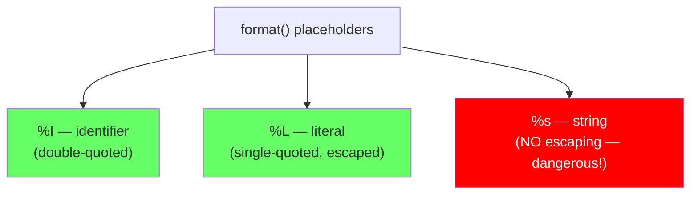
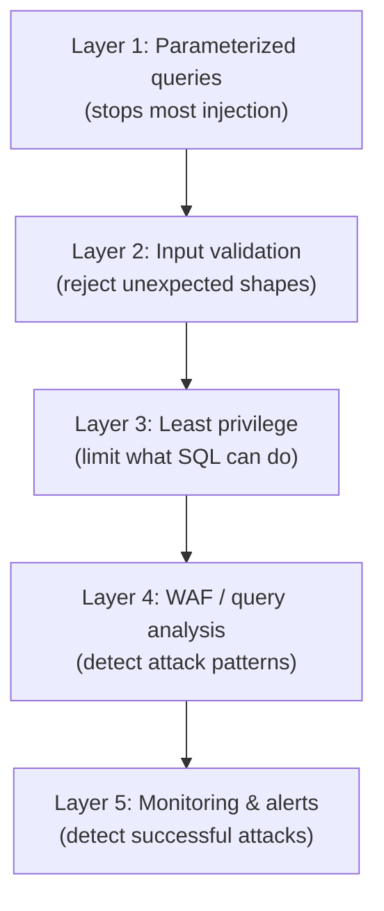

# SQL Injection Beyond Basics

> **What mistake does this prevent?**
> Thinking you're safe because you use parameterized queries, when second-order injection, identifier injection, and dynamic SQL in stored procedures bypass your defenses entirely.

You already know `' OR 1=1 --` and prepared statements. This file covers the injection vectors that experienced developers miss.

---

## 1. Second-Order SQL Injection

First-order: malicious input is used immediately in a query.
Second-order: malicious input is **stored safely**, then used **unsafely later**.



### How It Works

```python
# Registration (safe — parameterized)
cursor.execute("INSERT INTO users (username) VALUES (%s)", [user_input])

# Later, in admin panel (UNSAFE — trusts stored data)
username = get_username_from_db(user_id)
cursor.execute(f"SELECT * FROM audit_log WHERE username = '{username}'")
# If username is: admin'--
# Query becomes: SELECT * FROM audit_log WHERE username = 'admin'--'
```

### Prevention

**Rule: Never trust data from the database in string-built SQL.** Even if you parameterized the INSERT, the data in your database is untrusted input for any subsequent query.

```python
# ALWAYS parameterize, even when the value comes from your own database
cursor.execute("SELECT * FROM audit_log WHERE username = %s", [username])
```

---

## 2. Identifier Injection (Table and Column Names)

Parameterized queries protect **values**, not **identifiers**.

```sql
-- Parameterized: safe for VALUES
SELECT * FROM users WHERE email = $1;

-- But what about dynamic table names?
SELECT * FROM $1;  -- Cannot parameterize identifiers!
```

### The Problem

```python
# User selects which report to run
table_name = request.params['table']
cursor.execute(f"SELECT * FROM {table_name}")
# If table_name is: users; DROP TABLE users; --
# Query: SELECT * FROM users; DROP TABLE users; --
```

### Prevention: Allowlisting

```python
ALLOWED_TABLES = {'orders', 'products', 'categories'}

def get_report(table_name):
    if table_name not in ALLOWED_TABLES:
        raise ValueError(f"Invalid table: {table_name}")
    cursor.execute(f"SELECT * FROM {table_name}")
```

### Prevention: `quote_ident()` in PostgreSQL

```sql
-- In plpgsql, use quote_ident() for identifiers
EXECUTE format('SELECT * FROM %I WHERE id = %L', table_name, id_value);
-- %I = identifier quoting (table/column names)
-- %L = literal quoting (values)
-- %s = simple string (no quoting — dangerous)
```



---

## 3. Dynamic SQL in Stored Procedures

Stored procedures that build SQL from parameters:

```sql
-- DANGEROUS: String concatenation in plpgsql
CREATE FUNCTION search_users(search_col TEXT, search_val TEXT)
RETURNS SETOF users AS $$
BEGIN
  RETURN QUERY EXECUTE
    'SELECT * FROM users WHERE ' || search_col || ' = ''' || search_val || '''';
END;
$$ LANGUAGE plpgsql;

-- Calling: search_users('email', 'alice@test.com')
-- Generates: SELECT * FROM users WHERE email = 'alice@test.com'

-- Attacking: search_users('1=1; DROP TABLE users;--', 'x')
-- Generates: SELECT * FROM users WHERE 1=1; DROP TABLE users;-- = 'x'
```

### Safe Dynamic SQL

```sql
CREATE FUNCTION search_users(search_col TEXT, search_val TEXT)
RETURNS SETOF users AS $$
BEGIN
  -- Validate column name against allowed list
  IF search_col NOT IN ('email', 'name', 'id') THEN
    RAISE EXCEPTION 'Invalid column: %', search_col;
  END IF;

  -- Use format() with proper placeholders
  RETURN QUERY EXECUTE format(
    'SELECT * FROM users WHERE %I = %L',
    search_col,  -- %I: safely quoted as identifier
    search_val   -- %L: safely quoted as literal
  );
END;
$$ LANGUAGE plpgsql;
```

---

## 4. COPY and File-Based Injection

```sql
-- If an attacker can control part of a COPY command:
COPY (SELECT * FROM users) TO '/tmp/stolen_data.csv';

-- Or read arbitrary files:
COPY sensitive_table FROM '/etc/passwd';
```

PostgreSQL's `COPY` command with file paths requires superuser privileges. But `COPY ... TO PROGRAM` is even more dangerous:

```sql
-- Execute arbitrary OS commands (superuser only)
COPY (SELECT '') TO PROGRAM 'rm -rf /';
```

**Prevention:**
- Never run applications as PostgreSQL superuser
- Use `pg_read_server_files` and `pg_write_server_files` roles carefully
- Use `\copy` (client-side) instead of `COPY` (server-side) in psql

---

## 5. ORM Injection Vectors

ORMs protect against basic injection but have their own gaps:

### Raw Query Methods

```typescript
// Prisma — safe
const users = await prisma.user.findMany({ where: { email: input } });

// Prisma — UNSAFE if misused
const users = await prisma.$queryRaw`SELECT * FROM users WHERE email = ${input}`;
// This IS safe because of tagged template literals!

// But this is NOT:
const users = await prisma.$queryRawUnsafe(
  `SELECT * FROM users WHERE email = '${input}'`  // String interpolation = injection
);
```

### Sequelize

```javascript
// Safe: parameterized
User.findAll({ where: { email: input } });

// UNSAFE: raw query with string building
sequelize.query(`SELECT * FROM users WHERE email = '${input}'`);

// Safe: raw query with replacements
sequelize.query('SELECT * FROM users WHERE email = ?', {
  replacements: [input]
});
```

### The Pattern

Every ORM has an escape hatch for raw SQL. Every escape hatch is a potential injection point.

---

## 6. LIKE and Pattern Injection

Even parameterized queries can be vulnerable to pattern injection in `LIKE`:

```sql
-- User searches for a product name
SELECT * FROM products WHERE name LIKE '%' || $1 || '%';

-- If $1 = '%': matches everything
-- If $1 = '_': matches any single character
-- Not SQL injection per se, but information disclosure
```

**Prevention:** Escape LIKE special characters:

```sql
-- PostgreSQL: escape % and _ in user input
SELECT * FROM products
WHERE name LIKE '%' || replace(replace($1, '%', '\%'), '_', '\_') || '%';
```

---

## 7. Defense in Depth

No single defense is sufficient. Layer them:



### Practical Checklist

```
□ All queries use parameterized statements (not string building)
□ ORM raw query methods are reviewed in code review
□ Dynamic identifiers use allowlists or quote_ident()
□ Application connects with minimal-privilege DB role
□ Stored procedures validate all dynamic SQL inputs
□ LIKE patterns escape % and _
□ Audit log captures rejected/suspicious queries
□ pg_stat_statements monitored for unusual query patterns
```

---

## 8. Thinking Traps Summary

| Trap | What breaks | Prevention |
|------|------------|------------|
| "I use prepared statements, I'm safe" | Second-order injection, identifier injection | Parameterize ALL queries, even with DB-sourced data |
| Dynamic column/table names in SQL | Identifier injection | Allowlist + `format('%I', ...)` |
| ORM raw query escape hatches | String-built SQL inside "safe" ORM | Code review all `$queryRaw`, `.query()`, etc. |
| `COPY TO PROGRAM` with superuser | OS-level compromise | Never use superuser for applications |
| Trusting stored data | Data written safely, read unsafely | Treat all data as untrusted input |

---

## Related Files

- [Security_and_Governance/03_roles_privileges_least_privilege.md](03_roles_privileges_least_privilege.md) — limiting SQL permissions
- [Security_and_Governance/02_row_level_security.md](02_row_level_security.md) — additional access control layer
- [12_sql_vs_orm.md](../12_sql_vs_orm.md) — ORM safety considerations
