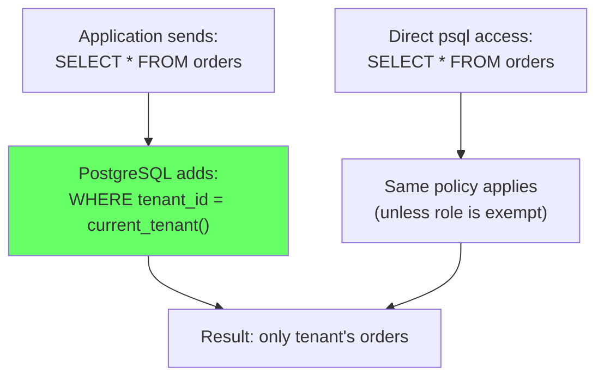
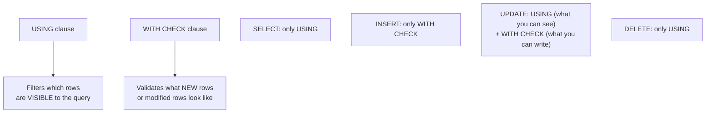
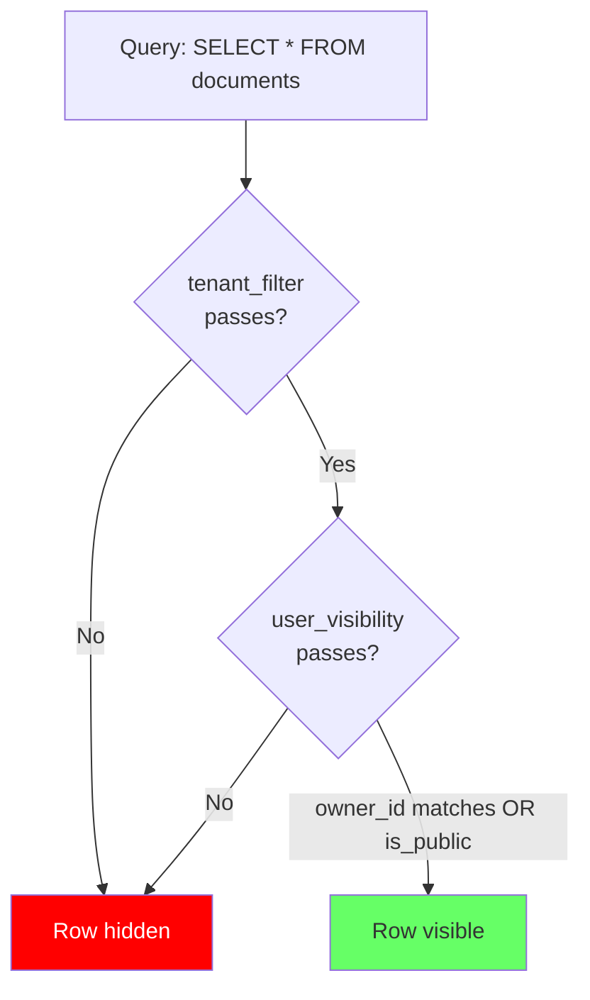

# Row-Level Security (RLS)

> **What mistake does this prevent?**
> Data leaking between tenants because a developer forgot a `WHERE tenant_id = ?` clause, or access control enforced entirely in application code that can be bypassed by direct database access, admin scripts, or future engineers who don't know the rules.

---

## 1. The Mental Model

RLS adds **invisible WHERE clauses** to every query. The database enforces access control regardless of how the query is constructed.



Without RLS, access control is:
```
Application → WHERE clause → Database
(If app forgets, data leaks)
```

With RLS, access control is:
```
Application → Database → RLS policy → Result
(Database enforces, regardless of application)
```

---

## 2. Enabling RLS

```sql
-- Step 1: Enable RLS on the table
ALTER TABLE orders ENABLE ROW LEVEL SECURITY;

-- Step 2: Create a policy
CREATE POLICY tenant_isolation ON orders
  USING (tenant_id = current_setting('app.tenant_id')::int);

-- Step 3: Force RLS on table owner too (optional but recommended)
ALTER TABLE orders FORCE ROW LEVEL SECURITY;
```

**Critical detail:** By default, the **table owner bypasses RLS**. If your application connects as the table owner, RLS does nothing! Use `FORCE ROW LEVEL SECURITY` or ensure the app uses a non-owner role.

---

## 3. Policy Types

### SELECT Policy (Read Control)

```sql
-- Users can only see their own data
CREATE POLICY user_read ON documents
  FOR SELECT
  USING (owner_id = current_setting('app.user_id')::int);
```

### INSERT Policy (Write Control)

```sql
-- Users can only insert rows for themselves
CREATE POLICY user_insert ON documents
  FOR INSERT
  WITH CHECK (owner_id = current_setting('app.user_id')::int);
```

### UPDATE Policy (Modify Control)

```sql
-- Users can update their own documents, but can't change ownership
CREATE POLICY user_update ON documents
  FOR UPDATE
  USING (owner_id = current_setting('app.user_id')::int)        -- Which rows can be seen
  WITH CHECK (owner_id = current_setting('app.user_id')::int);   -- What the row must look like after update
```

### DELETE Policy

```sql
CREATE POLICY user_delete ON documents
  FOR DELETE
  USING (owner_id = current_setting('app.user_id')::int);
```

### USING vs WITH CHECK



---

## 4. Setting Context for RLS

RLS policies typically read from session variables:

```sql
-- Application sets context at the beginning of each request
SET app.tenant_id = '42';
SET app.user_id = '123';
SET app.user_role = 'editor';

-- For connection pool safety (transaction-scoped):
SET LOCAL app.tenant_id = '42';  -- Resets at end of transaction
```

### Implementation in Application Code

```typescript
// Middleware pattern (Express + pg)
async function tenantMiddleware(req, res, next) {
  const tenantId = extractTenantFromToken(req);
  const client = await pool.connect();

  try {
    await client.query('BEGIN');
    await client.query(`SET LOCAL app.tenant_id = $1`, [tenantId]);
    req.db = client;
    next();
  } catch (err) {
    client.release();
    next(err);
  }
}

// After request: COMMIT releases the SET LOCAL
```

### Safety: Always Use SET LOCAL with Connection Pools

```sql
SET app.tenant_id = '42';         -- Session-scoped: DANGEROUS with pools!
SET LOCAL app.tenant_id = '42';   -- Transaction-scoped: SAFE with pools
```

If you use `SET` (not `SET LOCAL`) with PgBouncer in transaction mode, the setting persists after the transaction ends and may bleed to the next request on the same connection.

---

## 5. Multi-Tenant RLS (Complete Example)

```sql
-- Table
CREATE TABLE documents (
  id SERIAL PRIMARY KEY,
  tenant_id INT NOT NULL,
  owner_id INT NOT NULL,
  title TEXT NOT NULL,
  content TEXT,
  is_public BOOLEAN DEFAULT false
);

-- Enable RLS
ALTER TABLE documents ENABLE ROW LEVEL SECURITY;
ALTER TABLE documents FORCE ROW LEVEL SECURITY;

-- Policy: Tenant isolation (everyone is filtered by tenant)
CREATE POLICY tenant_filter ON documents
  FOR ALL
  USING (tenant_id = current_setting('app.tenant_id')::int)
  WITH CHECK (tenant_id = current_setting('app.tenant_id')::int);

-- Policy: Within tenant, users see own docs + public docs
CREATE POLICY user_visibility ON documents
  FOR SELECT
  USING (
    owner_id = current_setting('app.user_id')::int
    OR is_public = true
  );

-- Policy: Users can only modify their own docs
CREATE POLICY user_modify ON documents
  FOR UPDATE
  USING (owner_id = current_setting('app.user_id')::int)
  WITH CHECK (owner_id = current_setting('app.user_id')::int);

-- Policy: Admin role bypasses user restriction
CREATE POLICY admin_all ON documents
  FOR ALL
  TO admin_role
  USING (tenant_id = current_setting('app.tenant_id')::int);
```

**Multiple policies combine with OR** (within the same command type). A row is visible if **any** applicable policy allows it.



---

## 6. Performance Implications

RLS policies add conditions to every query. This has measurable impact:

### How It Works Internally

```sql
-- Your query:
SELECT * FROM documents WHERE title LIKE '%report%';

-- What PostgreSQL actually executes:
SELECT * FROM documents
WHERE title LIKE '%report%'
  AND tenant_id = current_setting('app.tenant_id')::int        -- tenant policy
  AND (owner_id = current_setting('app.user_id')::int           -- visibility policy
       OR is_public = true);
```

### Index Implications

The RLS conditions need index support:

```sql
-- CRITICAL: index that supports the RLS filter
CREATE INDEX idx_documents_tenant ON documents (tenant_id);

-- Even better: composite index for tenant + owner
CREATE INDEX idx_documents_tenant_owner ON documents (tenant_id, owner_id);
```

Without these indexes, every query does a sequential scan filtered by the RLS condition.

### Cost of Complex Policies

| Policy complexity | Performance impact |
|------------------|-------------------|
| Simple equality (`tenant_id = X`) | Negligible with index |
| IN list (`role IN ('admin', 'editor')`) | Low |
| Subquery (`EXISTS (SELECT 1 FROM permissions ...)`) | Significant — subquery runs per row or per query |
| Function call (`has_permission(user_id, 'read')`) | High — function called per row |

### Avoid Subqueries in Policies

```sql
-- SLOW: subquery in policy (potentially runs per row)
CREATE POLICY check_permissions ON documents
  FOR SELECT
  USING (EXISTS (
    SELECT 1 FROM permissions p
    WHERE p.user_id = current_setting('app.user_id')::int
      AND p.document_id = documents.id
  ));

-- FASTER: pre-compute permissions into session variable
-- Application sets: SET LOCAL app.accessible_docs = '{1,2,3,4,5}';
CREATE POLICY check_permissions ON documents
  FOR SELECT
  USING (id = ANY(string_to_array(current_setting('app.accessible_docs'), ',')::int[]));
```

---

## 7. Testing RLS

```sql
-- Test as a specific role
SET ROLE app_user;
SET LOCAL app.tenant_id = '1';
SET LOCAL app.user_id = '100';

-- This should only return tenant 1's documents
SELECT * FROM documents;

-- This should fail (trying to insert for another tenant)
INSERT INTO documents (tenant_id, owner_id, title) VALUES (2, 100, 'hack');
-- ERROR: new row violates row-level security policy

-- Reset
RESET ROLE;
```

### Automated Testing

```sql
-- Test helper function
CREATE FUNCTION test_rls_isolation() RETURNS VOID AS $$
DECLARE
  visible_count INT;
BEGIN
  SET LOCAL app.tenant_id = '1';
  SELECT COUNT(*) INTO visible_count FROM documents WHERE tenant_id != 1;

  IF visible_count > 0 THEN
    RAISE EXCEPTION 'RLS VIOLATION: tenant 1 can see % rows from other tenants', visible_count;
  END IF;

  RAISE NOTICE 'RLS isolation test passed';
END;
$$ LANGUAGE plpgsql;
```

---

## 8. Thinking Traps Summary

| Trap | What breaks | Prevention |
|------|------------|------------|
| Table owner bypasses RLS | Owner sees all data | `FORCE ROW LEVEL SECURITY` or don't use owner role |
| `SET` instead of `SET LOCAL` with pools | Context bleeds across requests | Always `SET LOCAL` |
| No index on RLS filter column | Every query is a sequential scan | Index tenant_id, owner_id |
| Subquery in RLS policy | Performance collapse at scale | Pre-compute and use session variables |
| Not testing RLS | False sense of security | Automated cross-tenant visibility tests |
| Forgetting WITH CHECK on INSERT | Users can insert rows they can't see | Always pair USING with WITH CHECK |

---

## Related Files

- [Data_Modeling/03_multi_tenant_schema_strategies.md](../Data_Modeling/03_multi_tenant_schema_strategies.md) — RLS for multi-tenancy
- [Security_and_Governance/03_roles_privileges_least_privilege.md](03_roles_privileges_least_privilege.md) — role design
- [Production_Postgres/01_connection_management.md](../Production_Postgres/01_connection_management.md) — connection pooling with RLS
