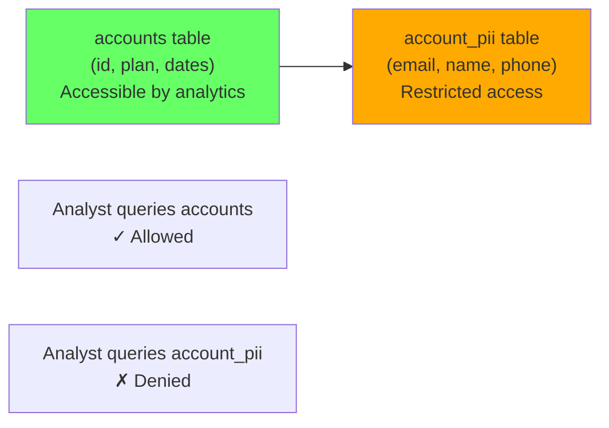
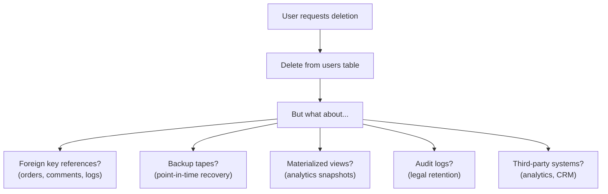

# Data Privacy and PII

> **What mistake does this prevent?**
> Exposing personally identifiable information through analytics queries, log files, database dumps, or third-party integrations because the schema treats PII the same as every other column.

---

## 1. What Counts as PII

PII is any data that can identify a specific individual, directly or in combination:

| Category | Examples | Risk level |
|----------|----------|------------|
| **Direct identifiers** | Name, email, phone, SSN, passport | Critical |
| **Indirect identifiers** | ZIP code, birth date, gender, job title | High (combinable) |
| **Sensitive data** | Health records, financial, biometric | Critical + regulated |
| **Behavioral data** | IP addresses, browser fingerprints, location | Medium (can identify) |
| **Quasi-identifiers** | Purchase history, timestamps + location | Medium (re-identifiable) |

**The re-identification problem:** 87% of the US population can be uniquely identified by just ZIP code + birth date + gender (Latanya Sweeney, 2000). Removing the "name" column doesn't make data anonymous.

---

## 2. Schema-Level PII Separation

### The Pattern: Split Sensitive from Non-Sensitive

```sql
-- Core table: business data, no PII
CREATE TABLE accounts (
  id UUID PRIMARY KEY DEFAULT gen_random_uuid(),
  plan_type TEXT NOT NULL,
  created_at TIMESTAMPTZ DEFAULT now(),
  is_active BOOLEAN DEFAULT true
);

-- PII table: separate, restricted access
CREATE TABLE account_pii (
  account_id UUID PRIMARY KEY REFERENCES accounts(id),
  email TEXT NOT NULL,
  full_name TEXT,
  phone TEXT,
  address JSONB,
  encrypted_ssn BYTEA  -- encrypted at rest
);
```



### Privilege Separation

```sql
-- Analytics role cannot access PII tables
GRANT SELECT ON accounts TO analyst;
GRANT SELECT ON orders TO analyst;
-- No grant on account_pii → analyst cannot access

-- Application role gets both
GRANT SELECT, INSERT, UPDATE ON accounts TO app_user;
GRANT SELECT, INSERT, UPDATE ON account_pii TO app_user;
```

---

## 3. Anonymization Techniques

### Technique 1: Pseudonymization

Replace identifiers with consistent tokens. Reversible with a key.

```sql
-- Pseudonymization function using HMAC
CREATE EXTENSION IF NOT EXISTS pgcrypto;

CREATE FUNCTION pseudonymize(val TEXT, secret TEXT)
RETURNS TEXT AS $$
  SELECT encode(hmac(val, secret, 'sha256'), 'hex');
$$ LANGUAGE sql IMMUTABLE;

-- Usage: same input always produces same output
SELECT pseudonymize('alice@example.com', 'my_secret_key');
-- Returns: a1b2c3d4... (consistent hash)

-- Create pseudonymized analytics view
CREATE VIEW analytics_users AS
  SELECT
    pseudonymize(email, current_setting('app.pseudonym_key')) AS user_token,
    plan_type,
    created_at
  FROM accounts
  JOIN account_pii USING (id);
```

### Technique 2: Generalization

Reduce precision to prevent identification.

```sql
-- Generalize exact values
CREATE VIEW demographics_safe AS
  SELECT
    -- Age bracket instead of birth date
    CASE
      WHEN age(birth_date) < '18 years' THEN 'under_18'
      WHEN age(birth_date) < '30 years' THEN '18-29'
      WHEN age(birth_date) < '50 years' THEN '30-49'
      WHEN age(birth_date) < '65 years' THEN '50-64'
      ELSE '65+'
    END AS age_bracket,
    
    -- ZIP prefix instead of full ZIP
    LEFT(zip_code, 3) || 'XX' AS zip_area,
    
    -- Category instead of exact income
    CASE
      WHEN income < 30000 THEN 'low'
      WHEN income < 80000 THEN 'medium'
      ELSE 'high'
    END AS income_band
  FROM customer_demographics;
```

### Technique 3: K-Anonymity Check

Ensure that every combination of quasi-identifiers appears at least K times:

```sql
-- Check k-anonymity (k=5) for a generalized view
SELECT
  age_bracket,
  zip_area,
  income_band,
  COUNT(*) AS group_size
FROM demographics_safe
GROUP BY age_bracket, zip_area, income_band
HAVING COUNT(*) < 5  -- These groups violate k=5 anonymity
ORDER BY group_size;

-- If any rows returned, those individuals are at re-identification risk
```

### Technique 4: Data Masking

```sql
-- Mask email for display
CREATE FUNCTION mask_email(email TEXT)
RETURNS TEXT AS $$
  SELECT
    LEFT(split_part(email, '@', 1), 2) || '***@' ||
    split_part(email, '@', 2);
$$ LANGUAGE sql IMMUTABLE;

-- mask_email('alice@example.com') → 'al***@example.com'

-- Mask phone number
CREATE FUNCTION mask_phone(phone TEXT)
RETURNS TEXT AS $$
  SELECT '***-***-' || RIGHT(phone, 4);
$$ LANGUAGE sql IMMUTABLE;

-- Create masked view for support reps
CREATE VIEW users_support_view AS
  SELECT
    id,
    mask_email(email) AS email,
    mask_phone(phone) AS phone,
    plan_type
  FROM users;
```

---

## 4. Right to Deletion (GDPR Article 17)

Users can request deletion of their data. This is harder than it sounds.

### The Challenge



### Implementation Strategy

```sql
-- Step 1: Anonymize rather than hard-delete (preserves referential integrity)
CREATE FUNCTION gdpr_erase_user(target_user_id UUID)
RETURNS VOID AS $$
BEGIN
  -- Anonymize PII
  UPDATE account_pii
  SET
    email = 'deleted-' || target_user_id || '@erased.local',
    full_name = 'ERASED',
    phone = NULL,
    address = NULL
  WHERE account_id = target_user_id;

  -- Mark as erased
  UPDATE accounts
  SET
    is_active = false,
    erased_at = now()
  WHERE id = target_user_id;

  -- Log the erasure (for compliance proof)
  INSERT INTO erasure_log (user_id, erased_at, erased_by)
  VALUES (target_user_id, now(), current_setting('app.admin_id'));
END;
$$ LANGUAGE plpgsql;
```

### Cascade Planning

```sql
-- Map all tables containing user PII
SELECT
  tc.table_name,
  kcu.column_name,
  ccu.table_name AS referenced_table
FROM information_schema.table_constraints tc
JOIN information_schema.key_column_usage kcu
  ON tc.constraint_name = kcu.constraint_name
JOIN information_schema.constraint_column_usage ccu
  ON tc.constraint_name = ccu.constraint_name
WHERE ccu.table_name = 'users'
  AND tc.constraint_type = 'FOREIGN KEY';

-- Result shows every table that references users
-- Each needs an erasure strategy
```

---

## 5. Encryption at Rest

### Column-Level Encryption

```sql
CREATE EXTENSION IF NOT EXISTS pgcrypto;

-- Encrypt sensitive column
INSERT INTO account_pii (account_id, encrypted_ssn)
VALUES (
  '550e8400-e29b-41d4-a716-446655440000',
  pgp_sym_encrypt('123-45-6789', current_setting('app.encryption_key'))
);

-- Decrypt when needed
SELECT pgp_sym_decrypt(
  encrypted_ssn,
  current_setting('app.encryption_key')
) AS ssn
FROM account_pii
WHERE account_id = '550e8400-e29b-41d4-a716-446655440000';
```

**Warning:** Column-level encryption prevents indexing on the encrypted column. You cannot efficiently search encrypted data.

### When to Use Column-Level vs Disk-Level Encryption

| Feature | Column-level (pgcrypto) | Disk-level (TDE/LUKS) |
|---------|------------------------|----------------------|
| Protects from | DB users without key, SQL injection | Physical disk theft |
| Searchable | No (unless separate hash) | Yes (transparent) |
| Performance | Significant per-row cost | Minimal |
| Key management | Application manages key | OS/infra manages key |
| Compliance | Specific column protection | Full volume protection |

---

## 6. Database Dumps and PII

```bash
# ❌ pg_dump with PII goes to S3, shared with contractors, etc.
pg_dump myapp > full_backup.sql

# ✓ Exclude PII tables from non-production dumps
pg_dump myapp --exclude-table=account_pii --exclude-table=payment_methods > safe_dump.sql

# ✓ Or use a sanitization step
pg_dump myapp | sanitize_pii.py > dev_dump.sql
```

### Sanitized Dev Database

```sql
-- Create a sanitized copy for development
CREATE FUNCTION sanitize_for_dev() RETURNS VOID AS $$
BEGIN
  -- Replace all emails with fake ones
  UPDATE account_pii
  SET
    email = 'user' || account_id || '@test.local',
    full_name = 'Test User ' || LEFT(account_id::text, 4),
    phone = '555-000-' || LPAD((random() * 9999)::int::text, 4, '0'),
    address = '{"city": "Testville", "zip": "00000"}'::jsonb;

  -- Wipe sensitive data entirely
  UPDATE account_pii SET encrypted_ssn = NULL;
END;
$$ LANGUAGE plpgsql;
```

---

## 7. PII Discovery

Finding PII you didn't know existed:

```sql
-- Search for columns that might contain PII by name pattern
SELECT
  table_schema,
  table_name,
  column_name,
  data_type
FROM information_schema.columns
WHERE column_name ~* '(email|phone|name|address|ssn|birth|salary|passport|license|ip_addr)'
  AND table_schema NOT IN ('pg_catalog', 'information_schema')
ORDER BY table_schema, table_name;
```

### Periodic PII Audit

```sql
-- Sample data to check for PII patterns
-- Look for email patterns in text columns
SELECT table_name, column_name
FROM information_schema.columns
WHERE data_type IN ('text', 'character varying')
  AND table_schema = 'public';

-- Then for each text column, check for email-like data:
-- SELECT column_name FROM table_name WHERE column_name ~ '[a-zA-Z0-9._%+-]+@[a-zA-Z0-9.-]+\.[a-zA-Z]{2,}' LIMIT 5;
```

---

## 8. Thinking Traps Summary

| Trap | What breaks | Prevention |
|------|------------|------------|
| PII mixed with business data | Analytics queries leak PII | Separate PII into restricted tables |
| Removing names = anonymous | Re-identification via quasi-identifiers | K-anonymity check, generalization |
| Hard delete for GDPR | Breaks foreign keys, misses copies | Anonymize in place, cascade plan |
| pg_dump includes everything | Dev databases contain production PII | `--exclude-table` for PII tables |
| Column encryption = solved | Can't index encrypted columns, key management | Use for specific high-risk fields only |
| "We don't have PII" | Unrecognized PII in text fields, logs | Periodic PII discovery scans |

---

## Related Files

- [Security_and_Governance/02_row_level_security.md](02_row_level_security.md) — restricting row-level access
- [Security_and_Governance/06_compliance_driven_schema_design.md](06_compliance_driven_schema_design.md) — designing for regulations
- [Data_Modeling/05_immutable_data_and_audit_logs.md](../Data_Modeling/05_immutable_data_and_audit_logs.md) — audit trails
