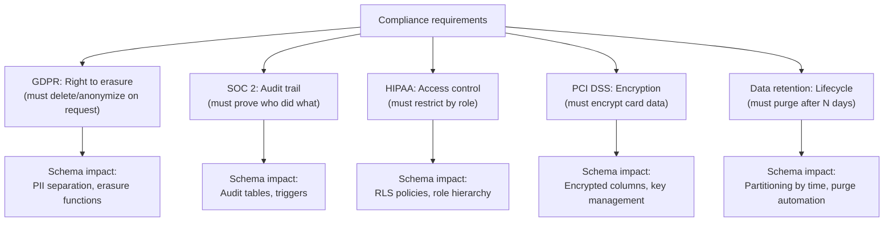
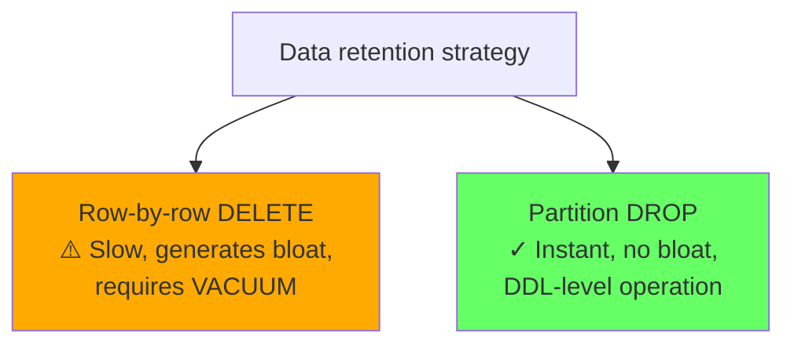
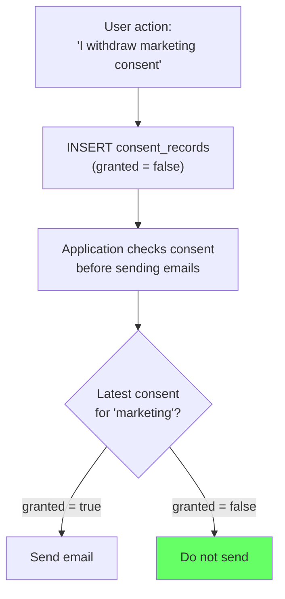

# Compliance-Driven Schema Design

> **What mistake does this prevent?**
> Retrofitting audit trails, data retention, and deletion capabilities into a mature database — a project that typically takes 3-6 months, breaks migrations, and introduces subtle data integrity bugs — when 30 minutes of upfront schema decisions would have handled it.

---

## 1. Why Compliance Shapes Schema

Regulations don't just constrain what you do with data — they constrain **how you store it**. If your schema doesn't support compliance operations efficiently, you'll bolt them on with application logic, cron jobs, and duct tape.



---

## 2. Audit Trail Design

### Requirements

SOC 2, HIPAA, and most financial regulations require:
- **Who** made the change
- **What** changed (before and after values)
- **When** the change occurred
- **Immutability** (audit records cannot be modified)

### Implementation: Trigger-Based Audit Table

```sql
-- Generic audit log table
CREATE TABLE audit_log (
  id BIGSERIAL,
  table_name TEXT NOT NULL,
  record_id TEXT NOT NULL,
  operation TEXT NOT NULL CHECK (operation IN ('INSERT', 'UPDATE', 'DELETE')),
  changed_by TEXT NOT NULL DEFAULT current_setting('app.user_id', true),
  changed_at TIMESTAMPTZ NOT NULL DEFAULT now(),
  old_values JSONB,
  new_values JSONB,
  PRIMARY KEY (id, changed_at)  -- For partitioning
) PARTITION BY RANGE (changed_at);

-- Partition by month
CREATE TABLE audit_log_2025_01 PARTITION OF audit_log
  FOR VALUES FROM ('2025-01-01') TO ('2025-02-01');
CREATE TABLE audit_log_2025_02 PARTITION OF audit_log
  FOR VALUES FROM ('2025-02-01') TO ('2025-03-01');

-- Prevent modification of audit records
REVOKE UPDATE, DELETE ON audit_log FROM PUBLIC;
REVOKE UPDATE, DELETE ON audit_log FROM app_user;
```

### Audit Trigger

```sql
CREATE FUNCTION audit_trigger_func()
RETURNS TRIGGER AS $$
BEGIN
  IF TG_OP = 'INSERT' THEN
    INSERT INTO audit_log (table_name, record_id, operation, new_values)
    VALUES (TG_TABLE_NAME, NEW.id::text, 'INSERT', to_jsonb(NEW));
    RETURN NEW;
  ELSIF TG_OP = 'UPDATE' THEN
    INSERT INTO audit_log (table_name, record_id, operation, old_values, new_values)
    VALUES (TG_TABLE_NAME, NEW.id::text, 'UPDATE', to_jsonb(OLD), to_jsonb(NEW));
    RETURN NEW;
  ELSIF TG_OP = 'DELETE' THEN
    INSERT INTO audit_log (table_name, record_id, operation, old_values)
    VALUES (TG_TABLE_NAME, OLD.id::text, 'DELETE', to_jsonb(OLD));
    RETURN OLD;
  END IF;
END;
$$ LANGUAGE plpgsql;

-- Attach to sensitive tables
CREATE TRIGGER audit_orders
  AFTER INSERT OR UPDATE OR DELETE ON orders
  FOR EACH ROW EXECUTE FUNCTION audit_trigger_func();

CREATE TRIGGER audit_users
  AFTER INSERT OR UPDATE OR DELETE ON users
  FOR EACH ROW EXECUTE FUNCTION audit_trigger_func();
```

---

## 3. Data Retention Policies

### The Problem

"Keep data for 7 years" means:
1. Data must exist for 7 years (legal hold)
2. Data must be **deleted after** 7 years (GDPR minimization)
3. Deletion must be provable (audit requirement)

### Schema Design for Retention

```sql
-- Add retention metadata to tables
CREATE TABLE orders (
  id UUID PRIMARY KEY DEFAULT gen_random_uuid(),
  customer_id UUID NOT NULL,
  total NUMERIC(12,2),
  created_at TIMESTAMPTZ NOT NULL DEFAULT now(),
  
  -- Retention metadata
  retention_until DATE GENERATED ALWAYS AS
    ((created_at + INTERVAL '7 years')::date) STORED,
  purged_at TIMESTAMPTZ  -- NULL until purged
);
```

### Automated Purge

```sql
-- Purge function (runs via pg_cron or external scheduler)
CREATE FUNCTION purge_expired_data() RETURNS INT AS $$
DECLARE
  purged_count INT := 0;
  batch_size INT := 10000;
BEGIN
  -- Delete in batches to avoid long-running transactions
  LOOP
    WITH batch AS (
      SELECT id FROM orders
      WHERE retention_until < CURRENT_DATE
        AND purged_at IS NULL
      LIMIT batch_size
      FOR UPDATE SKIP LOCKED
    )
    DELETE FROM orders
    WHERE id IN (SELECT id FROM batch);

    GET DIAGNOSTICS purged_count = ROW_COUNT;
    EXIT WHEN purged_count < batch_size;

    -- Yield to other transactions
    PERFORM pg_sleep(0.1);
  END LOOP;

  RETURN purged_count;
END;
$$ LANGUAGE plpgsql;
```

### Partition-Based Retention (More Efficient)

```sql
-- Partition by month for efficient bulk drops
CREATE TABLE events (
  id BIGSERIAL,
  event_type TEXT NOT NULL,
  payload JSONB,
  created_at TIMESTAMPTZ NOT NULL DEFAULT now(),
  PRIMARY KEY (id, created_at)
) PARTITION BY RANGE (created_at);

-- Create partitions automatically (pg_partman or manual)
CREATE TABLE events_2025_01 PARTITION OF events
  FOR VALUES FROM ('2025-01-01') TO ('2025-02-01');

-- Retention: DROP the entire partition (instant, no vacuum needed)
-- After 7 years:
DROP TABLE events_2018_01;  -- Instant, O(1) operation
```



---

## 4. Legal Hold

Sometimes you need to **prevent** deletion when retention says delete:

```sql
-- Legal hold table
CREATE TABLE legal_holds (
  id SERIAL PRIMARY KEY,
  reason TEXT NOT NULL,
  applied_at TIMESTAMPTZ DEFAULT now(),
  applied_by TEXT NOT NULL,
  scope JSONB NOT NULL  -- Which records are held
  -- Example scope: {"table": "orders", "customer_id": "abc-123"}
);

-- Modify purge function to check legal holds
CREATE FUNCTION check_legal_hold(tbl TEXT, record_id TEXT)
RETURNS BOOLEAN AS $$
  SELECT EXISTS (
    SELECT 1 FROM legal_holds
    WHERE scope->>'table' = tbl
      AND (scope->>'record_id' IS NULL
           OR scope->>'record_id' = record_id)
  );
$$ LANGUAGE sql;

-- In purge function:
-- IF NOT check_legal_hold('orders', order_id) THEN DELETE ...
```

---

## 5. Data Classification in Schema

### Column-Level Classification

```sql
-- Use COMMENT to classify data sensitivity
COMMENT ON COLUMN users.email IS 'PII:HIGH - Personal email address';
COMMENT ON COLUMN users.name IS 'PII:HIGH - Full legal name';
COMMENT ON COLUMN users.plan_type IS 'PII:NONE - Business data';
COMMENT ON COLUMN users.id IS 'PII:NONE - Internal identifier';
COMMENT ON COLUMN payments.card_last_four IS 'PCI:RESTRICTED - Partial card number';

-- Query classification
SELECT
  c.table_name,
  c.column_name,
  pgd.description AS classification
FROM information_schema.columns c
LEFT JOIN pg_catalog.pg_description pgd
  ON pgd.objoid = (c.table_schema || '.' || c.table_name)::regclass
  AND pgd.objsubid = c.ordinal_position
WHERE pgd.description LIKE 'PII:%'
   OR pgd.description LIKE 'PCI:%'
ORDER BY c.table_name, c.ordinal_position;
```

### Schema Naming Conventions

```sql
-- Convention: PII tables get a prefix or separate schema
CREATE SCHEMA pii;

CREATE TABLE pii.user_identifiers (
  user_id UUID PRIMARY KEY,
  email TEXT NOT NULL,
  phone TEXT,
  full_name TEXT
);

CREATE TABLE public.users (
  id UUID PRIMARY KEY,
  plan_type TEXT,
  created_at TIMESTAMPTZ DEFAULT now()
);

-- Grant structure enforces classification
GRANT USAGE ON SCHEMA public TO analyst;
-- NO grant on pii schema to analyst
```

---

## 6. Designing for Consent Management

GDPR requires tracking what users consented to and when:

```sql
CREATE TABLE consent_records (
  id SERIAL PRIMARY KEY,
  user_id UUID NOT NULL REFERENCES users(id),
  consent_type TEXT NOT NULL,  -- 'marketing', 'analytics', 'third_party'
  granted BOOLEAN NOT NULL,
  granted_at TIMESTAMPTZ NOT NULL DEFAULT now(),
  ip_address INET,            -- For proof of consent
  user_agent TEXT,             -- Browser/device context
  consent_text_version TEXT    -- Which version of T&C they agreed to
);

-- Index for querying current consent state
CREATE UNIQUE INDEX idx_consent_current
  ON consent_records (user_id, consent_type, granted_at DESC);

-- Query: What is user's current consent state?
SELECT DISTINCT ON (consent_type)
  consent_type,
  granted,
  granted_at
FROM consent_records
WHERE user_id = $1
ORDER BY consent_type, granted_at DESC;
```



---

## 7. Cross-Border Data Residency

Some regulations require data to stay within geographic boundaries:

```sql
-- Multi-region table partitioning
CREATE TABLE user_data (
  id UUID DEFAULT gen_random_uuid(),
  region TEXT NOT NULL CHECK (region IN ('eu', 'us', 'apac')),
  data JSONB,
  created_at TIMESTAMPTZ DEFAULT now(),
  PRIMARY KEY (id, region)
) PARTITION BY LIST (region);

CREATE TABLE user_data_eu PARTITION OF user_data FOR VALUES IN ('eu');
CREATE TABLE user_data_us PARTITION OF user_data FOR VALUES IN ('us');
CREATE TABLE user_data_apac PARTITION OF user_data FOR VALUES IN ('apac');

-- In a multi-region deployment, each partition lives on a database
-- instance in the corresponding region
-- (Requires logical replication or Citus for distributed enforcement)
```

---

## 8. Compliance Checklist: Schema Review

```
□ PII separated into dedicated tables or schema
□ Audit triggers on all tables with sensitive data
□ Audit log is append-only (no UPDATE/DELETE for non-superuser)
□ Retention period defined per table (COMMENT or generated column)
□ Partition strategy supports efficient bulk deletion
□ Legal hold mechanism prevents premature deletion
□ Consent records stored with version and timestamp
□ Column sensitivity classified via COMMENTs
□ Dev/staging databases use sanitized data (no production PII)
□ Database dumps exclude PII tables
□ Encryption applied to high-sensitivity columns
□ pg_hba.conf restricts access by role and network
```

---

## 9. Thinking Traps Summary

| Trap | What breaks | Prevention |
|------|------------|------------|
| "We'll add audit trails later" | Months of migration, no historical data | Design audit from day one |
| Row-by-row DELETE for retention | Table bloat, long locks, vacuum storms | Partition by time, DROP partitions |
| Retention = just delete old data | Legal holds, incomplete deletion | Hold check before purge |
| PII in same table as business data | Cannot restrict analyst access | Separate schema/table for PII |
| No consent versioning | Can't prove what user agreed to | Store consent text version + timestamp |
| Dev database has production data | PII exposure to dev team | Sanitized dumps, anonymization |

---

## Related Files

- [Security_and_Governance/05_data_privacy_and_pii.md](05_data_privacy_and_pii.md) — PII handling techniques
- [Data_Modeling/05_immutable_data_and_audit_logs.md](../Data_Modeling/05_immutable_data_and_audit_logs.md) — audit log patterns
- [Data_Modeling/04_soft_deletes_and_query_rot.md](../Data_Modeling/04_soft_deletes_and_query_rot.md) — deletion strategies
- [Security_and_Governance/03_roles_privileges_least_privilege.md](03_roles_privileges_least_privilege.md) — role design for compliance
- [Internals/04_partitioning.md](../Internals/04_partitioning.md) — partitioning mechanics
