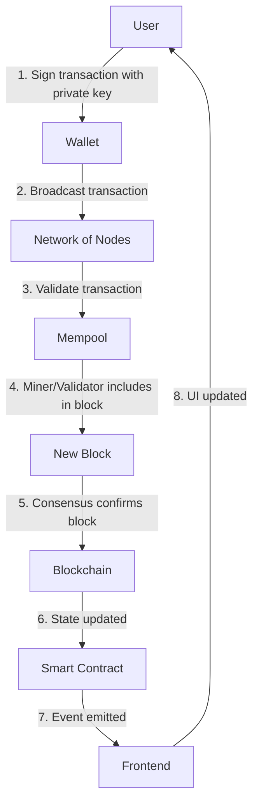

# What Web3 Actually Is

🟢 **Fundamentals**

---

## Web3 in One Sentence

**Web3 is a collection of protocols for maintaining shared state across untrusted parties using cryptography, consensus, and economic incentives.**

Not as exciting as "the future of the internet," but far more accurate.

---

## Let's Break That Down

### "Maintaining shared state"
- All participants agree on the current state (e.g., who owns what)
- State changes are coordinated and ordered

### "Across untrusted parties"
- Participants don't need to trust each other
- Participants may be adversarial

### "Using cryptography"
- Public/private key cryptography for identity
- Hashing for data integrity
- Signatures for authentication

### "Consensus"
- Mechanisms (Proof of Work, Proof of Stake) to agree on state
- Expensive by design (to prevent attacks)

### "Economic incentives"
- Participants are rewarded for honest behavior
- Participants are punished for dishonest behavior

---

## Blockchains as Data Structures

### Append-Only Logs

At its core, a blockchain is just an **append-only log**:

```
Block 0 (Genesis)
  ↓
Block 1: [tx1, tx2, tx3]
  ↓
Block 2: [tx4, tx5]
  ↓
Block 3: [tx6, tx7, tx8, tx9]
  ↓
...
```

Each block contains:
- Transactions (state changes)
- Hash of previous block (creates the "chain")
- Timestamp
- Other metadata

**Key insight:** You can't modify old blocks without changing their hash, which breaks the chain.

---

## Web3 as a Database

Compare blockchains to databases:

| Feature | Traditional Database | Blockchain |
|---------|---------------------|------------|
| **Who can write?** | Authenticated users | Anyone with gas fees |
| **Who can read?** | Authenticated users | Everyone (public by default) |
| **Who controls it?** | Database owner | Network participants (distributed) |
| **Can data be deleted?** | Yes | No (append-only) |
| **Can data be modified?** | Yes | No (immutable) |
| **Consistency model** | ACID transactions | Eventual consistency |
| **Performance** | Fast (milliseconds) | Slow (seconds to minutes) |
| **Cost** | Near-zero per write | High (gas fees) |

**Web3 = Database with enemies**

---

## Web3 vs Web2 vs Web1

### Web1 (1990-2004): Read-Only
- Static HTML pages
- No user interaction
- No user-generated content
- Example: Early Yahoo, GeoCities

### Web2 (2004-Present): Read-Write
- User-generated content
- Social platforms
- Centralized services
- Example: Facebook, Twitter, YouTube

**Problem:** Platforms control your data and can censor or ban you.

### Web3 (2015-Present): Read-Write-Own
- Users "own" their data via cryptographic keys
- No central platform controls access
- Permissionless participation

**Reality:** Most "Web3" apps still rely on centralized Web2 infrastructure.

---

## Core Components of Web3

### 1. Blockchains
Distributed ledgers maintaining shared state:
- **Bitcoin:** Digital currency
- **Ethereum:** Programmable blockchain (smart contracts)
- **Solana, Avalanche, Polygon, etc.:** Alternative blockchains

### 2. Cryptographic Wallets
Software managing private keys:
- Sign transactions
- Don't hold funds (blockchain does)
- Example: MetaMask, Ledger

### 3. Smart Contracts
Code deployed on blockchains:
- Deterministic execution
- Immutable (usually)
- Example: Token contracts, DeFi protocols

### 4. Tokens
Digital assets on blockchains:
- **Fungible:** Interchangeable (e.g., USDC, DAI)
- **Non-fungible (NFTs):** Unique (e.g., digital art, in-game items)

### 5. Decentralized Applications (DApps)
Apps interacting with blockchains:
- Frontend (Web2: HTML/CSS/JS)
- Backend (Web3: Smart contracts + RPC nodes)

---

## How Web3 Actually Works (High-Level)



### Step-by-Step
1. **User creates transaction**
   - Example: "Send 1 ETH to Bob"
   - Wallet constructs transaction data

2. **User signs with private key**
   - Proves user authorized this transaction
   - Signature is public, but private key stays secret

3. **Transaction is broadcast to network**
   - Sent to multiple nodes
   - Nodes validate signature and basic rules

4. **Transaction enters mempool**
   - Pool of unconfirmed transactions
   - Miners/validators select transactions to include

5. **Transaction is included in a block**
   - Miner/validator proposes new block
   - Other nodes validate the block

6. **Consensus is reached**
   - Network agrees this block is valid
   - Block is added to blockchain

7. **State is updated**
   - Smart contracts execute
   - Balances update
   - Events are emitted

8. **Frontend updates**
   - DApp reads new state
   - UI shows updated balance

**Key insight:** This process takes seconds to minutes, not milliseconds.

---

## Web3 as a Replicated State Machine

Think of a blockchain as a state machine:

```
State at Block N-1:
  Alice: 100 ETH
  Bob: 50 ETH

Transaction: Alice sends 10 ETH to Bob

State at Block N:
  Alice: 90 ETH
  Bob: 60 ETH
```

**Every node** independently:
1. Receives the same transactions (in the same order)
2. Applies the same rules
3. Arrives at the same state

This is called **deterministic execution**.

---

## The "Trustless" Claim

Web3 advocates say blockchains are "trustless."

**What they mean:**
- You don't have to trust any single party
- You trust cryptography, consensus, and code

**What they ignore:**
- You trust the blockchain protocol (is it secure?)
- You trust the consensus mechanism (is it fair?)
- You trust the smart contract code (any bugs?)
- You trust your wallet software (is it malicious?)
- You trust the RPC node you connect to (is it honest?)
- You trust the frontend (is it fake?)

**Reality:** "Trustless" means "trust is distributed" not "trust is eliminated."

---

## Web3's Actual Architecture

Despite the hype, most Web3 apps look like this:

```
User
  ↓
Frontend (Web2: React, hosted on AWS)
  ↓
Backend API (Web2: Node.js, hosted on AWS) ← Indexes blockchain
  ↓                                            Caches data
  ↓                                            Serves metadata
  ↓
Wallet (MetaMask)
  ↓
RPC Provider (Infura, Alchemy) ← Often centralized!
  ↓
Blockchain (Ethereum) ← Only place that's truly decentralized
```

**Key insight:** "Decentralized apps" still use centralized infrastructure.

---

## Common Misconceptions

### ❌ "Web3 is completely decentralized"
**Reality:** Most apps rely on centralized frontend hosting, RPC nodes, and data indexing.

### ❌ "Web3 eliminates intermediaries"
**Reality:** It replaces trusted intermediaries with trustless ones (miners/validators), but they still exist.

### ❌ "Web3 is private"
**Reality:** Blockchains are public by default. Your transactions are visible to everyone.

### ❌ "Web3 is fast"
**Reality:** Blockchains are intentionally slow (to ensure consensus).

### ❌ "Web3 is cheap"
**Reality:** Transaction fees can range from cents to hundreds of dollars.

---

## What Web3 Actually Is: Summary

**Technical definition:**
- Distributed ledgers using consensus mechanisms
- Cryptographic authentication
- Append-only data structures
- Deterministic state machines

**Practical definition:**
- Slow, expensive databases
- High transparency, low privacy
- Immutable code execution
- Coordination without trusted third parties

**Honest definition:**
- Useful for specific problems
- Overkill for most problems
- Comes with significant tradeoffs

---

## Analogies for Web Developers

| Web2 Concept | Web3 Equivalent |
|--------------|-----------------|
| Backend API | Smart contract |
| Database | Blockchain |
| Authentication token | Private key / wallet |
| User account | Blockchain address |
| POST request | Transaction |
| Read-only GET | View function call |
| Database trigger | Smart contract event |
| Server downtime | Never (if network is healthy) |
| Schema migration | Nearly impossible |

---

## Exercise

Answer these questions:

1. **Is a blockchain a database?**
   - Yes, but a very specific kind with unique tradeoffs.

2. **Why can't you delete data from a blockchain?**
   - It's append-only by design. Deleting data would break the hash chain.

3. **If Web3 is "trustless," why do you still need to trust things?**
   - You trust: the protocol, the code, your wallet, the RPC node, the frontend.

4. **Why are blockchains slow?**
   - Consensus requires multiple nodes to agree. This takes time.

5. **Name three things traditional databases do better than blockchains.**
   - Speed, privacy, flexibility (schema changes).

---

## Next Lesson

[→ What Web3 Is NOT](03-what-web3-is-not.md)
